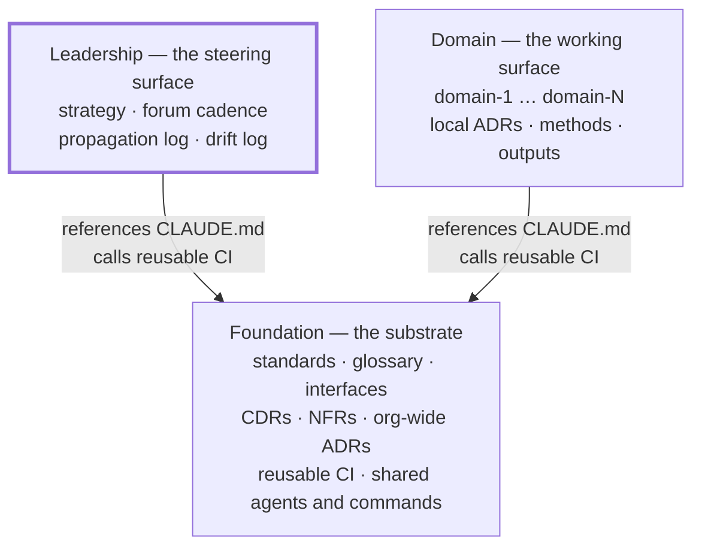
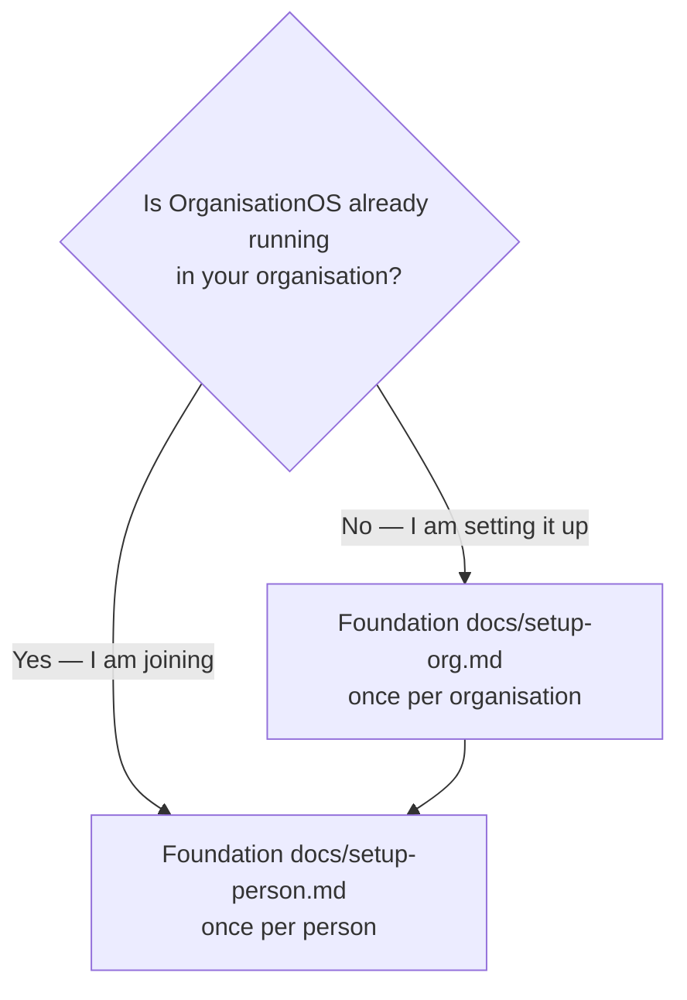

# OrganisationOS — Leadership

**The steering surface of an OrganisationOS three-repo set.** OrganisationOS is a harness for human↔AI-agent collaboration in a knowledge-work organisation: three Git repositories, a small set of conventions, and CI that keeps them honest. This repo holds what Leaders and the Admin work in — strategy, the Leadership Forum's cadence, the propagation log that tracks cross-domain decisions into the domains, and the steward's drift log. It depends on the Foundation repo for every shared standard, template and CI workflow.

## The three repos



| Repo | Holds | |
| --- | --- | --- |
| **Foundation** | Shared standards, decisions, CI and tooling | [organisationos-foundation](https://github.com/<adopter-org>/organisationos-foundation) |
| **Leadership** | Strategy, Forum cadence, propagation log, drift log | **You are here** |
| **Domain** | Per-domain working content | [organisationos-domain](https://github.com/<adopter-org>/organisationos-domain) |

On disk the three are siblings under one parent folder. Every cross-repo path in this repo is written `../organisationos-foundation/…`, and the settings that give a session reach into Foundation name that exact path. Nest the repos anywhere else and those paths break, silently.

```text
~/projects/<adopter-org>/
  organisationos-foundation/     ← clone this first
  organisationos-leadership/     ← this repo
  organisationos-domain/
```

## Where do I start?



- **Setting OrganisationOS up for an organisation** — [setup-org.md](https://github.com/<adopter-org>/organisationos-foundation/blob/main/docs/setup-org.md) in Foundation. Step 8 there enables this repo's monthly maintenance issue.
- **Joining as a Leader or Admin** — [setup-person.md](https://github.com/<adopter-org>/organisationos-foundation/blob/main/docs/setup-person.md) in Foundation. Leaders and the Admin clone all three repos; Team Members, Product Owners and Domain Leads do not normally need this one.
- **Understanding it first** — [concepts.md](https://github.com/<adopter-org>/organisationos-foundation/blob/main/docs/concepts.md) and [loading-model.md](https://github.com/<adopter-org>/organisationos-foundation/blob/main/docs/loading-model.md) in Foundation.

## What lives here

| Path | Contents |
| --- | --- |
| `strategy/` | Org-level strategic content: priorities, OKRs, position papers |
| `cadence/` | Leadership Forum minutes; propagation log tracking CDR → domain implementation |
| `steward/` | Admin's drift log, monthly DRI notes, harness improvement backlog |

**NOT here:** CDRs, NFRs, interfaces, standards, architectural decisions, or any cross-domain artefact. Those live in the Foundation repo. If the content affects more than one domain or needs org-wide enforcement, it goes in Foundation.

## The monthly maintenance issue

On the 1st of each month `.github/workflows/monthly-dri.yml` opens an issue from `.github/ISSUE_TEMPLATE/monthly-dri.md` and assigns it to the handle in the `ADMIN_HANDLE` repository variable. The Admin walks the checklist and closes the issue with a one-paragraph summary linked from `steward/drift-log.md`. If the variable is unset the issue opens unassigned; if the `drift` and `harness` labels do not exist yet, run `label-sync.yml` first. Run the workflow from the Actions tab to open the current month's issue on demand — it will not create a duplicate.

## Worked example — GreenLeaf Research Lab

GreenLeaf Research Lab uses the three-repo set. A CDR for a new anonymisation standard merges in the Foundation repo. Admin sees the merge notification and opens a propagation log entry in `cadence/propagation-log.md` with the CDR number and links to the three downstream implementation PRs opened in the Domain repo (one per affected domain: research, operations, compliance).

At the next Leadership Forum, the Leader reviews `cadence/propagation-log.md` to confirm all three implementation PRs have merged. The outcome is recorded as an addendum in the Forum minutes. The propagation cycle closes when all three domain PRs are merged and the log entry is marked complete.

## Further reading

- Foundation's [`FORMATS.md`](https://github.com/<adopter-org>/organisationos-foundation/blob/main/FORMATS.md) is mirrored here as `FORMATS.md`; the Foundation copy is canonical and `format-gate` fails a PR if the mirror drifts.
- Foundation's [`CHANGELOG.md`](https://github.com/<adopter-org>/organisationos-foundation/blob/main/CHANGELOG.md) announces merged substrate changes.

These templates originate from [2SSilver/organisationos-leadership](https://github.com/2SSilver/organisationos-leadership), MIT licensed.
