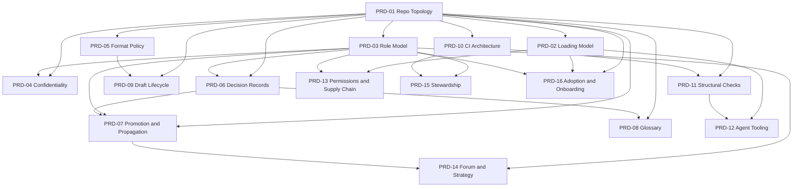

# PRD set — the harness as built

This is the as-built PRD set for the OrganisationOS harness: one PRD per capability, each describing what exists today rather than what was originally intended. PRDs are ordered by dependency, so reading them in the order listed below rebuilds the harness from nothing to fully wired. Every requirement in every PRD carries one of four statuses, defined below, so a rebuilder can tell working logic from documented intent from aspiration at a glance.

## Status legend

| Status | Meaning |
| --- | --- |
| `ENFORCED` | Logic executed and observed producing the correct verdict on both a violating and a clean input. Locus recorded (CI or local). |
| `SHIPPED` | The mechanism exists and is wired, but its logic has not been observed executing. |
| `CONVENTION` | Documented and expected; nothing enforces it. |
| `GAP` | Intended by the design; not built. |

`ENFORCED` means exactly one thing: this logic works, verified by execution against both a violating and a clean input. It never means that something compels the logic to run on every change (CI triggering on the right event, a merge actually being blocked, branch protection being configured). That question is separate, and each PRD's section 7 (Dependencies & constraints) addresses it: whether the check has a live caller, whether branch protection exists, and what an operator would need to add for `ENFORCED` logic to also be binding.

## What the coverage check proves

`coverage-check.sh` proves no file in the harness is undocumented. It does not prove any file is documented well — a PRD can name a file in `specifies:` and say nothing useful about it, and the check still passes. It is a floor against forgetting something exists, not a quality gate. Quality is a review concern, not a tooling one.

It also does not prove exclusive ownership. The check only detects files with zero claimants; it has no way to notice a file two PRDs both claim, and two files legitimately are: `organisationos-foundation/.github/workflows/self-ci.yml` is PRD-10's subject (Foundation's own CI entry point) and also carries the `agent-mirror-sync` job PRD-11 specifies; `organisationos-leadership/.github/workflows/lint.yml` is a thin caller PRD-10 documents that calls the `markdown-lint` reusable PRD-11 documents. Both claims are honest, describing the same file from two different requirements' points of view, but a reader should not take a green run as proof the file-to-PRD mapping is one-to-one. It is not, and the check does not test for that.

Run 2026-09-08, from `steward/prds/`: `coverage OK: 161 files claimed, 0 unclaimed`.

## The set

| ID | Title | Tier | Intent | Status mix |
| --- | --- | --- | --- | --- |
| [PRD-01](prd-01-repo-topology.md) | Three-Repo Topology & Scope Boundary | 0 | Keep every change's blast radius visible at the level it affects, with no central gatekeeper standing between a domain and its own work. | 2 SHIPPED · 5 CONVENTION |
| [PRD-02](prd-02-loading-model.md) | Session Context & Loading Model | 0 | Let an operator trust which rules are actually active in a session, regardless of which repository or folder it was launched from. | 5 SHIPPED · 3 CONVENTION |
| [PRD-03](prd-03-role-model.md) | Role Model & Review Gates | 1 | Route every artefact through a named human reviewer, with the weight of review landing at the narrowest level able to bear it. | 2 SHIPPED · 5 CONVENTION |
| [PRD-04](prd-04-confidentiality.md) | Confidentiality & Back-Flow Boundary | 1 | Let external work inform shared knowledge without ever making the client identifiable, by default rather than by contributor vigilance. | 3 ENFORCED · 2 SHIPPED · 1 CONVENTION · 3 GAP |
| [PRD-05](prd-05-format-policy.md) | Format Policy & Format Gate | 1 | Keep everything committed reviewable by diff; anything that lives in a live system is pointed at, never copied in. | 3 ENFORCED · 3 CONVENTION |
| [PRD-06](prd-06-decision-records.md) | Decision Records & Contracts | 2 | Route decisions and cross-domain contracts to the record type their blast radius calls for, in a shape a reader can trust unassisted. | 2 ENFORCED · 4 SHIPPED · 2 CONVENTION |
| [PRD-07](prd-07-promotion-propagation.md) | Promotion & Propagation Flow | 2 | Ensure a decision drafted in one domain cannot silently bind another, and cannot silently stall once accepted, without anyone needing to remember to check. | 2 ENFORCED · 1 SHIPPED · 3 CONVENTION |
| [PRD-08](prd-08-glossary.md) | Glossary & Terminology | 2 | Give every term one unambiguous home, so finding out what a word means costs one lookup rather than a conversation. | 2 ENFORCED · 2 SHIPPED · 1 CONVENTION |
| [PRD-09](prd-09-drafts-references.md) | Draft Lifecycle & References | 2 | Give work in progress a place to be imperfect with a clock on it, and point finished work at where the live thing actually is. | 1 ENFORCED · 2 SHIPPED · 3 CONVENTION |
| [PRD-10](prd-10-ci-architecture.md) | CI Architecture | 3 | Let a rule that guards every repository be written once and versioned once, adopted by each caller at a version it chose rather than one that moves underfoot. | 1 ENFORCED · 5 SHIPPED · 2 CONVENTION |
| [PRD-11](prd-11-structural-checks.md) | Structural Integrity Checks | 3 | Catch the kinds of drift that never announce themselves, without depending on a reviewer's limited attention to notice them. | 6 ENFORCED |
| [PRD-12](prd-12-agent-tooling.md) | Agent Commands & Subagents | 3 | Make routine agent work behave the same for every operator in every repository, so improving it once improves it everywhere. | 3 SHIPPED · 3 CONVENTION |
| [PRD-13](prd-13-permissions-supply-chain.md) | Agent Permissions & Supply Chain | 3 | Let an agent session read the whole harness but change only the surface it belongs to, with nothing executable un-pinned. | 5 SHIPPED · 2 CONVENTION |
| [PRD-14](prd-14-forum-strategy.md) | Leadership Forum & Strategy | 4 | Set, review, and close cross-domain direction in one visible, standing rhythm rather than in side channels. | 1 SHIPPED · 3 CONVENTION |
| [PRD-15](prd-15-stewardship.md) | Harness Stewardship & Improvement Loop | 4 | Put one named person on the hook every month for noticing drift, and one channel for turning what they notice into a change. | 1 ENFORCED · 2 SHIPPED · 3 CONVENTION |
| [PRD-16](prd-16-adoption-onboarding.md) | Adoption & Onboarding | 4 | Let a stranger stand the whole harness up, and a new joiner become productive in it, from the three published repositories alone. | 7 SHIPPED · 1 CONVENTION |

Intent column is paraphrased from each PRD's own section 1, not quoted; read the linked PRD's section 1 for its exact wording. Status mix is the primary status of every `FR-nn.m` in that PRD's section 6, derived from its `Status:` lines (a handful of requirements carry a compound status, such as "CONVENTION for the roll-forward procedure; SHIPPED for the current tag state" — these are counted once, under the first-named status, with the qualifier left to the requirement's own text).

Across the set: 21 ENFORCED · 43 SHIPPED · 40 CONVENTION · 3 GAP, out of 107 requirements total.

Read on its own, that "3 GAP" understates what this set found by more than an order of magnitude. Only three requirements, all in PRD-04, carry `Status: GAP`; that status marks a requirement whose entire logic is unbuilt. But every PRD also carries a section 8 (Known gaps & open questions), and across the set that section holds 31 findings marked `GAP`, spread across 15 of the 16 documents (every one except PRD-05). Most of the harness's gaps are not missing mechanisms; they are mechanisms that exist and were built for a real purpose, but fall short of it in some specific, documented way: a check that has never rejected anything in real CI, a control whose extraction logic silently drops the case it exists to catch, a setup path that leaves a reference unresolved. A reader who wants the full gap picture reads section 8 of every PRD, not the `Status:` line count alone.

### Dependency graph

Nodes are the sixteen PRDs; an edge from A to B means B's frontmatter lists A under `depends-on`, so A must exist first.

### Rebuild order

Numeric order already satisfies every dependency edge above; grouped by tier:

1. **Tier 0 (substrate):** PRD-01, PRD-02
2. **Tier 1 (governance surface):** PRD-03, PRD-04, PRD-05
3. **Tier 2 (decision and knowledge flow):** PRD-06, PRD-07, PRD-08, PRD-09
4. **Tier 3 (automation):** PRD-10, PRD-11, PRD-12, PRD-13
5. **Tier 4 (cadence and adoption):** PRD-14, PRD-15, PRD-16

A rebuilder who stops after any tier has a harness that is internally consistent for what has landed so far; each PRD's own section 9 (Rebuild guide) states plainly what exists after it alone and what stays broken until a later one lands.

## Cross-cutting patterns

No single PRD owns these. Each below was found by a different PRD examining its own subject; assembled, they say something about the harness that none says alone.

### Machinery that is enforcement-shaped and enforces nothing

Four checks were built, wired, and ran green while never exercising the logic they exist to enforce:

- **The loading-model smoke test's first version could never fail.** It asked for a fact from `FORMATS.md`, a file CI mirrors byte-identical into all three repositories, so a Domain-only clone with no Foundation on disk answered it correctly regardless. Replaced with a probe reading a Foundation-only file ([PRD-02](prd-02-loading-model.md)).
- **`propagation-sla` was cited as enforced on a run that never reached its logic.** The cited run executed against Foundation, which has no `cadence/` directory; the scan logged `No propagation log.`, its first guard clause, and exited before the deadline-comparison logic ever ran ([PRD-07](prd-07-promotion-propagation.md)).
- **`draft-staleness`'s predecessor could never fire anywhere.** It compared filesystem `mtime` against a checkout that resets every file's `mtime` on every run, so a 14-day-old draft always looked brand new. Fixed 2026-08-24 ([PRD-09](prd-09-drafts-references.md)).
- **`pr-preview` renders nothing, on any run checked.** Its checkout has no `fetch-depth: 0`, so its diff-based file selection cannot resolve its base branch, hits its own `echo "No changed Markdown files."` guard, and exits early — even on a pull request that changed many. It still uploads an empty artefact and posts a comment linking to it ([PRD-10](prd-10-ci-architecture.md)).

### Documented controls with no implementation

Three controls in the confidentiality chain are named in the harness's own documentation and implemented nowhere:

- **The agent-initiated back-flow ban** depends on a session-id field and a commit-tagging hook; neither ships. The ban rests on reviewer judgement with nothing to check against ([PRD-04](prd-04-confidentiality.md)).
- **`!context-near` co-occurrence detection**, named twice in `coverage-gaps.md` as the defence against two anodyne facts combining to identify someone, is declared in `banned-patterns.yml` but the check's own extraction reads only each entry's `.pattern` key; a `!context-near` entry has no `.pattern` key, so it is silently dropped before the scan ever runs ([PRD-04](prd-04-confidentiality.md)).
- **Declared `match:` modifiers**, including diacritic-insensitive and case-sensitive matching, are never read: the same extraction reads one key and drops every other declared modifier, so both enforcement points scan every pattern the same way regardless of what it declares ([PRD-04](prd-04-confidentiality.md)).

### Two-approver rules that nothing binds

No branch protection exists on any of the three published repositories — a direct `404` on every one, checked independently by four different PRDs. Against that fact:

- CODEOWNERS names a two-handle pairing on Foundation's substrate paths ([PRD-03](prd-03-role-model.md)).
- Back-flow review's documented two reviewers is one in theory: GitHub's CODEOWNERS matching is last-match-wins, and a narrower, later pattern strips the Domain Lead from `domain-N/methods/` and `domain-N/prompts/`, leaving only the Admin listed. It is zero in practice, since nothing enforces even that one ([PRD-03](prd-03-role-model.md), [PRD-04](prd-04-confidentiality.md)).
- Format changes are documented as requiring two approvers, resting on the same unconfigured mechanism ([PRD-05](prd-05-format-policy.md)).

### Verified logic never observed rejecting anything in real CI

Of the six structural-integrity checks, four (`structure-check`, `claude-md-length`, `stale-path-check`, `agent-mirror-sync`) have never produced a genuine red result across Foundation's own CI history; their `ENFORCED` status rests entirely on this PRD set's own local reproduction, run and read against both a violating and a clean input. Two, `markdown-lint` and `link-check`, each have a genuine CI-locus red and green pair to cite ([PRD-11](prd-11-structural-checks.md)).

### Individually true claims that do not compose

The subtlest class, because no single claim is wrong:

- **A retrieval-reachability gap.** `loading-model.md` correctly distinguishes the directory-mount flag (which brings Foundation's commands and agents into a session) from the settings-file reach entry (which grants file access alone), and correctly says the retrieval habit needs the mount flag. Every one of the five `claude-local-<role>.example.md` onboarding templates was read individually: none mentions the mount flag, and three of the five (Leader, Product Owner, Team Member) instruct the joiner to run `find-relevant-knowledge` anyway. A joiner who follows their role template exactly can complete onboarding without that command ever reaching their session ([PRD-12](prd-12-agent-tooling.md), [PRD-16](prd-16-adoption-onboarding.md)).
- **`update-wiki.md` cites `setup-org.md` Step 7** as the source for a per-path branch-protection setting. Step 7 itself says the opposite: GitHub branch protection is per-branch, not per-path, so it cannot express that distinction, and names the notification-only tier a documented convention with no enforcement behind it ([PRD-12](prd-12-agent-tooling.md)).

### Adoption blockers on the documented path

- **Templated repositories get no tags.** `gh repo create --template` copies no tags from the template repository. Twenty-two distinct workflow files across Leadership (10) and Domain (12) pin a reusable at `@v1` (twenty-three references in total, since one Domain file carries two), so a freshly templated Foundation with no `v1` tag leaves every one of them unable to resolve. `setup-org.md`'s ten numbered steps contain no tag-creation instruction; the one sentence mentioning `v1` sits in the closing "Afterwards" section, after all ten steps, and assumes the tag already exists ([PRD-10](prd-10-ci-architecture.md), [PRD-16](prd-16-adoption-onboarding.md)).
- **Unsubstituted supply-chain pins ship live.** `REPLACE-WITH-AUDITED-COMMIT-SHA` and `<pinned-version-or-ref>` ship in all three repositories' `.claude/settings.json`, and the documented placeholder sweep in `setup-org.md` matches only `<adopter-org>` and the `placeholder-` prefix in CODEOWNERS, catching neither ([PRD-13](prd-13-permissions-supply-chain.md), [PRD-16](prd-16-adoption-onboarding.md)).

### What the harness gets right

- **`coverage-gaps.md` is a shipped, public document that names six categories of leak its own CI cannot catch:** paraphrased, structural, numerical, co-occurrence, date, and near-miss identifiers, each paired with the human review that defends against it. The harness publishes its own blind spots rather than implying the pattern scan is sufficient on its own ([PRD-04](prd-04-confidentiality.md)).
- **`setup-org.md` Step 7 declines to claim enforcement it cannot deliver.** It states plainly that GitHub branch protection is per-branch, not per-path, and calls the per-path tier a documented convention rather than describing it as enforced ([PRD-12](prd-12-agent-tooling.md)).
- **An independent cold-start walkthrough concluded, on 2026-08-26, that setup was completable from the three published repositories alone, with caveats.** That reading predates the missing-tag gap, the two unsubstituted supply-chain placeholders, and the mount-flag reachability gap above, and PRD-16 discloses it as a limit on its own verification rather than presenting it as settled proof the path works end to end today ([PRD-16](prd-16-adoption-onboarding.md)).

## Maintenance

The Admin owns keeping this set current. This README's own claim that `coverage-check.sh` runs at the monthly DRI sitting is the documented cadence; PRD-15 records that the script is wired into no CI workflow on any of the three published repositories, and leaves open, rather than settled, whether it should be. Until that is decided, re-running it is one line on the Admin's monthly checklist, alongside `drift-check` and `promotion-candidate`, not something any pull request is blocked on.

Each PRD's `verified:` frontmatter date says when its statuses were last checked against the live repositories, not when the PRD's prose was last edited. A status that has drifted since its `verified:` date is a re-verification task, not evidence the PRD is wrong as written.
