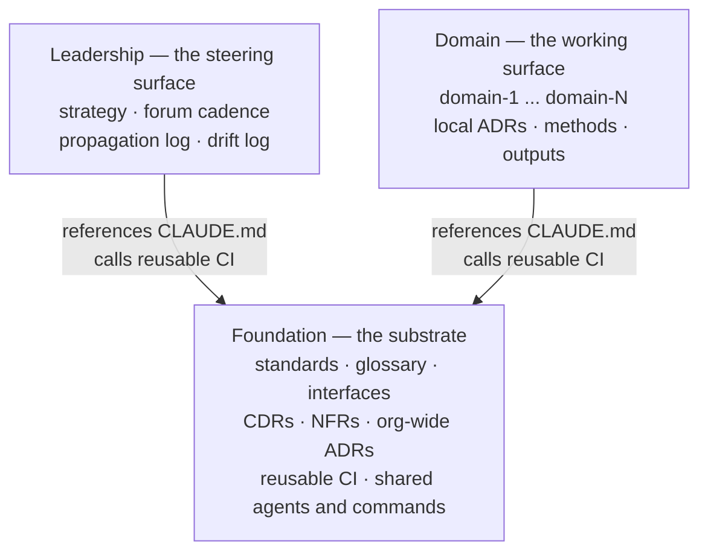

## 1. Intent

Keep the blast radius of any change visible and reviewable at the level it
affects (organisation-wide, steering, or one domain) without a central
gatekeeper standing between every domain and its own work. A harness change
should look like a harness change, a strategy change should look like a
strategy change, and a domain's working content should never have to pass
through either to ship.

## 2. Problem & evidence

An organisation running human↔agent collaboration accumulates three kinds of
content that a single shared repository blurs together: substrate that
everyone must agree on (standards, shared glossary, cross-domain decisions),
substrate that only Leaders and the Admin touch (strategy, forum cadence,
drift tracking), and working content that belongs to one domain alone
(local decisions, methods, drafts, outputs). In one repository, a Domain
Lead's PR sits in the same review queue and the same CODEOWNERS surface as a
change to the organisation's shared standards. Reviewers cannot tell, from
the repo alone, whether a change is domain-local or organisation-wide, so
either every PR gets the heavy review a substrate change deserves, or no PR
does. Neither is workable past a handful of domains: the first buries Domain
Leads under review load for changes that never leave their domain; the
second lets a domain-local habit quietly become an unreviewed org-wide
convention.

`organisationos-foundation/docs/concepts.md` states the position directly:
"Splitting them keeps the blast radius of a change visible: a PR in
Foundation is an organisation-wide change and is reviewed like one; a PR
inside `domain-3/` is that domain's business."

## 3. Outcomes

- Three independently clonable Git repositories exist, each holding one kind
  of content: substrate (Foundation), steering (Leadership), working surface
  (Domain).
- A reviewer can tell which review weight a PR needs by which repository it
  lands in, without reading the diff first.
- A domain's day-to-day work (ADRs, drafts, outputs) merges inside that
  domain's own repository or folder, with no required step through Foundation
  or Leadership.
- A change to shared standards, interfaces, or cross-domain decisions is
  visibly an organisation-wide event: it happens in one place, and that
  place is not any domain's.
- An organisation that outgrows one Domain repository with N folders has a
  documented path to N Domain repositories, without redesigning the other
  two repos.

## 4. Non-goals

- Enforcing the sibling on-disk layout or the exact path forms a session
  uses to reach across repos. That guard belongs to PRD-11
  (`stale-path-check`) and is not duplicated here.
- Defining the five committer roles, CODEOWNERS bindings, or the
  two-approver escalation rule. Those belong to the PRD covering roles and
  review.
- Defining how content is promoted from a domain into Foundation (the
  `promotion-lint` flow). That belongs to PRD-07.
- Prescribing which methodology (if any) a domain adopts from
  `references/patterns/`. The harness ships the shelf; it has no opinion on
  what a domain takes off it.
- Deciding for an adopter whether to start split-per-domain or consolidate
  later. Both are legitimate starting points; this PRD only describes the
  migration path from one to the other.

## 5. Solution sketch

Three repositories, one substrate and two consumers. Foundation holds
everything that must mean the same thing to everyone: standards, the shared
glossary, interfaces between domains, cross-domain decisions (CDRs),
non-functional requirements, org-wide architectural decisions, reusable CI,
and shared agents and commands. Leadership holds the steering surface:
strategy, the Leadership Forum's cadence, the propagation log, and the
Admin's drift log. Domain holds the working surface: one folder per domain,
each with its own local decisions, methods, drafts, outputs, and glossary.

The primary flow is a clone, not a request. An Admin or Leader clones all
three repositories as sibling folders under one parent directory; a Product
Owner, Team Member, or Domain Lead normally clones only Foundation and
Domain. Each repository's `CLAUDE.md` restates the rules that must hold in
every session and points at Foundation's `CLAUDE.md` for the rest, read on
demand rather than inlined automatically.

Key rules:

- Dependency runs one way. Leadership and Domain build on Foundation's rules
  and call Foundation's reusable CI; Foundation depends on neither.
- A repository's own working content never needs a round trip through
  another repository to merge. A domain's ADR merges inside Domain; a
  strategy update merges inside Leadership.
- Content that affects two or more domains, or must be enforced
  organisation-wide, belongs in Foundation, not copied into a domain or
  duplicated across domains.
- The methodology shelf (`references/patterns/`) is additive and optional:
  removing it changes nothing else in the harness.

Important states: a fresh clone of all three repos with nothing yet
customised (the state this PRD alone produces); one Domain repository
serving every domain (the default); N Domain repositories, one per domain
(the split-per-domain state, reached by the migration steps in Domain's
README and never required to reach it).

Alternatives rejected:

- **One monorepo with path-based CODEOWNERS.** Reviewers still see every PR
  in one queue regardless of blast radius, and a single branch-protection
  ruleset cannot express "two-approver for standards, one Domain Lead for a
  domain folder" without per-path rules that drift as the domain count
  grows. Rejected because the review-weight signal has to live in the repo
  boundary, not in a rule a reviewer must look up.
- **Per-domain repos with no shared Foundation.** Each domain reinvents
  standards, templates, and CI, and a cross-domain decision has nowhere
  canonical to live. Rejected because it trades review-load problems for
  duplication and drift problems.
- **Two repos (substrate+steering merged, domain separate).** Strategy and
  the drift log are steering activity, not substrate that domains build
  against; merging them into Foundation would put Leader-only content behind
  the same two-approver gate as shared standards, and put standards behind
  whatever review weight Leadership content gets. Rejected because it
  conflates two different audiences for "who commits here."

## 6. Requirements

### FR-01.1 — Three repos, one-way dependency

Status: CONVENTION
Evidence: `organisationos-foundation/docs/concepts.md`, "Why three repos"
section (table and "Dependency runs one way" paragraph);
`organisationos-domain/README.md`, "This repo depends on the Foundation repo
for shared standards, templates and CI; it does not redefine them.";
`organisationos-leadership/CLAUDE.md` line 31 and
`organisationos-domain/CLAUDE.md` line 39, each carrying
`@../organisationos-foundation/CLAUDE.md` as a pointer rather than an
automatic loader.

Foundation, Leadership, and Domain MUST exist as three separate Git
repositories. Leadership and Domain MUST reference Foundation's rules and
call Foundation's reusable CI; Foundation MUST NOT reference Leadership's or
Domain's content.

- Foundation's `CLAUDE.md` and `docs/` contain no path into a Leadership- or
  Domain-specific folder.
- Leadership's and Domain's `CLAUDE.md` each carry a pointer line to
  Foundation's `CLAUDE.md`, restating rather than inheriting the rules that
  must hold in every session.
- Any workflow authored in Foundation that mentions
  `organisationos-leadership` or `organisationos-domain` does so only as a
  reusable check's pattern definition (a string it matches against), never
  as a path it reads content from.

### FR-01.2 — Sibling clone layout, exact repo names

Status: CONVENTION
Evidence: `organisationos-foundation/docs/concepts.md`, on-disk layout block
(`organisationos-foundation/`, `organisationos-leadership/`,
`organisationos-domain/` as siblings under one parent); restated identically
in `organisationos-domain/README.md` and the Leadership repo's own
`README.md`. Enforcement of this layout at check time is PRD-11's
`stale-path-check` and coverage-check's sibling-clone guard, cross-referenced
here rather than duplicated.

The three repositories MUST be cloned as sibling folders under one parent
directory, using the exact names `organisationos-foundation`,
`organisationos-leadership`, and `organisationos-domain` (or one
`organisationos-domain-<name>` per domain in the split-per-domain variant).

- The parent directory contains no intermediate folder between it and any of
  the three clones.
- Each clone's folder name matches the canonical name exactly; nothing in
  this PRD checks that at commit or CI time.
- Nesting any of the three anywhere else breaks every cross-repo path
  silently, with no error at the point of breakage. This PRD documents the
  expectation; PRD-11 is where a violation gets caught.

### FR-01.3 — Canonical cross-repo path forms

Status: CONVENTION
Evidence: `organisationos-foundation/docs/concepts.md`, "every cross-repo
path in the harness is written as `../organisationos-foundation/...`";
`organisationos-domain/README.md`, "Cross-repo paths are written
`../organisationos-foundation/...` from the repo root and
`../../organisationos-foundation/` from inside a domain folder." Enforcement
is PRD-11's `stale-path-check`, cross-referenced rather than duplicated.

Every cross-repo path MUST be written relative to the sibling layout:
`../organisationos-foundation/<path>` from a repository's root, and
`../../organisationos-foundation/<path>` from one folder deeper (a domain
folder in Domain).

- No cross-repo path uses a banned monorepo-era prefix (a bare repo name,
  `foundation`, `leadership`, or `domain`, standing in as a path root
  instead of the full `organisationos-<repo>` slug) or an absolute path.
- A path one level deeper than repo root (inside a domain folder) uses
  `../../`, not `../`.
- This PRD states the canonical forms; it does not itself check that a
  given file uses them. That is PRD-11's `stale-path-check`.

### FR-01.4 — What-lives-where mapping

Status: CONVENTION
Evidence: `organisationos-foundation/docs/concepts.md`, "What lives where"
table, mapping fourteen artefact types (CDR, org-wide ADR, domain-local ADR,
interface contract, org-wide NFR, cross-domain term, domain-unique term,
template, banned-pattern list, format whitelist, strategy/OKRs, forum
minutes and propagation log, drift log and skill registry, short-lived
drafts, reference pointers, cross-domain synthesis) to a specific repo and
path.

Every artefact type the harness recognises MUST have exactly one documented
repo-and-path home in `concepts.md`'s what-lives-where table.

- A cross-domain decision (CDR) is documented as living in Foundation
  `cross-domain-decisions/`, never in a Domain folder.
- A domain-local architectural decision is documented as living in Domain
  `domain-N/adrs/`, never in Foundation.
- Strategy, OKRs, and position papers are documented as living in
  Leadership `strategy/`, never in Foundation or Domain.
- Nothing in this PRD prevents a contributor from committing an artefact to
  the wrong repo; the table states where it belongs, and human review is the
  only check.

### FR-01.5 — Split-per-domain variant documented

Status: SHIPPED
Evidence: `organisationos-domain/README.md`, "Split-per-domain path"
section — six numbered migration steps (create a new repo from the
template, move the folder, update Foundation's glossary and CODEOWNERS,
update CI callers and `additionalDirectories`, archive the empty folder,
remove the CODEOWNERS lines) and the closing note that the process "can be
done incrementally — one domain at a time."

The Domain repo MUST document a concrete migration path from one Domain
repository holding every domain's folder to one Domain repository per
domain, usable one domain at a time.

- The documented path names every file that must change on migration:
  Foundation's `glossary.md` `## Domains` section, `.github/CODEOWNERS`,
  CI callers referencing the old folder path, and `additionalDirectories` in
  settings files across affected clones.
- The steps are ordered and each names its output (a new repo, an archived
  folder, an updated CODEOWNERS).
- No organisation in either template's git history has executed this
  migration; the steps exist and are wired to the artefacts they touch, but
  their execution has not been observed.

### FR-01.6 — Optional methodology layer

Status: SHIPPED
Evidence: `organisationos-foundation/references/patterns/README.md` (the
folder's contract: one-paragraph summary, "when to use" note, canonical
source link, ≤120 words each, no paraphrase of mechanics, never presented as
"the harness's choice"); five pattern-stub files present
(`wardley-mapping.md`, `team-topologies.md`, `flow-engineering.md`,
`okrs.md`, `opportunity-solution-trees.md`); linked from `concepts.md`'s
"Further reading" as an adopter-optional layer.

Foundation MUST ship an optional, harness-agnostic methodology folder that
an adopter may apply within a domain or a ritual, with no mechanism in the
harness depending on its contents.

- `references/patterns/README.md` states explicitly that the folder is "not
  load-bearing: the harness works without any pattern from this folder."
- Each shipped pattern stub links to a canonical external source rather than
  reproducing the methodology's mechanics.
- No workflow, template, or CI check reads a pattern file's content; removing
  the entire folder changes no other requirement in this PRD set.

### FR-01.7 — Blast-radius principle

Status: CONVENTION
Evidence: `organisationos-foundation/docs/concepts.md`, "Splitting them keeps
the blast radius of a change visible: a PR in Foundation is an
organisation-wide change and is reviewed like one; a PR inside `domain-3/`
is that domain's business."; `organisationos-foundation/CLAUDE.md`, "Treat
every PR to this repo as a substrate change (two-approver minimum for
`/standards/`, `/.github/`, `/.claude/`)."

A pull request to Foundation MUST be understood and reviewed as an
organisation-wide change; a pull request inside one domain's folder MUST be
understood as that domain's own business, requiring no organisation-wide
review.

- The principle is stated in `concepts.md` and restated in Foundation's
  `CLAUDE.md`; no CI check computes "blast radius" from a diff.
- The concrete two-approver mechanism for sensitive Foundation paths
  (`/standards/`, `/.github/`, `/.claude/`) is a CODEOWNERS and
  branch-protection binding, out of scope for this PRD and covered by the
  PRD defining roles and review.
- A PR confined to `domain-N/` carries no Foundation-path CODEOWNERS entry,
  so it does not require a Leader or another domain's Domain Lead by
  construction of the CODEOWNERS file, not by a blast-radius calculation.

## 7. Dependencies & constraints

- **PRD-11 (stale-path-check)** enforces the path forms this PRD only
  documents (FR-01.2, FR-01.3): the banned monorepo-era prefixes (bare
  `foundation`, `leadership`, or `domain` standing in as a path root) and
  bare `../<repo>` forms without the full slug. This PRD states the
  convention; PRD-11 is where a violation is caught.
- **The PRD defining roles and review** owns CODEOWNERS bindings, the
  two-approver escalation rule, and the "no single human satisfies two
  required-reviewer slots" rule referenced from FR-01.7's evidence.
- **PRD-07 (promotion and propagation flow)** owns how content crosses from
  Domain into Foundation once `promotion-lint` fires. This PRD stops at
  "content that affects two or more domains belongs in Foundation," without
  describing how it gets there.
- **External constraint — GitHub repository limits.** Each repository is an
  independent GitHub repo with its own branch protection, CODEOWNERS, and
  Actions configuration; nothing in GitHub couples review policy across
  repositories, which is why the blast-radius principle has to be encoded
  per repository rather than once centrally.
- **External constraint — Claude Code session scope.** A session's
  filesystem reach into sibling repos comes from `additionalDirectories` in
  settings, not from the repo topology itself; this PRD describes the
  topology those settings assume, not the settings mechanism.

## 8. Known gaps & open questions

- **GAP — no automated check that an artefact landed in its documented
  repo.** FR-01.4's what-lives-where table is enforced only by human review;
  a CDR committed inside a Domain folder would not be caught by any check
  this PRD's evidence names.
- **GAP — split-per-domain migration is unexercised.** FR-01.5's steps are
  documented and internally consistent but have never been run against a
  real domain; a first execution may surface a missed file (for example, a
  Domain-repo-scoped GitHub Action referencing the old folder path by name).
- **Open question — when does an adopter split?** The README documents how
  to split per domain but not a trigger threshold (headcount, PR volume,
  CODEOWNERS friction). Left to adopter judgment; a future PRD could turn
  this into a documented heuristic if the pattern recurs across adopters.

## 9. Rebuild guide

This section assumes nothing exists yet. It produces the state PRD-01
alone is responsible for: three repositories in the right shape, with no CI,
no roles, and no session-loading behavior wired on top.

1. Create three Git repositories: `organisationos-foundation`,
   `organisationos-leadership`, and `organisationos-domain` (or
   `organisationos-domain-<name>` per domain, if starting split). Use the
   exact names; nothing later in the harness tolerates a renamed clone.
2. Clone all three as sibling folders under one parent directory. If you
   are setting this up for an organisation, clone Foundation first; the
   other two reference it before they hold any content of their own.
3. In Foundation, establish the substrate folders the what-lives-where table
   expects: `standards/`, `cross-domain-decisions/`, `architectural-decisions/`,
   `interfaces/`, `nfrs/`, `glossary.md`, `references/patterns/`,
   `syntheses/`. Populate `references/patterns/` only if you intend to offer
   a methodology shelf; it is optional from day one.
4. In Leadership, establish `strategy/`, `cadence/`, and `steward/`. In
   Domain, establish one folder per domain, each expecting `adrs/`,
   `glossary.md`, `_drafts/`, and `references.md` inside it once you reach
   the PRD that defines those.
5. Write each repository's `CLAUDE.md` so that Leadership's and Domain's
   restate the rules that must always hold and point at Foundation's
   `CLAUDE.md` for the rest, rather than assuming it loads automatically.
6. If you expect to outgrow one Domain repository, note the split-per-domain
   path now (Domain's README) even before you need it. Documenting ahead of
   the trigger costs nothing.

After this PRD alone: the three repositories exist in the right shape and
the right relative paths are known, but nothing checks that a clone sits
where it should, nothing checks that an artefact landed in its documented
home, no CI runs anywhere, no role is bound to a handle, and no session
automatically loads anything across repos. Those all wait for later PRDs.

## 10. Provenance & verification

Files specified by this PRD (`specifies:` above) are the pattern-stub
folder's contents, the three repositories' `.gitignore` files, and the four
placeholder domain READMEs. FR-01.6 requires the pattern shelf to exist and
be wired, verified by reading each file; the `.gitignore` and domain-README
files are otherwise-unclaimed structural artefacts of the topology this PRD
describes.

Every `CONVENTION` and `SHIPPED` claim above was verified by reading the
cited file at the cited section, on 2026-09-02, against Foundation tag
`v1.1.2`. No `ENFORCED` claim appears in this PRD: repo topology is a
documented shape, not executable logic, so nothing here was run. Each
citation was read, not executed, consistent with a topology PRD having no
CI of its own to observe.
