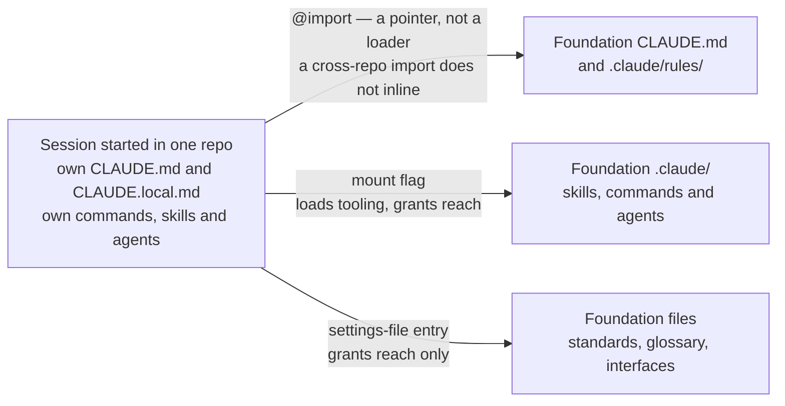

## 1. Intent

An operator can rely on knowing which rules are actually active in any
session, and rules that must always hold, always hold regardless of which
repository or folder the session was launched in. The harness must not let a
session look configured while quietly reaching nothing, and must not let a
rule the operator believes is universal turn out to depend on which repo
someone happened to launch from.

## 2. Problem & evidence

Three repositories mean a session almost never starts with everything in
context. An operator working in one repo reaches the other two through a
handful of configuration surfaces that look alike on the page — an import
line near the top of a `CLAUDE.md`, a launch flag, an entry in a settings
file — and behave nothing alike underneath. One is a pointer that never
resolves into context. One grants filesystem reach and also loads commands,
skills and agents. One grants filesystem reach and loads nothing else. None
of the three raises an error when used the way an operator would naturally
expect it to work.

The harness's own documentation got two of the three mechanisms wrong
outright, and mis-attributed the third mechanism's real capability to the
wrong place. Both repo-root `CLAUDE.md` files asserted that a sibling
repository's rules load into context automatically once it sits next to the
working repo on disk. That claim is false for the import line, corrected
2026-08-26. The same false claim survived six days longer in the role onboarding
templates, the files a joiner copies verbatim, and was not corrected until
2026-09-01. The settings entry carried a separate false claim of
its own: Domain's and Leadership's `AGENTS.md` stated that Foundation's
shared agents "are loaded by Claude via `additionalDirectories`," crediting
the settings entry with a capability it does not have. That capability
belongs to the launch flag, which was never itself misdescribed; its real
behaviour was simply attributed to the wrong mechanism. Both the import
claim and the settings claim failed silently: neither mechanism signals its
own limits. A session that reached nothing behaved, on the surface, exactly
like a session that had everything it needed: it started, it answered
questions, and it never said what it could not see. An operator trusting a
confidentiality rule to be active, or a shared command to be available, had
no signal from the session itself that neither was true.

Foundation's `CHANGELOG.md` records the correction directly: the 2026-08-26
entry states the harness "corrected what the harness claims about session
loading — a cross-repo `@import` of a sibling's `CLAUDE.md` never inlines
it, verified by test," and the 2026-09-01 entry records a second sweep that
"corrected the six sites across the three role onboarding templates — the
files a joiner copies verbatim — that claimed Foundation's rules load
automatically once it's a sibling repo."

## 3. Outcomes

- An operator can name, for any session, exactly which of the three reach
  mechanisms is active and what it does and does not put in context.
- A rule that must hold in every session, confidentiality above all,
  holds regardless of whether the other two repositories are reachable,
  because it is written into the repo the session actually starts in.
- A session in a stale clone is flagged before work begins, without any
  automatic merge happening on the operator's behalf.
- A misconfigured install is at least partially self-detecting: a documented
  probe distinguishes a session that can reach Foundation from one that
  cannot, rather than leaving the operator to discover the gap mid-task.
- Directory location alone determines which repository- and domain-specific
  rules a session picks up, with no separate switch to set.

## 4. Non-goals

- Building an automated check that a restated rule stays word-for-word in
  sync with Foundation's version. Section 8 records this as an open
  question; nothing in the harness closes it today.
- Enforcing `pull-check` at a technical level: blocking a session, or
  failing a commit, when staleness goes unreported. It remains an
  instruction inside each `CLAUDE.md`, not a hook or a CI gate.
- Specifying the anchor for a relative path inside `additionalDirectories`
  (settings-file location versus launch directory). Section 8 records this
  as a genuine gap, not a solved problem this PRD is describing.
- Defining the sibling clone layout or canonical cross-repo path forms.
  That is PRD-01's FR-01.2 and FR-01.3; this PRD assumes that layout exists
  and describes what a session does with it.
- Designing the banned-string check, back-flow review, or any other
  confidentiality enforcement layer. Those mechanisms are named here only
  as what the restated rule points to.

## 5. Solution sketch

A session's reach into the other two repositories comes from three
independent mechanisms, not one unified "load the harness" step. Each
mechanism grants a different combination of filesystem reach and in-context
content, and an operator who treats any one of them as doing what the other
two do will misjudge what the session actually knows.

The primary flow: an operator launches a session inside one repository. A
domain folder is the common case for a Product Owner, Team Member or Domain
Lead. That repository's own `CLAUDE.md` and `CLAUDE.local.md` load
automatically, and its own `.claude/` commands, skills and agents are
available without any extra step. Everything else about the other two
repositories is optional and mechanism-specific:

- An `@import` line near the top of a `CLAUDE.md`, pointing at a sibling
  repository's `CLAUDE.md`, is a pointer that documents the dependency. It
  does not inline the target file into context, and it raises no error when
  it fails to.
- A session launched with a directory-mount flag (or the equivalent
  mid-session command) gains filesystem reach into that directory, gains its
  `.claude/` skills with live reload, and gains its commands and agents
  without live reload. The launching repository's own command wins any
  name clash. It does not, by itself, put the mounted directory's
  `CLAUDE.md` into context.
- A settings-file entry granting a directory reach (nested correctly, it
  must sit under the settings file's permissions block, not at the file's
  top level) grants filesystem reach and nothing else: no skills, no
  commands, no agents, no `CLAUDE.md`.

Key rules:

- Reach is necessary and never sufficient. All three mechanisms let a
  session read files in the other repository; none of them puts that
  content into context on its own. Something still has to retrieve it: an
  operator asking for it, or a knowledge-retrieval command going and getting
  it.
- A rule that must hold in every session cannot live only in the repository
  an operator might fail to reach. It has to be restated in the repository
  the session is guaranteed to start in.
- Directory location is identity. The folder a session launches inside
  determines which repository's and which domain's rules apply, with no
  further configuration.
- A wrong install produces no error message anywhere in this flow. The only
  way to know reach is actually configured is to test it.

Important states: a session that never reaches beyond its own repository
(every operator's default, most of the time); a session with a mount flag
active, carrying the mounted repository's shared commands, skills and
agents; a session with only a settings-file entry active, carrying
filesystem reach into the other repository and nothing more than that.

Alternatives rejected:

- **Make `@import` inline the target automatically.** This is not a design
  choice the harness controls; it is the underlying agent tool's behaviour.
  Documenting it accurately was the fix, not proposing a different import
  semantics the harness has no way to implement.
- **Reference Foundation's confidentiality rule from Domain and Leadership
  instead of restating it.** Rejected because a reference resolves only if
  something retrieves it, and the one rule that must hold in every session
  cannot depend on an operator remembering to ask for it.
- **A CI check that inlines every restated rule and diffs it against
  Foundation's source.** Would close the FR-02.4 open question, but nothing
  in either repository's toolchain does this today; recorded as an open
  question rather than invented as a design this PRD would then have to
  claim is built.

## 6. Requirements

### FR-02.1 — A cross-repo import is a pointer, not a loader

Status: SHIPPED
Evidence: `organisationos-foundation/docs/loading-model.md`, mechanism
table, row 1: "A cross-repo import does not inline its target. An import of
a file inside the same project does. Neither case emits an error."; the same
file's closing verification note, "Mechanism behaviour re-verified by an
eight-cell, negative-controlled experiment on 2026-09-01"; Foundation
`CHANGELOG.md`, 2026-08-26 entry, "a cross-repo `@import` of a sibling's
`CLAUDE.md` never inlines it, verified by test." (The verification note's
own wording changed between when this PRD was scoped and when it was
written — an earlier draft cited a 2026-08-26 note describing seven headless
runs with an in-project import as control; the file read on 2026-09-02
carries the eight-cell note quoted above instead. Both describe a tested,
not merely asserted, distinction between an in-project import that inlines
and a cross-repo import that does not; this PRD cites what the file says on
the day it was read.)

A cross-repo `@import` line inside a `CLAUDE.md` MUST be treated as
documentation of a dependency, not as a mechanism that puts the target
file's content into the session's context. It MUST NOT raise an error when
the target is unreachable or when nothing retrieves it.

- Every `@import` line pointing at a sibling repository's `CLAUDE.md`
  appears near the top of the importing file, documenting the dependency
  for a human reader.
- No process in the harness treats a resolved `@import` as proof that the
  target file's rules are active in the current session.
- The same import syntax, used on a file inside the importing repository,
  behaves differently: an in-project import does inline. The distinction is
  the repo boundary, not the syntax.

### FR-02.2 — A mount flag loads tooling and grants reach

Status: SHIPPED
Evidence: `organisationos-foundation/docs/loading-model.md`, mechanism
table, row 2: "Yes | Yes, with live reload | Yes, without live reload; the
project's own command wins a name clash | No — but it grants the reach that
lets the agent read them on request"; `organisationos-domain/AGENTS.md` and
`organisationos-leadership/AGENTS.md`, each stating that the Claude Code
mirror of Foundation's shared agents "picks up Foundation's `.claude/agents/`
only when a session is started with" the mount flag.

Starting a session with a directory-mount flag (or issuing the equivalent
mid-session command) MUST grant filesystem reach into the mounted
directory, MUST load that directory's skills with live reload, and MUST
load that directory's commands and agents without live reload. A name
clash between a mounted command or agent and one already defined in the
launching repository MUST resolve to the launching repository's own
definition.

- Foundation's shared commands (an onboarding command, a knowledge-retrieval
  command, a wiki-update command, a cross-domain-decision command) and
  agents are unavailable to a session that has not mounted Foundation this
  way, regardless of any settings-file entry also in effect.
- Mounting mid-session picks up newly added skills without a restart; newly
  added commands or agents require the mount to be present at session
  start.
- Mounting a directory this way does not, by itself, put that directory's
  own `CLAUDE.md` into context. That effect is a separate, optional
  environment toggle, off by default and unused by anything in the
  three-repo set.

### FR-02.3 — A settings-file entry grants reach only

Status: SHIPPED
Evidence: `organisationos-foundation/docs/loading-model.md`, mechanism
table, row 3: a settings-file directory-reach entry grants "Yes" for
readable files and "No" for skills, commands, agents and the mounted
repository's `CLAUDE.md` rules — "but it grants that same reach." Currently
correct nesting confirmed by reading
`organisationos-foundation/standards/templates/onboarding/settings.local.json.example-domain-lead`,
`-admin`, `-leader`, `-product-owner` and `-team-member`, plus each repo's
own `.claude/settings.local.json.example`: all six carry the directory-reach
key nested under the settings file's permissions block.

That nesting was not always correct. Foundation `CHANGELOG.md`, 2026-09-01
entry: "every one put the key at the top level of the settings JSON, where
it is silently ignored — valid JSON, exit 0, no warning, and the granted
directories are simply never applied." All thirteen shipped examples across
the three repositories carried this defect at once, and an install built
from any of them started without complaint and reached nothing. Leadership's
own history carries the same fix as a standalone commit predating this
correction, titled "Fix `additionalDirectories` nesting in shipped settings
example."

A second, separate defect over-attributed capability to this same
mechanism. Domain's and Leadership's `AGENTS.md` (both corrected
2026-08-26) previously stated that Foundation's shared agents "are loaded
by Claude via `additionalDirectories`" — a capability the settings entry
has never had; agents load only via the mount flag described in FR-02.2.
The current text names the mount flag as the actual mechanism and states
plainly that "the `additionalDirectories` entry in `settings.local.json`
grants file access and loads no agents."

A settings-file directory-reach entry MUST grant filesystem reach into the
named directory and MUST NOT load that directory's skills, commands,
agents, or `CLAUDE.md`. The entry MUST be nested under the settings file's
permissions block; an entry at the file's top level is silently ignored by
the tool reading it.

- A directory named this way is readable by the session, and by nothing
  else until a mount flag or an explicit request retrieves its content.
- An empty or malformed list produces the same silent behaviour as no list
  at all: the session starts, reports nothing wrong, and simply cannot see
  the named directory.
- Each role's onboarding settings example — not the generic repo-root
  example, whose list ships empty — is the source a joiner should copy.

### FR-02.4 — Rules that must always hold are restated locally

Status: SHIPPED
Evidence: `organisationos-domain/CLAUDE.md` and
`organisationos-leadership/CLAUDE.md`, each carrying the confidentiality
rule in full, with the identical explanatory sentence: "This rule is stated
here in full rather than by reference to Foundation, because a cross-repo
`@import` does not put Foundation's rules into context — see Foundation
`docs/loading-model.md`. Restating the rule here is what makes it reliably
active." Both restatements date to 2026-08-26 (Domain `5acd566`, Leadership
`224fb78`). Foundation `CHANGELOG.md`'s 2026-09-01 entry records a later,
separate correction of the same false claim in the role onboarding
templates — the files a joiner copies verbatim — six days after the
repo-root files were fixed: "corrected the six sites across the three role
onboarding templates... that claimed Foundation's rules load automatically
once it's a sibling repo."

A rule that must hold in every session, regardless of whether Foundation is
reachable, MUST be written in full inside every repository's own
`CLAUDE.md`, not merely referenced from Foundation's copy of the same rule.

- The confidentiality rule appears in full, in the same words, in
  Domain's and Leadership's `CLAUDE.md` files, each explaining why the
  restatement exists rather than pointing elsewhere for it. Foundation's
  own `CLAUDE.md` carries the rule as its source, without that
  restatement framing — it has no other repo's copy to restate from.
- No onboarding material states or implies that a sibling repository's
  rules become active in a session merely because that repository is a
  sibling clone on disk.
- A restated rule is written independently in each file; nothing in this
  requirement claims it is derived from a single shared source at build
  time.

Open question, not settled by this requirement: the restatements are
correct today because someone reread and rewrote all three by hand during
the 2026-08-26 correction. Nothing checks that the next change to
Foundation's confidentiality wording gets carried into Domain's and
Leadership's copies — see section 8.

### FR-02.5 — The reach probe (smoke test)

Status: CONVENTION
Evidence: `organisationos-foundation/docs/loading-model.md`, "The smoke
test" section, and `organisationos-foundation/docs/setup-person.md`, step 4,
both specifying: "Read Foundation's `standards/coverage-gaps.md` and quote
the Defence for the 'Date identifiers' row," expecting the answer "Back-flow
review (Domain Lead recognises the date)."

This is the probe's second version. Foundation `CHANGELOG.md`, 2026-09-01
entry: "the smoke test in `loading-model.md` and `setup-person.md`... asked
for a fact from `FORMATS.md`, which CI mirrors byte-identical into all three
repos, so a Domain-only clone with no Foundation on disk answered it
correctly and the test could never fail. The probe now reads a file under
Foundation's `standards/`, which Domain and Leadership do not carry." The
old probe was not merely weak; it was structurally incapable of failing,
because every fact it asked for existed, identically, in the clone it was
meant to catch as broken. Of everything in this PRD set, that defect is the
clearest illustration of why an evidence bar distinguishing a documented
claim from an observed one exists at all: the old probe was fully
documented, fully wired into onboarding, and reported nothing false — and
still proved nothing, ever, about the one thing it existed to check.

The setup and loading-model documentation MUST specify a probe that a
session can fail: a question whose correct answer requires reading a file
that exists in Foundation and not in the repository the session started
in.

- The probe reads a fact from a file under Foundation's `standards/`
  folder, a folder Domain and Leadership clones do not carry.
- A session that cannot reach Foundation is expected to answer wrongly or
  report the file missing; either outcome is the probe working, not the
  probe failing.
- The probe documentation states explicitly what it does not prove: a
  correct answer shows reach, not that Foundation's rules are already in
  context.

### FR-02.6 — `pull-check` at session start

Status: CONVENTION
Evidence: Foundation, Domain and Leadership `CLAUDE.md`, each carrying an
identical step 0 in "Read order at session start": "run `git fetch` on each
cloned repo present in the workspace... and report how many commits behind
`origin/main` each one is... This is a freshness signal, not auto-merge —
never `git pull`/`merge`/`rebase` on the operator's behalf."

At the start of a session, the harness MUST fetch and report each present
repository's commits-behind count against `origin/main`, and MUST NOT pull,
merge, or rebase on the operator's behalf.

- The instruction runs before the rest of session context is assembled,
  because that context does not refresh again until the next session
  starts.
- The report names each repository present in the workspace, not only the
  one the session launched in.
- Nothing in the harness verifies that this step actually ran in a given
  session; it is a `CLAUDE.md` instruction, not a hook or a gate.

### FR-02.7 — `CLAUDE.local.md` personal overlay, gitignored

Status: SHIPPED
Evidence: `organisationos-foundation/.gitignore`,
`organisationos-domain/.gitignore` and
`organisationos-leadership/.gitignore`, each carrying `CLAUDE.local.md` and
`**/CLAUDE.local.md`; `organisationos-foundation/docs/setup-person.md`:
"Both files are gitignored. `CLAUDE.local.md`, `**/CLAUDE.local.md`,
`.claude/settings.local.json` and `**/.claude/settings.local.json` are in
every repo's `.gitignore`. Your notes about colleagues, your preferences and
your active work stay on your machine."

A personal overlay file, `CLAUDE.local.md`, MUST be excluded from version
control in every repository, at both the repository root and inside any
subfolder (a domain folder, in Domain's case).

- All three repositories' `.gitignore` files carry both the root-level and
  the recursive pattern.
- Each repository's `CLAUDE.md` read order lists `CLAUDE.local.md` as the
  final step, read if present.
- The paired settings file that grants a session its filesystem reach is
  gitignored the same way, for the same reason: it holds a person's own
  configuration, not shared harness content.

### FR-02.8 — Directory location is identity

Status: CONVENTION
Evidence: `organisationos-foundation/CLAUDE.md`, "Directory location is
identity. A session launched in the Domain repo inside a domain folder
picks up that domain's CLAUDE.md too."; `organisationos-domain/CLAUDE.md`,
"Directory location is identity. Launch Claude inside `domain-1/` and Claude
is a Domain 1 team member with both this file and `domain-1/CLAUDE.md` in
context."

The folder a session is launched inside MUST determine which repository's
and, inside Domain, which domain's `CLAUDE.md` applies, with no separate
role- or identity-selecting step.

- A session launched at a Domain repository's root picks up that
  repository's own `CLAUDE.md` only.
- A session launched inside a domain folder picks up both the repository
  root `CLAUDE.md` and that folder's own `CLAUDE.md`.
- Nothing in the harness checks that an operator launched from the folder
  matching their role; the convention relies on the operator doing so.

## 7. Dependencies & constraints

- **PRD-01** establishes the sibling clone layout and the canonical
  cross-repo path forms this PRD's mechanisms assume. A session whose
  sibling repository is nested somewhere else, or is named unconventionally,
  finds every path in this PRD silently broken before any loading-model
  question arises.
- **The PRD covering roles and onboarding templates** owns the specific
  `additionalDirectories` list shipped for each of the five committer roles.
  This PRD describes what the mechanism does with whatever list is present;
  it does not define which paths belong on which role's list.
- **External constraint — the underlying agent tool's own behaviour.** All
  three mechanisms in section 5 are the agent tool's design, not the
  harness's. The harness's only lever is documentation and the restated
  rules in FR-02.4; it cannot change what an import, a mount flag, or a
  settings entry does underneath.
- **External constraint — no session-start hook exists in either template
  repository.** `pull-check` (FR-02.6) and the reach probe (FR-02.5) are
  both instructions a session is expected to follow, not code that runs
  automatically before the session begins.

## 8. Known gaps & open questions

- **GAP — the anchor for a relative `additionalDirectories` path is
  unspecified.** Domain roles are told, in `setup-person.md` step 4, to
  launch a session "in the folder you will actually work from —
  `organisationos-domain/domain-N/` for domain roles." That folder sits one
  level deeper than the repository root the matching settings file is copied
  to (`organisationos-domain/.claude/settings.local.json`). That settings
  file's `additionalDirectories` entry reads `"../organisationos-foundation"`:
  correct if the path is resolved against the settings file's own location,
  wrong by one level if it is resolved against the session's launch
  directory instead. No document in either repository states which
  anchor the tool actually uses. A Domain Lead who launches from inside a
  domain folder is relying on a reading of this path that nothing confirms.
- **Open question — restatement drift (FR-02.4).** Domain's and
  Leadership's confidentiality sections are correct today because both were
  reread and rewritten by hand during the 2026-08-26 correction. No check
  compares their wording against Foundation's `CLAUDE.md` on an ongoing
  basis; a future edit to Foundation's confidentiality rule could go
  uncarried into either restatement with nothing surfacing the mismatch.
- **Caveat — the reach probe's own ingredients sit inside the answer's
  reach (FR-02.5).** The expected answer names "Back-flow review," "Domain
  Lead" and "date identifiers." All three phrases already appear, verbatim,
  in the confidentiality section of the very `CLAUDE.md` a broken-install
  session has already loaded: "Back-flow review by Admin + Domain Lead on
  `back-flow`-labelled PRs" and "paraphrased, structural, numerical,
  co-occurrence, date and near-miss identifiers." A session that cannot
  reach Foundation at all has a genuine chance of assembling a
  plausible-sounding version of the expected answer from context already in
  scope, rather than reporting the file unreachable. One trial run against
  this probe did not confabulate an answer; one trial is evidence of
  nothing more than that one trial's outcome, and does not establish the
  probe is robust against the failure mode it exists to catch.
- **Open question — no session-side signal when a mechanism is
  misconfigured.** All three reach mechanisms in section 5 fail silently by
  design (or by underlying tool behaviour the harness cannot change). This
  PRD documents that fact and ships one probe against it; it does not close
  the general problem that a session has no built-in way to report its own
  reach.

## 9. Rebuild guide

This section assumes PRD-01's three repositories already exist, each with
the sibling layout and path forms PRD-01 describes, and nothing about
session loading built on top of them yet.

1. Write each repository's own `CLAUDE.md` so it restates, in full, every
   rule that must hold regardless of which other repositories are
   reachable, the confidentiality rule above all. Do not write a rule only
   once in Foundation and reference it from Domain or Leadership; a
   reference resolves only if something retrieves it, and this rule cannot
   depend on that.
2. Add a single `@import` line near the top of Domain's and Leadership's
   `CLAUDE.md`, pointing at Foundation's `CLAUDE.md`. Document, next to it,
   that the line is a pointer for a human reader and not a loading
   mechanism. This is where the two past corrections (2026-08-26 and
   2026-09-01) both intervened, and skipping this note reintroduces the
   same false claim.
3. Ship one settings-file example per committer role, each carrying its
   role's directory list nested under the settings file's permissions
   block. Verify the nesting directly: run a session against one of the
   shipped examples and confirm the mounted directory is actually readable,
   rather than trusting that the JSON parses.
4. Write the reach probe into both the loading-model documentation and the
   person-onboarding documentation: a question whose answer requires a fact
   from a Foundation-only file, one neither Domain nor Leadership carries a
   copy of. Verify the probe can fail: run it against a session with no
   Foundation reach configured and confirm it reports the file missing
   rather than answering correctly by coincidence.
5. Add the `pull-check` instruction as the first step of every repository's
   read order, and the personal-overlay convention (`CLAUDE.local.md`,
   gitignored, read last) as the final step.
6. State directory-location-as-identity explicitly in Foundation's and
   Domain's `CLAUDE.md`: a session launched inside a domain folder carries
   both the repository root file and that folder's own file.

After this PRD alone: an operator can reason correctly about what each of
the three reach mechanisms does, a rule that must always hold does hold
regardless of reach, and a broken install has one documented probe against
it. What stays open: nothing enforces that Domain's and Leadership's
restated rules track Foundation's wording over time, nothing resolves the
`additionalDirectories` anchor question, and the probe's own resistance to
confabulation is untested beyond a single trial. All three wait for
whichever later PRD takes up automated drift-checking, settings-schema
validation, or install verification.

## 10. Provenance & verification

Files specified by this PRD (`specifies:` above) are the three repositories'
root `CLAUDE.md` and `AGENTS.md` files, the four domain-level `CLAUDE.md`
files in Domain, and Foundation's `docs/loading-model.md`. Every file was
read in full on 2026-09-02, against Foundation tag `v1.1.2`.

Every `SHIPPED` and `CONVENTION` claim above was verified by reading the
cited file at the cited section on 2026-09-02. Where a claim rests on a
mechanism-behaviour test (FR-02.1, FR-02.2, FR-02.3), this PRD cites
`loading-model.md`'s own account of that test and Foundation `CHANGELOG.md`
entries dated 2026-08-26 and 2026-09-01; neither test was re-run by this
PRD, which is why none of the three carries `ENFORCED` status. No
`ENFORCED` claim appears in this PRD: every requirement here describes
either the underlying agent tool's behaviour (not something this harness's
own CI executes) or a documentation convention, and this PRD did not itself
execute anything to observe a verdict.

FR-02.1's evidence block already records the wording drift behind this
test (seven headless runs, as originally scoped, versus the eight-cell
experiment the file carries as read) and the standing rule that the file
wins over a prior prediction; see that entry rather than a repeat here.
