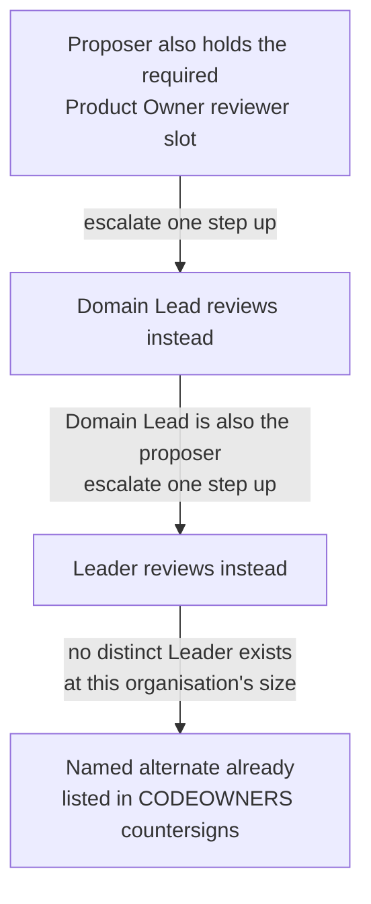

## 1. Intent

Every artefact that leaves a draft state passes a named human whose
ownership is legible from the repository and path alone, and the weight of
that review lands at the narrowest level able to bear it — a domain's own
note reviewed by one domain-local human, a harness-wide standard reviewed by
more than one. The model must keep working when the organisation is too
small to hand every role to a different person.

## 2. Problem & evidence

A knowledge-work organisation running human-agent collaboration needs every
merged artefact to have passed a named human, and needs the review weight to
track the artefact's blast radius rather than being uniform across every
change. `docs/concepts.md` names the organisation size where this bites: at
20–50 people, "one human often holds two or three roles" (line 45), and "up
to roughly 50 people, one Admin wears both hats" (line 47). At that size,
the number of distinct humans available to staff review roles is routinely
smaller than the number of roles the model calls for: one person holds two
or three functions at once. A model that assigns review purely by job title
breaks the first time a title-holder is also the person proposing the
change: either the pull request has no valid approver left, or the same
human's judgement is counted twice under two different labels. A model that
instead insists on a fully distinct human for every slot breaks
differently — toward the bottom of that same 20–50 range, some slots simply
have no second candidate, and review stalls rather than degrading.

The harness's own template repositories show the case this has to remain
honest about rather than design around. Foundation's `main` branch, as
published, carries no branch protection at all:
`gh api repos/2SSilver/organisationos-foundation/branches/main/protection`
returns `404`, `"Branch not protected"` (verified 2026-09-02). Its most
recently merged pull request, #6, was authored and merged by the same
account with no recorded reviews (`gh pr view 6 -R
2SSilver/organisationos-foundation --json reviews,author,mergedBy` returns
`"reviews":[]` and an identical `author.login` and `mergedBy.login`). A
single-maintainer instance of the harness — exactly the shape these three
template repositories are today — is a live example of the scarcity the
role model has to survive, not an edge case to exclude from its design.

## 3. Outcomes

- A reviewer can name, from the repository and path a pull request touches
  alone, which role or roles are supposed to approve it, without reading the
  diff first.
- No pull request is approved solely by the person who opened it.
- When the smallest available reviewer set would otherwise collapse onto one
  human wearing two hats, a documented escalation or a named alternate
  supplies a second, valid approver.
- A change to Foundation's substrate paths is documented as needing more
  reviewers than a change confined to one domain, consistent with PRD-01's
  blast-radius principle.
- The Admin's workload is documented as splitting into two functions that
  can be held by different people once the organisation outgrows one person
  holding both.

## 4. Non-goals

- Defining the three-repo split or the blast-radius principle itself. PRD-01
  owns that; this PRD assumes it and binds reviewer identity to the paths
  PRD-01 already distinguishes by repository.
- Defining how a decision is promoted from a domain into Foundation once
  `promotion-lint` fires. PRD-07 owns that flow; this PRD supplies the
  reviewer identities that flow calls on, not the flow's mechanics.
- Prescribing which real GitHub handle fills which role for any given
  adopter. Every CODEOWNERS entry in the template ships with a placeholder
  handle; substituting real ones is the adopter's own task, described in
  `docs/setup-org.md` Step 4.
- Building a check that confirms two *distinct* humans, rather than two role
  labels, approved a given pull request. Section 8 records this as an open
  gap; nothing in the harness closes it today.

## 5. Solution sketch

The role model binds five functions to review paths, not to people. A role
is a documented one-line ownership statement; a CODEOWNERS entry is what
turns that statement into a specific set of GitHub handles a reviewer set
can be checked against for a given path. Renaming a role's label changes
neither the path bindings nor the function it covers.

The primary flow: a contributor opens a pull request. The path it touches
determines, via CODEOWNERS, which role or roles are the required reviewers —
one domain-local reviewer for a change confined to that domain's folder, two
harness-level reviewers for a change to Foundation's substrate, a wider set
(the Leader plus every affected domain's Domain Lead) for a cross-domain
artefact. If the proposer is also one of the required reviewers for that
path, the slot does not simply go unfilled or get satisfied by the
proposer's own approval: it escalates one step up a fixed ladder — Product
Owner to Domain Lead to Leader — until it lands on someone who is not the
proposer. Where the organisation is too small for that ladder to reach a
distinct person, a named alternate already listed in CODEOWNERS countersigns
instead.

Key rules:

- Role labels are adopter-renameable defaults; the five functions — what
  each role owns — are what has to travel, not the label text.
- A consumer (someone who reads without committing) never appears in
  CODEOWNERS and needs no role binding; being listed as a stakeholder in a
  domain's README carries no reviewer obligation.
- CODEOWNERS' `*` default match is not treated as a dedicated owner for a
  substrate path; every substrate path names a specific role beyond it.
- A proposer's own approval of their own pull request never counts, by
  GitHub's own platform behaviour; the role model is built assuming this
  rather than encoding it itself.
- Two-approver review on Foundation's substrate paths is a documented floor,
  not something applied automatically at repository creation. It becomes an
  actual merge gate only once branch protection is configured deliberately;
  until then, every reviewer-set rule here is advisory.

Important states: the template state, as published — placeholder handles in
every CODEOWNERS entry, no branch protection applied anywhere, verified
directly on Foundation's own repository above; the adopter-bound state,
once real handles replace the placeholders; the protected state, once
branch protection is actually configured so CODEOWNERS stops being advisory;
and the escalated state, reached whenever a role-holder is also the
proposer and the ladder or a named alternate has to supply the second
reviewer.

Alternatives rejected:

- **A single flat reviewer pool, any of the five roles approves any PR.**
  Rejected because it erases the blast-radius signal PRD-01's repo split
  exists to preserve: a domain-local change and a Foundation substrate
  change would need the identical reviewer set, collapsing the distinction
  the split is for.
- **A CI-computed mapping from GitHub account to role, checked against a
  diff's actual risk.** Rejected — it would need an account-to-role registry
  the harness does not ship, duplicating what CODEOWNERS already expresses
  declaratively, and nothing in the current design maintains such a
  registry.
- **Requiring a fully distinct human for every reviewer slot, with no
  escalation or alternate.** Rejected because it does not survive the
  organisation sizes this harness targets: some roles have no second
  candidate at 20–50 people, and the model has to degrade through the
  ladder and the named alternate rather than stall outright.

## 6. Requirements

### FR-03.1 — Five committer roles, one-line ownership, portable functions

Status: CONVENTION
Evidence: `organisationos-foundation/docs/concepts.md`, "The five roles"
section (lines 33–47): "Role labels are defaults; adopters rename them to
fit their culture. The five functions are what travel." — followed by one
bullet per role (Product Owner, Team Member, Domain Lead, Leader, Admin),
each with a one-line ownership statement. `organisationos-foundation/CLAUDE.md`,
"Roles in this repo" section, restates the same five roles with matching
one-line ownership ("Product Owner — owns what the domain offers", "Team
Member — owns how the work is done", and so on).

The harness MUST define five committer roles — Product Owner, Team Member,
Domain Lead, Leader, Admin — each with one documented line of ownership, and
MUST state that the role labels are adopter-renameable while the five
functions travel intact.

- `docs/concepts.md` names all five roles with one ownership line each and
  states plainly that labels are defaults an adopter may rename.
- Foundation's `CLAUDE.md` restates the same five roles with matching
  one-line ownership, introduced as "The harness defines five committer
  roles."
- Neither file ties a role's function to a specific job title outside the
  harness; each is described by what it owns, not by an org-chart position.

### FR-03.2 — Consumers read without committing, no role binding

Status: CONVENTION
Evidence: `organisationos-foundation/docs/concepts.md`, line 43: "People who
read the harness without committing — Operations, Finance, Legal, customers
— are *consumers*. They are listed as stakeholders in a domain's README and
need no role binding." `organisationos-domain/domain-1/README.md`, "##
Stakeholders (read this repo without committing)" heading, listing consumers
by handle and what they consume.

A person who reads the harness without committing to it MUST NOT require a
role binding, and MUST be recorded, if at all, as a stakeholder in the
relevant domain's README rather than in any CODEOWNERS file.

- `docs/concepts.md` names Operations, Finance, Legal and customers as the
  worked examples of a consumer.
- Each domain's README carries a "Stakeholders" section distinct from its
  "Who works here" section, so a reader can tell a consumer from a
  committer role at a glance.
- No CODEOWNERS file in any of the three repositories lists a consumer; the
  mechanism that binds a role to a handle has no consumer-facing entry
  point.

### FR-03.3 — CODEOWNERS binds roles to handles

Status: SHIPPED
Evidence: `organisationos-foundation/.github/CODEOWNERS`,
`organisationos-leadership/.github/CODEOWNERS` and
`organisationos-domain/.github/CODEOWNERS` all exist and bind paths to
handles (each file's own header: "Adopter customisation: replace every
placeholder handle below with real GitHub handles"). Foundation's
`self-ci.yml`, `codeowners-lint` job, verifies structurally that "every
substrate path has a dedicated owner" beyond the `*` default, walking a
fixed `SUBSTRATE_PATHS` list against the parsed CODEOWNERS rules.
`docs/setup-org.md` Step 4 is the adopter step that replaces the
placeholders: "Each repo's `.github/CODEOWNERS` names `@placeholder-admin`,
`@placeholder-leader` and `@placeholder-domain-N-lead`. Replace them with
real GitHub handles in all three repos."

Each of the three repositories MUST ship a `.github/CODEOWNERS` file binding
review paths to role-holder handles, and Foundation MUST run a check that
every substrate path names a dedicated owner beyond the default match.

- All three CODEOWNERS files are present and every substrate path in
  Foundation's `codeowners-lint` list resolves to at least one named,
  non-default owner.
- At template state every handle is a placeholder
  (`@placeholder-admin`, `@placeholder-leader`,
  `@placeholder-domain-N-lead`); the binding mechanism is wired and
  structurally validated, but names no real reviewer until an adopter
  substitutes handles.
- An adopter completes the binding — not the mechanism itself — by running
  `docs/setup-org.md` Step 4; nothing before that step causes any CODEOWNERS
  entry to name an actual person.

### FR-03.4 — Two-approver minimum on Foundation substrate paths

Status: CONVENTION
Evidence: `organisationos-foundation/.github/CODEOWNERS`, two-approver block
(`/standards/`, `/.github/workflows/`, `/.github/hooks/`, `/.github/agents/`,
`/.github/ISSUE_TEMPLATE/`, `/.claude/`, `/CLAUDE.md`, `/AGENTS.md`,
`/FORMATS.md`, `/.mcp.json`, each naming
`@placeholder-admin @placeholder-leader`). Foundation `CLAUDE.md`:
"Treat every PR to this repo as a substrate change (two-approver minimum for
`/standards/`, `/.github/`, `/.claude/`)." `docs/setup-org.md` Step 7 gives
the branch-protection table and the `gh api` command that would turn this
into an actual gate (`required_approving_review_count: 2` for Foundation)
and states plainly what is lost without it: "What you lose if you skip this
step: every reviewer-set rule in the harness becomes advisory." Verified
live against the published Foundation repository on 2026-09-02: `gh api
repos/2SSilver/organisationos-foundation/branches/main/protection` returns
`404`, `"Branch not protected"` — the step has not been run, and nothing
enforces the two-approver floor on the repository as shipped.

A pull request touching Foundation's substrate paths MUST be documented as
requiring two approvers (Admin and Leader), and this floor MUST be
understood as a documented convention until branch protection is separately
and deliberately applied.

- Every substrate path in Foundation's CODEOWNERS names two handles, not
  one, for the two-approver block.
- `docs/setup-org.md` Step 7 supplies the exact command to turn the floor
  into an enforced gate; running it is a separate, deliberate act from
  shipping the CODEOWNERS file.
- On the published template repository, no branch protection is applied;
  the two-approver rule is documented and expected, not enforced, at
  template state.

### FR-03.5 — No double-hat approval; escalation Product Owner to Domain Lead to Leader

Status: CONVENTION
Evidence: `organisationos-foundation/docs/concepts.md`, "One person, several
hats" paragraph (line 45): "no single human satisfies two required-reviewer
slots on the same PR. When a role-holder is also the proposer, the slot
escalates one step up (Product Owner → Domain Lead → Leader)." The
`.github/PULL_REQUEST_TEMPLATE.md` "Reviewers" section carries the same rule
operationalised: "Second required reviewer if proposer wears multiple
roles: @<handle>." `docs/setup-org.md` Step 7 notes the one piece of this
that GitHub itself guarantees regardless of configuration: "GitHub never
counts the PR author's own approval, which is the 'proposer cannot approve'
rule the harness relies on."

When a role-holder who is also the proposer of a pull request would
otherwise be one of that pull request's required reviewers, the slot MUST
escalate one step up a fixed ladder — Product Owner to Domain Lead to
Leader — rather than being satisfied by the proposer's own approval or left
unfilled.

- `docs/concepts.md` states the ladder and the one-human-two-slots rule in
  the same paragraph as the multi-hat allowance, not as a separate,
  easy-to-miss caveat.
- The PR template carries a dedicated "Second required reviewer if proposer
  wears multiple roles" line, so the escalation is something the proposer
  records at the point of opening the PR, not something inferred later.
- GitHub's own platform behaviour guarantees the narrower case — a proposer
  cannot approve their own PR — independent of any harness configuration;
  the harness's own contribution is the escalation ladder for the broader
  case of one human holding two *different* required-reviewer roles.
- Nothing in Foundation's CI computes which GitHub account holds which
  role, so nothing checks that an escalation was actually followed, or that
  two approvals on a given PR came from two role-holders rather than one
  person operating under two hats; the rule is stated and repeated, not
  mechanically verified.

### FR-03.6 — Named alternates in CODEOWNERS so a valid approver always exists

Status: SHIPPED
Evidence: `organisationos-leadership/.github/CODEOWNERS`, `/cadence/` entry:
`@placeholder-leader @placeholder-domain-1-lead`, with the comment "Small-org
fallback to the multi-hat rule — worked example: Leader-authored minutes...
A Domain Lead countersigns as the named alternate." The same file's
`/steward/drift-log.md` entry: `@placeholder-leader`, distinct from
`/steward/`'s `@placeholder-admin`, with the comment: "Proposer-cannot-approve
makes a single-owner gate on `drift-log.md` mechanically impossible once the
Admin is both the routine proposer and the only owner — so the more specific
path below requires the Leader as the distinct reviewer."

Each repository's CODEOWNERS MUST name a named alternate reviewer wherever a
single default owner would otherwise deadlock against the proposer-cannot-
approve rule.

- When the Leader authors a pull request touching only `cadence/`, a Domain
  Lead is already listed as a second valid owner for that path, so
  proposer-cannot-approve does not leave zero valid approvers.
- When the Admin proposes a routine `drift-log.md` update, the Leader — not
  the Admin — is the owner named for that specific path, distinct from the
  Admin-only ownership of the rest of `steward/`.
- Both cases are encoded directly in CODEOWNERS as a second, path-specific
  handle, not left to a reviewer to work out from the escalation rule alone.

Caveat: this requirement is demonstrated, not universal. Its two pieces of
evidence are both in Leadership; Domain's own CODEOWNERS carries an
unaddressed counterexample. `organisationos-domain/.github/CODEOWNERS` lines
59–60 name only `@placeholder-admin` for `/domain-*/methods/` and
`/domain-*/prompts/` — no Domain Lead, no other alternate. Those two
patterns are more specific than, and are listed after, the `/domain-N/`
block (lines 15–33) that names each domain's Domain Lead; GitHub's
CODEOWNERS matching is last-match-wins, so for a file under one of those two
folders the later, narrower pattern overrides the domain-wide one and only
the Admin is a listed owner. An Admin-proposed pull request touching
`domain-N/methods/` or `domain-N/prompts/` therefore has exactly one listed
owner and no named alternate — the same deadlock shape FR-03.6 solves
everywhere else, left open here. (FR-03.3 is not affected by this: its claim
is only that CODEOWNERS binds roles to handles, and never asserts that the
resulting reviewer count is correct for every path.)

### FR-03.7 — Admin splits into Steward and Engineer; distributes beyond roughly 50 people

Status: CONVENTION
Evidence: `organisationos-foundation/docs/concepts.md`, Admin role bullet:
"owns the operating contract. Two functions, one person in a small
organisation, split at scale: **Steward** (drift log, propagation tracking,
the monthly maintenance issue, banned-pattern list, format gate, template
retirement) and **Engineer** (the improvement loop — new skills, tighter CI
rules, better templates)." Same document, "Admin at scale" paragraph: "Up to
roughly 50 people, one Admin wears both hats (about 0.3 FTE). Beyond that,
stewardship distributes to per-domain stewards chaired by a lead Admin; the
Engineer function stays singular so the improvement loop keeps one voice."

The Admin role MUST be documented as two functions — Steward and Engineer —
held by one person up to roughly 50 people, with stewardship distributing to
per-domain stewards beyond that size while the Engineer function stays
singular.

- `docs/concepts.md` names both functions and what each owns, inside the
  same bullet that introduces the Admin role.
- The scaling threshold (roughly 50 people, about 0.3 FTE below it) is
  stated as a documented expectation, not derived from any measurement the
  harness takes of an actual organisation's headcount.
- No mechanism in the harness enforces the split or the threshold; nothing
  prevents an Admin from continuing to hold both functions well past 50
  people, or from splitting earlier.

## 7. Dependencies & constraints

- **PRD-01** establishes the three-repo split and the blast-radius
  principle that gives review weight its meaning; this PRD binds that
  principle to actual CODEOWNERS paths and handles rather than redefining
  it.
- **PRD-07** owns the promotion and propagation flow that carries a
  decision from a domain into Foundation once `promotion-lint` fires; the
  reviewer identities this PRD defines are what that flow calls on, not
  something PRD-07 itself specifies.
- **PRD-13** owns the tool-permission gate — the second of the harness's two
  gates, governing individual high-risk tool calls inside a session. This
  PRD is scoped to the first gate alone: the named human who signs off when
  an artefact leaves a draft state.
- **External constraint — GitHub CODEOWNERS satisfies a path rule with one
  approval from any listed owner.** Listing two handles on a path does not,
  by itself, require two approvals; that additional requirement comes from
  branch protection's `required_approving_review_count`, a separate
  configuration surface `docs/setup-org.md` Step 7 documents.
- **External constraint — GitHub never counts a PR author's own review.**
  This is inherent platform behaviour the harness relies on for the
  narrower "proposer cannot approve their own PR" case; it does not, by
  itself, distinguish two different role-holders from one human holding two
  roles.
- **External constraint — a two-approver gate cannot be satisfied by a
  single maintainer's own review.** A repository with exactly one active
  maintainer has no second distinct GitHub account available to supply a
  second approval, regardless of how CODEOWNERS or branch protection are
  configured; Section 2's live evidence on Foundation's own repository is
  one instance of this constraint in effect.

## 8. Known gaps & open questions

- **GAP — nothing verifies that two distinct humans, rather than one human
  under two role labels, approved a given pull request.** FR-03.5's
  escalation ladder and FR-03.6's named alternates are both documented
  responses to this scarcity, not a check that runs against a real PR;
  Foundation's `checklist-complete` job (`self-ci.yml`) verifies only that
  the PR template's Approval checklist boxes are ticked, not who ticked
  them or which GitHub accounts they correspond to.
- **Tension recorded, not resolved — the escalation ladder assumes a
  distinct human exists to escalate to.** The templates this PRD describes
  are, as published, single-maintainer repositories: Section 2's evidence
  shows Foundation's `main` with no branch protection and its most recent
  merge self-approved with zero recorded reviews. The role model's
  escalation and named-alternate mechanisms exist for exactly the
  organisation sizes where a second person is scarce but present; they do
  not manufacture a second person where none exists at all. An adopter
  running this harness alone inherits a role model whose reviewer-set rules
  are, for them, entirely advisory until more than one person joins.
- **Open question — no threshold check for the Admin split (FR-03.7).**
  `docs/concepts.md` gives a headcount (roughly 50 people) as the point
  where stewardship distributes, but nothing in the harness measures an
  adopter's actual headcount or flags when the threshold is crossed; the
  split happens only if and when the Admin notices and acts on it.

## 9. Rebuild guide

This section assumes PRD-01's three repositories already exist. It produces
the state PRD-03 alone is responsible for: role definitions and CODEOWNERS
bindings, with no branch protection yet applied and no promotion flow yet
built on top.

1. Write the five roles into Foundation's `docs/concepts.md`: one bullet
   each, one line of ownership, stating explicitly that the labels are
   adopter-renameable defaults. Restate the same five, with matching
   one-line ownership, in Foundation's own `CLAUDE.md` under a "Roles in
   this repo" heading.
2. Document the consumer category separately from the five committer roles:
   a person who reads without committing needs no role binding and belongs
   in a domain's README as a stakeholder, not in any CODEOWNERS file.
3. Write each repository's `.github/CODEOWNERS`, binding role labels to
   placeholder handles per path. Match the review-weight tiers PRD-01
   already distinguishes by repository: a single reviewer for domain-local
   paths, two reviewers for Foundation's substrate paths, and the wider
   Leader-plus-affected-Domain-Leads set for cross-domain artefacts.
4. Wherever a single default owner on a path would deadlock against
   proposer-cannot-approve — a Leader authoring Leadership Forum minutes, an
   Admin proposing a scheduled drift-log update — add a second, path-specific
   handle as the named alternate, rather than leaving the deadlock to be
   discovered at review time.
5. Add a `codeowners-lint` check that fails if any substrate path lacks a
   dedicated owner beyond the default match, and a PR template carrying an
   "Approval checklist" and a "Reviewers" section that states the
   two-approver floor, the escalation ladder, and the named-alternate rule
   in the artefact a proposer actually fills in.
6. Document the branch-protection commands that turn CODEOWNERS from a
   documented floor into an actual merge gate (`docs/setup-org.md` Step 7),
   and state plainly, next to those commands, what is lost if the step is
   skipped.
7. Document the Admin's Steward-and-Engineer split and the headcount past
   which stewardship distributes to per-domain stewards, as an expectation
   rather than a measured trigger.

After this PRD alone: five roles are defined with one-line ownership, every
repository's CODEOWNERS binds paths to placeholder handles at the correct
review-weight tiers, and named alternates exist wherever a documented
deadlock was anticipated. What stays open: no branch protection is applied
on any of the three template repositories as shipped, nothing checks that
two distinct humans (rather than one human under two labels) approved a
given PR, and the Admin-split threshold is a documented expectation with no
measurement behind it. Those wait for an adopter completing
`docs/setup-org.md` Step 7, and for whichever later PRD takes up reviewer-
identity verification.

## 10. Provenance & verification

Files specified by this PRD (`specifies:` above) are the three repositories'
`.github/CODEOWNERS` files. All three were last touched on 2026-08-26
(Foundation `adc560a`, Leadership `8bb2c85`, Domain `5acd566`) and were read
in full on 2026-09-02, against Foundation tag `v1.1.2`.

Every `CONVENTION` claim above was verified by reading the cited file at the
cited section on 2026-09-02. The two `SHIPPED` claims (FR-03.3, FR-03.6)
were verified the same way, against the actual CODEOWNERS content rather
than a description of it. FR-03.4's and FR-03.5's `CONVENTION` status also
rests on two commands executed live against the published Foundation
repository on 2026-09-02: `gh api
repos/2SSilver/organisationos-foundation/branches/main/protection`,
returning `404` (`"Branch not protected"`), and `gh pr view 6 -R
2SSilver/organisationos-foundation --json reviews,author,mergedBy`, returning
an empty `reviews` array and identical `author.login` and `mergedBy.login`.
Both commands were run, not reasoned about, consistent with the workstream's
standing rule that a claim about enforcement is checked by executing
something, even where the executed result is an absence. No `ENFORCED`
claim appears in this PRD: nothing here was observed producing a correct
verdict against both a violating and a clean input, which the evidence
above shows is the honest state of the role model at template state.
