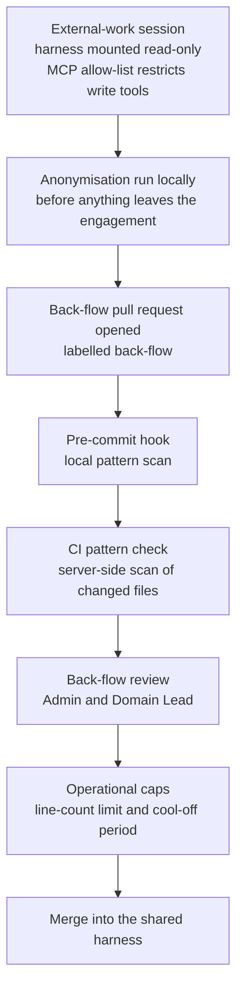

## 1. Intent

Work performed for an external party can inform the harness's shared
knowledge without that party ever becoming identifiable from what lands in
it, and this boundary must hold by default against an ordinary lapse of
attention rather than depend on every contributor staying vigilant every
time. A domain's working content flows inward to the harness deliberately
and only after anonymisation; nothing flows outward from the harness into a
domain's confidential engagement, and nothing crosses the boundary
automatically.

## 2. Problem & evidence

Pattern A adopters (harness-as-IP-layer) run one harness across multiple
confidential client engagements. Each engagement produces knowledge worth
generalising (a reusable method, a sharper glossary term, a pattern worth
adding to the shelf), but that knowledge sits inside content that also names
the client, their numbers, and details specific enough to identify them
without naming them at all. The job is to let the generalisable part cross
into the harness while the identifying part never does, on every occasion,
including the occasions nobody is being careful.

A substring or regex scan is a real defence and a narrow one. Foundation's
`docs/setup-org.md` and `standards/coverage-gaps.md` both treat it as
necessary but not sufficient, and `coverage-gaps.md` names six categories of
leak a literal-pattern scan cannot catch on its own: a client renamed in
prose rather than quoted verbatim; an industry, region and company-size
triple that is unique even though none of the three words is sensitive
alone; an unusual number (a contract value, a headcount, a KPI baseline);
two anodyne facts that only identify someone in combination; a date that
correlates to a known public event for that client; and a near-miss
variant of a name or code not yet added to the pattern list. Six rows are
named in that file's table (verified by grep count against the file, not
by an earlier read-through), and the table names a specific defence for
each: chiefly human review at the point content crosses the boundary,
rather than a second automated scan.

That crossing point is back-flow: a pull request, labelled `back-flow`,
carrying content proposed to move from a domain's confidential working
surface into the shared harness. Foundation's own `CLAUDE.md` states the
confidentiality rule and its enforcement directly: "Identifying details
from external work do not enter this repo," followed by three numbered
enforcement layers with an explicit reliance qualifier: "rely on 1 and 2;
layer 3 is conscience." The first two layers are the pre-commit and CI
scans and the two-reviewer back-flow review; the third is the rule stated
as an operator's own conscience, which is not a mechanism at all. A design
that relied on layer three alone would depend on every contributor
remembering, every time, under whatever pressure produced the lapse in the
first place, which is exactly the failure mode client confidentiality
work cannot survive even once.

## 3. Outcomes

- A commit containing one of the harness's declared banned patterns is
  blocked before it is committed, and a pull request carrying one is
  blocked before it merges, both from the same declared pattern list.
- A pull request moving content out of a domain's confidential working
  surface into the shared harness is legible as such (labelled `back-flow`)
  and passes through a named human review, an operational size cap, and a
  cool-off period before it can merge.
- The harness publishes, in one place, which categories of leak its
  automated scan cannot catch, and which defence (usually a named human
  review, not another automated check) covers each one.
- An external-work session is documented as mounting the harness read-only,
  under a template that states the direction knowledge is allowed to flow
  and restricts which MCP tools are active.
- Where a documented defence has no working implementation, that gap is
  recorded in this PRD rather than left implicit in the difference between
  what a comment claims and what the code that comment sits beside actually
  does.

## 4. Non-goals

- Building an automated check that a human reviewer read the diff rather
  than skimmed it, or that a named reviewer is a distinct human from the
  proposer. PRD-03 owns reviewer identity and the escalation ladder; this
  PRD assumes back-flow review happens and specifies what CI enforces
  around it, not whether the human review itself was rigorous.
- Detecting the six categories `coverage-gaps.md` names as beyond CI's
  reach. This PRD documents that those categories are not caught by the
  pattern scan and names the defence the harness relies on instead; closing
  that gap with a better scanner is out of scope.
- Building the session-mount enforcement, PR-template field, or commit-tagging
  hook that a working agent-initiated back-flow ban would require. Section 8
  records this as a gap; this PRD does not close it.
- Fixing `standards/templates/external-work-claude-md.md`'s overstated
  isolation claim. That file is owned by another workstream; this PRD
  records the claim and its status qualifier without editing the file.
- Prescribing Pattern B's (harness-as-primary-workspace) confidentiality
  posture. `banned-patterns.yml`'s own header states Pattern B adopters may
  leave the file empty; this PRD describes Pattern A's defence chain.

## 5. Solution sketch

The boundary is a chain of layers, not one gate. Automated scanning catches
the careless slip: a literal string typed where it should not be. Human
review at a labelled, capped, cooled-off crossing point catches what
scanning structurally cannot: a paraphrase, a combination, a number, a
date, a near-miss. Neither layer alone is sufficient; the chain is designed
so a lapse at one layer is still caught by the next.

The primary flow starts inside a domain's confidential engagement. A
contributor decides something there is worth generalising, strips
identifying detail locally, and opens a pull request into the harness
carrying only the anonymised generalisation, labelled `back-flow`. Before
that commit exists, a pre-commit hook scans staged files against the
harness's declared pattern list and blocks a match. Once the pull request
is open, the same pattern list is scanned again server-side against every
changed file, and two further checks apply because the PR is labelled
`back-flow`: the diff cannot exceed a fixed line-count cap, and the pull
request cannot merge until a fixed cool-off period has passed since it was
opened, giving the reviewing Domain Lead reading time before anyone can
merge under time pressure. A named human review (Admin and Domain Lead)
covers everything the pattern list cannot.

Key rules:

- The pattern list is a declared, editable file; adding a new pattern
  requires no code change, only a documented entry the scan already knows
  how to consume.
- A pull request that touches the folders back-flow content is documented
  to land in, but carries no `back-flow` label, fails rather than merging
  silently unlabelled: the label is treated as a claim the harness demands
  a contributor make explicitly, not something it infers from the diff.
- Knowledge flows one direction only: into the harness from a domain's
  confidential work, anonymised first. Nothing syncs the other way, and
  nothing syncs automatically in either direction.
- An external-work session mounts the harness read-only under a named
  subfolder allow-list; the harness never mounts a domain's confidential
  engagement content into itself.

Important states: a back-flow pull request before the cool-off period has
elapsed (reviewable, not yet mergeable); the same pull request after the
cap and cool-off both clear but before a human has reviewed it (mergeable
by CI's own logic, still gated by the review requirement); and a pull
request that changes back-flow-shaped folders without the label, which the
path tripwire refuses to let through unlabelled regardless of content.

Alternatives rejected:

- **A single automated leak-detector, trained or heuristic, replacing human
  review.** Rejected because the six coverage-gap categories are exactly
  the shapes a pattern-based or model-based detector struggles hardest with:
  paraphrase, combination, and correlation to public knowledge outside the
  harness's own text. Named human review by someone who knows the
  engagement is the defence `coverage-gaps.md` names for every one of them;
  no detector this harness could ship replaces that.
- **Cap and cool-off without a human review requirement.** Rejected because
  the operational defences slow a merge down and bound its size, but do
  not, by themselves, catch a paraphrased or structural leak; they exist to
  give the named reviewer time and a bounded diff to review, not to replace
  the reviewer.
- **Auto-sync from a domain into the harness with post-hoc audit.**
  Rejected because it inverts the chain's ordering: every defence here
  fires before content lands in the shared harness, and a post-hoc audit
  catches a leak only after every future user of the harness may already
  have read it.

## 6. Requirements

### FR-04.1 — Three defence layers, reliance on the first two only

Status: CONVENTION
Evidence: `organisationos-foundation/CLAUDE.md` lines 32-38: "### Confidentiality
(hard — enforcement is layered)" / "Identifying details from external work do
not enter this repo. Enforcement layers (rely on 1 and 2; layer 3 is
conscience):" followed by "1. Pre-commit + CI banned-string check...",
"2. Back-flow review by Admin + Domain Lead on `back-flow`-labelled PRs",
"3. This rule, as last-line operator conscience." `organisationos-leadership/CLAUDE.md`
restates the identical rule and the identical "rely on 1 and 2; layer 3 is
conscience" phrasing under its own confidentiality section, with an explicit
reason given for the restatement: a cross-repo `@import` does not put
Foundation's rules into a Leadership session's context, so the rule "is
stated here in full rather than by reference to Foundation."

The harness MUST state that identifying details from a domain's confidential
external-work engagement do not enter the shared harness, and MUST name at
least two independent enforcement layers that do not depend on a
contributor's own vigilance as the sole safeguard.

- Each of the three repositories' `CLAUDE.md` restates the confidentiality
  rule rather than relying on a cross-repo pointer to carry it, since a
  pointer does not inline its target into a session's context.
- The stated reliance is explicit: layers one and two are load-bearing;
  layer three is named as conscience, not as a mechanism.
- The two layers this PRD specifies (FR-04.2, FR-04.3, FR-04.4) each carry
  their own status below; this requirement covers only the framing
  statement itself, which is convention, not executable logic.

### FR-04.2 — CI banned-string check

Status: ENFORCED (local)
Evidence: `organisationos-foundation/.github/workflows/banned-string-check.yml`,
"Scan changed files for banned patterns" step (lines 34-62): extracts
`.pattern` from each entry in `banned-patterns.yml` via
`yq '.[] | .pattern' | grep -v '^null$'`, then scans every changed file with
`rg -qi "\b${p}\b"`. `organisationos-foundation/.github/workflows/self-ci.yml`
line 54 (`uses: ./.github/workflows/banned-string-check.yml`, job
`banned-string`) confirms Foundation calls the reusable directly against its
own PRs. The reusable is not orphaned; it runs on every Foundation PR in
addition to the `@v1`-pinned calls from `organisationos-leadership/.github/workflows/banned-string-check.yml`
and `organisationos-domain/.github/workflows/banned-string-check.yml`.
Red/green log: `$SCRATCH/verification/prd-04.md`, Check 1 and Check 1a
(2026-09-03): the extracted scan loop, run against a file seeded with the
harness's shipped example-client placeholder pattern, exited 1 and named the
match; the same loop run against a clean file exited 0.

The CI scan MUST extract every substring and regex pattern declared in
`banned-patterns.yml` and MUST fail a pull request that changes a file
matching any of them.

- Given a changed file containing the example-client placeholder pattern
  When the CI scan runs
  Then the check exits non-zero and names the matching file and pattern
- Given a changed file containing no declared pattern
  When the CI scan runs
  Then the check exits zero
- The scan runs against every Foundation pull request via `self-ci.yml`, and
  against every Domain and Leadership pull request that calls the
  `@v1`-pinned reusable; both paths were confirmed present by reading the
  caller files, not assumed from one of them.

### FR-04.3 — Pre-commit hook blocks the same patterns before a commit exists

Status: ENFORCED (local)
Evidence: `organisationos-foundation/.github/hooks/banned-string-pre-commit`:
resolves `banned-patterns.yml` from a local or sibling Foundation path,
extracts `.pattern` the same way the CI check does, and scans staged files
with `rg -qi "\b${p}\b"` before allowing a commit. `docs/setup-person.md`
Step 3 (lines 53-64) is the install step: `cp
organisationos-foundation/.github/hooks/banned-string-pre-commit
"organisationos-$r/.git/hooks/pre-commit"` run once per clone a person
commits from. Step 4 (the smoke test) verifies only that a session can read
Foundation's `standards/coverage-gaps.md`; it does not verify the hook
itself was installed or is executable. Red/green log: Check 2: a commit
carrying the four-digit ticket-reference pattern was blocked (exit 1,
staged file retained); the same file with the pattern removed committed
cleanly (exit 0).

Before a commit is created, the pre-commit hook MUST scan staged files
against the same declared pattern list the CI check uses, and MUST block
the commit on a match.

- Given a staged file containing the four-digit ticket-reference pattern
  When `git commit` runs with the hook installed
  Then the commit is blocked, the file stays staged, and the offending
    pattern is named
- Given the same file with the pattern removed
  When `git commit` runs again
  Then the commit succeeds
- Coverage is per-clone, not guaranteed: the hook is installed by a manual
  copy step a person runs once per clone, and nothing in the harness
  verifies afterward that the copy was made, is executable, or was not
  bypassed with `--no-verify`.

### FR-04.4 — Back-flow PRs: labelled, capped, cooled off, reviewed

Status: ENFORCED (local) for the cap and the cool-off arithmetic;
CONVENTION, materially weaker than documented, for the review
Evidence: `organisationos-foundation/.github/workflows/back-flow-rules.yml`:
"Decide applicability" step treats the `back-flow` label as the signal and
the back-flow-shaped folders as a tripwire that fails an unlabelled PR
touching them; "Enforce 500-line cap" step computes added lines from
`git diff --shortstat` and fails above 500; "Enforce 24-hour cool-off" step
computes PR age from `github.event.pull_request.created_at` and fails under
86400 seconds. Red/green log: Check 3 (cap: a 501-line branch failed, a
100-line branch passed) and Check 4 (cool-off: a synthetic `created_at` one
hour old failed, one two days old passed; the arithmetic is separable from
the GitHub-API-sourced timestamp itself, so it was fed a fake value rather
than left unverified). The documented review ("Domain Lead + a second")
is weaker in practice than stated: `organisationos-domain/.github/CODEOWNERS`
lines 59-60 name only `@placeholder-admin` for `/domain-*/methods/` and
`/domain-*/prompts/`, listed after and more specific than the `/domain-N/`
block (lines 14-33) naming each domain's Domain Lead; GitHub's CODEOWNERS
matching is last-match-wins, so the narrower, later pattern is the one that
applies. Check 8 confirms both lines directly; Check 8a confirms live that
`organisationos-domain`'s `main` branch also carries no branch protection
(`gh api .../branches/main/protection` → 404, re-confirmed 2026-09-03).
That absence applies equally to every mechanism this requirement names, not
only the review: on the published Domain repository as it stands, nothing
currently compels the cap check or the cool-off check to run as a merge
gate either, since a required-status-checks rule is what branch protection
would supply and none is configured. `ENFORCED (local)` for the cap and
cool-off records that the extracted logic produces the correct verdict when
run; it does not claim that anything on the live repository currently
forces that logic to run before a merge.

A pull request labelled `back-flow` MUST NOT merge if it changes more than
500 net new lines, and MUST NOT merge within 24 hours of being opened.

- Given a `back-flow`-labelled PR adding 501 or more lines
  When the cap check runs
  Then it fails and names the added-line count against the 500-line limit
- Given a `back-flow`-labelled PR adding 500 or fewer lines
  When the cap check runs
  Then it passes
- Given a `back-flow`-labelled PR opened fewer than 24 hours ago
  When the cool-off check runs
  Then it fails and names the earliest mergeable time
- Given the same PR 24 hours or more after opening
  When the cool-off check runs
  Then it passes
- The documented "Domain Lead + a second" review is CONVENTION, and for
  content landing in `domain-N/methods/` or `domain-N/prompts/` (the two
  folders the harness names as where back-flow content lands), CODEOWNERS
  names one owner, not two, and no branch protection enforces even that one
  on the published Domain repository.
- The published Domain repository carries no branch protection on `main`
  at all (`gh api .../branches/main/protection` → 404), so the same absence
  applies equally to the cap and cool-off checks: nothing on the live
  repository currently compels either check to run as a merge gate, even
  though both were independently verified to produce the correct verdict
  when run.

### FR-04.5 — Six leak categories CI cannot detect, each with a named defence

Status: SHIPPED
Evidence: `organisationos-foundation/standards/coverage-gaps.md`: a table of
six rows (grep count against the file: 6), each naming a leak category, a
worked example, and a defence: paraphrased identifiers, structural
identifiers, numerical identifiers, co-occurrence identifiers, date
identifiers, and near-misses. Five of the six name back-flow review (by the
Domain Lead, sometimes with the Admin) as the defence, in whole or in part;
the sixth (near-misses) names periodic banned-pattern-list maintenance at
the monthly maintenance issue plus a reviewer agent. The file's own framing
line states the relationship to FR-04.2 directly: "The `banned-patterns.yml`
substring/regex check catches the careless human; it does not catch
structural identifiers."

The harness MUST publish, in one place, every leak category its own
automated scan is known not to catch, together with the specific defence
relied on for each.

- `coverage-gaps.md` names exactly six categories, verified by grep count
  against the file rather than recalled from an earlier read.
- Every row names a defence; no row is left blank or deferred to "TBD."
- The file states plainly, in its own text, that the automated scan is
  necessary but not sufficient: the harness publishing its own limits
  rather than implying completeness.

### FR-04.6 — Agent-initiated back-flow ban

Status: GAP
Evidence: `organisationos-foundation/.github/workflows/back-flow-rules.yml`,
line 11 (`grep -n 'TODO'` → "under that condition — not by anything in this
workflow. TODO: no such"). The header comment (lines 5-13) frames the ban as
"a session-mount-state condition, not an authorship-within-session claim,"
caught by "a session-id field in the PR template plus a hook that tags
commits made under that condition — not by anything in this workflow."
Neither compensating mechanism exists: `grep -rn -i "session-id"` across
`organisationos-foundation` and `organisationos-domain` finds the phrase
only inside comments (`back-flow-rules.yml` lines 10, 13, 146;
`external-work-claude-md.md` line 54); neither repository's
`PULL_REQUEST_TEMPLATE.md` contains a session-id field.

Intent: a commit made while `--add-dir` included a non-harness path (the
signature of an agent operating inside an external-work session) MUST fail
before it reaches the shared harness.

Reality: detection would need a session-id field recorded in the PR
template plus a hook tagging commits made under that mount condition.
Neither ships. No CI job in `back-flow-rules.yml` evaluates session mount
state; the ban rests entirely on reviewer judgement during back-flow
review, with no compensating field to judge against.

### FR-04.7 — External-work sessions mount the harness read-only, restricted MCP allow-list

Status: SHIPPED, with a status qualifier on its central confidentiality claim
Evidence: `organisationos-foundation/standards/templates/external-work-claude-md.md`
exists and documents a read-only `--add-dir` mount naming only safe
subfolders, an MCP allow-list restricted to what a project's own `.mcp.json`
lists, and a back-flow procedure. Nothing in the harness enforces that an
external-work repository actually adopts this template, or that a session
is actually launched with the documented flags rather than some broader
mount. **Status qualifier (A17-2, security-relevant, owned by another
session, recorded here, not fixed):** the template overstates what
`--add-dir` does. Line 30 calls the mount "OS-level isolation, fail-closed";
line 32 states "nothing outside this list is visible to the session"; line
45 states unlisted content "stays hidden by default." `--add-dir` is a
Claude Code permission-surface flag that grants a session access to a named
directory; it is not an operating-system sandbox, and nothing in the tool
enforces that content outside the named list is actually invisible to a
session running under some other configuration. The template's central
confidentiality claim for Pattern A external-work sessions rests on this
overstated sentence.

An external-work repository under Pattern A MUST document a read-only mount
of only the safe harness subfolders and a restricted MCP allow-list, using
a shared template rather than each engagement inventing its own.

- The template exists, names specific safe subfolders (`interfaces`,
  `standards/templates`, `syntheses`, `glossary.md`) rather than the harness
  repo root, and states the allow-list is fail-closed by omission.
- Nothing in the harness verifies, at any point, that a given external-work
  repository's own `CLAUDE.md` was actually derived from this template
  rather than something looser.
- The template's isolation language is stronger than what the underlying
  mechanism (`--add-dir`) actually provides; this is recorded as a status
  qualifier rather than corrected here, since the file is owned by another
  session.

### FR-04.8 — `context-near` co-occurrence patterns

Status: GAP
Evidence: `organisationos-foundation/standards/banned-patterns.yml` line 8
documents the directive ("`!context-near` — co-occurrence directive. Fails
if two strings appear within a token window.") and line 22 carries one
worked entry using it. `organisationos-foundation/.github/workflows/banned-string-check.yml`
line 44 extracts patterns with `yq '.[] | .pattern' | grep -v '^null$'`: a
`!context-near` entry has no `.pattern` key, so this extraction yields
`null` for it (confirmed directly: `yq '.[] | .pattern'` against the file
returns two literal patterns followed by a literal `null` for the
`context-near` entry), and `grep -v '^null$'` drops it before the scan loop
ever runs. The pre-commit hook uses the identical extraction line, so the
gap is the same at both enforcement points. `coverage-gaps.md` names
`context-near` twice as the defence for structural and co-occurrence
identifiers (lines 8 and 10 of that file).

Intent: two otherwise-anodyne strings that only identify someone in
combination MUST be catchable by a declared co-occurrence rule, not left to
human review alone.

Reality: the directive is documented in `banned-patterns.yml` and named
twice in `coverage-gaps.md` as the defence for exactly this leak shape, but
the workflow's own extraction reads only the `.pattern` key. A
`!context-near` entry carries no `.pattern` key by construction, so it is
filtered out before either scan loop sees it. A documented confidentiality
control has no implementation at all.

### FR-04.9 — `match:` modifiers

Status: GAP
Evidence: `organisationos-foundation/standards/banned-patterns.yml` declares
`match:` modifiers on every entry: line 16 ("word-boundary,
case-insensitive, diacritic-insensitive") and line 19 ("regex,
case-sensitive"). Neither `banned-string-check.yml` nor
`banned-string-pre-commit` reads a `.match` key anywhere (`grep -n
"\.match"` against both returns zero hits); both extract only `.pattern`
(the same line cited for FR-04.8) and both scan with a hardcoded `rg -qi`
regardless of what a given entry's `match:` declares. Concretely: the
four-digit ticket-reference pattern declares `case-sensitive`, but the loop
that scanned it in this PRD's own red/green run (verification log Check 2)
used `rg -qi` (case-insensitive) throughout, the same as every other
pattern.

Intent: an entry's declared `match:` modifiers (including
diacritic-insensitive matching and an entry-specific case sensitivity)
MUST govern how that entry is scanned.

Reality: both enforcement points hardcode one matching mode
(word-boundary, case-insensitive) for every pattern, independent of what
`match:` declares. Same root cause as FR-04.8: the extraction reads one
key and silently drops every other declared modifier, so a stated
diacritic-insensitive or case-sensitive rule does not exist in either
scan.

## 7. Dependencies & constraints

- **PRD-01** establishes the three-repo split this boundary sits inside: a
  domain's confidential working content lives in Domain, and the shared
  harness it must never leak into spans Foundation, Leadership, and every
  other domain in Domain.
- **PRD-03** owns reviewer identity, CODEOWNERS bindings, and the
  escalation ladder that back-flow review calls on; this PRD specifies what
  CI enforces around a back-flow pull request (label, cap, cool-off) and
  cites PRD-03's own CODEOWNERS evidence for FR-04.4's review-strength
  qualifier rather than re-deriving it.
- **External constraint — GitHub Actions labels and diff APIs.** The label
  check, the path tripwire, the line-count cap, and `created_at` all depend
  on GitHub's pull-request event payload; nothing in this PRD's checks ran
  against a live GitHub Actions run, since every check here is executed
  logic extracted from the workflow files and run locally, per the
  workstream's evidence bar for `ENFORCED`.
- **External constraint — Claude Code's `--add-dir` is a permission
  surface, not a sandbox.** FR-04.7's status qualifier depends on this:
  nothing in the tool itself makes unlisted content inaccessible in an
  operating-system sense; the isolation the external-work template
  describes is a mounting convention a session's launch command follows,
  not a guarantee the tool enforces.
- **External constraint — `yq`'s single-key extraction.** FR-04.8 and
  FR-04.9 share this constraint: `yq '.[] | .pattern'` returns exactly the
  `.pattern` field of each entry and nothing else, by design; any directive
  or modifier declared under a different key in the same YAML document
  requires a separate extraction line the current scan does not have.

## 8. Known gaps & open questions

- **GAP — the agent-initiated back-flow ban has no CI check and no
  compensating field.** FR-04.6's own workflow names the compensating
  mechanism (a session-id PR-template field plus a commit-tagging hook);
  neither exists in either repository's PR template. The ban is enforced by
  reviewer judgement alone, with nothing for a reviewer to check against.
- **GAP — `context-near` co-occurrence patterns are declared and named as
  a defence, but never executed.** FR-04.8: the workflow's own `.pattern`-only
  extraction silently drops any entry that uses the directive instead of a
  literal pattern.
- **GAP — declared `match:` modifiers are never read.** FR-04.9: both
  enforcement points hardcode one matching mode for every entry, so a
  declared case-sensitive or diacritic-insensitive rule does not exist in
  either scan.
- FR-04.6, FR-04.8, and FR-04.9 share one shape: a control the
  documentation describes, naming a specific mechanism, and no code
  implements. Each was verified independently against its own file and
  line; this PRD does not generalise the shape to any control beyond these
  three.
- **Status qualifier, not closed here — A17-2.** FR-04.7's central
  confidentiality claim (`--add-dir` as "OS-level isolation, fail-closed")
  is overstated relative to what the underlying tool does. The file is
  owned by another workstream and is not edited by this PRD.
- **Open question — nothing verifies a back-flow PR's own CODEOWNERS
  routing before merge.** FR-04.4's cap and cool-off run as CI checks;
  whether the correct reviewer set was actually named for a given PR's
  changed paths is not itself checked by anything this PRD's evidence
  names, beyond the CODEOWNERS file's static content.
- **Open question — the pre-commit hook's own coverage is unmeasured.**
  FR-04.3 is installed per clone, per person, by a manual copy step; no
  inventory exists of which clones, across an adopter's organisation,
  actually have it installed and executable at a given time.

## 9. Rebuild guide

This section assumes PRD-01's three repositories and PRD-03's CODEOWNERS
bindings already exist. It produces the state PRD-04 alone is responsible
for: the pattern-based scan at two enforcement points, the back-flow
operational defences, the harness's own published limits, and the
external-work session template.

1. Write `standards/banned-patterns.yml` in Foundation, declaring one entry
   per pattern with a `pattern:` key and, where useful, a `match:` key,
   understanding today that `match:` is documented but not yet consumed by
   either enforcement point (FR-04.9).
2. Write the CI scan as a reusable workflow: check out the caller repo and
   a pinned Foundation ref, extract `.pattern` from every declared entry,
   and fail on a match in any changed file. Call it directly from
   Foundation's own CI as well as from Domain's and Leadership's callers. A
   reusable with no caller against its own repo never runs on that
   repo's PRs.
3. Write the pre-commit hook to resolve `banned-patterns.yml` from either a
   local or a sibling path, use the same `.pattern` extraction the CI check
   uses, and scan staged files before a commit is created. Document the
   per-clone install step; you will not, at this PRD's scope, verify that
   install actually happened anywhere.
4. Write `back-flow-rules.yml`: a label-and-path tripwire that refuses an
   unlabelled PR touching back-flow-shaped folders, a line-count cap, and a
   cool-off period measured from the PR's own `created_at`. Wire it as a
   caller from Domain (and from Foundation's own `self-ci.yml`, since
   Foundation's `CLAUDE.md` names back-flow review as one of its own two
   enforced layers).
5. Write `coverage-gaps.md`, naming every leak category the pattern scan
   is known not to catch and the defence relied on for each: chiefly, that
   the named human reviewer during back-flow review is the actual defence
   for everything a substring scan cannot see.
6. Write the external-work session template: a read-only mount naming only
   safe subfolders, a restricted MCP allow-list, and the back-flow
   procedure a session should follow when something in the engagement
   generalises. State plainly what the mount does and does not guarantee.
   This PRD's own evidence (FR-04.7) shows the shipped template overstates
   this step.

After this PRD alone: a commit or a pull request carrying a declared
pattern is blocked at two independent points; a back-flow pull request is
capped and cooled off; the harness's own coverage limits are published in
one place; and an external-work session has a documented, if imperfectly
worded, mounting convention. What stays broken until later work closes it:
the agent-initiated back-flow ban has no executable check, the co-occurrence
directive and the match modifiers are declared but never read, and the
external-work template's central isolation claim needs correcting by
whichever session owns it.

## 10. Provenance & verification

Files specified by this PRD (`specifies:` above) were confirmed present with
`ls` on 2026-09-03: `organisationos-foundation/standards/banned-patterns.yml`,
`.../standards/coverage-gaps.md`, `.../.github/hooks/banned-string-pre-commit`,
`.../standards/templates/external-work-claude-md.md`,
`.../.github/workflows/banned-string-check.yml`,
`.../.github/workflows/back-flow-rules.yml`,
`organisationos-leadership/.github/workflows/banned-string-check.yml`,
`organisationos-domain/.github/workflows/banned-string-check.yml`, and
`organisationos-domain/.github/workflows/back-flow-rules.yml`; all nine
resolved without error. Last-touched commits (`git log -1 --format="%H %ad"
--date=short -- <path>`, run 2026-09-03): `banned-patterns.yml`,
`banned-string-pre-commit`, and Foundation's `banned-string-check.yml` all
at `5fa85c9`, 2026-08-20; `coverage-gaps.md`, Foundation's
`back-flow-rules.yml`, and `self-ci.yml` all at `adc560a`, 2026-08-26;
`external-work-claude-md.md` at `d39135f`, 2026-09-01; Foundation `CLAUDE.md`
at `d43a5d7`, 2026-08-26; Domain's `CODEOWNERS` and `back-flow-rules.yml`
both at `5acd566`, 2026-08-26; Leadership's `banned-string-check.yml` at
`c09fe4b`, 2026-08-20; Domain's `banned-string-check.yml` at `f10a3e2`,
2026-08-20. Foundation tag `v1.1.2` resolves to `d70bafc`, 2026-09-02
(`git describe --tags` / `git log -1`, run against Foundation's own clone).

All verification below was run this session (2026-09-03) against `cp -R`
copies of Foundation under a scratch directory with `.git` removed, and
against fresh scratch git repositories seeded for each check, never
against the live clones, which another session was actively working in.
The commands, seeded inputs, and results are reproduced from the working
verification log; two of the log's seeded literal strings are described
rather than quoted here, since they are themselves examples on the banned
pattern list this PRD documents and quoting them verbatim would trip this
repository's own gate.

Method: every `ENFORCED` claim (FR-04.2, FR-04.3, FR-04.4) was verified by
extracting the cited workflow's or hook's own logic and running it
standalone against seeded scratch git repositories, never against a live
GitHub Actions execution or the live clones another session was actively
working in. FR-04.4's cool-off arithmetic was fed a synthetic `created_at`
timestamp rather than one sourced from a live PR, and was exercised under
GNU `date` specifically, since the workflow's own runner uses GNU date and
this host's native `date` does not support `-d`. Every `GAP` (FR-04.6,
FR-04.8, FR-04.9) and status qualifier (FR-04.7) was verified by direct read
of the cited file and line instead: there is no logic to run for a
documented absence, and neither file was edited. The one live exception is
FR-04.4's CODEOWNERS-ordering claim, confirmed with a `gh api` call against
the published Domain repository's own branch protection, run this session
rather than assumed from PRD-03's Foundation-only evidence of the same
absence.

Section 6's own evidence line for each requirement (FR-04.1 through FR-04.9)
carries that requirement's actual red/green result, seeded input, and
command; this section does not repeat them. Every `ENFORCED` claim's locus
recorded there is `local`, consistent with the workstream's evidence bar,
which counts locally executed logic as valid evidence for `ENFORCED` where
CI itself is disabled or unobserved. A re-verifier reproducing the
`ENFORCED` claims needs the same scratch git repositories and GNU `date`;
reproducing the `GAP` and status-qualifier claims needs only the cited
files, read on 2026-09-03 against Foundation tag `v1.1.2`.
