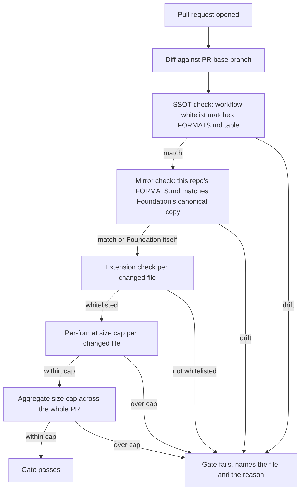

## 1. Intent

Everything committed to any of the three repositories stays reviewable by
diff, and anything that lives in a live system (a dashboard, a scheduling
tool, a CRM) is pointed at from the harness rather than copied into it, so
the repositories never silently become a stale export of somewhere else.

## 2. Problem & evidence

A harness built for human-agent collaboration accumulates two kinds of
content: material the audience reads as text, and material generated
elsewhere: a rendered slide deck, a dashboard snapshot, a live tool's
export. Committing the second kind as a binary blob buys convenience once
and a cost forever after: the file cannot be diffed, a reviewer cannot see
what changed, and nothing prevents a git history from filling with
megabytes of regenerable output that duplicates a source of truth living
somewhere else. `organisationos-foundation/CLAUDE.md` states the resulting
rule directly (lines 46-49, "### Format policy"): "Only formats on
`FORMATS.md`'s whitelist are committed" and "Built outputs (decks,
dashboards, live-data artefacts) are referenced in a domain's
`references.md`, not committed."

`FORMATS.md` itself must exist identically in all three repositories: a
contributor working in Domain or Leadership needs to know the same rule a
Foundation contributor knows, without opening a fourth repository to find
it. Left unenforced, a mirror drifts the moment one repository's copy is
edited without the others following, and the whitelist stops meaning the
same thing everywhere it is read.

## 3. Outcomes

- Every committed file's extension is checked against a single published
  whitelist; a file with a non-whitelisted extension fails the pull
  request that introduces it.
- Binary formats on the whitelist carry a per-format size cap, and a pull
  request's new binary content is capped in aggregate as well.
- `FORMATS.md` reads identically in Foundation, Leadership, and Domain; a
  pull request that lets the Leadership or Domain copy diverge from
  Foundation's canonical copy fails.
- A deck, dashboard, or other built output is referenced from a domain's
  `references.md` rather than committed, and a documented pattern
  regenerates it from a committed Markdown source.

## 4. Non-goals

- Choosing the whitelist's contents for an adopter. The three principles
  and the shipped list are a starting point; adopters extend or narrow it
  for their own formats.
- Specifying `references.md`'s own mechanics: how a reference entry is
  structured, or how staleness in a referenced live system is caught. That
  belongs to PRD-09.
- Building a scanner that infers whether a committed file was actually
  built from a source the repository also carries. The gate checks
  extension and size only.
- Enforcing the two-approver review a format change is documented to
  require. CODEOWNERS names the reviewers; whether that naming currently
  binds anything is a branch-protection question this PRD does not own.

## 5. Solution sketch

One reusable workflow, defined once in Foundation and called by all three
repositories, is the single place every one of this policy's checks lives.
Leadership's and Domain's own `format-gate.yml` files carry no logic of
their own: each is a short caller pinned to a Foundation tag. A pull
request's changed files are read from a git diff against the PR's base
branch, not from the working tree, so every check below runs against
`added` or `modified` files only.

Four things happen in sequence when the gate runs: first, the workflow
confirms its own hardcoded whitelist has not drifted from `FORMATS.md`'s
published table, so the two descriptions of "what is allowed" cannot say
different things inside the same repository. Second (skipped when running
inside Foundation itself, since there is nothing to compare against),
it checks out Foundation's canonical `FORMATS.md` and fails if the calling
repository's own mirror has diverged from it. Third, every added or
modified file in the pull request is checked against the whitelist by
extension, and a whitelisted binary format is checked against its own
per-format size cap. Fourth, the total new binary content across the whole
pull request is summed and checked against one aggregate cap.

Key rules:

- The whitelist and the caps are declared once, in Foundation, and read
  from there by every calling repository; nothing in Leadership or Domain
  can grant itself an exception the reusable workflow does not know about.
- A file without a recognised extension (`CODEOWNERS`, `.gitignore`, and a
  short list of similar names) is exempted by name rather than forced
  through the whitelist check.
- `FORMATS.md`'s mirror in Leadership and Domain is a full copy of
  Foundation's body plus a short header noting it is a mirror; the gate
  compares bodies, not the header, so the header itself never trips the
  drift check.
- A built output (deck, dashboard snapshot, rendered document) is
  referenced from `references.md`, never committed; the build-deck pattern
  documents how a deck's Markdown source regenerates the built form.

Important states: a pull request whose new content is entirely
whitelisted and under every cap (passes cleanly); one that introduces a
single non-whitelisted extension (fails on that file alone, naming it);
one where every individual file is within its own cap but the sum across
the pull request exceeds the aggregate cap (fails on the aggregate check
even though no single file tripped its own); and a repository whose
`FORMATS.md` mirror has drifted from Foundation's canonical copy,
independent of whatever else the same pull request changes (fails on the
mirror check regardless of the rest of the diff).

Alternatives rejected:

- **Generating the workflow's whitelist from `FORMATS.md` at runtime**,
  rather than hardcoding it and separately checking the two agree.
  Rejected because a generated list keeps the enforcement logic's failure
  output dependent on `FORMATS.md`'s exact prose structure; a hand-readable
  hardcoded list plus a static drift check keeps the core logic legible on
  its own and still catches the two falling out of sync.
- **Replacing each mirror with a cross-repo `@`-import stub.** Rejected
  because `FORMATS.md` is read standalone by a person working in that
  repository, and by this same gate running in that repository's own
  context; a stub would leave both without a body to read.
- **A single shared repository instead of three, avoiding the mirror
  question entirely.** Out of this PRD's scope. That split is PRD-01's,
  and this PRD's mirror-and-drift-check exists because of it.

## 6. Requirements

### FR-05.1 — Three format principles

Status: CONVENTION
Evidence: `organisationos-foundation/FORMATS.md` lines 5-7: "1. **Prefer
diffable text** where the audience reads text.", "2. **Reference, do not
commit, anything generated from a live system** (dashboards, scheduling
tools, CRM exports).", "3. **Cap binary size per file**, with
format-specific limits." `organisationos-foundation/CLAUDE.md` lines 46-49
("### Format policy") restate the load-bearing half of the same rule inline
in the repo-wide rules a session reads without opening `FORMATS.md`
separately.

The harness MUST publish three format principles (prefer diffable text,
reference rather than commit live-system output, and cap binary size) and
MUST state them as the basis the whitelist and caps below apply.

- The three principles are documented once, in `FORMATS.md`, and restated
  in `CLAUDE.md`'s "Format policy" section as the rule a session reads on
  every launch.
- The principles are guidance for extending or narrowing the whitelist;
  nothing executes them directly. The whitelist and caps they justify are
  what the gate enforces (FR-05.2, FR-05.3).

### FR-05.2 — Extension whitelist

Status: ENFORCED (local) — with a reproducible defect in the extraction
logic, described below
Evidence: `organisationos-foundation/.github/workflows/format-gate.yml`,
step "Verify changed files against FORMATS.md whitelist": line 66,
`ext="${f##*.}"`, then `if ! echo "$allowed_extensions" | grep -wq "$ext"`.
Verified 2026-09-03: a
scratch git repo branch adding `report.xlsx` failed with `::error
file=report.xlsx::extension '.xlsx' is not on FORMATS.md's whitelist.`; the
same repo with only a `.md` file added passed cleanly.

The gate MUST reject a pull request that adds or modifies a file whose
extension is not on `FORMATS.md`'s published whitelist, and MUST name the
offending file and its extension in the failure.

- Given a changed file with a non-whitelisted extension
  When the gate runs
  Then it fails and names the file and the extension
- Given a changed file with a whitelisted extension
  When the gate runs
  Then it passes
- **Defect, reproduced (finding N5):** the extension is derived by taking
  everything after a filename's last dot (`ext="${f##*.}"`), so a filename
  with more than one dot yields whatever follows the final one as its
  "extension," regardless of the file's real type. Six files in Foundation
  are shaped this way: `.claude/settings.local.json.example` and the five
  `standards/templates/onboarding/settings.local.json.example-<role>`
  files (`-admin`, `-domain-lead`, `-leader`, `-product-owner`,
  `-team-member`), yielding "extensions" `example` and
  `example-<role>`, none of which are on the whitelist. `git log --oneline`
  against each of the six shows exactly two commits per file: the initial
  commit and `7ce3b32` ("Fix additionalDirectories nesting in shipped
  settings examples", 2026-09-01), the first change to any of their
  content since the repository's initial commit. That live pull request's
  own CI run (`gh api .../commits/7ce3b32.../check-runs`) shows
  `format-gate / format` as the one `failure` among thirteen checks, with
  file-level annotations naming exactly these six files and extensions;
  confirmed against GitHub, not only reproduced locally. The commit landed
  on `main` regardless, since Foundation's `main` carries no branch
  protection (`gh api .../branches/main/protection` → 404, confirmed
  2026-09-03). The gate's logic is otherwise sound and was verified
  producing the correct verdict on both a violating and a clean input; this
  is a defect in what counts as an "extension" for these six specific
  filenames, not a failure of the check to run. Left unfixed here per
  instruction: the source is read-only for this PRD.

### FR-05.3 — Size caps: per-file by format, aggregate per PR

Status: ENFORCED (local)
Evidence: `organisationos-foundation/.github/workflows/format-gate.yml`
lines 83-90 (per-format cap table: `svg) cap=204800`, `png|pdf)
cap=2097152`, `excalidraw|drawio) cap=512000`) and lines 63, 95-98
(`per_pr_cap_mb=10`, aggregate sum and comparison). `FORMATS.md` lines
19-22 and 25 publish the same caps in KB/MB form. Red/green log: Check 2
(per-file: a 3,145,728-byte PNG against the 2,097,152-byte cap failed
naming both figures; a 102,400-byte PNG passed) and Check 3 (aggregate: six
PNGs each exactly 2,097,152 bytes, none individually over its own cap,
summed to 12 MB and failed the 10 MB aggregate cap with no per-file error
alongside it; two of the same files, 4 MB total, passed).

The gate MUST reject a pull request whose new binary content exceeds
either a per-format per-file size cap or a 10 MB aggregate cap across the
whole pull request, whichever is exceeded first.

- Given a whitelisted binary file over its format's per-file cap
  When the gate runs
  Then it fails and names the file, its size, and the cap
- Given the same file at or under its cap
  When the gate runs
  Then the per-file check passes
- Given several files each individually within cap but summing past 10 MB
  When the gate runs
  Then the aggregate check fails independently of the per-file check
- Given the same set of files summing to 10 MB or less
  When the gate runs
  Then the aggregate check passes

### FR-05.4 — `FORMATS.md` canonical in Foundation, mirrored in Leadership and Domain, drift fails the PR

Status: ENFORCED (local)
Evidence: `organisationos-foundation/.github/workflows/format-gate.yml`,
steps "SSOT check — allowed_extensions must match FORMATS.md (MR-18a)" and
"SSOT check — FORMATS.md byte-identical to canonical (MR-18b)":
the latter's comparison, `diff -q <(tail -n +3 FORMATS.md)
_foundation-canonical/FORMATS.md`, is the one the Leadership README
describes at line 70 ("the Foundation copy is canonical and `format-gate`
fails a PR if the mirror drifts"); it lives in this same workflow, not
elsewhere. Both Leadership's and Domain's `format-gate.yml` are eight-line
callers (`on: pull_request` plus `uses:
<adopter-org>/organisationos-foundation/.github/workflows/format-gate.yml@v1`)
carrying no logic of their own (`diff` against Foundation's copy is
line-for-line identical past the trigger and the job body). `diff <(tail -n
+3 organisationos-leadership-prds/FORMATS.md)
organisationos-foundation/FORMATS.md` and the same comparison for Domain
both report identical, confirming no drift exists in the shipped mirrors as
read today. Red/green log: Check 4 (MR-18b: an appended line to a scratch
copy of Leadership's `FORMATS.md` failed the diff against Foundation's
canonical copy; the unmodified copy passed) and Check 5 (MR-18a: an added
row to a scratch copy of Foundation's own whitelist table, not matched by
the workflow's hardcoded list, produced the same drift error the workflow
would emit; the unmodified file passed).

`FORMATS.md` MUST exist identically in content across all three
repositories, with Foundation's copy canonical, and the gate MUST fail a
pull request in Leadership or Domain whose `FORMATS.md` has diverged from
Foundation's canonical copy.

- Given Leadership's or Domain's `FORMATS.md` byte-identical (body only,
  excluding the mirror-note header) to Foundation's canonical copy
  When the gate runs
  Then the mirror check passes
- Given a divergence between the two
  When the gate runs
  Then the mirror check fails and shows the diff
- Given the workflow's own hardcoded whitelist and `FORMATS.md`'s
  published table disagreeing on which extensions are listed
  When the gate runs
  Then the self-consistency check fails independently of the mirror check
- This check is skipped, not passed vacuously, when the gate runs inside
  Foundation's own repository, since there is no canonical copy to compare
  against there.

### FR-05.5 — Built outputs referenced, not committed; regenerated from Markdown

Status: CONVENTION
Evidence: `organisationos-foundation/FORMATS.md`, "Out of Git — referenced
via `references.md`" table, rows for PowerPoint/Keynote ("Built from
Markdown via the build-deck pattern"), interactive dashboards ("the
artefact is the URL"), and live drafting docs. `organisationos-foundation/CLAUDE.md`
line 49 restates it as a repo-wide rule. `organisationos-foundation/standards/templates/build-deck.md`
documents the regeneration pattern: a Markdown source under
`<domain>/outputs/<deck-name>.md`, three tooling options (Marp, python-pptx,
Reveal.js/Slidev), and a "Storage rule" stating the built output "is
**not** committed — it is regenerable, and storing it would create a
source-of-truth split."

A built output (deck, dashboard snapshot, rendered document) MUST be
referenced from the relevant domain's `references.md` rather than
committed, where a documented pattern for regenerating it from a committed
source exists.

- The Markdown source for a deck is committed; the built PPTX, PDF, or
  HTML is not.
- `build-deck.md` documents at least one concrete build path per format
  family it covers.
- `references.md`'s own structure, and how staleness in what it points to
  is caught, are out of this PRD's scope: see PRD-09.

### FR-05.6 — Adopters extend the whitelist by applying the principles; format changes are two-approver PRs

Status: CONVENTION
Evidence: `organisationos-foundation/FORMATS.md`, "Adopter customisation"
section: "The whitelist is a placeholder, not a fixed list. Add formats by
applying the three principles," with worked examples for research labs,
design orgs, and marketing teams, and the closing line: "Add to
`FORMATS.md`, then update `.github/workflows/format-gate.yml` to match.
Format changes are a two-approver PR (Admin + Leader)."
`organisationos-foundation/.github/CODEOWNERS` line 32 names
`/FORMATS.md @placeholder-admin @placeholder-leader`, matching the
documented two-approver pairing.

Extending or narrowing the whitelist for an adopter's own context MUST be
documented as applying the three principles (FR-05.1), and a format change
MUST be routed as a two-approver pull request naming the Admin and a
Leader.

- CODEOWNERS names the documented pairing for `FORMATS.md` (Admin +
  Leader), matching `FORMATS.md`'s own stated rule.
- Whether that CODEOWNERS entry currently binds anything is a branch-
  protection question: Foundation's `main` carries no branch protection
  (confirmed above, FR-05.2's evidence), so nothing on the published
  repository currently forces a two-approver review before a `FORMATS.md`
  change merges. This is the same absence this PRD set has found wherever a
  CODEOWNERS-based review claim was checked against live branch
  protection.

## 7. Dependencies & constraints

- **PRD-01** establishes the three-repo split this policy applies inside:
  a single `FORMATS.md` and a single gate definition, read identically by
  all three, rather than three independently maintained copies.
- **PRD-09** owns `references.md`'s own mechanics: its structure and how
  staleness in a referenced live system is caught. FR-05.5 states only that
  a built output is referenced rather than committed; it does not specify
  how.
- **External constraint — the gate reads a git diff, not the working
  tree.** `git diff --name-only --diff-filter=AM
  "origin/${GITHUB_BASE_REF}...HEAD"` is what every check in FR-05.2 and
  FR-05.3 operates against; verifying these checks required a scratch git
  repository with the seeded files committed on a branch, not a bare
  directory of files.
- **External constraint — GitHub Actions' reusable-workflow model.**
  Leadership's and Domain's gates are `uses:` callers pinned to a
  Foundation tag; every enforcement change happens in exactly one place
  (Foundation), and rolling it out to the other two repositories is a tag
  bump, not a file edit in each.
- **External constraint — CODEOWNERS without branch protection enforces
  nothing.** FR-05.6's two-approver claim depends on branch protection
  requiring code-owner review; Foundation's published `main` has none.

## 8. Known gaps & open questions

- **Defect, not closed here — N5.** `ext="${f##*.}"` takes everything
  after a filename's last dot; six shipped Foundation files with a second
  dot in their name (`settings.local.json.example` and its five
  `-<role>` variants) fail the whitelist check on any pull request that
  modifies them, independent of their actual content. Reproduced locally
  and confirmed against the live CI run that hit it (commit `7ce3b32`).
  Not fixed here: the source files are read-only for this PRD.
- **Open question — no inventory of which past PRs merged with
  `format-gate` red.** Commit `7ce3b32` is confirmed; whether other merges
  share this history is not checked here.
- **Open question — whether FR-05.6's two-approver rule binds anything in
  practice.** CODEOWNERS names the pairing; no branch protection currently
  enforces code-owner review on the published repository.
- **Open question — adopter customisation is undocumented for removal.**
  `FORMATS.md`'s "Adopter customisation" section shows how to add a format;
  it does not show how an adopter would narrow the whitelist, only that the
  same three principles apply.

## 9. Rebuild guide

This section assumes PRD-01's three repositories already exist. It
produces the state PRD-05 alone is responsible for: the whitelist, the
size caps, the mirror-drift check, and the built-output convention.

1. Write `FORMATS.md` in Foundation: the three principles, the in-Git
   whitelist table with per-format size caps, the out-of-Git table
   pointing to `references.md`, and an adopter-customisation section
   naming the two-approver rule for format changes.
2. Copy `FORMATS.md`'s body into Leadership's and Domain's own copies,
   each prefixed with a one-line mirror note pointing back to Foundation
   as canonical.
3. Write `format-gate.yml` as a reusable workflow in Foundation
   (`on: workflow_call`) with four steps in order: the workflow's own
   hardcoded whitelist checked against `FORMATS.md`'s table; the calling
   repository's `FORMATS.md` checked against Foundation's canonical copy
   (skipped when the caller is Foundation itself); every changed file's
   extension checked against the whitelist; and per-file plus aggregate
   size caps applied to whitelisted binaries. You will hit the same
   extension-parsing choice this PRD's evidence flags (FR-05.2): decide
   deliberately whether a filename may carry more than one dot.
4. In Leadership and Domain, write `format-gate.yml` as a short caller:
   `on: pull_request`, one job invoking Foundation's reusable pinned to a
   released tag or commit SHA.
5. Call the reusable from Foundation's own CI as well (`self-ci.yml`), so
   it runs on Foundation's own pull requests and not only the two callers.
6. Write `standards/templates/build-deck.md`: the Markdown input shape a
   deck source follows, at least one concrete tool path per output family,
   and the storage rule stating the built form is regenerable and is not
   committed.

After this PRD alone: a pull request in any of the three repositories that
adds a non-whitelisted extension, exceeds a per-file or aggregate size cap,
or lets a `FORMATS.md` mirror drift from Foundation's canonical copy fails
the gate, with the offending file and reason named. What stays broken until
later work closes it: the six shipped files this PRD's evidence names still
fail on any content change until someone either renames them or changes
the extension-parsing logic, and `references.md`'s own mechanics (PRD-09)
are not yet specified.

## 10. Provenance & verification

Files specified by this PRD (`specifies:` above) were confirmed present
with `ls` on 2026-09-03; all seven resolved without error. Last-touched
commits (`git log -1 --format="%H %ad" --date=short -- <path>`, run
2026-09-03): Foundation's `FORMATS.md` at `16d18f4`, 2026-08-21; Foundation's
`format-gate.yml` at `a25fdc6`, 2026-08-26; `build-deck.md` at `f5d083f`,
2026-08-21; Leadership's `FORMATS.md` at `38fd934`, 2026-08-24; Leadership's
`format-gate.yml` at `c09fe4b`, 2026-08-20; Domain's `FORMATS.md` at
`46dadc4`, 2026-08-24; Domain's `format-gate.yml` at `f10a3e2`, 2026-08-20.
Foundation tag `v1.1.2` resolves to `d70bafc`, 2026-09-02.

All verification was run this session (2026-09-03) against `cp -R` copies
and fresh scratch git repositories under a scratch directory, never against
the live clones, which another session was actively working in. Each
check's command, seeded input, and result is reproduced inline in the
relevant requirement's evidence above.

Method: Checks 1-3 (FR-05.2, FR-05.3) exercise the "Verify changed files"
step, which reads a git diff rather than the working tree, so each ran
inside a scratch git repository with the seeded file committed on a branch
against a base commit, exactly as the live gate's `origin/${GITHUB_BASE_REF}...HEAD`
comparison would see it. Checks 4-5 (FR-05.4) exercise the two SSOT/mirror
steps, which compare on-disk files directly; no git repository was needed
for those two. Check 6 (FR-05.2's N5 qualifier) combined a repository-wide
scan for affected filenames, a per-file `git log` confirming the one commit
that touched each, a scratch-repo reproduction of the failure, and a live
`gh api` read of the actual CI run on that commit: the last of these is
the one piece of evidence in this PRD drawn from GitHub rather than
reproduced locally, included because it was available and corroborates the
local finding exactly, file for file. Limits: no check here exercised the
gate as an actual GitHub Actions run under this PRD's own control (the CI
evidence for N5 is a live run that occurred for unrelated reasons, read
after the fact, not one this verification triggered); a re-verifier
reproducing the `ENFORCED` claims would need only the scratch git repo
steps, not GitHub access.
