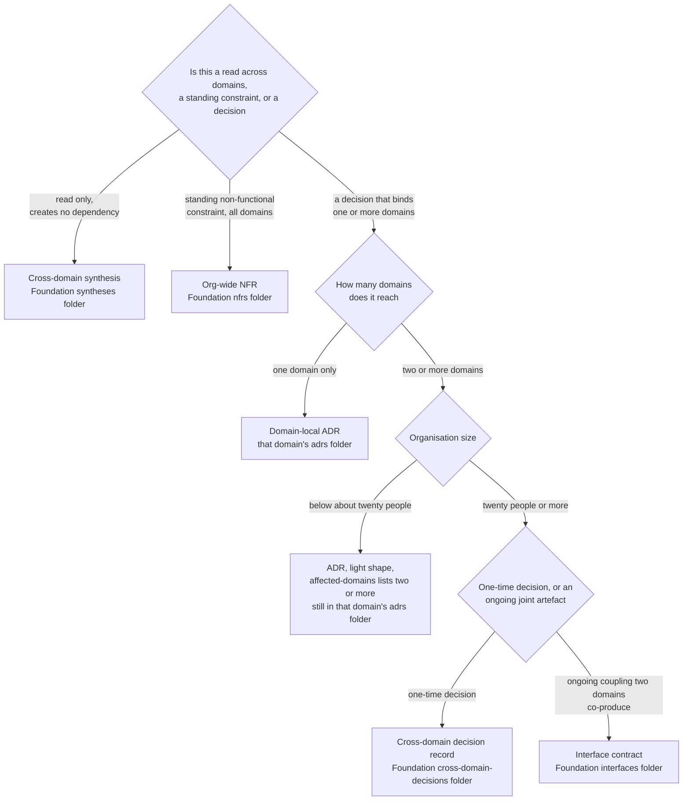

## 1. Intent

Decisions and the contracts between domains land in the record type their
blast radius calls for (domain-local, organisation-wide, or a standing
coupling between exactly two domains), in a shape consistent enough that a
reader can trust what an artefact says without asking the person who wrote
it. The constraint this must not violate: nothing in the harness may let a
decision's stated scope, or its claimed reviewer sign-off, silently diverge
from what actually happened.

Three materially different solutions could satisfy this without being what
the harness ships: a single flat decision log per repository with no fixed
shape and no routing rule; a database-backed decision registry with a web
form that enforces required fields at entry time; or routing a decision's
record type by the seniority of its author rather than by how many domains
it actually reaches. The harness's own answer (five fixed templates,
routed to a repo-and-folder home by reach, checked in part by two CI jobs)
is one of several ways to meet the intent, which is what keeps this an
intent rather than a solution mandate.

## 2. Problem & evidence

A decision's blast radius is rarely where the person making it first writes
it down. `organisationos-foundation/docs/concepts.md`'s "How a decision
travels" section states the job plainly: "A decision starts where the work
is. A Team Member drafts an ADR in their domain." From there, the record
has to travel to whatever repository and folder its actual affected scope
calls for, in a shape a Leader or a Domain Lead reviewing it can trust
without re-deriving.

The obstacle is that a markdown file's shape is not self-verifying. A CDR
missing its Consequences-per-domain section, or an Approval checklist with
its boxes left unticked, looks, at a glance, no different from a complete
one; nothing about the file itself flags the gap. `docs/concepts.md` line
81 states two specific claims about what catches this: "`structure-check`
confirms the CDR follows the template; `checklist-complete` confirms the
Approval checklist is filled in." Section 6 below (FR-06.7, FR-06.8)
records what each of those two named checks was found to actually verify,
against what is claimed for it.

The consequence, wherever a check turns out narrower than its claim (or
turns out not to exist at all), is silent: a Leader approving a merge on
the strength of "CI confirmed the template" or "CI confirmed the checklist"
is trusting a claim the mechanism may not fully back, with nothing in the
session telling them so.

## 3. Outcomes

- Every decision or contract an author writes lands in exactly one
  documented record type: domain-local ADR, CDR (full or light), interface
  contract, or org-wide NFR, determined by how many domains it reaches and
  whether it is a one-time decision or an ongoing coupling.
- A CDR, an ADR, or an interface contract that reaches review carries the
  same section headings every time, so a reviewer opening it does not need
  to ask the author whether anything is missing.
- A read across domains that creates no dependency is recorded as a
  synthesis, not forced through a CDR it does not need.
- An issue opened to propose a change is pre-shaped by the template
  matching its likely scope (a CDR stub, a lightweight change, or a domain
  proposal), rather than starting from a blank body.
- A cross-domain artefact (a CDR, an interface, an org-wide architectural
  decision, or an NFR) is referenced from a domain's own folder; its
  content is never copied into one.
- A reviewer's trust in "CI confirmed it" is calibrated to what the named
  check was actually found to verify, not to what a worked example claims
  for it.

## 4. Non-goals

- The mechanism that moves a domain-local ADR into Foundation
  (`promotion-lint`, the `shared:` / `local-reasoning:` / `promoted-to:`
  frontmatter contract) and the propagation log that tracks a CDR's
  implementation PRs across domains once it is accepted. Both belong to
  PRD-07; this PRD stops at the artefact types, their templates, and the
  contracts a reader can rely on, not the flow that carries one from a
  domain into Foundation and back out again.
- The reviewer-role bindings themselves — which handles sit in CODEOWNERS,
  the two-approver escalation rule, and the "no single human satisfies two
  required-reviewer slots" rule. Those belong to PRD-03; this PRD cites
  CODEOWNERS only to show which paths a given record type routes review
  through.
- The Leadership Forum's standing role in approving CDRs and closing
  propagation cycles as an institution. That belongs to PRD-14.
- The two-tier glossary and the "used by two or more domains" rule that
  routes a term into it. That belongs to PRD-08.
- Whether a required-reviewer rule actually blocks a merge anywhere in the
  harness. That finding is recorded once, in section 7, rather than
  re-litigated per requirement below.

## 5. Solution sketch

Foundation's `standards/templates/` folder ships five templates. Four are
decision or contract records: `adr-template.md` for a domain-local
decision, `cdr-template.md` for a cross-domain decision at organisation
scale, `cdr-light-template.md` for the same job below roughly twenty
people, and `interface-template.md` for an ongoing joint artefact two
domains co-produce rather than a one-time call. The fifth,
`change-proposal-template.md`, is a pre-decision proposal shape, not a
decision record itself. Each decision-record template fixes the same
skeleton: a `## Status` line drawn from the same four-state vocabulary
(Proposed, Accepted, Deprecated, Superseded by), an `## Approval` section
naming required reviewers by role, and, for the CDR and interface shapes,
a section naming which domains are affected or coupled. A README file per
Foundation folder that holds a record type, plus one identical README per
Domain folder's `adrs/`, states in prose what belongs in that folder and
what does not.

The primary flow has an author draft from the template matching where a
decision's effect actually lands, and open it as a PR in the repository
`docs/concepts.md`'s "What lives where" table names for that artefact type
(cross-referenced here from PRD-01 FR-01.4 rather than restated). How that
draft is promoted from a domain into Foundation once it crosses a
threshold, and how its implementation is tracked back out into every
affected domain, is PRD-07's flow; this PRD stops at the artefact reaching
its documented home in a complete, reviewable shape.

Key rules:

- A cross-domain artefact is referenced from a domain's own folder, never
  copied into it: a domain's ADR points at the Foundation interface or CDR
  it depends on rather than restating its content.
- Read-only synthesis across domains needs no CDR: it creates no
  dependency, so it is recorded in `syntheses/` instead.
- Below roughly twenty people, the CDR/ADR split collapses to a single
  ADR (drafted from `cdr-light-template.md`) living in the affected
  domain's own folder with `affected-domains:` naming two or more; the
  Foundation `cross-domain-decisions/` folder is not where that record
  lives at that scale, which is why it may stay near-empty rather than
  absent.
- An issue template pre-shapes a proposal to the record type it is likely
  to become, rather than every proposal starting from the same blank body.

Important states: an organisation below the ~20-person threshold, where
every cross-domain call is an ADR in a domain folder and `cross-domain-decisions/`
stays near-empty; an organisation at scale, where that folder is
populated and the light template is retired; a domain-local ADR before a
promotion trigger fires, against the same ADR after promotion, now also
present in Foundation with `promoted-from:` linking back; an interface
before and after a breaking change, gated on a migration window.

Alternatives rejected:

- **A single flat decision log per repository, no template.** Nothing
  would flag a missing Approval section or an unnamed affected domain, and
  no CI check could target a "confirm the shape" job without a fixed shape
  to check it against. Rejected because the trust problem this PRD exists
  to solve has no anchor without a fixed skeleton.
- **One CDR shape for every cross-domain decision, no light variant.**
  `organisationos-foundation/cross-domain-decisions/README.md`'s "Below ~20
  people" section states the reason directly: at that scale there are not
  enough distinct Domain Leads to justify separate CDR ceremony for every
  two-domain call, and the full CDR's per-domain Consequences and Approval
  structure would demand sign-offs from roles the organisation does not
  yet distinctly staff. Rejected in favour of collapsing to a single ADR
  shape that still names every affected domain.
- **A synthesis routed through the same CDR review path as a decision.**
  A synthesis creates no dependency between domains and asks no one to
  commit to an action; running it through CDR review would demand
  Domain Lead and Leader sign-off for an artefact that binds no one.
  Rejected in favour of a separate, lower-ceremony folder.

## 6. Requirements

### FR-06.1 — ADRs at two levels: domain-local and org-wide

Status: SHIPPED
Evidence: `organisationos-foundation/standards/templates/adr-template.md`
(full template: `## Status`, `## Context`, `## Decision`, `## Consequences`,
`## Approval`, `## Notes`, plus frontmatter `title`, `status`,
`affected-domains`, `shared`, `promoted-to`, `local-reasoning`);
`organisationos-foundation/architectural-decisions/README.md`, "How a
decision arrives here" (five numbered steps: draft in a domain, promotion-
lint detects a trigger, a companion Foundation PR is opened, Foundation
reviewer rules apply, the Domain PR's `promoted-to:` is amended);
`organisationos-domain/domain-1/adrs/README.md` through
`organisationos-domain/domain-4/adrs/README.md`, confirmed byte-identical
across all four (`md5` of each file: `454c3b438864c2e90a648f2452304638`);
`organisationos-domain/.github/CODEOWNERS` lines 18, 23, 28, 33, each
routing one domain's `adrs/` folder to that domain's own Lead alone.

The harness MUST provide one ADR template usable at two levels: domain-local
(a Domain repository's `domain-N/adrs/` folder) and organisation-wide
(Foundation's `architectural-decisions/` folder, once a promotion trigger
fires).

- `adr-template.md` ships at Foundation's `standards/templates/`, with the
  section skeleton and frontmatter fields named above.
- Each of the four Domain `adrs/` folders documents, in identical prose,
  that the same template is the shape to draft from, plus the three
  frontmatter fields (`shared`, `local-reasoning`, `promoted-to`) that drive
  whether a given ADR stays local or promotes.
- CODEOWNERS routes a domain's own `adrs/` folder to that domain's own Lead
  alone; no cross-domain reviewer is required by construction unless
  promotion moves the record into Foundation.
- Whether promotion actually fires correctly on a cross-domain trigger is
  `promotion-lint`'s logic, owned by PRD-07 and not re-verified here.

### FR-06.2 — CDR for any cross-domain change, full and light variants

Status: SHIPPED
Evidence: `organisationos-foundation/standards/templates/cdr-template.md`
(full template: `## Status`, `## Domains affected`, `## Context`,
`## Decision`, `## Consequences per domain`, `## Approval`, `## Propagation
actions (Admin)`); `organisationos-foundation/standards/templates/cdr-light-template.md`
(same `## Status` / `## Domains affected` / `## Context` / `## Decision` /
`## Consequences` / `## Approval` / `## Follow-up actions` skeleton, titled
`# ADR-XXX` rather than `# CDR-XXX`); `organisationos-foundation/cross-domain-decisions/README.md`,
"Below ~20 people" section, stating the light variant collapses the
CDR/ADR split into a single domain-folder ADR rather than a populated
`cross-domain-decisions/` entry.

The harness MUST provide a template for any decision affecting two or more
domains, in a full variant (organisation scale) and a light variant (below
roughly twenty people), each carrying an Approval section naming required
reviewers.

- `cdr-template.md`'s `## Approval` section names Product Owner and Domain
  Lead per affected domain, plus Leader and Admin.
- `cdr-light-template.md`'s `## Approval` section names the Domain Lead(s)
  of affected domains and, for a multi-domain instance, the Leader.
- Whether the Approval checklist a PR carries is actually verified complete
  before merge is a separate mechanism, evaluated at FR-06.8 below rather
  than assumed here from the template's existence.

### FR-06.3 — Interface contracts live in Foundation; no copying content

Status: CONVENTION for the no-copying rule; SHIPPED for the template
Evidence: `organisationos-foundation/standards/templates/interface-template.md`
(full template: `## Providing domain`, `## Consuming domain(s)`, `## Scope`,
`## Inputs the consuming domain expects`, `## Outputs the providing domain
commits to`, `## Owners`, `## Versioning`, `## Active references`);
`organisationos-foundation/interfaces/README.md`, "Why a separate folder":
"Without it, cross-domain content drifts into one domain's tree and the
other domain has no way to find it or contest it"; same README's "What does
NOT go here" list, naming domain-internal coordination and one-off
communications as explicitly excluded; `organisationos-foundation/.github/CODEOWNERS`
line 43, routing `/interfaces/` to the six-owner superset (Admin, Leader,
all four Domain Leads).

Interface contracts between domains MUST live in Foundation's `interfaces/`
folder; a cross-domain interaction MUST go through the published interface
rather than by copying its content into a domain's own folder.

- The template ships and is wired to CODEOWNERS as shown above (SHIPPED).
- Nothing in any workflow this PRD's evidence names detects a domain folder
  that has copied an interface's content instead of referencing it; the
  no-copying rule is stated in the README and nowhere enforced
  (CONVENTION).
- A breaking interface change requires a CDR and a migration window
  (`## Versioning`, default four weeks), gated on a migration-completion
  checkpoint the consuming Domain Lead confirms in the propagation log;
  the propagation-log mechanics themselves are PRD-07's.

### FR-06.4 — Org-wide NFRs in `nfrs/`

Status: SHIPPED
Evidence: `organisationos-foundation/nfrs/README.md` (frontmatter shape:
`title`, `authored-by`, `authored-at`, `affected-domains`, `status`,
`supersedes`, `superseded-by`; five body sections: Statement, Rationale,
Acceptance evidence, Exceptions, Review cadence); `organisationos-foundation/.github/CODEOWNERS`
line 46, routing `/nfrs/` to the same six-owner superset as `/interfaces/`,
`/cross-domain-decisions/`, and `/architectural-decisions/`.

Foundation MUST provide a home and a documented shape for org-wide
non-functional requirements that every domain is expected to meet.

- `nfrs/README.md` states both origins an NFR can have: directly authored
  at Foundation, or promoted from a domain that recognised cross-domain
  applicability, and fixes the five-section body shape above.
- CODEOWNERS routes `/nfrs/` through the same reviewer superset as the
  other three six-owner substrate paths, naming it as a peer artefact type
  to CDRs, interfaces, and org-wide architectural decisions rather than a
  lesser-reviewed one.
- No workflow this PRD's evidence names checks that an NFR file actually
  carries all five body sections; only the CDR and interface record types
  get that partial check (FR-06.7).

### FR-06.5 — Read-only cross-domain synthesis needs no CDR

Status: CONVENTION
Evidence: `organisationos-foundation/syntheses/README.md`, "Why a separate
folder": "Read-only synthesis across domains is permitted and requires no
CDR (see Foundation `CLAUDE.md`, Absolute rules — Cross-domain)"; same
README's "What belongs here" and "What does NOT belong here" sections,
distinguishing a cross-domain read from a domain-owned artefact, from
Leadership's strategy surface, and from a CDR ("If a synthesis's
conclusion leads to a decision that creates a cross-domain dependency ...
that decision is a CDR ... not an edit to the synthesis file").

A write-up that reads across two or more domains and reports a pattern, gap,
or comparison, without creating a dependency between domains, MUST NOT
require a CDR to publish.

- `syntheses/` carries "no CODEOWNERS gate beyond the standard Foundation
  review — this is a read-only artefact, not a substrate change."
- The boundary between a synthesis and a CDR is drawn by consequence (does
  it create a dependency), not by subject matter or authorship, and is
  stated in prose rather than checked by any workflow.
- A synthesis does not expire on the `_drafts/` fourteen-day clock; its
  lifecycle (superseded or retired) is left to the Admin's judgement at the
  monthly DRI, which is PRD-15's territory.

### FR-06.6 — Issue and PR templates route proposals to the right artefact type

Status: SHIPPED
Evidence: `organisationos-foundation/.github/ISSUE_TEMPLATE/cdr.md`
(pre-fills Proposing, Domains affected, Context, Proposed decision, Likely
consequences per domain, and a "Next step" pointing at
`cdr-template.md`); `organisationos-foundation/.github/ISSUE_TEMPLATE/change.md`
(a lighter shape: Domain checkboxes including Foundation and Leadership,
What, Why, Effort, "Anyone needs to know?"); `organisationos-foundation/.github/ISSUE_TEMPLATE/proposal.md`
(Domain(s) affected checkboxes, What is being proposed, Why now, Evidence,
"Likely cross-domain implications" naming that a cross-domain answer
"probably needs to land as a CDR rather than a direct change"); all three
PR templates (`organisationos-foundation/.github/PULL_REQUEST_TEMPLATE.md`,
`organisationos-domain/.github/PULL_REQUEST_TEMPLATE.md`,
`organisationos-leadership/.github/PULL_REQUEST_TEMPLATE.md`), read in
full, each carrying an area-affected checklist naming its own repo's
substrate paths, a "Cross-domain implications" prompt pointing at
`cdr-template.md`, and an "Approval checklist (cross-domain / substrate PRs
only)" section with the identical five-line reviewer checklist.

Every issue and PR template MUST point an author opening it toward the
artefact type its scope calls for, rather than leaving record-type choice
to prose alone.

- The three issue templates are differentiated by weight (CDR stub,
  lightweight change, domain proposal), each naming the heavier artefact
  type ("this issue is a stub," "probably needs to land as a CDR") a
  cross-domain answer should escalate to.
- All three PR templates carry the same five-line Approval checklist
  wording; only Foundation's copy is followed by "CI verifies this
  checklist is complete on any PR that changes cross-domain substrate."
  Domain's copy instead states "Manual affordance; not CI-enforced in this
  repo." Leadership's copy states "Manual affordance only — this checklist
  is not CI-enforced." A reviewer using the identically worded checklist
  gets a materially different guarantee depending on which repository the
  PR is in; FR-06.8 records what the Foundation-side claim actually
  verifies.
- No workflow this PRD's evidence names checks that an author chose the
  correct template for their proposal's actual scope; the routing is a
  documented affordance, not an enforced classification.

### FR-06.7 — `structure-check` verifies a CDR follows its template

Status: ENFORCED (local) for the two required headings the mechanism
actually checks; the broader claim it is cited for, "confirms the CDR
follows the template," is CONVENTION and unenforced for the rest of the
template's sections.
Evidence: `organisationos-foundation/.github/workflows/structure-check.yml`
lines 29-35 (CDR check: `grep -q "## Status"`, `grep -q "## Domains
affected"` against every `cross-domain-decisions/*.md` file, excluding
`README`/`template` names) and lines 36-42 (identical shape for
`interfaces/*.md`, checking `## Providing domain` and `## Consuming
domain`). `docs/concepts.md` line 81: "Foundation's `structure-check`
confirms the CDR follows the template." `organisationos-foundation/README.md`
line 103 repeats the same claim. Red/green, run locally on 2026-09-07
against the two `grep -q` checks above, extracted verbatim from
`structure-check.yml` and run against seeded scratch files: a CDR file
carrying only `## Status` and `## Domains affected`, and nothing else the
full `cdr-template.md` requires
(`## Context`, `## Decision`, `## Consequences per domain`, `## Approval`,
`## Propagation actions (Admin)` all absent) exits 0; a CDR file missing `##
Status` and an interface file missing `## Consuming domain` both exit 1,
each naming the correct missing heading.

`structure-check` MUST verify that a CDR carries the two headings its logic
names, and the claim made for it elsewhere in the documentation MUST NOT
overstate what that logic covers.

- Given a `cross-domain-decisions/*.md` file missing `## Status`
  When `structure-check` runs
  Then it exits non-zero, naming that file and the missing heading
- Given the same file with `## Status` restored but every other
  `cdr-template.md` section still absent (`## Context`, `## Decision`,
  `## Consequences per domain`, `## Approval`, `## Propagation actions
  (Admin)`)
  When `structure-check` runs
  Then it exits zero: the mechanism does not detect the five missing
    sections
- The identical pattern holds for `interfaces/*.md`: `## Providing domain`
  and `## Consuming domain` are checked; `## Scope`, `## Inputs the
  consuming domain expects`, `## Outputs the providing domain commits to`,
  `## Owners`, `## Versioning`, and `## Active references` are not
- `docs/concepts.md` line 81 and `README.md` line 103 both describe the
  check as confirming template conformance without qualifying which
  sections; this PRD records the gap between that prose and the mechanism
  rather than repeating the unqualified claim

### FR-06.8 — `checklist-complete` verifies the Approval checklist is filled in

Status: ENFORCED (local)
Evidence: `organisationos-foundation/.github/workflows/self-ci.yml`, job
`checklist-complete` (lines 222-290): a "Determine whether this PR is
cross-domain" step (lines 252-267) computes `cross_domain` from changed
files (substrate paths `cross-domain-decisions|interfaces|architectural-decisions|nfrs`,
or two or more `domain-N/` folders touched), with no job-level `if:` (the
comment at lines 242-246 records why: a label-gated job reports green on an
unlabelled PR since GitHub counts a skipped required check as passing); a
"Verify the PR-template Approval checklist is complete" step (lines
268-290) extracts the `## Approval checklist` section from the PR body via
`awk`, and fails if that section is absent or contains any `- [ ]` line
under it. `docs/concepts.md` line 81: "`checklist-complete` confirms the
Approval checklist is filled in." Red/green, run locally on 2026-09-07: the
extracted logic (lines 268-290) executed against three cases:
`CROSS_DOMAIN=yes` with an Approval checklist carrying four unticked
boxes (exit 1, naming the count and each unticked line); the same section
with every box ticked (exit 0); `CROSS_DOMAIN=no` (exit 0, checklist not
required, regardless of body content).

This resolves the brief's predicted `GAP` status: the check is implemented
and wired into `self-ci.yml`, which runs on every Foundation pull request
(no separate trigger is needed: `self-ci.yml`'s own `on: pull_request`
covers it), not merely documented and unshipped.

`checklist-complete` MUST fail a pull request that changes cross-domain
substrate and carries an incomplete Approval checklist, and MUST NOT
require a checklist at all on a PR that is not cross-domain.

- Given a PR that touches `cross-domain-decisions/`, `interfaces/`,
  `architectural-decisions/`, or `nfrs/`, or two or more `domain-N/`
  folders, with its `## Approval checklist` section containing one or more
  `- [ ]` lines
  When `checklist-complete` runs
  Then it exits non-zero, naming the count of unticked boxes and each one
- Given the same PR with every box in that section ticked (`- [x]`)
  When `checklist-complete` runs again
  Then it exits zero
- Given a PR that touches none of those paths and no two domain folders
  When `checklist-complete` runs
  Then it exits zero regardless of the PR body's Approval-checklist state
- The check's applicability is computed from the diff, not a label (AR-09,
  see the workflow's own comment), so there is no label an author can
  forget to make the check apply
- The regex driving `cross_domain` deliberately omits `standards/` and
  `glossary.md` — both are two-owner CODEOWNERS paths (Admin + Leader, no
  Domain Lead), and the Approval checklist's "did each affected Domain Lead
  approve" question is unanswerable for a change no Domain Lead is ever
  asked to review. The workflow's own comment (lines 238-241) names this as
  an accepted, unfixed residual: a `standards/` or `glossary.md` PR gets no
  checklist-completeness verification at all

## 7. Dependencies & constraints

- **PRD-01 (repo topology)** owns the what-lives-where mapping this PRD's
  routing assumes (FR-01.4): which repository and folder a given artefact
  type belongs in. This PRD does not restate that table; it cites it.
- **PRD-03 (role model)** owns CODEOWNERS bindings, the two-approver
  escalation rule, and the "no single human satisfies two required-reviewer
  slots" rule this PRD's evidence cites but does not define.
- **PRD-07 (promotion and propagation flow)** owns `promotion-lint`, the
  `shared:` / `local-reasoning:` / `promoted-to:` frontmatter contract, and
  the propagation log — the mechanics that move a record from a domain-local
  ADR into Foundation and track its implementation back out. This PRD
  covers the artefact types and templates those mechanics operate on, not
  the mechanics themselves.
- **External constraint — no branch protection on any of the three
  reference repositories.** `gh api repos/2SSilver/organisationos-foundation/branches/main/protection`
  returned `404` ("Branch not protected") on 2026-09-07. CODEOWNERS routing
  cited throughout section 6 (FR-06.1 through FR-06.4, FR-06.6) determines
  who GitHub suggests as a reviewer; without branch protection requiring
  code-owner review, nothing blocks a merge that lacks it. This is the same
  finding PRD-03's FR-03.4 and the errata record; it is not re-derived per
  requirement above, only applied once here.
- **External constraint — Leadership Actions are disabled.** Until an
  adopter substitutes the `<adopter-org>` placeholder, no workflow this
  PRD's evidence cites can execute inside a Leadership pull request; the
  local-execution evidence bar (FR-06.7, FR-06.8) exists because of this
  constraint, not despite it.
- **External constraint — GitHub Issue and PR templates carry no
  server-side validation.** A template pre-fills a body; nothing in GitHub
  itself stops an author from deleting a section or submitting an empty
  one. Enforcement, where it exists at all, is the CI checks named in
  section 6, not the templates.

## 8. Known gaps & open questions

- **GAP — no check verifies a domain-local ADR's template conformance.**
  `structure-check` checks only that a domain folder itself has a
  `README.md` and a `CLAUDE.md`; nothing checks that a file under
  `domain-N/adrs/` carries `## Status`, `## Context`, `## Decision`, and
  `## Consequences`, the way CDRs and interfaces get a partial check
  (FR-06.7). A domain-local ADR missing every section but its title would
  pass every CI check this PRD's evidence names.
- **GAP — no check verifies an NFR's five-section body shape.** FR-06.4
  records this: `nfrs/README.md` documents the Statement / Rationale /
  Acceptance evidence / Exceptions / Review cadence shape, and nothing
  enforces it.
- **Open question — should `checklist-complete`'s regex widen to
  `standards/` and `glossary.md`?** The workflow's own comment (self-ci.yml
  lines 229-241) argues no, on the grounds that those two paths carry no
  Domain Lead reviewer for the checklist to verify. Recorded here as a
  live design question rather than settled, since it was "asked twice"
  according to that same comment.
- **Open question — reconciling FR-06.7's two-heading check with full
  template conformance.** Either the documentation's claim narrows to match
  what `structure-check` verifies, or the check grows to verify the
  remaining sections. Neither has happened as of this PRD's `verified:`
  date; this PRD records the gap without resolving which direction closes
  it.
- **Open question — the identically worded Approval checklist across three
  PR templates carries three different guarantees.** FR-06.6 records that
  Foundation's copy is CI-verified (FR-06.8) while Domain's and
  Leadership's copies both state plainly that they are not. A reviewer
  moving between repositories has to know which repository they are in to
  know what the checklist actually guarantees.

## 9. Rebuild guide

This section assumes PRD-01 (repo topology) and PRD-03 (role model) are
already in place: the three repositories exist, and CODEOWNERS can bind a
path to a role's handle. It produces the state this PRD alone is
responsible for: the five templates, their folder homes, and the two
partial CI checks — with no promotion or propagation mechanism running on
top.

1. In Foundation, create `standards/templates/` and write
   `adr-template.md`, `cdr-template.md`, `cdr-light-template.md`,
   `interface-template.md`, and `change-proposal-template.md`, each with
   the section skeleton and frontmatter fields section 5 describes.
2. In Foundation, create the five folders a decision or contract record can
   live in — `architectural-decisions/`, `cross-domain-decisions/`,
   `interfaces/`, `nfrs/`, `syntheses/` — each with a README stating what
   belongs there and what does not, per the "What does NOT go here"
   convention this PRD's evidence shows working in `interfaces/README.md`
   and `syntheses/README.md`.
3. In each Domain folder, create an `adrs/` subfolder with an identical
   README pointing at Foundation's `adr-template.md` and naming the three
   frontmatter fields (`shared`, `local-reasoning`, `promoted-to`) a later
   PRD's promotion mechanism will read.
4. Bind CODEOWNERS: each Domain's own `adrs/` folder to that domain's own
   Lead; Foundation's `interfaces/`, `cross-domain-decisions/`,
   `architectural-decisions/`, and `nfrs/` to the six-owner superset
   (Admin, Leader, every Domain Lead); `standards/templates/` to Leader plus
   Admin.
5. Write the three issue templates (`cdr.md`, `change.md`, `proposal.md`)
   and the three PR templates, each carrying the Approval checklist wording
   section 6 cites, and each PR template's own repo-specific area-affected
   checklist.
6. If you want any CI signal before PRD-07's promotion mechanism lands,
   implement `structure-check`'s two-heading CDR and interface checks and
   `checklist-complete`'s diff-driven Approval-checklist verification, both
   as this PRD's FR-06.7 and FR-06.8 describe them — including their known
   partiality, so a later reader is not surprised by what they do not
   check.

After this PRD alone: an author has five templates, five documented
folder homes, and two CI checks that each verify part of what they are
described as verifying. What stays broken until PRD-07 lands: nothing
detects that a domain-local ADR should have been promoted, nothing tracks
a CDR's implementation PRs back into the domains it names, and nothing
closes a propagation cycle. What stays broken until PRD-03 lands (if built
out of order): CODEOWNERS has no real handles to route review to.

## 10. Provenance & verification

Files specified by this PRD (`specifies:` above) are the five templates,
three issue templates, three PR templates, five Foundation folder READMEs,
and the four Domain `adrs/` READMEs. Every path was confirmed present with
`ls` before this document was committed (see the task report for the full
per-path listing).

**Method.** Every `CONVENTION` and `SHIPPED` claim in section 6 was
verified by reading the cited file at the cited section or line range, on
2026-09-07, against Foundation tag `v1.1.2`. The two `ENFORCED (local)`
claims (FR-06.7, FR-06.8) were verified by extracting the exact shell logic
from the named `run:` block and executing it in the session scratchpad
against both a violating input and a clean input, per the evidence bar in
the PRD template's section 3.5 (local execution of the same logic counts;
`self-ci.yml` and `structure-check.yml` have never run in this session's
observation, since Leadership Actions are disabled and no PR was opened
against Foundation to trigger them there). Their red/green transcripts are
in section 6's own evidence blocks, not repeated here.

**Limits.** The byte-identical check on the four Domain `adrs/` READMEs
(FR-06.1) was a direct comparison of all four files, not an assumption from
one; the same discipline was not extended to the five Foundation folder
READMEs, which are not claimed to be identical and were each read in full
instead. The `checklist-complete` extraction (FR-06.8) reproduces the
workflow's `run:` steps faithfully but not its GitHub Actions execution
context in full: `github.event.pull_request.body` and
`git diff --name-only "origin/${{ github.base_ref }}...HEAD"` were supplied
as literal strings rather than produced by a real PR event or a real git
diff, which is the same locus limitation FR-06.7's evidence carries and the
reason both are recorded as "local" rather than "CI." A re-verifier
re-running either check against a real Foundation pull request would
additionally confirm the GitHub Actions expression syntax itself resolves
as expected, which this verification did not exercise.
