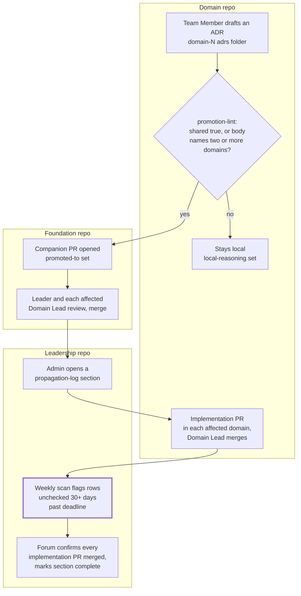

## 1. Intent

A decision drafted inside one domain cannot silently bind another domain
without that domain's own leadership reviewing it, and an accepted
cross-domain decision cannot silently stall once accepted: its
implementation stays visible, owned, and time-bounded until every affected
domain has merged its part. The constraint this must not violate: neither
direction of that guarantee may depend on someone remembering to check.

Three materially different solutions could satisfy this without being what
the harness ships: a manual promotion checklist a Domain Lead runs by eye
before every ADR merge, with no automated trigger; a single shared decision
log all domains write into directly, so there is nothing to promote because
there is nothing local to begin with; or a propagation tracker that pings
every owner on a fixed calendar cadence regardless of whether a deadline has
actually passed. The harness's own answer (a frontmatter contract checked by
CI at the promotion boundary, and a dated checklist file scanned weekly for
staleness) is one of several ways to meet the intent, which is what keeps
this an intent rather than a solution mandate.

## 2. Problem & evidence

`organisationos-foundation/docs/concepts.md`'s "How a decision travels"
section states the job in one sentence: "A decision starts where the work
is. A Team Member drafts an ADR in their domain." Most ADRs stay exactly
there. The obstacle is the minority that do not: an ADR that mentions
another domain by name, or that the author already knows is a shared
technical standard, has a blast radius its own domain folder cannot
contain, and nothing about drafting it in the usual place flags that fact
to anyone outside the domain.

The same section names the consequence on the other side of acceptance:
once a cross-domain decision merges into Foundation, its work is not done —
every affected domain still has an implementation PR to write and merge.
`organisationos-foundation/cross-domain-decisions/README.md`'s "Audit trail"
section states the tracking mechanism directly: "Every PR that closes a
propagation action carries `Closes CDR-XXX` in its description. The Admin
records the merged PR's SHA in the Leadership repo's
`cadence/propagation-log.md`." A checklist item sitting unchecked past its
own stated deadline is, structurally, indistinguishable from one nobody has
looked at in weeks — nothing about an unchecked box itself surfaces that
distinction to the Admin or the Forum.

Both problems share a shape: a decision or an obligation whose true scope
has silently outgrown the place it started, without anything in that
place's normal operation calling attention to the mismatch. This PRD covers
the two mechanical trip-wires the harness sets at each of those seams: a
CI check at the point a domain-local ADR is drafted, and a dated scan at
the point a propagation action's deadline has passed.

## 3. Outcomes

- An ADR marked `shared: true`, or whose own body names two or more
  domains, cannot merge in its domain without the author setting either
  `promoted-to:` (it is being promoted) or `local-reasoning:` (it is staying
  local, and why).
- A promoted decision's companion Foundation PR is reviewed by a Leader and
  the Domain Lead of every domain the decision affects, before it merges.
- Every accepted CDR gets a propagation-log section naming its downstream
  implementation actions as checkbox rows, each with an owner and a
  deadline.
- A propagation-log item left unchecked more than 30 days past its own
  deadline is surfaced as an issue on a weekly schedule, rather than
  waiting for someone to notice it in the file.
- The Leadership Forum, not a CI check, is the human gate that confirms a
  cross-domain decision's cycle is actually closed: every implementation PR
  merged, the log entry marked complete.
- A closed propagation-log section does not clutter the file indefinitely:
  it moves to the bottom after the calendar month ends, with an optional
  annual archive.

## 4. Non-goals

- The five artefact templates (ADR, CDR, CDR-light, interface, change
  proposal) and the folders they live in. That is PRD-06's territory; this
  PRD assumes an ADR or a CDR already exists in the shape PRD-06 documents,
  and covers only how one travels from a domain into Foundation and how its
  acceptance is tracked back out.
- The Leadership Forum as an institution: its cadence, who chairs it, and
  what else it does beside confirm propagation. That belongs to PRD-14;
  this PRD cites the Forum only as the human gate that closes a propagation
  cycle.
- Reviewer identity, CODEOWNERS bindings, and the escalation ladder ("no
  single human satisfies two required-reviewer slots"). Those belong to
  PRD-03; this PRD cites CODEOWNERS only to show which paths a promotion PR
  routes review through.
- Whether a required-reviewer rule actually blocks a merge anywhere in the
  harness. That finding (no branch protection on any of the three reference
  repositories) is recorded once, in section 7, rather than re-derived per
  requirement in section 6.
- The two-tier glossary itself and the "used by two or more domains" rule
  that promotes a term into it. That belongs to PRD-08; this PRD cites
  Foundation's glossary only as the domain-name source `promotion-lint`
  reads from.

## 5. Solution sketch

The flow has two seams, one at each end of a cross-domain decision's life.
At the drafting end, a CI check reads what the author already wrote — the
ADR's own frontmatter and body — and refuses to let a promotion-shaped ADR
merge silently local. At the acceptance end, a scheduled scan reads a
single dated checklist and turns a missed deadline into a visible issue
instead of a fact only the file itself knows.

The primary flow starts with a Team Member drafting an ADR in their own
domain's `adrs/` folder. `promotion-lint` reads the ADR's frontmatter
(`shared:`) and its body, checking the body against every domain name
Foundation's own `glossary.md` lists under its `## Domains` heading. If
neither condition fires, the ADR merges as an ordinary domain-local
decision. If either fires, the author must set one of two frontmatter
fields before the check passes: `local-reasoning:`, keeping the decision
local with a stated reason, or `promoted-to:`, pointing at a companion PR
opened in Foundation. That companion PR is reviewed by a Leader and the
Domain Lead of every affected domain; once it merges, the Admin opens a
propagation-log section in Leadership naming one checkbox row per
downstream implementation action, each with an owner and a deadline.
Domains merge their own implementation PRs against that section, and a
weekly scan flags any row still unchecked more than 30 days past its
deadline as an issue. The cycle closes when the Leadership Forum sees every
implementation PR merged and marks the section complete.

Key rules:

- A promotion trigger is either frontmatter (`shared: true`) or a body
  scan (the ADR names two or more domains); either alone is sufficient to
  require a `promoted-to:` or `local-reasoning:` answer.
- The domain-name list `promotion-lint` scans against is not hardcoded in
  the workflow: it is read at run time from Foundation's own
  `glossary.md`, so adding a domain there is enough to widen the scan.
- A propagation-log row is a checkbox, not a status field: "closed" means
  ticked, and a ticked row records the closing PR alongside it.
- The weekly staleness scan is a calendar fact (today minus the row's own
  stated deadline), not a judgement call — it does not ask whether the work
  is actually late for a good reason before flagging it.

Important states: a domain-local ADR before promotion-lint has run against
it (undetermined); the same ADR after the check fires with neither field
set (blocked); a promoted ADR's companion Foundation PR before its required
reviewers have signed off (open, not yet mergeable); a propagation-log row
before its deadline (open, not yet due); the same row after 30 days past
deadline with no closing PR (stale, surfaced as an issue); and a
propagation-log section where every row is checked but the Forum has not
yet confirmed it (implementation complete, cycle not yet formally closed).

Alternatives rejected:

- **A manual promotion checklist, no automated trigger.** Rejected because
  it depends on every author remembering to ask themselves the
  cross-domain question on every ADR, which is exactly the failure mode a
  silent scope mismatch produces: the times nobody asks are the times it
  matters most.
- **One shared decision log for every domain, nothing to promote.**
  Rejected because it forces every domain-local decision through the
  ceremony a cross-domain one needs (naming affected domains, routing a
  broader review), which is the same cost PRD-06 rejected a single flat
  decision log over.
- **A propagation reminder on a fixed calendar cadence, not tied to each
  row's own deadline.** Rejected because a fixed cadence either nags an
  owner who still has weeks left, or waits past a deadline that has
  already been missed for reasons a fixed reminder interval cannot
  anticipate; a per-row deadline comparison is the only version that
  answers the actual question, "is this specific item late."

## 6. Requirements

### FR-07.1 — Promotion trigger: `shared:` or cross-domain body mentions gate on `promoted-to:`/`local-reasoning:`

Status: ENFORCED (local) for the detection logic; the deployed Domain
caller has never actually triggered it on a pull request
Evidence: `organisationos-foundation/.github/workflows/promotion-lint.yml`,
step "Detect promotion candidates": extracts changed
`domain-[0-9]+/adrs/*.md` files from the caller's diff, builds a
domain-name alternation from Foundation's own `glossary.md` "## Domains"
section (`awk '/^## Domains/{flag=1; next} /^## /{flag=0} flag && /^- /{print $2}'`),
then for each changed file parses `shared`, `promoted-to`, and
`local-reasoning` from its frontmatter with `yq` and counts distinct
domain-name mentions in its body, failing with `::error file=$f::Promotion
trigger fired but neither 'promoted-to:' nor 'local-reasoning:' is set in
frontmatter` when `shared` is `true` or the body names two or more domains
and neither field is set.
`organisationos-foundation/glossary.md` "## Domains" section: "This list is
referenced by the promotion-lint workflow to detect cross-domain mentions
in ADR bodies," followed by four bullets, `domain-1` through `domain-4`.
`organisationos-domain/.github/workflows/promotion-lint.yml`: a 13-line
caller (`wc -l`; 11 non-blank), `on: pull_request`, `paths:
['domain-*/adrs/**.md']`, `uses:
<adopter-org>/organisationos-foundation/.github/workflows/promotion-lint.yml@v1`.

Verified: the "Detect promotion candidates" step's `run:` block, extracted
verbatim and run against a scratch git repository seeded with Foundation's
actual four-domain glossary list. A
domain-1 ADR with `shared: true` and neither `promoted-to:` nor
`local-reasoning:` set, body naming both domain-1 and domain-2, failed
(exit 1), naming the file and the missing-field condition. The same
extraction run against a domain-1 ADR with `shared: false`,
`local-reasoning:` set, and a single-domain body passed (exit 0).

`gh api repos/2SSilver/organisationos-domain/actions/workflows` and its
`/runs` endpoint: `promotion-lint.yml` has exactly one recorded run
(id `32367702410`, `event: push`, `conclusion: failure`, on the initial
commit), with zero jobs under it. Two other `<adopter-org>`-pinned Domain
callers checked for the same shape (`back-flow-rules.yml`,
`banned-string-check.yml`) show an identical single push-event failure
with zero jobs at the same commit — consistent with a workflow-registration
failure from the unresolvable `<adopter-org>/organisationos-foundation`
reference, not an execution of any of these workflows' own declared
triggers. No `pull_request`-triggered run of `promotion-lint.yml` has ever
occurred on the published Domain repository.

The harness MUST fail a domain-local ADR's promotion check when its
frontmatter is marked `shared: true` or its body names two or more domains
from Foundation's own glossary, unless the ADR also sets `promoted-to:` or
`local-reasoning:`.

- Given an ADR with `shared: true` and neither `promoted-to:` nor
  `local-reasoning:` set
  When `promotion-lint` runs
  Then it fails, naming the file
- Given the same ADR with `local-reasoning:` set instead
  When `promotion-lint` runs again
  Then it passes
- Given an ADR whose body names two or more of Foundation's declared
  domains, with neither field set
  When `promotion-lint` runs
  Then it fails on the same condition, independent of the `shared:` value
- `organisationos-foundation/architectural-decisions/README.md`'s own
  "How a decision arrives here" step 2 describes the check as one that
  "posts a PR comment with the promote-or-keep-local choice"; nothing in
  `promotion-lint.yml` posts a PR comment (confirmed: zero matches for
  `comment`, `github-script`, or `issues.create` in the file) — the actual
  mechanism is a failing check with an inline `::error` annotation on
  whichever frontmatter field the author already chose before pushing, not
  an interactive prompt offering a choice

### FR-07.2 — Promotion opens a companion Foundation PR, reviewed by a Leader plus every affected Domain Lead

Status: CONVENTION
Evidence: `organisationos-foundation/architectural-decisions/README.md`,
"How a decision arrives here" (five numbered steps): step 3, "a companion PR
is opened in this repo (Foundation) adding a copy of the ADR here with
`promoted-from:` frontmatter linking back to the original Domain PR"; step
4, "Foundation reviewer rules apply: 1 Leader + Domain Lead of each affected
domain"; step 5, "the Domain PR amends the original ADR's `promoted-to:`
field to point at the Foundation PR URL."
`organisationos-foundation/docs/concepts.md` line 79: "The Foundation PR is
reviewed by a Leader and the Domain Lead of every affected domain."
`organisationos-foundation/.github/CODEOWNERS` lines 43-45 route
`/interfaces/`, `/cross-domain-decisions/`, and `/architectural-decisions/`
each to the same six-owner superset (Admin, Leader, all four Domain Leads),
not a subset scoped to only the affected domains named in a given PR —
the same CODEOWNERS-cannot-express-per-PR-scope limitation PRD-06's
FR-06.3/FR-06.4 evidence records for the identical three paths, cited here
rather than re-derived.

The harness MUST route a promoted decision's companion Foundation PR
through review by a Leader and the Domain Lead of every domain the decision
affects, before that PR merges.

- The five-step sequence (draft, detect, companion PR, required review,
  `promoted-to:` amendment) is documented in full in
  `architectural-decisions/README.md` and restated in `concepts.md`.
- CODEOWNERS names the documented reviewer set as a superset (every Domain
  Lead, not only affected ones) because GitHub's CODEOWNERS format has no
  per-pull-request scoping; whether the review that actually happens is
  narrower than the names GitHub suggests is a human judgement this PRD's
  evidence cannot check.
- No branch protection exists on Foundation's published `main` (section 7);
  nothing on the live repository currently forces this review, or any
  review, to occur before a promotion PR merges.

### FR-07.3 — Every accepted CDR gets a propagation-log section with checkbox actions, owner, deadline, closing PR

Status: SHIPPED
Evidence: `organisationos-leadership/cadence/propagation-log.md`, "Format"
section (a fenced example): `## CDR-NNN: <title>` followed by checkbox rows,
`- [ ] Action in Domain 1: <description> — Owner: @<handle>, Deadline:
YYYY-MM-DD` and, for a closed row, `- [x] Action in Domain 2: <description> —
Owner: @<handle>, Deadline: YYYY-MM-DD, Closed by PR #NNN on YYYY-MM-DD`.
"Rules" section: "Every accepted CDR gets a section here when the Admin
co-signs it at the Forum." and "Each propagation action is a checkbox row
with owner, deadline, and (when closed) the closing PR SHA/number."
`organisationos-foundation/cross-domain-decisions/README.md`, "Audit trail":
"Every PR that closes a propagation action carries `Closes CDR-XXX` in its
description. The Admin records the merged PR's SHA in the Leadership repo's
`cadence/propagation-log.md`." The file's own "Current state" section, read
as shipped: "Replace this section with the current state. At adoption time,
this file is empty save for these instructions" — the format and the rules
ship; no live propagation entries exist in the reference repository as
read.

The propagation log MUST record every accepted CDR as a section naming its
downstream implementation actions, each a checkbox row carrying an owner
and a deadline, and naming the closing PR once checked.

- The documented row shape names all four elements this requirement lists:
  checkbox state, owner handle, deadline date, and (once closed) the
  closing PR reference.
- Section creation is triggered by an Admin action at the Forum ("when the
  Admin co-signs it"), not by any CI check; nothing in this PRD's evidence
  verifies that a given accepted CDR actually received a section, or that
  a section's rows match what the CDR itself calls for.
- The reference file carries no live entries at this PRD's `verified:`
  date; the format and rules were read directly rather than inferred from
  a populated example.

### FR-07.4 — Overdue propagation actions surfaced as issues weekly

Status: ENFORCED (local) for the detection logic, on both a violating and
a clean input; no check against a duplicate escalation issue exists
Evidence: `organisationos-foundation/.github/workflows/propagation-sla.yml`,
step "Scan propagation log for stale propagation actions": reads
`cadence/propagation-log.md` from the caller-repo checkout, greps unchecked
rows (`^- \[ \]`), extracts each row's first `YYYY-MM-DD` date as its
deadline, computes `age` as `today` minus that date in seconds, and flags a
row when `age -gt 2592000` (30 days). A separate step, "Post SLA-breach
issue" (`actions/github-script`, `github.rest.issues.create`), runs only
`if: steps.scan.outputs.result == 'stale'`. The scan step itself contains
no GitHub API call: it reads a file, computes an `age` in seconds per row,
and writes `result=clean` or `result=stale` plus a `list` of matching rows
to its own step output. Detection is therefore separable from the
issue-opening call by construction, not by an extraction choice made for
this verification — which is what makes local execution of the scan step
alone a legitimate `ENFORCED` locus for this requirement, rather than a
substitute for evidence the real mechanism cannot produce.

Date derivation: `date
-v-31d +%Y-%m-%d`, run 2026-09-07, output `2026-08-07`; `date -v+30d
+%Y-%m-%d`, same run, output `2026-10-07`. The scan step's logic, extracted
verbatim (substituting `gdate` for `date`, since this host's native `date`
does not support `-d`, matching PRD-04's FR-04.4 verification for the same
reason), was run against a seeded
log with one unchecked row deadlined `2026-08-07` (31 days past); it
reported `result=stale` and named the exact row; run against a seeded log
with one unchecked row deadlined `2026-10-07` (a future date), it reported
`result=clean`.

This resolves a contradiction in the spec's own worked example, which cites
run `33418204703` (2026-08-31, `conclusion: success`) as this requirement's
`ENFORCED` evidence. `gh api` resolves that run against
**`organisationos-foundation`**, not Leadership — the same reusable
workflow also carries `on: schedule` at its own top level and runs weekly
against Foundation's own repository, which has no `cadence/` folder at all.
`gh api .../actions/runs/33418204703/jobs` shows the "Post SLA-breach issue"
step as `skipped`, and `gh run view 33418204703 --repo
2SSilver/organisationos-foundation --log` shows the scan step's actual
output: `No propagation log.` — the scan's first guard clause, before the
deadline-comparison logic this requirement is about ever runs. A green run
proves the workflow executes; this specific green run does not even reach
the line of logic that would need to. The red/green above, against seeded
content the live reference repositories do not carry, is the evidence this
requirement's `ENFORCED` status rests on instead.

The system MUST open an issue for any propagation-log item that remains
unchecked more than 30 days past its stated deadline.

- Given a propagation-log item unchecked with a deadline 31 days past
  When the weekly scan runs
  Then it is flagged as stale, reproduced locally against a deadline
    derived as 31 days before the run date
- Given a propagation-log item unchecked with a deadline still in the
  future
  When the weekly scan runs
  Then it is not flagged
- Given no `cadence/propagation-log.md` file at all (Foundation's own
  case, since the reusable also runs on Foundation's own schedule)
  When the weekly scan runs
  Then it exits clean immediately, without evaluating any item — the
    actual shape of the only live run this requirement's spec-level
    evidence cites
- The issue-creation step carries no check against an already-open
  escalation issue for the same row: `github.rest.issues.create` runs
  unconditionally whenever `result == 'stale'`, so a row that remains
  unchecked across consecutive weekly runs receives a new issue each week,
  not one
- The Leadership caller's own workflow (`organisationos-leadership/.github/workflows/propagation-sla.yml`)
  has never executed at all: Leadership's Actions are disabled at the
  repository level (`gh api repos/2SSilver/organisationos-leadership/actions/permissions`
  → `enabled: false`), and its one recorded run is the same push-triggered
  registration failure the Domain callers show (FR-07.1), not a schedule
  trigger

### FR-07.5 — Cycle closes when the Forum sees every implementation PR merged

Status: CONVENTION
Evidence: `organisationos-foundation/docs/concepts.md` line 79: "The cycle
closes when the Leadership Forum sees every implementation PR merged and
marks the log entry complete." The Forum itself — its cadence, chairing,
and everything else it does beside this confirmation — is PRD-14's
territory, cited here rather than described.

The propagation cycle for an accepted CDR MUST close only when the
Leadership Forum has seen every implementation PR merged and marks the
propagation-log entry complete.

- The closing act is a human one, done at the Forum, not a CI state
  transition; no workflow named in this PRD's evidence marks a
  propagation-log section complete automatically.
- Nothing in this PRD's evidence checks that the Forum's confirmation
  actually followed a review of every implementation PR, as opposed to a
  section being marked complete on trust.

### FR-07.6 — Closed sections move to the bottom after month end; optional annual archive

Status: CONVENTION
Evidence: `organisationos-leadership/cadence/propagation-log.md`, "Rules"
section: "Closed sections (all items checked) move to the bottom of the
file after the current calendar month ends. Optionally archive to
`_archive/propagation-log-YYYY.md` annually."

A closed propagation-log section (every row checked) MUST move to the
bottom of the file once the calendar month it closed in ends, and MAY be
archived to a dated file annually.

- The rule is documented in the file's own "Rules" section as read above.
- No workflow named in this PRD's evidence checks file ordering or
  archival state; a section left in place past month end, or never
  archived, would not be flagged by anything this PRD's evidence names.

## 7. Dependencies & constraints

- **PRD-01 (repo topology)** owns the three-repo split this flow moves a
  decision across: a domain-local ADR drafted in Domain, a promoted copy
  living in Foundation, and the propagation log tracking implementation in
  Leadership.
- **PRD-03 (role model)** owns reviewer identity, CODEOWNERS bindings, and
  the "no single human satisfies two required-reviewer slots" escalation
  rule that FR-07.2's companion-PR review draws on; this PRD cites
  CODEOWNERS only to show which paths a promotion PR routes review
  through, consuming PRD-03's FR-03.5 rather than re-deriving it.
- **PRD-06 (decision records & contracts)** owns the artefact templates
  (ADR, CDR, CDR-light, interface) and the folders they live in, consuming
  its FR-06.2 (the CDR template's Approval section) as the shape a
  propagation-log entry's underlying CDR already satisfies before this
  PRD's flow ever tracks its implementation.
- **PRD-14 (not yet written)** owns the Leadership Forum as an
  institution; FR-07.2 and FR-07.5 both cite the Forum's confirming role
  without describing the Forum itself.
- **External constraint — no branch protection on any of the three
  reference repositories.** `gh api repos/2SSilver/organisationos-foundation/branches/main/protection`,
  the same call against `organisationos-domain`, and against
  `organisationos-leadership`, all returned `404` ("Branch not protected"),
  confirmed 2026-09-07. CODEOWNERS routing cited in FR-07.2 determines who
  GitHub suggests as a reviewer; without branch protection requiring
  code-owner review, nothing blocks a promotion PR from merging without
  it. This is the same finding PRD-03's FR-03.4 and PRD-04's FR-04.4
  record for their own requirements; it is not re-derived per requirement
  in section 6 above, only applied once here.
- **External constraint — the `<adopter-org>` placeholder makes every
  Domain and Leadership caller in this flow unresolvable as shipped.**
  Both `promotion-lint.yml` (Domain) and `propagation-sla.yml`
  (Leadership) are `uses: <adopter-org>/organisationos-foundation/...@v1`
  callers; until an adopter substitutes a real organisation name, GitHub
  cannot resolve either reference. FR-07.1's and FR-07.4's evidence records
  the observed consequence directly: a single push-triggered registration
  failure at initial commit, zero jobs, on every caller checked, rather
  than any execution of the caller's own declared trigger.
- **External constraint — Leadership Actions are disabled at the
  repository level**, independent of the placeholder above (`gh api
  repos/2SSilver/organisationos-leadership/actions/permissions` →
  `enabled: false`). `propagation-sla.yml`'s weekly schedule has never
  fired there for this reason alone; substituting `<adopter-org>` would
  not be sufficient on its own to make it run.
- **External constraint — Foundation's own copy of `propagation-sla.yml`
  runs on Foundation's own schedule, against a repository with no
  propagation log.** The reusable workflow declares `on: schedule` at its
  own top level, not only `on: workflow_call`; Foundation's `self-ci.yml`
  lines 25-29 document excluding it from Foundation's own composite CI
  because it and two other weekly-scheduled workflows "already run on
  their own schedule/workflow_dispatch trigger, so adding them here would
  just duplicate that trigger on every PR:" (the comment then lists three
  excluded workflows, `propagation-sla.yml` among them). That independent
  schedule is what produced the run the spec's own worked example cites as
  `ENFORCED` evidence for FR-07.4 — against a repository that structurally
  cannot exercise the requirement's logic.
- **External constraint — GitHub's CODEOWNERS format has no per-pull-
  request scope.** FR-07.2's "Leader and Domain Lead of each affected
  domain" is a documented review target; CODEOWNERS can only name a fixed
  owner set per path, so it names every Domain Lead for every promotion PR
  regardless of which domains that specific PR actually affects.

## 8. Known gaps & open questions

- **GAP — `promotion-lint`'s documented "PR comment with the promote-or-
  keep-local choice" does not exist.** FR-07.1 records this precisely:
  `architectural-decisions/README.md` describes an interactive prompt;
  the shipped mechanism is a failing check with an inline `::error`
  annotation on whichever frontmatter field the author already committed
  before pushing. An author who has not yet read the README learns of the
  requirement only from a red check, not from a comment explaining the
  choice.
- **GAP — the SLA-breach issue has no duplicate check.** FR-07.4 records
  this: `propagation-sla.yml`'s issue-creation step runs unconditionally
  whenever the scan reports `stale`, with no search for an already-open
  escalation issue naming the same row. A propagation-log item that stays
  unchecked for two consecutive weekly runs gets two issues, not one
  reopened or updated issue.
- **Open question — whether FR-07.2's documented review actually binds
  anything.** No branch protection exists on any of the three reference
  repositories (section 7); CODEOWNERS names the reviewer set GitHub
  suggests, but nothing currently forces a promotion PR to collect that
  review before merging.
- **Open question — no check verifies that a section's rows actually
  match the CDR it belongs to.** FR-07.3 records that a propagation-log
  section's creation is an Admin action taken at the Forum, not a CI
  step; nothing in this PRD's evidence checks that a given accepted CDR
  received a section at all, or that a section's rows are complete
  relative to what the CDR itself calls for.
- **Open question — whether Foundation's own scheduled `propagation-sla`
  run should exist at all.** It is a documented, deliberate exclusion from
  Foundation's own composite CI (section 7), not an oversight; but it is
  also the run the spec's own worked example mistook for evidence that the
  requirement's actual logic had been exercised. Recorded here as a live
  design question — whether the reusable should skip itself entirely when
  no propagation log is present, rather than reporting a bare `success` —
  rather than settled by this PRD.

## 9. Rebuild guide

This section assumes PRD-01's three repositories, PRD-03's CODEOWNERS
bindings, and PRD-06's five templates and folder homes already exist. It
produces the state PRD-07 alone is responsible for: the promotion trigger
at the domain-to-Foundation seam, and the propagation log and its
staleness scan at the Foundation-to-Leadership seam.

1. In Foundation, add a `## Domains` section to `glossary.md` naming every
   domain your organisation runs; `promotion-lint` reads this list at run
   time, so you do not hardcode domain names into the workflow itself.
2. Write `promotion-lint.yml` as a reusable workflow in Foundation
   (`on: workflow_call`, taking a `foundation-repo` input): detect changed
   `domain-N/adrs/*.md` files, parse each one's `shared`, `promoted-to`,
   and `local-reasoning` frontmatter, count distinct domain-name mentions
   in the body against your glossary's list, and fail when either trigger
   condition holds with neither field set. Decide deliberately whether you
   want an inline check-annotation only, or an actual PR comment — this
   PRD's evidence shows the shipped version is the former even though its
   own documentation describes the latter.
3. In Domain, write `promotion-lint.yml` as a short caller: `on:
   pull_request`, path-scoped to `domain-*/adrs/**.md`, pinned to a
   released Foundation tag.
4. In Foundation, write `architectural-decisions/README.md`'s "How a
   decision arrives here" sequence and bind CODEOWNERS on
   `/architectural-decisions/` and `/cross-domain-decisions/` to your
   Leader-plus-every-Domain-Lead superset, understanding today that
   CODEOWNERS cannot scope that set down to only the domains a specific
   PR affects.
5. In Leadership, write `cadence/propagation-log.md` with the row format
   section 6 (FR-07.3) describes, and the Rules section stating when a
   section is created, how a row closes, and when a closed section moves
   to the bottom of the file.
6. Write `propagation-sla.yml` as a reusable workflow in Foundation
   (`on: schedule`, `workflow_dispatch`, and `workflow_call` all three, as
   shipped) that reads `cadence/propagation-log.md` relative to the
   caller's own checkout, flags any unchecked row more than 30 days past
   its deadline, and opens an issue naming the stale rows. Decide
   deliberately whether to guard the issue-creation step against a
   duplicate already open for the same row — the shipped version does not.
7. In Leadership, write `propagation-sla.yml` as a short caller (`on:
   schedule`, pinned to the same released tag) carrying `issues: write`
   permission, and turn Actions on for the repository — without both,
   the scheduled run this PRD's evidence shows never having fired here
   still will not fire.

After this PRD alone: a domain-local ADR that mentions another domain or
declares itself shared cannot merge without an explicit local-or-promote
answer, a promoted decision has a documented (if unenforced, absent branch
protection) review path into Foundation, and a propagation-log row left
unchecked past its deadline is surfaced rather than silently aging. What
stays broken until later work closes it: nothing checks that an accepted
CDR actually received a propagation-log section, nothing deduplicates a
repeated weekly escalation issue for the same row, and the Leadership
Forum's own confirmation that a cycle is closed remains a human act this
PRD's evidence cannot verify happened.

## 10. Provenance & verification

Files specified by this PRD (`specifies:` above) were confirmed present
with `ls` on 2026-09-07; all five resolved without error. Last-touched
commits (`git log -1 --format="%H %ad" --date=short -- <path>`, run
2026-09-07): Foundation's `promotion-lint.yml` at `5fa85c9`, 2026-08-20;
Foundation's `propagation-sla.yml` at `adc560a`, 2026-08-26; Domain's
`promotion-lint.yml` at `f10a3e2`, 2026-08-20; Leadership's
`propagation-sla.yml` at `0a64f33`, 2026-08-21; Leadership's
`cadence/propagation-log.md` at `503a974`, 2026-08-21. Foundation tag
`v1.1.2` resolves to `d70bafc`, 2026-09-02 (`git log -1` against the tag),
the same commit `v1` resolves to.

**Method.** FR-07.2, FR-07.3, FR-07.5, and FR-07.6 (all `CONVENTION`) were
verified by reading the cited file at the cited section, on 2026-09-07,
against Foundation tag `v1.1.2`. FR-07.1 and FR-07.4 (both `ENFORCED
(local)`) were verified by extracting the exact shell logic from each
workflow's own named `run:` block and executing it in the session
scratchpad against a scratch git repository (FR-07.1) or a seeded flat
file (FR-07.4), each carrying both a violating and a clean input, per the
evidence bar in the PRD template's section 3.5. Their red/green
transcripts — command, seeded inputs, and both results — are in
section 6's own evidence blocks above.

Live GitHub state — workflow run history and branch-protection status —
was read via `gh api` against the published repositories directly, rather
than reproduced locally, for three findings: the Domain caller's own
run history (FR-07.1), the actual identity and outcome of run
`33418204703` (FR-07.4), and the absence of branch protection on all
three repositories (section 7). None of these three write to a live
repository; each is a read against public GitHub state, run 2026-09-07,
distinct from the local-execution evidence the `ENFORCED` claims rest on.

**Limits.** FR-07.1's scratch verification supplies `_foundation/
glossary.md` as a static snapshot of Foundation's actual "## Domains"
section rather than a live `actions/checkout` of the Foundation repository
at a pinned ref; the checkout mechanics themselves were not exercised.
It also supplies `BASE_REF` as a literal parameter (`main`, the scratch
repo's own base branch) in place of the workflow's own
`${GITHUB_BASE_REF:-main}` expression; the GitHub Actions expression
syntax itself was not exercised, only the `git diff` comparison it would
otherwise resolve to. It also runs against this host's locally installed
`yq` (Homebrew, `v4.53.6`, macOS binary) rather than the workflow's own
"Install yq" step, which `wget`s the latest `yq_linux_amd64` release at
run time; the two were not confirmed to parse the seeded frontmatter
identically beyond this verification's own passing runs. FR-07.4's date
arithmetic was run under `gdate` rather than this host's
native `date`, for the same reason PRD-04's FR-04.4 verification recorded:
the workflow's own runner uses GNU date, and this host's native `date`
does not support `-d`. Neither `ENFORCED` claim exercises a live GitHub
Actions run: Domain's Actions are disabled at the repository level
(`gh api repos/2SSilver/organisationos-domain/actions/permissions` →
`enabled: false`, verified 2026-09-07T11:34Z), the same as Leadership's
(section 7). The earlier claim in this paragraph that Domain's Actions
were enabled rested on the per-workflow `state: active` field FR-07.1's
evidence cites, not on this repository-level permission itself, which was
never separately checked at the time; no accessible history (the public
events API records pushes, PRs, and member changes, not a permissions
toggle) establishes whether the repository-level setting changed between
then and this correction, so the earlier claim is treated as unverified
rather than as a state change. Either way, the caller's own `<adopter-org>`
reference (section 7) remains unresolvable regardless of the permission
setting, so no pull-request- or schedule-triggered execution of either
requirement's logic has ever occurred on the published repositories,
consistent with the workstream's evidence bar treating local execution as
equally valid where CI itself cannot be observed. A re-verifier reproducing
the `ENFORCED` claims needs only FR-07.1's and FR-07.4's own `run:` blocks
(section 6), a scratch git repository or seeded flat file of the shapes
described there, and the substitutions this Limits paragraph discloses
(static glossary snapshot, literal `BASE_REF`, local `yq`, `gdate`) — not
GitHub access; a re-verifier checking the `gh api` findings needs only
public read access to the three repositories.
