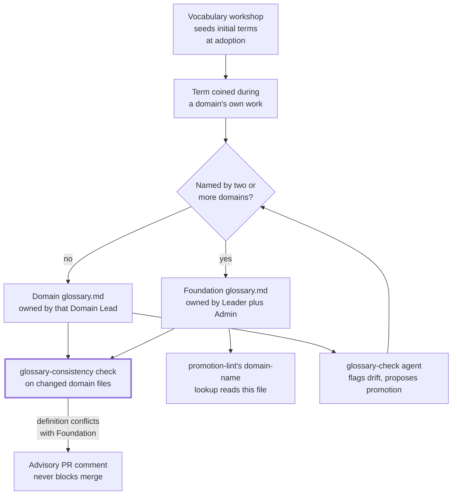

## 1. Intent

Two people, or two agents, using the same word MUST mean the same thing, and
finding out what a word means MUST cost one lookup in a known place rather
than a conversation. The constraint this must not violate: a term's home
must stay unambiguous even as the organisation adds domains, so the lookup
never turns into "check every domain's glossary in case one of them also
defines this."

Three materially different solutions could satisfy this without being what
the harness ships: a single shared glossary every domain writes into
directly, so there is nothing to route because there is only one place a
term can live; no documented glossary at all, with meaning discovered by
asking a Domain Lead or reading a domain's prose; or a single automated
term-reconciliation scanner that compares every definition across every
repo on every PR and resolves conflicts by rule, with no human tier. The
harness's own answer, a two-tier glossary split between Foundation and each
domain plus a workshop that seeds it, an advisory (non-blocking) comparison
check, and an on-demand agent, is one of several ways to meet the intent,
which is what keeps this an intent rather than a solution mandate.

## 2. Problem & evidence

`organisationos-foundation/glossary.md`'s own opening line states the job:
"Terms used across two or more domains in this organisation. Domain-specific
terms live in each domain's own `glossary.md`." Foundation's `CLAUDE.md`
names the same split at its "Where to read more" pointer, line 110:
"`glossary.md` — cross-domain terminology (≥2 domains)".

The obstacle is that nothing about coining a term in the ordinary course of
domain work tells its author which tier it belongs in. A Domain Lead writing
their own domain's `glossary.md` has no automated way to learn that another
domain independently coined the same word for something close enough to
matter, or that a word they assumed was domain-local already has a different,
committed meaning in Foundation's glossary. `docs/concepts.md`'s "What lives
where" table states the intended placement directly: "Term used by two or
more domains | Foundation `glossary.md`" and "Term unique to one domain |
Domain `domain-N/glossary.md`", consuming PRD-01's FR-01.4, which already
establishes this table as the harness's what-lives-where mapping, rather than
restating it.

The consequence, left unaddressed, is silent terminology drift: a word that
means one thing in one domain's decisions and something else in another's,
discovered only when a cross-domain reader stumbles on the mismatch, at
which point untangling which meaning any given past decision relied on is
far more expensive than the one-time cost of naming the conflict at the
point the second domain coined the word.

## 3. Outcomes

- A term unique to one domain has exactly one documented home, that
  domain's own `glossary.md`, and a term meant to span domains has exactly
  one documented home, Foundation's `glossary.md`.
- A vocabulary workshop, run before or at adoption, surfaces vocabulary
  clashes, ownership overlaps, and missing interfaces between prospective
  domains before folders and glossaries encode a boundary that turns out to
  be wrong.
- A domain pull request that redefines a term already carrying a different
  definition in Foundation's glossary gets an advisory comment naming the
  conflict, without blocking the merge.
- An operator or agent can run a single on-demand check against any changed
  file that flags undefined terms, conflicting definitions, and candidates
  for glossary promotion, for a human to act on.
- `promotion-lint`'s cross-domain-mention detection reads the organisation's
  actual domain list from Foundation's glossary at run time, rather than a
  domain list hardcoded into the workflow itself.

## 4. Non-goals

- The five artefact templates (ADR, CDR, CDR-light, interface, change
  proposal) and the folders they live in. That is PRD-06's territory, which
  itself names the two-tier glossary as this PRD's territory in turn.
- `promotion-lint`'s promotion trigger, its `shared:` / `promoted-to:` /
  `local-reasoning:` frontmatter contract, and the companion-PR review flow.
  That is PRD-07's territory; this PRD cites `promotion-lint` only for the
  domain-name lookup its own `foundation-repo` input parameterises.
- The `glossary-check` agent's own definition file, its invocation surface,
  and its model binding. That is PRD-12's territory; this PRD covers only
  the agent's stated role in terminology consistency.
- Reviewer identity, CODEOWNERS bindings, and the escalation ladder. Those
  belong to PRD-03; this PRD cites CODEOWNERS only to show which review
  routing a glossary change carries.
- The confidentiality coverage gaps (paraphrased, structural, numerical
  identifiers) that name `glossary-check` as a partial defence. That is
  PRD-04's territory; this PRD does not re-derive that analysis.
- Which actual terms and domain names an adopting organisation chooses.
  That is deliberately left to the vocabulary workshop the template
  describes, not prescribed here.

## 5. Solution sketch

A term's life starts wherever the domain work that coins it happens, and the
harness gives it exactly one of two homes based on a single question: does
this word mean the same thing to more than one domain? Before any of that,
a vocabulary workshop run at adoption (or at any major reorganisation) is
meant to have already surfaced the vocabulary clashes a later, word-by-word
discovery would be far more expensive to untangle.

The primary flow: a Domain Lead (or the Team Member drafting alongside them)
writes a new term into their domain's own `glossary.md` by default. If a
domain pull request touching that file bolds a term Foundation's own
`glossary.md` already defines, `glossary-consistency` compares the two
definitions and, when they differ, posts an advisory PR comment naming the
conflict, without failing the check. Separately, an operator can run the
`glossary-check` agent on demand against any changed file to flag undefined
terms, conflicting definitions, and candidates whose repeated use suggests a
glossary entry is overdue; its own constraints steer it toward extending the
domain's glossary first, escalating to Foundation's only once a term
genuinely spans two or more domains. `promotion-lint`, a separate mechanism
owned by PRD-07, reads a different section of the same Foundation file, the
"## Domains" list, to build the domain-name alternation it scans ADR bodies
against.

Key rules:

- A term's tier is a binary choice driven by domain count: two or more
  domains, Foundation; one domain, that domain.
- `glossary-consistency` compares only in one direction: a changed domain
  definition against a term Foundation's glossary already lists under
  bolded bullets. It does not scan across the four domain glossaries
  looking for a term two of them have coined independently.
- The comparison is advisory by construction (its own header comment: "flags
  — never blocks —"), not a gate; nothing in this PRD's evidence stops a
  conflicting domain-local definition from merging.
- The vocabulary workshop's own exit criteria gate adoption readiness, not
  any later terminology change: two or more unresolved "Deferred" items
  means "The bounded contexts are not bounded ..." and the workshop itself
  recommends against adopting yet.

Important states: a term that exists in exactly one domain's glossary
(settled, no action needed); a term that exists identically worded in
Foundation's glossary and a domain's own file (consistent, the passing
case); a term that exists with conflicting wording in both places (flagged,
advisory, not blocking); a term coined independently in two or more domain
glossaries that no automated check has ever compared against each other
(undetected, since `glossary-consistency` only checks a changed file against
Foundation's existing list, not domain files against each other); and a
"Deferred" vocabulary clash from a workshop round, unresolved past the
workshop itself (recorded with an owner and a review date, per the
template, but not tracked by any CI check this PRD's evidence names).

Alternatives rejected:

- **A single shared glossary, no tiering.** Rejected because it forces
  every domain-local term through the same ceremony a genuinely
  cross-domain one needs, manufacturing review overhead for words only one
  domain will ever use.
- **No documented glossary at all.** Rejected because it turns "what does
  this word mean here" into a conversation someone has to have, exactly
  the cost the intent rules out.
- **A single automated reconciliation scanner, no human tier.** Rejected
  because a term meaning something different in two domains is sometimes a
  deliberate scoping choice, not a defect a script should silently resolve;
  only a Domain Lead, or the workshop, can tell the difference.

## 6. Requirements

### FR-08.1 — Two-tier placement: ≥2-domain terms in Foundation, single-domain terms in Domain

Status: CONVENTION
Evidence: `organisationos-foundation/glossary.md` line 3: "Terms used across
two or more domains in this organisation. Domain-specific terms live in
each domain's own `glossary.md`." `docs/concepts.md`'s "What lives where"
table: "Term used by two or more domains | Foundation `glossary.md`" and
"Term unique to one domain | Domain `domain-N/glossary.md`" (consuming
PRD-01's FR-01.4 rather than restating the table's existence).
`.github/CODEOWNERS` (Foundation) line 53 routes `/glossary.md` to
`@placeholder-leader @placeholder-admin`, with the preceding comment (lines
48-52): "Glossary: 1 Leader + Admin (substrate, lower-stakes than
standards)." The same comment adds that CODEOWNERS "cannot express
'affected domain' for a cross-domain glossary entry" and defers that
judgement to the PR-template Approval checklist. `.github/CODEOWNERS`
(Domain) lines 16, 21, 26, 31 route each `domain-N/glossary.md` to that
domain's own Lead placeholder only. `docs/setup-org.md` line 116 names this
the "notification-only tier" and states plainly: "GitHub branch protection
is per-branch, not per-path, so it cannot express that distinction
natively ... the notification-only tier is a convention: Domain Leads
approve glossary and draft PRs promptly rather than reading them closely."

The harness MUST route a term used by two or more domains into Foundation's
`glossary.md`, and a term unique to one domain into that domain's own
`glossary.md`, with no other home for either.

- Foundation's `glossary.md` documents its own scope in its opening line,
  deferring domain-specific terms to each domain's own file.
- `docs/concepts.md`'s "What lives where" table names both directions of
  the rule as the harness's documented mapping.
- CODEOWNERS routes review of Foundation's `glossary.md` to a Leader-plus-
  Admin pair and each domain's own `glossary.md` to that domain's own Lead,
  a review-routing convention rather than an automated gate.
- No check in this PRD's evidence scans across the four domain glossaries
  to detect a term independently coined in two or more of them; the one
  automated check that touches glossary content (FR-08.2) compares a
  changed domain definition only against terms Foundation's glossary
  already lists, a narrower and one-directional comparison than the
  ≥2-domain threshold itself.
- No branch protection exists on Foundation's or Domain's published `main`
  (`gh api .../branches/main/protection` → `404` on both; a point-in-time
  reading, checked 2026-09-07 ~11:54 UTC), so the CODEOWNERS routing above
  does not currently force any review before a `glossary.md` change
  merges.

### FR-08.2 — `glossary-consistency` flags domain-Foundation term conflicts, advisory only

Status: ENFORCED (local) for the comparison logic, on both a violating and
a clean input; advisory only by design, and never executed on the published
repository
Evidence: `organisationos-domain/.github/workflows/glossary-consistency.yml`.
Its own header comment states: "flags — never blocks — domain-artefact
terms that disagree with Foundation's cross-domain glossary.md." It goes
on: "Domain-only: there is no Leadership equivalent (Leadership has no
domain-N/ artefacts) and no Foundation-side reusable counterpart, so this
file carries the check inline rather than calling out to a Foundation
`workflow_call` reusable." Step "Checkout Foundation repo (for
glossary.md)" (lines 25-33) checks out `<adopter-org>/organisationos-foundation`
at `ref: main`, with its own comment explaining the unpinned ref: "this
reads live glossary *content*, not a workflow version; the caller wants
the current glossary, not a frozen copy." Step "Compare domain-artefact terms against the
Foundation glossary" (lines 34-69): extracts changed `domain-[0-9]+/*.md`
files from the caller's diff, builds a term list from Foundation's "##
OrganisationOS terms" bolded bullets, and for each changed file, wherever it
bolds one of those terms, compares the domain file's own definition text
against Foundation's, writing `flagged=true` and a line to `_flagged.txt`
when they differ. Step "Comment flagged terms" (`if:
steps.check.outputs.flagged == 'true'`) posts an `actions/github-script`
comment: "glossary-consistency (advisory — does not block merge):",
followed by the flagged lines and "Reconcile with
`organisationos-foundation/glossary.md`, or confirm ≥2 domains do not
actually share this term and the domain-local definition is intentional."
The Domain PR template's own reviewer checklist (line 43) names it:
"Glossary check run? (advisory — review any flagged terms against
`organisationos-foundation/glossary.md`)".

Verified: the "Compare domain-artefact terms against the Foundation
glossary" step's `run:` block (the workflow's own lines 37-69, copied
verbatim and de-indented), run in a scratch git repository seeded
with an actual copy of Foundation's `glossary.md` and Domain's
`domain-1/glossary.md`. The shipped `domain-1/glossary.md` carries only its
placeholder `<term>` bullet, not a real `**CDR**` entry, so both branches
replace that placeholder line with an invented `**CDR**` bullet rather than
modifying an existing one. A `violating` branch's invented bullet reads "A
note captured during any team meeting" (Foundation's own definition:
"Cross-Domain Decision Record. Lives in Foundation's
`cross-domain-decisions/`. Distinguished from ADRs (single-domain
decisions).") and produced `flagged=true`, naming the file and term in
`_flagged.txt`. A `clean` branch's invented bullet instead reused
Foundation's own wording verbatim and produced `flagged=false`.

`gh api repos/2SSilver/organisationos-domain/actions/workflows/338581282/runs`,
a point-in-time reading checked 2026-09-07 ~11:54 UTC, returns
`total_count: 0`: this workflow has never recorded a single run on the
published repository, not even the one failed push-triggered registration
run FR-07.1 records for `promotion-lint.yml` and two other
`<adopter-org>`-pinned callers. `gh api
repos/2SSilver/organisationos-domain/actions/permissions`, checked the same
2026-09-07 ~11:54 UTC window, returns `enabled: false`: Domain's Actions
are currently disabled at the repository level, an independent reason no
`pull_request` trigger of this workflow could fire, on top of the
unresolvable `<adopter-org>` reference FR-07.1 and FR-07.4 record for other
callers. The same window's `gh api
repos/2SSilver/organisationos-foundation/actions/permissions` returns
`enabled: true`, and `gh api
repos/2SSilver/organisationos-leadership/actions/permissions` returns
`enabled: false`: the disabled state is not universal across the three
reference repositories, it is Domain's (and separately Leadership's) own
setting.

The harness MUST flag, without blocking a merge, a domain pull request that
changes a file bolding a term Foundation's `glossary.md` already defines,
where the two definitions differ.

- Given a changed `domain-N` file that bolds a term Foundation's glossary
  already defines, with a different definition
  When the compare step runs
  Then it writes `flagged=true` and names the file and term
- Given the same file with the term's wording matching Foundation's
  definition exactly
  When the compare step runs again
  Then it writes `flagged=false`
- Given `flagged=true`
  When the workflow continues
  Then it posts a PR comment that states outright it does not block merge,
    never a failing check
- The workflow has never recorded a run on the published Domain repository,
  and Domain's Actions are currently disabled at the repository level,
  independent of any workflow-registration issue

### FR-08.3 — `glossary-check` agent flags undefined terms, conflicts, and promotion candidates

Status: SHIPPED (agent definition exists; execution is per-session, not
automated; the file's own ownership, invocation surface, and model binding
belong to PRD-12)
Evidence: `organisationos-foundation/.claude/agents/glossary-check.md`
(identical, byte-for-byte, to `.github/agents/glossary-check.md`). Its own
frontmatter: `description: Check a changed file against the domain's
glossary. Flag terms used without definition, terms defined differently
elsewhere, and candidates for glossary inclusion.`, `tools: [read, search]`.
"What to check" names three bullets, each its own sentence: "Undefined
terms — domain-specific vocabulary used without a glossary definition."
"Conflicting definitions — a term whose meaning here differs from its
glossary definition." "Candidate additions — terms used >2 times in the
file that warrant glossary entries." "Constraints" separately states:
"Read-only." and "Prefer extending the domain's glossary; only escalate to
Foundation's `glossary.md` if the term spans ≥2 domains."
`standards/coverage-gaps.md` names it as a defence: "Paraphrased
identifiers | ... | Back-flow review (Domain Lead + Admin), `glossary-check`
agent" (cross-referencing PRD-04's territory, not re-deriving it).
`standards/templates/onboarding/claude-local-domain-lead.example.md` line
33: "The `glossary-check.md` agent is good for catching vocabulary drift".

The harness MUST provide an on-demand check, invocable against any changed
file, that surfaces undefined terms, conflicting definitions, and glossary
promotion candidates for a human to act on.

- The agent's own file names exactly the three checks this requirement
  lists, each with a one-line description.
- Its own constraints are read-only and propose-only, steering toward the
  domain's own glossary first and Foundation's only once a term spans two
  or more domains.
- No workflow in either repo's `.github/workflows/` references
  `glossary-check` by name (confirmed: zero matches); nothing wires it into
  an automatic CI trigger, consistent with its stated per-session,
  operator-invoked nature.
- `coverage-gaps.md` names this agent, alongside back-flow review, as a
  partial defence against paraphrased identifiers escaping confidentiality
  review (PRD-04's territory, cited here rather than analysed).
- The agent's own definition file, its invocation mechanics, and its model
  binding are PRD-12's territory; this PRD's evidence is limited to its
  stated role in terminology consistency.

### FR-08.4 — Vocabulary workshop template seeds both glossary tiers at adoption

Status: SHIPPED
Evidence: `organisationos-foundation/standards/templates/vocabulary-workshop.md`.
"Purpose": "Surface domain-boundary disagreements before they encode into
folders." Format runs four rounds over 4 hours: independent drafting;
pairwise reads surfacing "Vocabulary clashes (same word, different meaning
across domains)"; a plenary sorting each clash into Resolved / Renamed /
Merged / Deferred; and a written output including "Glossary additions
(terms with their resolved meanings)". "Exit criteria" states two rules in
full: "≥2 unresolved 'Deferred' items: do not adopt yet. The bounded
contexts are not bounded; fix the vocabulary before the folders." Then:
"0–1 Deferred items: adopt with the Deferred items as the first CDR
candidates in the new harness."

`domain-1/glossary.md` and `domain-1/README.md` link the template by its
full relative path (`../../organisationos-foundation/standards/templates/vocabulary-workshop.md`),
as does `domain-2/README.md`. `domain-3/README.md` and `domain-4/README.md`
instead read: "The vocabulary workshop is the right time to write the real
content." That sentence names it without a path or link. Confirmed by
`diff`: `domain-1/README.md` and `domain-2/README.md` are identical apart
from a domain-number substitution occurring in three places (the title,
the charter-paragraph question, and the numbered `glossary.md`-reading
step); `domain-3/README.md` and `domain-4/README.md` are identical apart
from that same substitution in the title alone, and neither carries the
linked phrasing the first two do. `domain-2/glossary.md`,
`domain-3/glossary.md`, and `domain-4/glossary.md` reference the workshop
only via "Seed during the vocabulary workshop." with no link;
`domain-1/glossary.md` instead carries the full linked path.
`organisationos-leadership/cadence/README.md` line 26 names the template's
own output artefact and links back to it: "`vocabulary-YYYY-MM-DD.md` —
output of any vocabulary workshop (see
`../../organisationos-foundation/standards/templates/vocabulary-workshop.md`)."

The harness MUST provide a documented, repeatable format for surfacing
cross-domain vocabulary clashes before adoption, with an exit criterion
tied to how many clashes remain unresolved.

- The template's own "Exit criteria" section gates adoption readiness on
  the count of unresolved "Deferred" items from its plenary round.
- Two of the four domains' onboarding surfaces (`domain-1`, `domain-2`)
  link the template by its full path; the other two (`domain-3`,
  `domain-4`) name it without a link, a real inconsistency across the
  four domains' own scaffolding, not a claim that all four match.
- Leadership's own cadence documentation links back to the template as the
  source of the workshop's dated output file.
- Nothing in this PRD's evidence checks that a workshop was actually run,
  that its output file exists, or that a "Deferred" item was later
  resolved; the format and its exit criteria are documented, and running
  them is a point-in-time human ritual this PRD's evidence cannot verify
  happened.

### FR-08.5 — `promotion-lint`'s domain-name lookup reads Foundation's glossary at run time

Status: ENFORCED (local) for the detection logic, established by PRD-07's
FR-07.1; the deployed Domain caller has never actually triggered it on a
pull request (not re-verified here, cross-referenced)
Evidence: `organisationos-foundation/.github/workflows/promotion-lint.yml`
lines 4-12, its `workflow_call.inputs` block: `foundation-repo` (`type:
string`, `required: true`, `description: 'Foundation repo in owner/name
format (for glossary domain-name lookup)'`), and `foundation-ref` (`type:
string`, `default: main`). This is the "glossary lookup" the input's own
description names: not a term-definition lookup (FR-08.1/FR-08.2's
territory) but a domain-name lookup. The "Detect promotion candidates" step
(line 44) builds its cross-domain-mention scan, `awk '/^## Domains/{flag=1;
next} /^## /{flag=0} flag && /^- /{print $2}' _foundation/glossary.md`,
from the checkout this input parameterises (lines 22-27), against the same
"## Domains" section FR-08.1's own evidence cites, read for a different
purpose than FR-08.1's term-placement rule.

PRD-07's FR-07.1 verified this detection logic red/green in a scratch git
repository seeded with Foundation's actual four-domain glossary list, both
against a violating and a clean input (its own evidence block, section 6);
that verification is cross-referenced here, not reproduced.

`promotion-lint`'s domain-name lookup MUST read Foundation's actual
`glossary.md` "## Domains" section at run time, rather than a domain list
hardcoded into the workflow file itself.

- The `foundation-repo` input is `required: true`; the reusable workflow
  cannot run at all without a caller naming which Foundation repository to
  check out for this lookup.
- The domain-name alternation the detection step scans ADR bodies against
  is built from that checkout's own file content, not a literal list
  written into the workflow: the "no hardcoded domain names" property
  PRD-07's own solution sketch records.
- FR-08.1's two-tier term-placement rule and this requirement read
  different sections of the same Foundation file for different purposes:
  FR-08.1 governs where a glossary *term* lives; this requirement is
  `promotion-lint` reading the "## Domains" *list* to detect which domains
  an ADR body names.
- PRD-07's FR-07.1 is this requirement's verification, cited rather than
  reproduced; its Limits paragraph (its own section 10) discloses the
  substitutions that verification made.

## 7. Dependencies & constraints

- **PRD-01 (repo topology)** owns the what-lives-where mapping (FR-01.4)
  this PRD's two-tier rule (FR-08.1) consumes rather than restates: which
  repository a cross-domain term versus a domain-unique term belongs in.
- **PRD-06 (decision records & contracts)** names this PRD as the owner of
  "the two-tier glossary and the 'used by two or more domains' rule that
  routes a term into it" in its own Non-goals section; this PRD fulfils
  that hand-off. PRD-06's own evidence also records that
  `checklist-complete`'s regex deliberately omits `standards/` and
  `glossary.md` because both are two-owner CODEOWNERS paths with no Domain
  Lead to verify an Approval checklist against, cited here rather than
  re-derived, since it explains why FR-08.1's CODEOWNERS routing names a
  Leader-plus-Admin pair for Foundation's `glossary.md`.
- **PRD-07 (promotion & propagation flow)** owns `promotion-lint` itself:
  its promotion trigger, its frontmatter contract, and the companion-PR
  review flow. FR-08.5 cites its FR-07.1 for the domain-name lookup's own
  verification rather than reproducing it.
- **PRD-03 (role model)** owns CODEOWNERS bindings and reviewer identity
  generally; this PRD cites CODEOWNERS only to show which review routing a
  glossary change carries.
- **PRD-12 (not yet written)** owns the `glossary-check` agent's own
  definition file, invocation surface, and model binding; FR-08.3 cites its
  stated role in terminology consistency without describing the file
  itself.
- **PRD-04 (confidentiality)** owns the coverage-gaps analysis that names
  `glossary-check` as a partial defence against paraphrased identifiers;
  FR-08.3 cites that row without re-deriving the analysis.
- **External constraint — no branch protection on Foundation's or Domain's
  published `main`.** `gh api repos/2SSilver/organisationos-foundation/branches/main/protection`
  and the same call against `organisationos-domain` both returned `404`
  ("Branch not protected"); a point-in-time reading, checked 2026-09-07
  ~11:54 UTC. CODEOWNERS routing cited in FR-08.1 determines who GitHub
  suggests as a reviewer for a
  `glossary.md` change; without branch protection, nothing forces that
  review to occur before the change merges.
- **External constraint — the `<adopter-org>` placeholder makes
  `glossary-consistency.yml`'s own Foundation checkout unresolvable as
  shipped.** Line 28 of the workflow checks out
  `<adopter-org>/organisationos-foundation`; until an adopter substitutes a
  real organisation name, GitHub cannot resolve that reference, the same
  constraint FR-07.1 and FR-07.4 record for `promotion-lint.yml` and
  `propagation-sla.yml`.
- **External constraint — Domain's Actions are currently disabled at the
  repository level**, independent of the placeholder above. `gh api
  repos/2SSilver/organisationos-domain/actions/permissions`, a
  point-in-time reading checked 2026-09-07 ~11:54 UTC, returns `enabled:
  false`; the same window's checks against Foundation and Leadership are
  recorded above. PRD-07's section 10 records the same reading —
  "Domain's Actions are disabled at the repository level (`gh api
  repos/2SSilver/organisationos-domain/actions/permissions` → `enabled:
  false`, verified 2026-09-07T11:34Z)" — and traces an earlier, opposite
  claim in that same PRD to a different field: the per-workflow `state:
  active` value FR-07.1's evidence cites, not the repository-level
  `actions/permissions` setting this PRD and PRD-07's section 10 both
  query. Per PRD-07's own account, no accessible history distinguishes a
  genuine state change from that earlier miscited field, so this PRD
  treats the two readings as consistent rather than as an open
  discrepancy between PRDs.

## 8. Known gaps & open questions

- **GAP — nothing scans across the four domain glossaries for a term
  independently coined in two or more of them.** FR-08.1 and FR-08.2 both
  record this: the one automated glossary check compares a changed domain
  file against terms Foundation's glossary already lists, which only
  catches a conflict after a term has already been promoted. A term coined
  identically, or divergently, in two domain glossaries without either
  domain ever proposing it to Foundation would pass every check this PRD's
  evidence names.
- **GAP — `glossary-consistency`'s advisory comment has never been posted
  on the published repository.** FR-08.2 records zero total runs of the
  workflow; the "Comment flagged terms" step's own behaviour has never been
  observed outside this PRD's local extraction.
- **Open question — should the four domain onboarding surfaces be made
  uniform?** FR-08.4 records that `domain-1` and `domain-2`'s README and
  glossary files link the vocabulary-workshop template by path, while
  `domain-3` and `domain-4`'s do not. This is placeholder scaffolding, not
  live adopter content, but as shipped the four domains do not read alike.
- **Open question — whether Domain's Actions-disabled state (section 7) is
  deliberate or drift.** It directly affects whether `glossary-consistency`
  could ever fire even with `<adopter-org>` resolved. PRD-07's section 10
  records the same `enabled: false` reading (section 7 above), so the two
  PRDs are consistent; what remains open is adopter intent, not a
  discrepancy between this PRD and PRD-07.

## 9. Rebuild guide

This section assumes PRD-01's two repositories and PRD-06's artefact
folders already exist. It produces the state PRD-08 alone is responsible
for: the two-tier glossary itself, the workshop that seeds it, and the
advisory check that watches for drift between the tiers.

1. In Foundation, write `glossary.md` with an "## OrganisationOS terms"
   heading carrying bolded-bullet rows (`- **Term** — definition.`), and a
   "## Domains" section naming every domain your organisation runs: the
   same list `promotion-lint` reads for an unrelated purpose (FR-08.5,
   PRD-07's territory).
2. In each Domain folder, write a `glossary.md` for terms unique to that
   domain, with your own house convention for marking a term whose meaning
   genuinely differs by domain.
3. Before or at adoption, and again at any major reorganisation, run the
   vocabulary workshop (`standards/templates/vocabulary-workshop.md`) to
   seed both tiers and surface clashes a later, word-by-word discovery
   would cost far more to untangle.
4. In Domain, write `glossary-consistency.yml` as an inline check (there is
   no Foundation-side reusable counterpart): on every pull request, check
   out Foundation for its current `glossary.md`, diff the PR's changed
   `domain-N` files against Foundation's bolded terms, and post an advisory
   PR comment naming any conflicting definition. Decide deliberately that
   it never blocks the merge, the way the shipped version does.
5. In Foundation's and Domain's CODEOWNERS, route `glossary.md` review to
   Leader plus Admin (Foundation) and each domain's own Lead (Domain),
   understanding today that this routing is a convention Domain Leads
   honour rather than something branch protection enforces.
6. Wire the `glossary-check` agent (PRD-12's territory) so an operator can
   run an on-demand pass over any changed file for undefined terms,
   conflicting definitions, and promotion candidates.

After this PRD alone: a term has one documented, discoverable home based on
how many domains use it, a workshop exists to seed both tiers before
adoption, and a domain PR that contradicts an existing Foundation
definition gets a named, advisory warning. What stays broken until later
work closes it: nothing detects a term coined independently in two or more
domain glossaries before either domain ever proposes it to Foundation, and
nothing confirms a vocabulary workshop's "Deferred" items were ever
actually resolved.

## 10. Provenance & verification

Files specified by this PRD (`specifies:` above) were confirmed present
with `ls` on 2026-09-07; all seven resolved without error. Last-touched
commits (`git log -1 --format="%H %ad" --date=short -- <path>`, run
2026-09-07): Foundation's `glossary.md` and
`standards/templates/vocabulary-workshop.md` both at `adc560a`, 2026-08-26;
Domain's `domain-1/glossary.md`, `domain-2/glossary.md`,
`domain-3/glossary.md`, and `domain-4/glossary.md` all at `3791f15`,
2026-08-21; Domain's `.github/workflows/glossary-consistency.yml` at
`5acd566`, 2026-08-26. Foundation tag `v1.1.2` resolves to `d70bafc`,
2026-09-02, the same commit `v1` resolves to.

**Method.** FR-08.1, FR-08.3, and FR-08.4 (`CONVENTION` and `SHIPPED`) were
verified by reading each cited file at its cited section, on 2026-09-07,
against Foundation tag `v1.1.2`. FR-08.2 (`ENFORCED (local)`) was verified
by extracting `glossary-consistency.yml`'s own "Compare domain-artefact
terms" step verbatim and executing it in a scratch git repository seeded
with real copies of Foundation's and Domain's own glossary files, carrying
both a violating and a clean input, per the evidence bar in the PRD
template's section 3.5. Its red/green transcript — command, seeded inputs,
and both results — is in section 6's own evidence block above.
FR-08.5 cites PRD-07's FR-07.1 as its verification rather than
reproducing it, since both requirements describe the same underlying
detection logic reading the same file's "## Domains" section.

Live GitHub state (workflow run history, Actions-permissions state, and
branch-protection status) was read via `gh api` against the published
repositories directly, rather than reproduced locally: `glossary-consistency.yml`'s
own run history (FR-08.2, `total_count: 0`), Domain's, Leadership's, and
Foundation's Actions-permissions state (FR-08.2, section 7), and the
absence of branch protection on Foundation and Domain (FR-08.1, section 7).
All six calls were run within the same 2026-09-07 ~11:54 UTC window, a
point-in-time reading distinct from the local-execution evidence the
`ENFORCED` claim rests on and from the committed-file evidence the
`CONVENTION` and `SHIPPED` claims rest on; a later query against the same
endpoints could return a different answer, as PRD-07's own history of this
exact question (section 7) demonstrates.

**Limits.** FR-08.2's scratch verification seeds both the violating and
clean test cases by replacing `domain-1/glossary.md`'s placeholder
`<term>` bullet with an invented `**CDR**` entry; the shipped file carries
no real `**CDR**` bullet to redefine, so the seed is invented content, not
a modification of anything the published repository actually ships. It
supplies Foundation's `glossary.md` as a static file copy rather than a
live `actions/checkout` of the Foundation repository at `ref: main`; the
checkout mechanics themselves were not exercised. It resolves `origin/${GITHUB_BASE_REF}` via
a hand-created local `refs/remotes/origin/main` ref pointing at the scratch
repository's own baseline commit, rather than an actual `git fetch` against
a real GitHub remote; the scratch repository carries no remote at all. It
supplies `GITHUB_BASE_REF` and `GITHUB_OUTPUT` as hand-set environment
variables and a hand-created file, rather than values the Actions runner
itself provides. It runs under this host's native macOS `grep`, `sed`, and
`awk` rather than the GNU coreutils the workflow's own `ubuntu-latest`
runner uses; the two were not confirmed to parse every regex construct in
the script identically beyond this verification's own passing runs, the
same category of tool-version gap PRD-07's FR-07.1 disclosed for `yq`. Only
the "Compare" step was extracted and run: the workflow's second step,
which posts the actual advisory comment via `actions/github-script`, was
not exercised at all. This verification establishes that the comparison
logic produces the correct `flagged` verdict, not that a comment is ever
actually posted. No live GitHub Actions run of `glossary-consistency.yml`
exists to compare against: it has never run once on the published
repository, and Domain's Actions are currently disabled at the repository
level, independent of the `<adopter-org>` placeholder issue recorded in
section 7.

A re-verifier reproducing the `ENFORCED` claim needs only the "Compare"
step's own `run:` block (section 6), a scratch git repository seeded with
glossary files of the shapes described there, and the five substitutions
this Limits paragraph discloses (invented `**CDR**` seed, static glossary
file copy, hand-created `origin/main` ref, hand-set `GITHUB_BASE_REF`/
`GITHUB_OUTPUT`, native macOS `grep`/`sed`/`awk`) — not GitHub access; a
re-verifier checking the `gh api` findings needs only public read
access to the two repositories.
