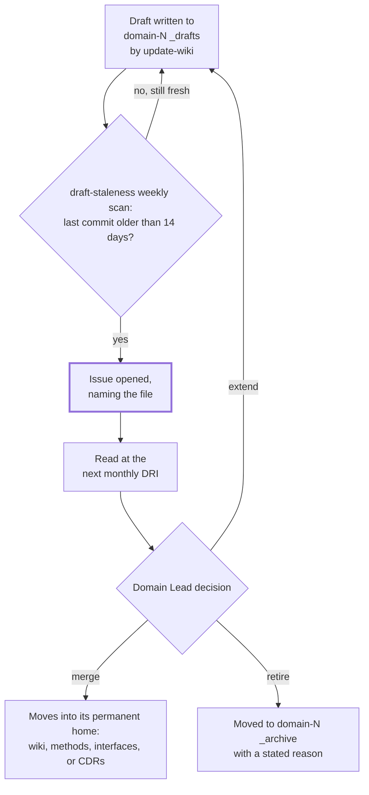

## 1. Intent

Work in progress needs a place to be imperfect, a clock that stops it from
silently accumulating, and finished work needs to point at where the live
thing actually is rather than a stale copy of it. The constraint this must
not violate: neither guarantee may depend on someone remembering to look.
A draft's age and a reference's currency must both be things the harness can
be asked about, not things only a diligent human happens to notice.

Three materially different solutions could satisfy this without being what
the harness ships: no separate holding area at all, where a decision or
insight is either committed to its permanent home immediately or lost when
the session ends; a fixed-cadence human review with no automated age
detection, where an Admin simply remembers to eyeball every domain's
provisional work once a month; or committing every external artefact
directly into Git and re-committing it whenever it changes, so there is
nothing to point at because there is nothing external left. The harness's
own answer (a `_drafts/` folder with a 14-day shelf life enforced by a
weekly scan, an `_archive/` folder for what does not survive review, and a
`references.md` naming external artefacts by owner and retention rather than
committing them) is one of several ways to meet the intent, which is what
keeps this an intent rather than a solution mandate.

## 2. Problem & evidence

Foundation's own `CLAUDE.md` states the job in one sentence, at its
"End-of-session ritual" section: "Run the `update-wiki` command at the end
of every working session. It drafts ADRs, CDRs, wiki entries, and method
updates into `_drafts/` (domain-level) or the relevant Foundation folder.
Drafts have a 14-day shelf life; the monthly DRI loop sweeps them."
`docs/concepts.md`'s "What lives where" table names the same home twice, for
two different kinds of provisional content: "Short-lived drafts (14-day
shelf life) | Domain `domain-N/_drafts/`" and, on the next row, "Pointers to
live external artefacts | Domain `domain-N/references.md`".

The obstacle is that a folder with a stated shelf life is not the same thing
as a shelf life anyone enforces. A draft that sits untouched for weeks looks
identical, from the file listing alone, to one still under active
discussion. Nothing about `_drafts/` itself distinguishes work nobody has
gotten to yet from work everybody has forgotten exists. The same gap
exists on the other side of the ritual: `FORMATS.md`'s "Out of Git —
referenced via `references.md`" table lists PowerPoint, dashboards, and
live-collaboration documents as artefacts the harness deliberately does not
commit, precisely because a committed binary copy would fork from whatever
the live version becomes. But a reference row itself can go stale in the
same quiet way a draft can, pointing at a dashboard nobody has opened in a
year with nothing to say so.

The consequence, in both cases, has the same shape as a check that can
never fail on its own terms: a folder or a column that carries a
documented age limit is not evidence anyone is watching that limit, unless
something executes the comparison and says so out loud.

## 3. Outcomes

- Every domain has a `_drafts/` folder scaffolded from the start, and a
  draft in it resolves to exactly one of three end-states: merged into its
  permanent home, retired to `_archive/`, or extended for another 14 days by
  the Domain Lead.
- A draft whose last commit is more than 14 days old is named, by file path,
  in a weekly-scanned issue an Admin reads at the next monthly DRI;
  detection does not wait on anyone opening the folder and looking.
- Every domain has a `_archive/` folder scaffolded from the start as the
  named destination for retired drafts and expired reference rows.
- Every domain's `references.md` names each external artefact it depends on
  with an owner, a retention period, and a last-verified date, rather than
  committing the artefact itself.
- An outgoing Admin hands the role over using a structured template naming
  open propagation actions, open drift-log items, and recent monthly-DRI
  history, so continuity does not depend on an unstructured conversation.

## 4. Non-goals

- The `update-wiki` command's own definition file, its invocation surface,
  and the drafting logic for the other artefact types it produces (ADRs,
  CDRs, wiki entries, method and prompt notes). That is PRD-12's territory;
  this PRD covers only the ritual's stated role in populating and clearing
  `_drafts/`.
- The `drift-check` command's own definition, invocation surface, and its
  checks unrelated to draft or reference staleness. That is also PRD-12's
  territory; this PRD cites its `_drafts/`- and `references.md`-related
  steps only.
- The two-tier glossary and the vocabulary workshop. That is PRD-08's
  territory.
- CDR and ADR template shapes, and the promotion and propagation flow that
  moves a decision between repositories. That is PRD-06's and PRD-07's
  territory; this PRD assumes a draft may become one of those artefacts but
  does not describe what either artefact contains.
- CODEOWNERS bindings and reviewer identity generally. That is PRD-03's
  territory; this PRD cites CODEOWNERS only to show which review routing a
  `_drafts/` or template change carries.
- The regeneration mechanics (Marp, python-pptx, Reveal.js/Slidev) for the
  built outputs a `references.md` row might eventually replace once a
  Markdown source exists. That is PRD-05's territory (its FR-05.5 names
  `references.md`'s own structure and staleness detection as this PRD's
  territory in turn); this PRD does not re-derive the build-deck pattern.

## 5. Solution sketch

A draft's life starts the moment a session ends: `update-wiki` writes it into
`domain-N/_drafts/` rather than committing it anywhere permanent, because the
whole point of the folder is to hold something not yet judged good enough,
or important enough, to merge. From there the folder needs a clock, because
nothing about a quiet directory tells anyone time has passed. `draft-staleness`
supplies that clock: a weekly scan reads each `_drafts/` file's own git
history (not filesystem mtime, which a checkout resets to zero every run)
and opens an issue naming any file whose last commit is more than 14 days
old. That issue feeds the Admin's monthly DRI close-out, where each named
draft resolves to one of three end-states.

The same session that produces a draft may also depend on something the
harness deliberately does not commit: a deck, a dashboard, a live document.
`references.md` is where that dependency is named instead: one row per
artefact, carrying an owner, a retention period, and a date it was last
confirmed to still be current. A row whose retention period expires moves to
`_archive/references-archived.md`, the same folder retired drafts move to,
and the row disappears from the live file.

Key rules:

- A draft's age is derived from the last commit that touched its path, not
  from filesystem timestamps: `actions/checkout` writes every file fresh on
  every run, so a filesystem-mtime comparison can never distinguish an old
  file from a new one.
- Every draft has exactly three end-states: merged, retired, or extended;
  none of the three is silent: a merge changes the draft's location, a
  retirement changes it too (to `_archive/`), and an extension is a Domain
  Lead's explicit decision to reset the clock, not an absence of one.
- `references.md` is a pointer, never a copy: the row names where the live
  artefact is, who owns it, and how long it is expected to stay relevant; it
  never contains the artefact's content.
- The 14-day clock and the reference-retention clock are two different
  timers on two different kinds of content, both landing in the same
  monthly DRI review as the point a human actually looks at what either
  clock has flagged.

Important states: a draft younger than 14 days (open, not yet due); a draft
past 14 days with no closing action (stale, named in an issue, awaiting a
Domain Lead's merge/retire/extend decision); a draft just extended (open
again, clock reset); a reference row within its stated retention period
(live); a reference row past retention (archived, row deleted from the live
file).

Alternatives rejected:

- **No separate holding area; commit only what is already finished.**
  Rejected because it discards exactly the provisional insight the
  end-of-session ritual exists to capture: a decision half-formed at the
  end of a session either gets forced into permanent shape prematurely, or
  is lost rather than revisited.
- **A fixed monthly review with no automated age detection.** Rejected for
  the same reason a manual promotion checklist was rejected elsewhere in
  this set: the sessions nobody remembers to check are exactly the ones a
  silent accumulation needs someone to.
- **Committing built outputs directly and re-committing them on every
  change.** Rejected because a binary artefact does not diff cleanly and a
  committed copy forks from whatever the live version becomes; the same
  reasoning `FORMATS.md`'s own out-of-Git table gives for every row in it.

## 6. Requirements

### FR-09.1 — `_drafts/` holds short-lived work with a 14-day shelf life, swept by the monthly DRI loop

Status: CONVENTION
Evidence: `organisationos-foundation/CLAUDE.md`, "End-of-session ritual":
"Run the `update-wiki` command at the end of every working session. It
drafts ADRs, CDRs, wiki entries, and method updates into `_drafts/`
(domain-level) or the relevant Foundation folder. Drafts have a 14-day shelf
life; the monthly DRI loop sweeps them." `docs/concepts.md` line 100:
"Short-lived drafts (14-day shelf life) | Domain `domain-N/_drafts/`".
`.claude/commands/update-wiki.md` line 31: "Drafts in `_drafts/` live 14
days. The `draft-staleness.yml` workflow surfaces drafts >14 days into the
monthly DRI issue." `organisationos-leadership/.github/ISSUE_TEMPLATE/monthly-dri.md`
line 15 carries the matching checklist row: "Accumulated drafts — any file
in `domain-*/_drafts/` >14 days (cross-check `draft-staleness.yml` reports);
decision per draft: merge, retire, or extend". Separately,
`.claude/commands/drift-check.md`'s per-domain checks (its own step 2) name
"`_drafts/` exists; any file >14 days flagged" as part of an Admin-invoked
report, cross-referenced here rather than described, since the command file
itself is PRD-12's territory.
`organisationos-domain/.github/CODEOWNERS` lines 17, 22, 27, 32 route each
domain's own `_drafts/` to that domain's own Lead placeholder, not a shared
owner. Confirmed present with `ls` on 2026-09-07: `_drafts/` exists under
all four domain folders, each holding only a `.gitkeep` (0 draft files) at
this reading.

Every domain's `_drafts/` folder MUST hold short-lived work under a 14-day
shelf life, with the monthly DRI loop as the point a human reviews what has
aged past it.

- The 14-day figure is stated identically across `CLAUDE.md`,
  `docs/concepts.md`, and `update-wiki.md`; no file in this PRD's evidence
  states a different number.
- The monthly DRI's own checklist template carries a matching line item
  naming `_drafts/` and the workflow that feeds it (FR-09.2), rather than
  the sweep being described in one place and unimplemented in the checklist
  itself.
- CODEOWNERS routes each domain's `_drafts/` to that domain's own Lead, the
  same domain-scoped-review shape FR-09.3's `_archive/` and FR-09.4's
  `references.md` carry.
- Nothing in this requirement's evidence enforces the shelf life itself:
  detection is FR-09.2's territory, and the sweep is a human act at the
  monthly DRI, not a merge-blocking check.

### FR-09.2 — `draft-staleness` detects drafts past shelf life weekly

Status: SHIPPED
Evidence: `organisationos-foundation/.github/workflows/draft-staleness.yml`.
Its `on.schedule` block carries a nine-line comment (lines 5-13) explaining
why the cron lives here at all: "Runs weekly on Monday at 09:00 UTC; the
monthly DRI issue (1st of month) reads its output." then, after a blank
comment line, "Foundation has no `_drafts/` of its own, so this run always
reports clean — and Leadership's identical cron was removed for exactly
that reason. It is kept HERE deliberately: Actions is enabled only in
Foundation, so this is the one place the detector executes at all. It is
the live smoke test that this workflow still runs green after the
git-history rewrite, which matters precisely because the detector it
replaced could never fire anywhere. The callers in Domain set their own
schedule; this trigger does not affect them."

The "detector it replaced" is verifiable in the file's own history:
`git log --oneline` for this path shows commit `45ad914`, "fix(ci): detect
draft staleness from git history, not checkout mtime (C4)", 2026-08-24,
whose message states directly: "find -path '*/_drafts/*' -mtime +14 could
never fire: actions/checkout@v4 writes every file fresh, so mtime is
always ~0." The pre-fix line it replaced, from that commit's own diff:
`stale=$(find . -path '*/_drafts/*' -type f -mtime +14 -not -name
'.gitkeep' || true)`: a filesystem-mtime comparison against a checkout that
resets every file's mtime on every run, structurally unable to ever match,
in any repository, on any run, the same shape of defect as a check that
can never fail regardless of what it is checking. The current step, "Find
drafts older than 14 days" (line 28), instead computes `cutoff=$(date -u -d
'14 days ago' +%s)` and compares it against each file's `git log -1
--format=%ct` value, walking every file under any `_drafts/` path
(`find . -path '*/_drafts/*' -type f -not -name '.gitkeep'`, line 41).

`gh api repos/2SSilver/organisationos-foundation/actions/workflows` (checked
2026-09-07 ~12:18 UTC) shows this workflow's id as `338581050`. Its run
history (`.../workflows/338581050/runs`, same reading) shows exactly two
recorded runs, both `event: schedule`, both `conclusion: success`:
`33416134921` (2026-08-31T16:48:29Z) and `32713615917` (2026-08-24T09:49:48Z).
`gh run view 33416134921 --repo 2SSilver/organisationos-foundation --log`
shows the scan step's actual output line: "No stale drafts." This is
consistent with the comment's own admission that Foundation has no `_drafts/` folder
to find anything stale in (confirmed with `find`: zero `_drafts/` directories
under Foundation). Both green runs prove the workflow executes on schedule;
neither proves the comparison logic can distinguish a stale draft from a
fresh one, since neither run had any draft to compare.

Domain's caller (`organisationos-domain/.github/workflows/draft-staleness.yml`)
carries its own weekly `schedule: - cron: '0 9 * * 1'` alongside
`workflow_dispatch`; Leadership's caller
(`organisationos-leadership/.github/workflows/draft-staleness.yml`) carries
`workflow_dispatch` only, matching the comment's claim that "Leadership's
identical cron was removed for exactly that reason." Domain's Actions are
disabled at the repository
level (`gh api repos/2SSilver/organisationos-domain/actions/permissions` →
`enabled: false`, checked 2026-09-07 ~12:19 UTC) and its `<adopter-org>`
reference is unresolvable as shipped, the same two independent obstacles
FR-07.1 and FR-08.2 record for sibling callers; Domain's own run history for
this workflow (`gh api .../actions/workflows/338581280/runs`, same reading)
shows exactly one recorded run, `32367700427`, `event: push`,
`conclusion: failure`, `2026-08-20T12:13:10Z`, with zero jobs
(`.../runs/32367700427/jobs` → `total_count: 0`): a registration failure,
not an execution of the workflow's own declared triggers. Leadership's run
history (`.../workflows/338581492/runs`) shows the identical single
push-failure shape, `32367727987`, same date, zero jobs implied by the same
pattern. No `pull_request`-, `schedule`-, or `workflow_call`-triggered run of
this workflow has ever produced a real comparison against a populated
`_drafts/` folder on any of the three published repositories.

Verified: the "Find drafts older than 14 days" step's `run:` block (lines
30-68), extracted verbatim (confirmed against the source file with
`grep -F` on its `cutoff=` and `find .` lines, both exact matches) and run
in a scratch git repository seeded with a `domain-1/_drafts/` folder holding
two files: one committed `2026-08-01` (37 days before the 2026-09-07 run
date) and one committed `2026-09-06` (1 day before). Substituting `gdate`
for `date` (this host's native `date` lacks `-d`, the same substitution
PRD-07's FR-07.4 and FR-08.2 recorded for the same reason), the extracted
step reported `result=stale`, naming only
`./domain-1/_drafts/wiki-old-topic.md`; the 2026-09-06 file was correctly
excluded. Run again against a second scratch repository holding only the
2026-09-06 file, it reported `result=clean`. `gdate -u -d '14 days ago'
+%Y-%m-%d`, run 2026-09-07, computed the cutoff as `2026-08-24`, consistent
with both results (the 2026-08-01 commit predates the cutoff; the
2026-09-06 commit postdates it).

The system MUST scan every `_drafts/` file weekly and flag, by path, any
whose last commit is more than 14 days old.

- Given a `_drafts/` file last committed 37 days before the run date
  When the weekly scan runs
  Then it is named as stale, reproduced locally against a cutoff derived as
    14 days before the run date
- Given a `_drafts/` file last committed 1 day before the run date
  When the weekly scan runs
  Then it is not flagged
- Given a repository with no `_drafts/` folder at all (Foundation's own
  case)
  When the weekly scan runs
  Then it reports clean, the actual shape of both live runs this
    requirement's evidence names
- The predecessor detector this workflow replaced used filesystem mtime
  against a checkout that resets every file's mtime on every run, and could
  therefore never fire on any repository; this is recorded as history in the
  workflow's own comment and commit message, not as a defect open today
- No `pull_request`-, `schedule`-, or `workflow_call`-triggered run of this
  workflow has ever executed against a populated `_drafts/` folder on any of
  the three published repositories; the two live runs this requirement's
  spec-level evidence would otherwise cite are both green-by-construction

### FR-09.3 — `_archive/` holds closed work, per domain

Status: CONVENTION
Evidence: `organisationos-foundation/.github/workflows/back-flow-rules.yml`'s
own comment (surrounding line 35) lists the pre-created scaffolding
literally: "`domain-1/` ships `_archive _drafts adrs CLAUDE.md glossary.md
README.md references.md`". `.claude/commands/update-wiki.md` line 32 names
one of a draft's three end-states as "**retired** (moved to `_archive/`
with reason)". `.github/workflows/draft-staleness.yml`'s issue body repeats
the same three end-states, including "**retired** (moved to `_archive/`)".
`.claude/commands/drift-check.md`'s per-domain checks (step 2) list
"`_archive/` exists" as a bare presence check, with no age or content rule
attached, the only automated-report mention of the folder that is not
about what moves into it. `standards/templates/references-template.md`
names a second use for the same folder: "When `Retention` expires, the row
is moved to `_archive/references-archived.md` and the row in this file is
deleted." Confirmed present with `ls` on 2026-09-07: `_archive/` exists
under all four domain folders in `organisationos-domain`, each holding only
a `.gitkeep`.

Notably, `docs/concepts.md`'s "What lives where" table (the canonical
what-lives-where mapping FR-01.4 establishes) names `_drafts/` and
`references.md` as rows but carries no row naming `_archive/` itself; the
folder is the documented destination several other artefacts point at
(retired drafts, expired reference rows) without being, itself, a named
artefact type in that table.

Every domain MUST provide an `_archive/` folder as the destination for
retired drafts and expired reference rows.

- The folder is pre-created scaffolding in every domain, named explicitly in
  `back-flow-rules.yml`'s own comment rather than left to an adopter to
  create.
- Two different sources point content at it for two different reasons:
  `update-wiki.md` and `draft-staleness.yml` for a retired draft,
  `references-template.md` for an expired reference row.
- `drift-check`'s report checks only that the folder exists, not what is in
  it or how it got there; nothing in this PRD's evidence verifies that a
  retired draft or an expired reference row actually reaches `_archive/`
  rather than being deleted outright.
- The folder is not itself named as an artefact type in `concepts.md`'s
  what-lives-where table, though two other rows in that table (short-lived
  drafts, reference pointers) document it as their eventual destination.

### FR-09.4 — `references.md` per domain points at live external artefacts instead of committing them

Status: SHIPPED
Evidence: `organisationos-foundation/FORMATS.md`, "Out of Git — referenced
via `references.md`" (heading, line 27): rows for Excel with macros or live
data, PowerPoint/Keynote ("Built from Markdown via the build-deck pattern"),
interactive dashboards ("the artefact is the URL"), long video/podcast/audio
("reference and timestamp in `references.md`"), and live drafting or wiki
documents. `standards/templates/references-template.md` (line 5): "The
Admin verifies the `Last verified` column at the monthly DRI review (see
`.github/ISSUE_TEMPLATE/monthly-dri.md`)." The template's own row format
names five columns (Title, URL, Owner, Retention, Last verified), a
"Retention policy (adopter-defined)" section with four worked examples, and
a "Splitting this file (append-hotspot option)" section for domains with
heavy external-artefact traffic.

The four domain copies are not uniform. `diff` confirms `domain-2/references.md`,
`domain-3/references.md`, and `domain-4/references.md` are identical to each
other apart from the domain-number substitution in their title line alone.
`domain-1/references.md` differs from those three in two further respects:
its opening paragraph carries one extra sentence the other three omit,
appended directly after the shared first sentence: "The Admin verifies the
`Last verified` column at the monthly DRI review." Its splitting-option
pointer also differs: `domain-1` reads "see the splitting option in
`references-template.md`", where the other three read "see the splitting
option in the Foundation `references-template.md`" (the word "Foundation"
present in three copies, absent in `domain-1`'s). All four are otherwise
identical: the same
five-column empty table header and the same "Retention policy" pointer
sentence.

Separately, `organisationos-leadership/.github/ISSUE_TEMPLATE/monthly-dri.md`
(the file `references-template.md` line 5 cites by name) carries no
checklist line naming `references.md` or a "Last verified" check anywhere
in its eleven checklist rows (confirmed: zero matches for `references` as a
whole word across lines 11-21; the one match for the substring, line 12's
"no quarterly active-references update", is about interfaces, not domain
`references.md`). The mechanism that does perform a Last-verified check is a
different file entirely: `.claude/commands/drift-check.md`'s per-domain step
2 states "`references.md` exists; last-verified column in the references
table is not >90 days old." Its report template's worked output line
repeats it: "references.md last-verified: NNN days ago (cap: 90)". That
command is an Admin-invoked report tool, not automated CI, and is PRD-12's
territory; it is cited here only because it is the actual mechanism behind
the verification `references-template.md` attributes to a different,
non-matching file.

`organisationos-domain/.github/CODEOWNERS` carries no path entry naming
`references.md` specifically; each domain's `references.md` falls under
that domain's own root-anchored catch-all (lines 15, 20, 25, 30), routed to
that domain's own Lead placeholder, the same routing FR-09.1's `_drafts/`
and FR-09.3's `_archive/` receive.

The harness MUST provide each domain a `references.md` naming external
artefacts it depends on, by owner and retention period, in place of
committing those artefacts.

- `FORMATS.md`'s out-of-Git table and the template's own row format agree on
  what a reference row names: title, URL, owner, retention, and a
  last-verified date.
- All four domain copies carry the same five-column empty table and the
  same retention-policy pointer; `domain-1`'s copy carries two additional
  differences from the other three (an extra sentence, one word present or
  absent in a cross-reference), a real inconsistency across the four
  domains' scaffolding rather than a claim that all four match, in the same
  vein PRD-08 records for the glossary and README scaffolding.
- The template's own citation for who verifies the Last-verified column
  points at a checklist file that does not itself carry a matching line
  item; the check that does exist lives in a different command's report
  format, not automated CI, and is not itself named by the template's
  citation.
- No workflow in this PRD's evidence scans `references.md` for a Last-
  verified date past its retention period; the only mechanism that reads
  that column at all is the on-demand `drift-check` report.

### FR-09.5 — Handover template for role transitions

Status: SHIPPED
Evidence: `organisationos-foundation/standards/templates/handover-template.md`.
Seven numbered sections plus a signed block: "1. Open items at handover"
(a propagation-log and drift-log snapshot with explicit counts); "2. Last 3
monthly DRI summaries" (three linked entries); "3. Pending improvement-loop
proposals" (a checklist of unmerged PRs); "4. Plugin / MCP version state";
"5. Banned-pattern list — recent additions"; "6. Cross-domain stewardship
state (at scale)"; "7. Pair-session checklist" (a five-item checklist ending
"Outgoing Admin's contact retained for two follow-up cycles"). The closing
"Signed" block names three roles: outgoing Admin, incoming Admin, and a
Leader acknowledgement, each with a handle and a date.
`.claude/commands/onboard.md` line 60 wires it into the Admin's own
onboarding path: "**Admin:** Pair with the outgoing Admin if there is one
(use `handover-template.md`). Read the last three monthly DRI close-outs and
the full drift log." `organisationos-foundation/.github/CODEOWNERS` line 59
routes `/standards/templates/` (the folder this file lives in) to
`@placeholder-leader @placeholder-admin`.

The harness MUST provide a structured template naming open propagation
actions, open drift-log items, recent DRI history, and a pairing checklist,
for use at every Admin role transition.

- The template's seven sections name every category FR-09 depends on
  elsewhere in this PRD set for handover continuity: propagation-log state
  (PRD-07's territory), drift-log state, and monthly DRI history (both this
  PRD's own FR-09.1).
- `onboard.md`'s own Admin onboarding path names this template by its exact
  filename as the pairing artefact to use, rather than leaving handover
  content undocumented.
- Nothing in this PRD's evidence checks that a handover actually happened,
  or that a filled-in copy of this template exists for any real transition;
  the template's existence and its wiring into `onboard.md` are what this
  requirement's evidence establishes.

### FR-09.6 — End-of-session ritual runs `update-wiki`, drafts only, never commits

Status: CONVENTION
Evidence: `.claude/commands/update-wiki.md` frontmatter (line 2):
"End-of-session ritual. Review the session and draft ADRs, CDRs, wiki
updates, method revisions to `_drafts/`. Drafts only — never commits."
`organisationos-foundation/CLAUDE.md`'s "End-of-session ritual" section
states the same mandate repo-wide, quoted in full under FR-09.1. The
command's own "Critical rules" section (line 30) restates the constraint
this requirement is about: "**Do NOT commit any of the above autonomously.**
Surface a list of drafts for the operator to review." The command file
itself, its invocation surface, and its drafting logic for each artefact
type are PRD-12's territory; this PRD's interest is the ritual's stated
role at the seam between a session ending and `_drafts/` gaining content:
the seam FR-09.1's shelf life and FR-09.2's scan both act on downstream.

The same file's "Low-ceremony merge path" section (line 36) contains a
claim worth recording, since it bears directly on how a draft this PRD
governs is expected to merge: "branch protection has
`require-code-owner-review` off on `domain-N/_drafts/`, so it merges on
proposer + green CI without waiting on a blocking review." `docs/setup-org.md`
line 116 (already the evidence PRD-08's FR-08.1 cites for the identical
point) states plainly that no such per-path branch-protection setting can
exist at all: "GitHub branch protection is per-branch, not per-path, so it
cannot express that distinction natively."
`update-wiki.md`'s own paragraph describes a `require-code-owner-review`
toggle scoped to `domain-N/_drafts/` that `setup-org.md` says GitHub cannot
express: a repo-internal inconsistency inside the command's own file, not
a claim this PRD is positioned to resolve, since the file itself is PRD-12's
territory. It is recorded here rather than corrected, because it names the
exact merge path a stale-but-not-yet-swept draft would take.

The harness MUST run an end-of-session ritual that drafts candidate ADRs,
CDRs, wiki entries, and method or prompt notes into `_drafts/` without
committing any of them, leaving the operator to decide what merges.

- The command's own frontmatter and its "Critical rules" section both state
  the never-commits constraint directly; nothing in this PRD's evidence
  contradicts it.
- Nothing in this PRD's evidence enforces that an operator actually runs
  `update-wiki` at the end of a session; the ritual is a documented
  convention, not a check any CI workflow in this PRD's evidence performs.
- The command's own file contains a self-contradiction, recorded above,
  about how a `_drafts/` PR merges; this PRD records the contradiction
  because it touches the draft merge path FR-09.1 governs, without
  attempting to resolve which of the two accounts is correct.

## 7. Dependencies & constraints

- **PRD-01 (repo topology)** owns the what-lives-where mapping (FR-01.4)
  this PRD's `_drafts/`, `_archive/`, and `references.md` rows all draw
  from; FR-09.1, FR-09.3, and FR-09.4 each cite specific rows from that
  table rather than restating the table's existence.
- **PRD-05 (format policy)** owns the format whitelist and the build-deck
  regeneration pattern; its own FR-05.5 names `references.md`'s own
  structure and staleness detection as this PRD's territory, which FR-09.4
  fulfils, consuming FR-05.5's built-outputs-are-referenced rule rather than
  re-deriving it.
- **PRD-12 (not yet written)** owns the `update-wiki` and `drift-check`
  command files themselves: their invocation surface, model bindings, and
  drafting or reporting logic for artefact types outside this PRD's scope.
  FR-09.1, FR-09.4, and FR-09.6 each cite one of those commands' stated role
  in the draft or reference lifecycle without describing the files
  themselves.
- **PRD-07 (promotion & propagation flow)** owns the propagation log FR-09.5's
  handover template snapshots; this PRD cites that snapshot only as one
  section of the handover template's own structure.
- **PRD-08 (glossary & terminology)** records the same four-domains-are-not-
  uniform pattern this PRD's FR-09.4 finds in the domain `references.md`
  copies, for the glossary and README scaffolding instead; cited here as a
  precedent for the finding's shape, not re-derived.
- **PRD-03 (role model)** owns CODEOWNERS bindings and reviewer identity
  generally; this PRD cites CODEOWNERS only to show that `_drafts/`,
  `_archive/`, and `references.md` all route to a domain's own Lead rather
  than a shared owner.
- **External constraint — no branch protection on any of the three
  reference repositories.** `gh api repos/2SSilver/organisationos-foundation/branches/main/protection`,
  the same call against `organisationos-domain`, and against
  `organisationos-leadership`, each return `404`, a point-in-time reading
  checked 2026-09-07 ~12:19 UTC; the same finding PRD-07's and PRD-08's own
  section 7 record for their own requirements. FR-09.6's recorded
  self-contradiction about a `require-code-owner-review` toggle on
  `domain-N/_drafts/` is moot in practice regardless of which account is
  correct: no branch protection of any kind currently exists on any of the
  three repositories to enforce either version.
- **External constraint — the `<adopter-org>` placeholder makes Domain's and
  Leadership's `draft-staleness.yml` callers unresolvable as shipped.** Both
  are `uses: <adopter-org>/organisationos-foundation/.github/workflows/draft-staleness.yml@v1`
  callers; until an adopter substitutes a real organisation name, GitHub
  cannot resolve either reference, the same constraint FR-07.1, FR-07.4, and
  FR-08.2 record for sibling callers.
- **External constraint — Domain's and Leadership's Actions are both
  disabled at the repository level, independent of the placeholder above.**
  `gh api repos/2SSilver/organisationos-domain/actions/permissions` and the
  same call against `organisationos-leadership`, checked 2026-09-07 ~12:19
  UTC, both return `enabled: false`; Foundation's own reading in the same
  window returns `enabled: true`. This is why Foundation is, in the
  workflow's own words, "the one place the detector executes at all."

## 8. Known gaps & open questions

- **GAP — nothing automated checks a `references.md` row's Last-verified
  date against its stated retention period.** FR-09.4 records this
  directly: the only mechanism that reads that column at all is the
  on-demand `drift-check` report (PRD-12's territory), and the checklist
  file `references-template.md` itself cites for this verification carries
  no matching line item.
- **GAP — nothing verifies that a retired draft or an expired reference row
  actually reaches `_archive/`.** FR-09.3 records this: `drift-check`
  confirms the folder exists, not what has been moved into it or when.
- **Open question — should `_archive/` be a named row in `docs/concepts.md`'s
  what-lives-where table?** FR-09.3 records that two other rows in that
  table point at `_archive/` as their eventual destination without the
  folder itself appearing as a row.
- **Open question — `update-wiki.md`'s own account of how a `_drafts/` PR
  merges.** FR-09.6 records the contradiction between its
  "Low-ceremony merge path" section and `setup-org.md`'s admission that
  GitHub branch protection cannot express a per-path exception at all. No
  branch protection currently exists on any of the three repositories
  (section 7), so the contradiction has no live consequence today, but it
  would need resolving before an adopter turned branch protection on.
- **Open question — whether the four domains' `references.md` copies should
  be made uniform.** FR-09.4 records `domain-1`'s two small deviations from
  the other three; this is placeholder scaffolding, not live adopter
  content, but as shipped the four domains do not read alike, the same
  open question PRD-08 records for the glossary and README scaffolding.

## 9. Rebuild guide

This section assumes PRD-01's repositories and PRD-05's format whitelist
already exist. It produces the state PRD-09 alone is responsible for: the
`_drafts/` and `_archive/` scaffolding and its weekly staleness scan, each
domain's `references.md`, and the Admin handover template.

1. In each Domain folder, create `_drafts/` and `_archive/` with a
   `.gitkeep` each, so both exist from the domain's first commit rather
   than being created ad hoc the first time someone needs them.
2. Write `draft-staleness.yml` as a reusable workflow in Foundation
   (`on: schedule`, `workflow_dispatch`, and `workflow_call` all three, as
   shipped): checkout with `fetch-depth: 0` (a shallow clone makes
   `git log` for an individual path unreliable), then compare each
   `_drafts/` file's last-commit timestamp (not filesystem mtime, which a
   fresh checkout always resets) against a 14-day cutoff, and open an
   issue naming any file past it.
3. In Domain, write a short caller carrying its own weekly `schedule` and
   `issues: write` permission (the reusable opens an issue, not a comment).
   In Leadership, write the same caller but decide deliberately whether to
   give it its own schedule: this PRD's evidence shows Leadership's cron was
   removed once it became clear it could add nothing, since it has no
   `_drafts/` of its own that this workflow could ever compare against.
   Keep a copy of the reusable running on Foundation's own schedule too, if
   you want a live smoke test that the comparison logic still runs green
   after a future change, understanding that a green run there means only
   that Foundation still has no drafts to compare, not that the comparison
   itself was exercised.
4. In Foundation, write `standards/templates/references-template.md` naming
   five columns (title, URL, owner, retention, last verified), a worked
   retention-policy section, and the append-hotspot splitting option for
   domains with heavy external-artefact traffic.
5. In each Domain folder, write a `references.md` from that template, kept
   empty until an adopter's first external dependency is named. Decide
   deliberately what actually re-checks the Last-verified column: this
   PRD's evidence shows the shipped version relies on an on-demand report
   command rather than any scheduled check, and the checklist file the
   template itself points to does not carry a matching line item.
6. In Foundation, write `standards/templates/handover-template.md` with the
   seven sections this PRD's FR-09.5 lists, and wire it into the Admin's own
   onboarding path as the artefact an outgoing and incoming Admin pair
   around.
7. Route each domain's `_drafts/`, `_archive/`, and `references.md` to that
   domain's own Lead in CODEOWNERS, and `standards/templates/` to a
   Leader-plus-Admin pair in Foundation, understanding today that neither
   routing is enforced by any branch protection on the published
   repositories.

After this PRD alone: a domain has somewhere to put work that is not yet
ready to be permanent, a weekly scan names anything left there past its
shelf life, and an external dependency is named rather than copied into
Git. What stays broken until later work closes it: nothing automatically
re-checks a reference row's own currency, nothing confirms a retired draft
or expired reference actually reaches `_archive/`, and the command that
populates `_drafts/` in the first place is not itself covered here; this
PRD covers only its stated role at the seam it governs.

## 10. Provenance & verification

Files specified by this PRD (`specifies:` above) were confirmed present with
`ls` on 2026-09-07; all nine resolved without error. Last-touched commits
(`git log -1 --format="%H %ad" --date=short -- <path>`, run 2026-09-07):
Foundation's `draft-staleness.yml`, `references-template.md`, and
`update-wiki.md` all at `adc560a`, 2026-08-26; Foundation's
`handover-template.md` at `bd3263d`, 2026-08-24; Domain's
`draft-staleness.yml` at `3e9d445`, 2026-08-24; Domain's `domain-1/references.md`
through `domain-4/references.md` all at `5acd566`, 2026-08-26; Leadership's
`draft-staleness.yml` at `68ae9ca`, 2026-08-24. Foundation tag `v1.1.2`
resolves to `d70bafc`, 2026-09-02 (`git log -1` against the tag), the same
commit `v1` resolves to.

**Method.** FR-09.1, FR-09.3, FR-09.4, FR-09.5, and FR-09.6 (`CONVENTION`
and `SHIPPED`) were verified by reading each cited file at its cited
section, on 2026-09-07, against Foundation tag `v1.1.2`, plus the `diff`
comparisons FR-09.4 records directly in its own evidence block. FR-09.2
(`SHIPPED`) was verified by extracting `draft-staleness.yml`'s own "Find
drafts older than 14 days" step verbatim and executing it in two scratch
git repositories (one seeded with a 37-day-old and a 1-day-old `_drafts/`
file, one with only the 1-day-old file), per the evidence bar in the PRD
template's section 3.5. Both directions are reproduced in section 6's own
evidence block above; it is recorded `SHIPPED` rather than `ENFORCED`
because, unlike FR-07.4 and FR-08.2's comparable extractions, no locus in
this PRD's evidence has ever exercised the comparison logic against a
populated `_drafts/` folder on any of the three published repositories:
both live runs this requirement's own evidence names are green-by-
construction against a repository with no `_drafts/` folder at all, which is
a weaker locus than the scratch execution itself, not a stronger one. The
scratch execution demonstrates the logic behaves correctly; it does not
establish that this specific logic, as opposed to the extracted copy, has
ever produced that verdict anywhere the workstream can point to as a
locus independent of this PRD's own verification.

Live GitHub state (workflow run history and Actions-permissions state)
was read via `gh api` against the published repositories directly: run
histories for `draft-staleness.yml` on all three repositories, and
Actions-permissions state for all three, all read within the 2026-09-07
~12:18-12:19 UTC window recorded in section 6 and section 7. Branch-
protection absence on all three repositories was read in the same window.
None of these calls write to a live repository.

**Limits.** The scratch verification for FR-09.2 substitutes `gdate` for
`date` (this host's native `date` lacks `-d`; the workflow's own
`ubuntu-latest` runner uses GNU date), the same substitution PRD-07's
FR-07.4 and PRD-08's FR-08.2 disclosed for the identical reason. It supplies
two hand-created scratch git repositories rather than an actual
`actions/checkout@v4` with `fetch-depth: 0`; the checkout mechanics
themselves, and the shallow-clone risk the workflow's own comment names,
were not exercised. It supplies `$GITHUB_OUTPUT` as a hand-created file
rather than a value the Actions runner provides. Only the "Find drafts older
than 14 days" step was extracted and run: the workflow's second step, which
posts the actual staleness-report issue via `actions/github-script`, was
not exercised at all: this verification establishes that the comparison
logic produces the correct `result` value, not that an issue is ever
actually opened from it. No live GitHub Actions run of this workflow has
ever compared against a populated `_drafts/` folder on any of the three
published repositories, for the reasons section 6 and section 7 both
record: Foundation has none to compare, and Domain's and Leadership's
callers have never executed past a push-triggered registration failure.

A re-verifier reproducing the scratch result needs only the "Find drafts
older than 14 days" step's own `run:` block (section 6), two scratch git
repositories seeded with `_drafts/` files of the ages described there, and
the three substitutions this Limits paragraph discloses (`gdate` in place
of `date`, hand-created git repositories in place of an Actions checkout,
hand-created `$GITHUB_OUTPUT`), not GitHub access; a re-verifier checking
the `gh api` findings needs only public read access to the three
repositories.
