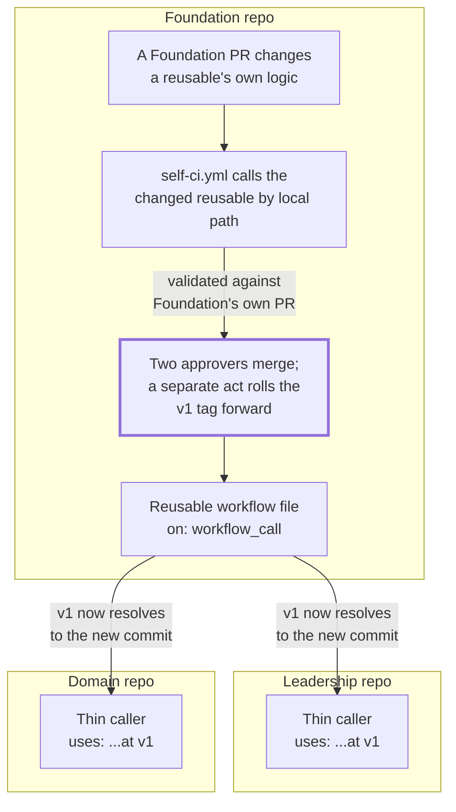

## 1. Intent

A rule that guards every domain and the Leadership repo needs to be written
once and versioned once, so fixing it fixes it everywhere, at a version each
caller chose rather than one that changes underfoot the moment its source is
edited. The constraint this must not violate: a caller's own governance,
meaning who approved bumping to a newer version and when, stays with the
caller, not with whoever last touched the shared logic.

Three materially different solutions could satisfy this without being what
the harness ships: the same YAML copy-pasted by hand into every repository,
updated in three places whenever a rule changes and left to drift the moment
one copy is missed; a single monorepo where every check runs against the
same working tree, so there is no cross-repository call to version at all;
or every caller resolving the shared logic's default branch directly, with
no pin and no version boundary, so a change lands in every repository the
instant it merges, before anyone downstream has reviewed it. The harness's
own answer is a `workflow_call` reusable living once in Foundation, called
by local path when Foundation is its own caller and by a pinned tag
everywhere else, with the tag rolled forward only by a deliberate, reviewed
Foundation PR. It is one of several ways to meet the intent, which is what
keeps this an intent rather than a solution mandate.

## 2. Problem & evidence

`organisationos-foundation/README.md`'s own file-layout table states the
pattern directly: "Reusable (`workflow_call`) CI called by Leadership and
Domain, pinned at `@v1`." Its directory-tree comment names the one exception in the same breath, on
the line naming the `workflows/` folder itself: "reusable CI + self-ci.yml
(runs them on Foundation's own PRs)." A reusable workflow has no caller of
its own inside
the repository that defines it: without a second file calling it, Foundation
could ship every check it wants Leadership and Domain to run and never run
one of them against its own pull requests.

The obstacle is that a delivery mechanism spanning three repositories has
three separate ways to fail silently. First, a freshly created Foundation
carries none of the tag history a pinned caller expects: `gh repo create
--template` does not copy tags, and `docs/setup-org.md`'s own ten numbered
steps (from creating the three repositories, Step 1, through installing a
pre-commit hook, Step 9, and setting up a person, Step 10) never once
instruct creating one. The only tag-related instruction in the document
appears after Step 10, in "Afterwards", and it assumes the tag already
exists: "When Foundation's workflows change, roll the `v1` tag forward in a
Foundation PR (two approvers) — callers pick the change up on their next
run." A literal reading of the setup guide leaves every `@v1` caller in
Leadership and Domain unresolvable on its first run. Second, Leadership and
Domain ship with Actions disabled until an adopter substitutes the
`<adopter-org>` placeholder every cross-repo caller carries; `docs/setup-org.md`
names the reason directly: "Actions are disabled on the published Leadership
and Domain templates precisely because Step 3 has not run on them." Every
caller in both repositories failed identically, at repository-creation time,
before any adopter had a chance to substitute anything. Third, a workflow
that has genuinely never been observed running is not the same failure mode
as one that runs and reports green without reaching the logic it claims to
guard, a distinction this harness's own history has produced more than
once, and one this PRD's evidence treats as materially different every time
it appears.

The consequence, across all three, is the same shape: a delivery mechanism
that looks uniform from its own documentation can carry a different
execution reality in each of the three repositories it spans, and only
mining what has actually run, rather than reading what the workflow files
say they do, surfaces which is which.

## 3. Outcomes

- A shared check's logic exists in exactly one file, in Foundation; fixing
  a defect in it is a single edit, not three.
- Foundation validates a change to its own reusable logic against its own
  pull requests, through `self-ci.yml`, before any other repository's caller
  ever resolves the new commit.
- Leadership and Domain pick up a Foundation change only when the `v1` tag
  is deliberately rolled forward by a two-approver Foundation pull request,
  not the moment the underlying change merges to Foundation's own default
  branch.
- The label taxonomy is the one deliberate exception to the call-by-reference
  pattern: each repository carries its own full copy of the sync logic and
  applies it to its own labels, rather than calling out to Foundation.
- Where Actions are disabled (Leadership and Domain, until an adopter
  substitutes the placeholder), no caller in either repository executes at
  all; only Foundation's own `self-ci.yml` runs against real pull requests
  today.

## 4. Non-goals

- What each individual check actually verifies: confidentiality, format,
  structure, staleness, promotion. Those are PRD-04's, PRD-05's, PRD-11's,
  PRD-07's, and PRD-09's territory in turn; this PRD covers only the
  mechanism that delivers a check's logic from Foundation to a caller, not
  the logic itself.
- CODEOWNERS bindings, reviewer identity, and whether branch protection
  requires a check to pass before merge. That is PRD-03's territory; this
  PRD cites the absence of branch protection only as it bears on whether a
  red CI run can ever block a Foundation merge (section 8).
- The label taxonomy's own content: which labels exist and why. This PRD
  covers only the mechanism that applies `.github/labels.yml` to a
  repository, not the taxonomy itself.
- The specific two-checkout caller shape Domain's own structural and
  glossary checks use, and the content of any individual structural check.
  That is PRD-11's territory; this PRD's job enumeration for `self-ci.yml`
  names those checks only to show which are and are not wired into it.
- The PR-template Approval-checklist content itself, and which paths carry
  the six-owner CODEOWNERS superset that makes a PR "cross-domain" for its
  purposes. This PRD cites `checklist-complete` only as one of `self-ci.yml`'s
  own jobs, not as a description of CODEOWNERS' shape (PRD-03's territory).

## 5. Solution sketch

A shared check's logic lives in exactly one file: a `workflow_call` reusable
in Foundation's own `.github/workflows/`. Foundation calls its own reusables
by local path (`uses: ./.github/workflows/<name>.yml`) because the
reusable and its caller share a repository; there is no cross-repository
version to pin. Leadership and Domain call the same reusables by a pinned
tag instead (`uses: <adopter-org>/organisationos-foundation/.github/workflows/<name>.yml@v1`)
because they are calling out across a repository boundary, and a caller
in that position needs to choose when it accepts a change rather than
inheriting one the moment it merges upstream.

The primary flow starts with a change to a reusable's own logic, proposed as
a Foundation pull request. `self-ci.yml` is Foundation's own caller: it has
no logic of its own beyond a small number of Foundation-only integrity jobs,
and instead calls every reusable the harness ships (with named exceptions,
enumerated in FR-10.3) by local path, on every Foundation pull request. That
gives Foundation's own PRs the same coverage Leadership's and Domain's
pinned callers get, and validates the change against Foundation's own tree
before anyone downstream ever sees it. Once the PR is reviewed by two
approvers and merged, a second, deliberate act, rolling the `v1` tag
forward to the new commit, is what makes the change visible to Leadership
and Domain at all: merging to Foundation's own default branch does not move
the tag by itself. A caller's next run resolves `@v1` fresh and picks up
whatever commit the tag currently names.

Key rules:

- A reusable's logic and its Foundation-local caller (`self-ci.yml`) live in
  the same commit, so a Foundation PR that changes the logic and the CI run
  that validates it are never out of sync.
- A pinned caller in Leadership or Domain resolves `@v1` at the moment its
  own trigger fires, not at the moment the tag last moved, so a caller that
  has not run since the tag rolled forward still picks up the new commit on
  its very next trigger, with no caller-side action required.
- Rolling the tag is a distinct, deliberate act from merging the underlying
  change: the same two-approver review gate that reviews a reusable's logic
  does not, by itself, decide when that logic reaches Leadership or Domain.
- The label taxonomy does not follow this pattern at all: `label-sync`'s
  logic is duplicated in full in every repository and applied to that
  repository's own `labels.yml`, run manually rather than triggered by a
  pull request.

Important states: a reusable's logic before a Foundation PR changes it
(stable, every pinned caller unaffected); the same PR open and running
against `self-ci.yml` (validated, not yet reachable by any pinned caller);
the PR merged but the `v1` tag not yet rolled (changed in Foundation,
invisible everywhere else); the tag rolled forward (reachable by every
pinned caller on its next trigger); a caller repository with Actions
disabled (unreachable regardless of tag state, since no trigger ever fires).

Alternatives rejected:

- **The same YAML copy-pasted into every repository, no shared source.**
  This is not hypothetical: it is what `label-sync` itself does today, and
  its own reasoning for a different design choice (avoiding a third-party
  action) is documented, not its choice of duplication over a shared call.
  Rejected as the general pattern because three independent copies of the
  same check drift the moment one is edited and the others are not; the
  harness accepts this cost only for the one mechanism whose job is to act
  on a repository's own local file, not to police shared content.
- **A single monorepo, no cross-repository call to version.** Rejected for
  the same reason PRD-01 rejected a single repository generally: it forces
  every domain and Leadership through Foundation's own review ceremony for
  changes that do not touch shared logic at all.
- **Every caller resolving Foundation's default branch directly, unpinned.**
  Rejected because it removes the one thing a version pin buys a caller: the
  choice of when to accept a change, made by that caller's own reviewers
  rather than inherited automatically the instant Foundation merges.

## 6. Requirements

### FR-10.1 — Every shared check is a `workflow_call` reusable living once in Foundation, called by thin callers elsewhere

Status: SHIPPED as a general pattern; per-check statuses live in the PRDs
that own each check's own logic; `label-sync` is a documented exception
Evidence: `organisationos-foundation/README.md`'s file-layout table: "Reusable
(`workflow_call`) CI called by Leadership and Domain, pinned at `@v1`."
`organisationos-leadership/.github/workflows/pr-preview.yml` and
`organisationos-domain/.github/workflows/pr-preview.yml`: both a five-line
job (`uses: <adopter-org>/organisationos-foundation/.github/workflows/pr-preview.yml@v1`,
`permissions: {pull-requests: write, contents: read}`), matching the thin-
caller shape. By contrast, `organisationos-foundation/.github/workflows/label-sync.yml`,
`organisationos-leadership/.github/workflows/label-sync.yml`, and
`organisationos-domain/.github/workflows/label-sync.yml` are byte-identical
(`diff` between each pair returns no output; all three 2,563 bytes): the same
full job, including its own `sync:` implementation, duplicated in every
repository rather than called by reference. `label-sync.yml`'s own `on:`
block (`workflow_dispatch` and `workflow_call` only) never resolves a
cross-repository reference at all; each repository applies the logic to its
own `.github/labels.yml`, which is why it is duplicated rather than called.
`self-ci.yml`'s own comment names one further, narrower exception:
"Domain's `glossary-consistency.yml`... is a separate case — it is
Domain-only and follows the Category B two-checkout caller shape instead;
see that file's header comment."

The harness MUST keep every shared check's logic in exactly one file in
Foundation, with Leadership and Domain calling it by reference rather than
carrying their own copy, except where a check's own nature requires acting
on a repository's own local content.

- Confirmed for `pr-preview.yml`, `markdown-lint.yml` (via
  `organisationos-leadership/.github/workflows/lint.yml`), and every other
  `@v1`-pinned caller counted under FR-10.2: each is a short file whose only
  substantive line is a `uses:` reference to Foundation's reusable.
- `label-sync` is the one check this PRD's evidence finds duplicated rather
  than called: its job is to write to a repository's own `labels.yml`, which
  is local content a cross-repository call would not simplify. This is
  recorded as a real exception, not folded into the general pattern's
  status.
- Nothing in this PRD's evidence checks that the three `label-sync.yml`
  copies stay identical as either is edited; a future edit to one copy alone
  would silently diverge from the other two, the exact failure mode the
  call-by-reference pattern exists to avoid elsewhere.

### FR-10.2 — Callers pin `@v1`; the tag rolls forward only by a two-approver Foundation PR

Status: CONVENTION for the roll-forward procedure; SHIPPED for the current
tag state; GAP for a freshly templated Foundation's first run
Evidence: `git -C organisationos-foundation tag --points-at v1` returns `v1`
itself; `git -C organisationos-foundation rev-list -n1 v1` and the same
command against `v1.1.2` both return `d70bafc83acd1942e807ff35da888901ac45f255`:
`v1` currently resolves to the same commit as the latest point release,
checked 2026-09-07 ~13:08 UTC. `grep -rl '@v1' organisationos-leadership/.github/workflows/`
lists 10 files (`banned-string-check.yml`, `claude-md-length.yml`,
`draft-staleness.yml`, `format-gate.yml`, `link-check.yml`, `lint.yml`,
`monthly-dri.yml`, `pr-preview.yml`, `propagation-sla.yml`,
`stale-path-check.yml`), each carrying exactly one `@v1` reference (`grep -rc`
confirms). The same command against `organisationos-domain/.github/workflows/`
lists 12 files, 11 carrying one reference each and
`glossary-consistency.yml` carrying two (its own two-checkout shape), for
13 references across 12 files. Total: 23 `@v1` references across the two
repositories (10 + 13), 22 distinct files carrying at least one.
`docs/setup-org.md`'s own "Pinning" bullet, in its closing "Afterwards"
section: "Every Leadership and Domain workflow calls Foundation's reusables
at `@v1`. When Foundation's workflows change, roll the `v1` tag forward in a
Foundation PR (two approvers) — callers pick the change up on their next
run."

Errata finding N1, checked directly: `docs/setup-org.md`'s ten numbered steps
(Step 1, "Create the three repos," through Step 10, "Now set yourself up as
a person") contain no instruction to create a tag anywhere; a search for
`git tag`, `tag -a`, or any tag-creation phrase across the whole file returns
no matches. Step 1 itself creates each repository with `gh repo create
"$ORG/organisationos-$r" --template "2SSilver/organisationos-$r" --private`,
a mechanism that does not copy tags from the template repository. The only
tag-related sentence in the document is the "Pinning" bullet quoted above,
which assumes `v1` already exists and describes rolling it forward, not
creating it.

The harness MUST resolve every Leadership and Domain caller's reusable
reference at a tag (`@v1`), and that tag MUST move only through a
two-approver Foundation pull request, never automatically on merge to
Foundation's own default branch.

- `v1` and the latest point-release tag (`v1.1.2`) resolve to the same
  commit today, consistent with a tag kept rolled forward rather than left
  behind.
- Every counted caller in both repositories pins the same tag name (`@v1`);
  none pins a specific commit SHA or a different tag.
- N1 confirms a literal reading of `docs/setup-org.md` produces a freshly
  templated Foundation with zero tags at all (`gh repo create --template`
  does not copy them), and no step in the guide instructs creating one, so
  every one of the 23 counted `@v1` references would fail to resolve on a
  first run performed exactly as documented. This is recorded as a `GAP` in
  the setup path itself, distinct from the `SHIPPED` state of the tag as it
  exists today on the published repositories.

### FR-10.3 — `self-ci` calls every Foundation reusable by local path, so Foundation PRs run the same suite

Status: ENFORCED (CI); run IDs both red and green, on Foundation's own pull
requests
Evidence: `organisationos-foundation/.github/workflows/self-ci.yml` defines
13 jobs: nine call a reusable by local path (`banned-string`, `markdown-lint`,
`format-gate`, `structure-check`, `stale-path-check`, `pr-preview`,
`claude-md-length`, `link-check`, `back-flow-rules`); four are inline
Foundation-only integrity jobs with no reusable file of their own
(`banned-patterns-validate`, `codeowners-lint`, `checklist-complete`,
`agent-mirror-sync`). The file's own header comment names its Included and
Excluded reusables directly: back-flow-rules is included because "Foundation's
own CLAUDE.md names 'back-flow review' as one of its two confidentiality-
enforcement layers, so this needs to run here too, not just in Domain";
`promotion-lint` is excluded because "Foundation has no `domain-*/adrs/`
tree" and wiring it in "would only add a permanent, always-green no-op
check"; `draft-staleness.yml` and `propagation-sla.yml` are excluded because
they "already run on their own schedule/workflow_dispatch trigger, so adding
them here would just duplicate that trigger on every PR"; `monthly-dri.yml`
is excluded because its "cron lives in Leadership's caller."

Foundation's `.github/workflows/` directory holds 15 files total. Of the 14
besides `self-ci.yml` itself, nine are called by the jobs above; five are
not: `draft-staleness.yml`, `propagation-sla.yml`, and `monthly-dri.yml` (each
named and reasoned in the header comment above), `promotion-lint.yml` (also
named and reasoned), and `label-sync.yml`, which appears in neither the
Included nor the Excluded list, and whose own trigger (`workflow_dispatch`
and `workflow_call` only, confirmed by reading the file directly) fires on
nothing a Foundation pull request would ever trigger. Unlike the other four
excluded reusables, `label-sync` has no Foundation execution path of any
kind besides a manual `gh workflow run label-sync.yml` invocation
(`docs/setup-org.md` Step 6 names exactly this command).

Run history, mined directly (`gh run list --repo 2SSilver/organisationos-foundation
--workflow=self-ci.yml --limit 20`, checked 2026-09-07 ~13:00 UTC): nine runs
total, ever. `32483354620` (2026-08-21T12:44:47Z) is a `startup_failure` with
zero jobs dispatched; `gh run view` reports "This run likely failed because
of a workflow file issue." `32484132031` (2026-08-21T12:54:17Z) failed on
three jobs: `banned-string/banned` (`fatal: repository
'https://github.com/%3Cadopter-org%3E/organisationos-foundation/' not found`,
exit 128; Foundation's own caller had not yet been fixed to resolve its own
repository name instead of the placeholder, a fix the current file's
`banned-string` job comment documents as already applied); `link-check/links`
("Unhandled error: HttpError: Resource not accessible by integration"; the
job-scoped `pull-requests: write` grant FR-10.4 records had not yet been
added); `markdown-lint/lint` (real MD022/MD025/MD032 heading and list-spacing
violations across `.claude/agents/*.md` and `.github/agents/*.md` files).
`32485676303` (2026-08-21T13:12:53Z) failed on `markdown-lint/lint` (the same
violation shapes) and `link-check/links` (exit code 2). `32486466984`
(2026-08-21T13:22:06Z) failed on `format-gate/format` ("extension '.jsonc' is
not on FORMATS.md's whitelist." `.jsonc` is present on the current
`allowed_extensions` list in the live file, confirming this was since fixed)
and `checklist-complete` ("This PR changes cross-domain substrate but its
body has no '## Approval checklist' section. Use the PR template."; the live
`self-ci.yml` source carries this same sentence today, without the internal
spec-section suffix the 2026-08-21 log additionally carried at the time).
`32486961529` (2026-08-21T13:27:46Z) failed on `checklist-complete` alone,
the identical message. Between these and the run below, `32741967207`
(2026-08-24T14:58:07Z) and `32953795628` (2026-08-26T09:35:17Z) both
succeeded. `33501983753` (2026-09-01T11:20:28Z) succeeded with all 13 jobs
green (`checklist-complete`, `codeowners-lint`, `agent-mirror-sync`,
`back-flow-rules/back-flow`, `banned-patterns-validate`, `markdown-lint/lint`,
`link-check/links`, `structure-check/structure`, `pr-preview/build-preview`,
`banned-string/banned`, `stale-path-check/stale-paths`,
`claude-md-length/length`, `format-gate/format`), confirmed individually via
the run's own jobs listing. `33508553151` (2026-09-01T12:35:49Z), roughly 65
minutes later, failed on `format-gate/format` alone: "extension '.example' is
not on FORMATS.md's whitelist." repeated identically, once each, for the
extensions `.example-admin`, `.example-domain-lead`, `.example-leader`,
`.example-product-owner`, and `.example-team-member`. This is the errata's
own N5 finding (`format-gate`'s extension parser taking everything after the
last dot, so a filename like `settings.local.json.example-admin` yields the
non-whitelisted "extension" `example-admin`), firing for real, on a genuine
pull request, immediately after a run in which the same job passed clean.

The harness MUST run every included reusable directly against Foundation's
own pull requests, via `self-ci.yml`, so a defect in shared CI logic is
caught on the repository that owns it before any pinned caller downstream
ever runs it.

- Given a Foundation pull request whose changes trigger a real defect in one
  of the nine called reusables (the `.jsonc`-whitelist gap, the missing
  comment-permission grant, the unresolved-placeholder clone target, real
  markdown heading violations, or the N5 extension-parsing defect)
  When `self-ci.yml` runs
  Then the corresponding job fails, naming the offending file or extension,
    reproduced five separate times across 2026-08-21 and 2026-09-01
- Given a Foundation pull request with no such defect
  When `self-ci.yml` runs
  Then every job reports success, as reproduced on run `33501983753`, all 13
    jobs green
- `label-sync.yml` is excluded from `self-ci.yml`'s job list with no stated
  reason in the file's own Included/Excluded comment, and its own trigger
  never fires on a Foundation pull request either; it has no Foundation
  execution path at all besides a manual dispatch (FR-10.5)

### FR-10.4 — Job-scoped permissions: a caller grants `pull-requests: write` only where the reusable posts a comment

Status: SHIPPED; the grant is present and correctly job-scoped in the
caller, but no observed run isolates it
Evidence: `organisationos-foundation/.github/workflows/self-ci.yml`'s
`link-check` job carries `permissions: {pull-requests: write, contents:
read}` with the comment: "Job-scoped write: this job's reusable posts a PR
comment on failure via github-script. Without it the comment step dies with
'Resource not accessible by integration' and fails the job even when the
check itself behaved correctly." `markdown-lint`, `pr-preview`, and
`back-flow-rules` each carry the identical grant and an equivalent comment;
the other nine jobs in the file carry no `permissions:` block and run on the
repository's read-only default. `organisationos-leadership/.github/workflows/lint.yml`
mirrors the same pattern at the caller level, verified character-for-character:
"Job-scoped write: the reusable this calls posts a PR comment. pr-preview
additionally cannot start at all without it, since its reusable declares
pull-requests: write and a read-default caller cannot pass that down."

`organisationos-foundation/.github/workflows/link-check.yml`'s own "Plain-English
failure comment" step carries `if: failure()`: it only runs at all when the
preceding lychee step has already failed, on its own terms, for its own
reasons. Run `32484132031` (2026-08-21T12:54:17Z) shows exactly why this
gate defeats a clean before/after comparison. The lychee step itself failed
first, independent of any permission question: its own summary reports
"No links were found. This usually indicates a configuration error." and
the step exits 1 on that basis. Only then does the gated comment step run,
and it does fail with "Unhandled error: HttpError: Resource not accessible
by integration" — but the job was already going to report failure from
lychee's own defect, so this run does not isolate the permission grant; it
shows one failure caused by something else, with a second, permission-
related failure riding along behind it. Run `33501983753` (2026-09-01T11:20:28Z)
shows the opposite half of the same problem: `gh api
.../actions/runs/33501983753/jobs`'s own step list for this job shows
"Check links with lychee" as `success` and "Plain-English failure comment"
as `skipped` — the underlying check passed cleanly, so the permission-gated
step never executed at all. Neither run demonstrates the grant working
correctly on a genuine violating input paired with a genuine clean one.

The harness MUST grant `pull-requests: write` to a calling job only when the
reusable it invokes posts a PR comment, and MUST leave every other job on
the repository's read-only default.

- `link-check`, `markdown-lint`, `pr-preview`, and `back-flow-rules` all post
  a comment (via `github-script`) and all four carry the grant, each with a
  comment explaining why.
- The remaining nine jobs in `self-ci.yml`, including `format-gate`,
  `structure-check`, `stale-path-check`, `claude-md-length`, `banned-string`,
  and the four inline integrity jobs, post no comment and carry no
  `permissions:` block, staying on read-only.
- No observed CI run isolates this requirement: the one available red run
  for `link-check` failed upstream of the permission-gated step, and the
  only available green run skipped that step entirely because `if:
  failure()` never fired. A clean red/green pair would need a lychee run
  that fails on a real broken link (so the comment step is reached on its
  own terms) with the permission grant first absent, then present.

### FR-10.5 — `label-sync` applies `labels.yml` via the `gh` CLI, deliberately not a third-party action

Status: SHIPPED; needs repository write and a manual trigger; never
observed executing on any of the three published repositories
Evidence: `organisationos-foundation/.github/workflows/label-sync.yml`'s own
header comment, quoted verbatim: "Deliberately uses the `gh` CLI rather than
a third-party label-sync action: AR-06 found this harness already asserting
supply-chain controls it does not have, and adding an unpinned marketplace
action while that finding is open would make the overclaim worse." The same
file's `sync` job reads `.github/labels.yml` line by line with `sed` and
applies each entry with `gh label create` or, on failure, `gh label edit`,
carrying `permissions: {issues: write, contents: read}`.
`docs/setup-org.md` Step 6 documents the trigger: "Run it once per repo; it
is idempotent," with the exact command `gh workflow run label-sync.yml -R
"$ORG/organisationos-$r"` looped across all three repositories.

`gh run list --workflow=label-sync.yml --limit 10` against each of
`2SSilver/organisationos-foundation`, `2SSilver/organisationos-leadership`,
and `2SSilver/organisationos-domain` (checked 2026-09-07 ~13:1x UTC) returns
an empty list for all three: this workflow has never executed, anywhere, on
any of the three published repositories. Despite this, `gh label list`
against each repository shows all nine `labels.yml`-defined labels
(`domain:1`, `domain:2`, `cross-domain`, `interface`, `cdr`, `harness`,
`drift`, `back-flow`, `agent-authored`) present alongside GitHub's stock
defaults. The labels exist, but not because this workflow's own logic has
ever run; some other mechanism put them there.

The harness MUST apply each repository's own `.github/labels.yml` via the
`gh` CLI rather than a third-party marketplace action, triggered manually
per repository.

- The workflow's own comment states the supply-chain reasoning directly,
  tying the choice to a named, open adoptability finding rather than
  asserting it as a general principle.
- Confirmed present, byte-identical, and 968 bytes in all three repositories:
  `organisationos-foundation/.github/labels.yml`,
  `organisationos-leadership/.github/labels.yml`, and
  `organisationos-domain/.github/labels.yml`.
- No recorded run of this workflow exists on any of the three repositories;
  the labels present today were not put there by an execution of this
  mechanism, and this PRD's evidence does not establish what did.

### FR-10.6 — `pr-preview` renders Markdown, uploads an artefact, posts one comment; requests no pages/id-token scopes

Status: SHIPPED; two of its three behaviours observed executing for real on
live Foundation pull requests, but the rendering step has never reached
real content
Evidence: `organisationos-foundation/.github/workflows/pr-preview.yml`'s own
comment: "This workflow renders Markdown with pandoc, uploads the result as
a run artefact, and posts one PR comment linking to it... It deliberately
does NOT request `pages: write` or `id-token: write`: nothing here deploys
to GitHub Pages. Those two were declared and never used, and because a
caller must be able to grant everything its callee asks for, they made every
calling workflow fail at startup with zero jobs dispatched."

Because `self-ci.yml` calls `pr-preview` on every Foundation pull request,
this reusable, unlike `label-sync`, has a live Foundation execution path
and has actually run. Checked directly across four such runs
(`33501983753`, `33508553151`, `32953795628`, `32741967207`, spanning
2026-08-24 through 2026-09-01): every one shows the same failure inside the
"Render Markdown to HTML" step: `fatal: ambiguous argument
'origin/main...HEAD': unknown revision or path not in the working tree.`,
immediately followed by the step's own `echo "No changed Markdown files."`
and an early exit. The cause is that `pr-preview.yml`'s `actions/checkout@v4`
step carries no `fetch-depth: 0` (a shallow, single-commit checkout by
default), so `git diff --name-only --diff-filter=AM
"origin/${{ github.base_ref }}...HEAD"` cannot resolve `origin/main`
locally; the command's own `|| true` swallows the resulting non-zero
pipeline status, so the "no changed Markdown" guard fires unconditionally,
before any real content is ever inspected. Run `32953795628`'s title,
"README overhaul, docs/ set, monthly-dri reusable — closes AR-01, AR-04, AR-07
(Foundation)," demonstrably changed many Markdown files; the guard fired
identically anyway.

Downstream of that guard, the remaining two steps in the same job do execute
for real: `actions/upload-artifact@v4` runs and logs its own warning ("No
files were found with the provided path: `_preview/`. No artifacts will be
uploaded."), and the `actions/github-script@v7` comment step completes
without error. Checked against the live repository: Foundation pull request
number 3 carries a real posted comment beginning "Rendered preview is built...",
id `5423397619`, created 2026-08-26T09:36:02Z, matching the moment run
`32953795628`'s job completed.

The harness MUST render each changed Markdown file to HTML, upload the
result as a run artefact, and post exactly one PR comment linking to it,
without requesting `pages:` or `id-token:` scopes.

- The comment-posting behaviour is confirmed executing for real, against a
  live Foundation pull request, producing an actual comment on the
  repository.
- The artefact-upload step also executes for real on every checked run, and
  correctly reports nothing to upload when the render step produced nothing,
  consistent behaviour given what came before it rather than a defect of
  its own.
- The render-Markdown behaviour has never been observed producing real
  output on any of the three published repositories: every checked run,
  including one against a pull request that demonstrably changed many
  Markdown files, hits the same shallow-checkout failure in its own diff
  command before reaching a single file. This is a genuine defect in the
  workflow's own checkout step, not a "no PR available" gap: the mechanism
  runs, on real pull requests, and its central behaviour has still never
  been exercised.
- Neither `pages: write` nor `id-token: write` appears anywhere in the file;
  its own comment records these as a past defect already found and removed,
  not merely an intentional omission never tried.

### FR-10.7 — Leadership and Domain ship with Actions disabled until placeholder substitution; enabling them before substitution produces parse-time failures

Status: SHIPPED; deliberately, not as a defect. Leadership and Domain ship
with Actions off by design, so their callers never having executed is
intended template state
Evidence: `docs/setup-org.md` Step 5: "Actions are disabled on the published
Leadership and Domain templates precisely because Step 3 has not run on
them. Now that it has, enable them..." Step 3 names the placeholder itself:
"The templates carry the literal string `<adopter-org>` wherever they need
to name your GitHub owner: in every workflow that calls a Foundation
reusable, in `AGENTS.md`, and in the cross-repo links in each README. Until
it is substituted, those workflows are invalid and those links are dead."

Point-in-time reading, `gh api repos/2SSilver/organisationos-<repo>/actions/permissions`,
checked 2026-09-07 ~13:03 UTC: Leadership and Domain both return
`{"enabled":false,...}`; Foundation returns `{"enabled":true,"allowed_actions":"all",...}`.
This is the repository-level Actions-permissions field, distinct from a
workflow's own `state: active` field returned by a different endpoint
(`GET /repos/{o}/{r}/actions/workflows`); the two answer different
questions, and this evidence cites the former because Actions-enabled/
disabled is the claim at issue.

`gh run list` against both repositories (checked 2026-09-07 ~13:1x UTC)
shows every workflow in each failing identically, at repository-creation
time: Leadership's eight workflows (`pr-preview.yml`, `link-check.yml`,
`lint.yml`, `banned-string-check.yml`, `claude-md-length.yml`,
`format-gate.yml`, `propagation-sla.yml`, `draft-staleness.yml`) each failed
once, on a `push` event, all within the same 20-second window on
2026-08-20T12:13Z; Domain's nine workflows failed the same way in the same
window. Two run IDs cited per repository, checked directly for duration and
job count: Leadership's `32367735647` (`pr-preview.yml`) and `32367734462`
(`link-check.yml`) both show `createdAt` equal to `updatedAt`
(2026-08-20T12:13:32Z, a zero-second run) and zero dispatched jobs; Domain's
`32367708371` (`markdown-lint.yml`) and `32367707410` (`pr-preview.yml`) show
the same shape at 2026-08-20T12:13:15Z. `gh run view` on all four reports:
"This run likely failed because of a workflow file issue." This is a
registration-time parse failure from the unresolvable `<adopter-org>`
reference in each caller's own `uses:` line, not an execution of any
check's own logic.

The harness MUST ship Leadership and Domain with Actions disabled until an
adopter substitutes the `<adopter-org>` placeholder, and MUST fail any
caller that attempts to resolve that placeholder before substitution, at
registration time rather than silently.

- `docs/setup-org.md` states the reason for shipping Actions disabled
  directly, tying it to the same placeholder-substitution step (Step 3) that
  every pinned caller depends on.
- All 17 workflows across the two repositories (8 in Leadership, 9 in
  Domain) failed in the identical zero-duration, zero-job shape, at the
  identical repository-creation moment, consistent with a single common
  cause (the unresolvable placeholder) rather than 17 independent defects.
- Every failure recorded here is a `push` event at repository creation, not
  a `pull_request` or `schedule` trigger exercising any check's actual
  logic; this evidence establishes that the placeholder blocks registration,
  not that any check's own detection has ever run in either repository.

### FR-10.8 — Workflows carry their reasoning as comments, so the why travels with the yml

Status: CONVENTION
Evidence: three separate files, each carrying a substantial header comment
explaining a design choice rather than only what the file does.
`organisationos-foundation/.github/workflows/self-ci.yml`'s header explains
why the file exists at all: "without this file, Foundation PRs run zero CI
even though Domain and Leadership run the full suite against Foundation's
reusables." and separately why Foundation calls its own reusables
differently from everyone else: "Foundation calls its own reusables by LOCAL
path... not the cross-repo pinned-tag form (`@v1`) Domain/Leadership callers
use — the reusable lives in this same repo, so there is no cross-repo
version to pin." `organisationos-foundation/.github/workflows/label-sync.yml`'s
header explains a supply-chain choice, quoted in full under FR-10.5.
`organisationos-foundation/.github/workflows/pr-preview.yml`'s header
explains a scopes choice and the concrete failure it once caused, quoted in
full under FR-10.6.

The harness MUST carry the reasoning for a non-obvious CI design choice as a
comment in the same file the choice appears in, rather than only in a
separate document.

- All three examples name a specific reason tied to a specific consequence
  (zero CI on Foundation PRs; an open supply-chain finding; every calling
  workflow failing at startup with zero jobs dispatched), not a generic
  restatement of what the file does.
- Nothing in this PRD's evidence checks that every workflow file carries an
  equivalent comment; the three examples establish the convention exists and
  is followed in the files this PRD's own evidence draws on, not that it is
  universal across all workflow files in the harness.

## 7. Dependencies & constraints

- **PRD-01 (repo topology)** owns the three-repository split this delivery
  mechanism spans: Foundation as the source of every reusable, Leadership
  and Domain as pinned callers.
- **PRD-03 (role model)** owns CODEOWNERS bindings and reviewer identity
  generally; this PRD's `checklist-complete` job (FR-10.3) reads a PR's
  Approval-checklist section without describing which paths route which
  reviewers there.
- **PRD-04, PRD-05, PRD-11, PRD-07, PRD-09** each own the actual logic one or
  more reusables run (confidentiality, format, structure, promotion,
  drafts/staleness); this PRD's job enumeration for `self-ci.yml` names those
  checks only to establish which are and are not wired into Foundation's own
  CI, not to re-derive their own statuses.
- **External constraint — no branch protection on any of the three reference
  repositories.** `gh api repos/2SSilver/organisationos-foundation/branches/main/protection`,
  and the same call against `organisationos-leadership` and
  `organisationos-domain`, all return `404` ("Branch not protected"),
  confirmed 2026-09-07 ~13:21 UTC, the same finding PRD-07's and PRD-09's
  own section 7 record for their own requirements. Nothing about `self-ci.yml`
  running red currently blocks a Foundation merge; section 8 records a real
  instance of exactly that happening.
- **External constraint — the `<adopter-org>` placeholder and Actions being
  disabled by design are two independent obstacles, not one.** FR-10.7's
  evidence shows every Leadership and Domain caller failing at registration
  time regardless of the Actions-enabled state, because the placeholder
  itself cannot resolve; separately, `gh api
  repos/2SSilver/organisationos-<leadership|domain>/actions/permissions`
  (checked 2026-09-07 ~13:03 UTC) shows `enabled: false` for both
  repositories today, meaning no trigger fires at all even once the
  placeholder is substituted, until an adopter also completes Step 5.
  Substituting the placeholder alone is not sufficient to make any caller
  run; enabling Actions alone (with the placeholder still in place) is not
  sufficient either: both steps are required, and FR-10.7's cited runs show
  neither had happened yet at the point they failed.
- **External constraint — GitHub's repository-level Actions-permissions
  field and a workflow's own `state` field answer different questions.**
  FR-10.7's evidence deliberately cites the repository-level
  `actions/permissions` endpoint rather than a workflow's `state: active`
  field, because a workflow can report `state: active` in a repository
  whose Actions are disabled outright, the distinction this PRD's evidence
  keeps separate throughout.

## 8. Known gaps & open questions

- **GAP — a freshly templated Foundation has no tags, and nothing tells an
  adopter to create one.** FR-10.2 (errata N1) records this precisely:
  `gh repo create --template` does not copy tags, `docs/setup-org.md`'s ten
  numbered steps never instruct creating `v1`, and every one of the 23
  counted `@v1` references in Leadership and Domain resolves to nothing on
  a literal, first-time execution of the documented setup path.
- **GAP — most of Foundation's own enforcement surface has never executed
  in place.** `self-ci.yml` runs on Foundation's own pull requests, and
  FR-10.3's evidence shows it genuinely doing so: real red runs, real green
  runs. But every Leadership and Domain caller this PRD's evidence checked
  has executed past nothing but a zero-job registration failure at
  repository-creation time (FR-10.7): no `pull_request`- or `schedule`-
  triggered run of any pinned caller in either repository has ever reached
  the reusable's own logic. As shipped, the template's honest state is that
  the delivery mechanism itself (pinning, tag resolution, the reusable-
  workflow call) has been exercised for real in exactly one of the three
  repositories it spans.
- **GAP — a real merge landed on Foundation's `main` with `self-ci.yml`
  red.** Section 7 records that no branch protection exists on any of the
  three repositories; FR-10.3's evidence shows this is not merely a
  theoretical gap. Pull request #6 ("Fix additionalDirectories nesting in
  shipped settings examples") ran against run `33508553151`
  (`format-gate/format` failing on the N5 defect) on 2026-09-01, and merged
  the following morning regardless, into the same commit both `v1` and
  `v1.1.2` resolve to today.
- **GAP — `pr-preview`'s own render step has never inspected real content,
  on any repository, for a reason distinct from the placeholder or Actions
  being disabled.** FR-10.6 records this: `pr-preview.yml`'s `checkout`
  step carries no `fetch-depth: 0`, so its own `git diff` against
  `origin/main` fails on every checked run, including one against a pull
  request that changed many Markdown files, and the resulting error is
  silently swallowed, producing a "no changed Markdown" result
  indistinguishable, from the workflow's own output, from a genuine empty
  diff. The artefact-upload and comment-posting steps downstream of that
  guard do execute for real; the render logic itself does not, on any run
  checked.
- **Open question — whether `label-sync` should also be wired into a
  trigger, rather than remaining manual-only everywhere.** FR-10.5 records
  that it has never executed on any of the three repositories despite the
  labels it would apply already being present by some other means; nothing
  in this PRD's evidence establishes whether that absence has ever caused a
  labels.yml change to go unapplied in practice.
- **Open question — whether the three `label-sync.yml` copies should become
  a genuine call-by-reference pattern instead.** FR-10.1 records the
  byte-identical duplication as a deliberate exception (the workflow acts on
  a repository's own local file), but nothing checks that an edit to one
  copy is mirrored in the other two, the same drift risk the call-by-
  reference pattern exists to prevent for every other check.

## 9. Rebuild guide

This section assumes PRD-01's three repositories already exist. It produces
the state PRD-10 alone is responsible for: the reusable-workflow delivery
mechanism itself, not the content of any individual check.

1. In Foundation, write each shared check as a `workflow_call` reusable
   under `.github/workflows/`. Give any reusable that posts a PR comment a
   `permissions:` block at the job level in its own definition, matching
   what it actually needs: a caller cannot grant a callee more than the
   caller itself was granted.
2. In Foundation, write `self-ci.yml` as Foundation's own caller: one job
   per reusable Foundation itself needs covered, each calling `uses:
   ./.github/workflows/<name>.yml` by local path, plus any Foundation-only
   integrity checks with no reusable file of their own. Decide deliberately,
   and record the reason in the file, for every reusable this workflow does
   NOT call. A reusable excluded without a stated reason is
   indistinguishable, later, from one nobody remembered to wire in.
3. In Leadership and Domain, write each caller as a short file: a trigger
   (`pull_request`, `schedule`, or both, matching the check's own nature),
   a `permissions:` block scoped no wider than the reusable requires, and a
   `uses: <adopter-org>/organisationos-foundation/.github/workflows/<name>.yml@v1`
   reference. Comment the pin with the bump procedure, so it travels with
   the file rather than living only in a setup guide.
4. In Foundation, create the `v1` tag against the commit you want every
   caller to resolve, before publishing the template: a template published
   without one leaves every pinned caller unresolvable on an adopter's first
   run, and nothing in the setup path catches this today (section 8).
   Document rolling it forward as a two-approver Foundation PR whenever a
   reusable's logic changes.
5. In Foundation, write `.github/labels.yml` once and copy it into
   Leadership and Domain; write `label-sync.yml`'s `sync` job once and copy
   it identically into all three repositories, since its job is to act on
   each repository's own local labels file rather than to call across a
   repository boundary. Decide deliberately whether to wire it into a
   trigger rather than leaving it manual-only, understanding today's shipped
   version is manual-only and has never executed on any of the three
   repositories.
6. Document, in the setup guide, that Actions must stay disabled in
   Leadership and Domain until the `<adopter-org>` placeholder is
   substituted everywhere a caller carries it, and enable Actions only
   afterward. Both steps are independently necessary, and the reference
   repositories' own history shows every caller failing at registration
   until both are done.

After this PRD alone: a shared check's logic exists in one file, Foundation
validates changes to it against its own pull requests, and Leadership and
Domain have a pinning mechanism that lets each choose when it accepts a
change. What stays broken until later work closes it: nothing in the setup
path itself creates the `v1` tag a freshly templated Foundation needs, no
branch protection exists anywhere to make a red `self-ci.yml` run actually
block a Foundation merge, and, as the reference repositories stand today,
no pinned caller in Leadership or Domain has ever executed past a
registration failure, so the cross-repository half of this delivery
mechanism remains real in design and unexercised in practice.

## 10. Provenance & verification

Files specified by this PRD (`specifies:` above) were confirmed present with
`ls` on 2026-09-07: all eleven resolved without error, including the Domain
caller filenames (`label-sync.yml`, `pr-preview.yml`), checked directly
rather than assumed from the Leadership shape. Foundation tag `v1.1.2`
resolves to `d70bafc83acd1942e807ff35da888901ac45f255`, 2026-09-02 (`git log
-1` against the tag), the same commit `v1` resolves to.

**Method.** This PRD's subject, the delivery mechanism itself, cannot be
red/green tested by extracting a shell block, unlike most of this set's
other requirements: only real CI runs demonstrate whether a reusable
resolves, whether a caller dispatches, and whether a pinned tag actually
delivers a change. Every `ENFORCED` and `SHIPPED` claim in section 6
therefore rests on run history mined directly from the three published
repositories via `gh run list`, `gh run view --log-failed`, and `gh api
.../actions/runs/<id>/jobs`, rather than on logic extracted and executed
locally. FR-10.3 meets the `ENFORCED` bar with locus CI: it cites a
specific failing run's actual log content alongside a specific
later-or-earlier succeeding run of the identical job, both against real
Foundation pull requests, and neither run's own failure or success rests on
anything but the requirement's own logic. FR-10.4 was checked against the
same kind of pair and did not meet that bar: its cited red run failed for an
independent reason first (lychee's own "No links were found" defect), and
its cited green run's own job steps show the permission-gated comment step
as `skipped`, never reached at all. Neither run isolates the grant, so
FR-10.4 stays `SHIPPED` rather than `ENFORCED`, with the confound recorded
in its own evidence rather than smoothed over. FR-10.1, FR-10.2, FR-10.5,
FR-10.6, and FR-10.8 were verified by reading each cited file directly and,
where a run history existed to check, mining it rather than assuming from
the file's own claims. FR-10.5 and FR-10.6 in particular rest on run
histories that returned, respectively, zero recorded runs and a defect that
has kept the mechanism's central behaviour from ever firing. FR-10.7
combines a point-in-time `gh api` reading of repository-level
Actions-permissions state with four specific run IDs' own duration, job
count, and `gh run view` text.

Live GitHub state (run histories, job-level logs, repository-level
Actions-permissions, branch-protection status, and label lists) was read
directly against the three published repositories throughout section 6 and
section 7, each call timestamped to the hour. None of these calls write to
a live repository.

**Limits.** Every run history this PRD cites is itself live state: GitHub
retains workflow-run records for a bounded period, and the specific run IDs
named throughout section 6 may age out and become unresolvable to a future
re-verifier, even though the repositories, files, and tags they concern do
not. A re-verifier who cannot resolve a cited run ID can still confirm the
underlying claim in three of the eight requirements without it: FR-10.1's
byte-identical `diff` comparisons, FR-10.2's tag-resolution commands, and
FR-10.8's file-comment quotes all depend on no run history at all. The
remaining requirements' central claims would need a fresh run history mined
the same way, against whatever the
repositories' CI has produced by the time of re-verification, since the
specific runs cited here are a point-in-time sample of that history, not a
permanent artefact of it.

This PRD's evidence is also silent on anything that would require repository
write access or a live pull request this session did not have standing to
create: FR-10.5 records `label-sync`'s complete absence of run history
rather than exercising the workflow itself, and FR-10.6's evidence reads
what four existing runs actually did rather than opening a new pull request
to test the render step against a differently configured checkout. Neither
substitution changes what the cited evidence shows; both are disclosed here
because either could otherwise be read as a stronger claim than the run
history alone supports.

FR-10.3's job-and-directory count (13 jobs; 9 called, 5 not, against a
15-file directory) and FR-10.2's pin count (23 references across 22 files)
were each re-derived from the `grep`/`ls` commands quoted in section 6 rather
than computed by hand; a re-verifier re-running those same commands against
the current state of the three repositories should expect the totals to
match only as long as no reusable, caller, or workflow file has been added
or removed since this PRD's `verified:` date.
