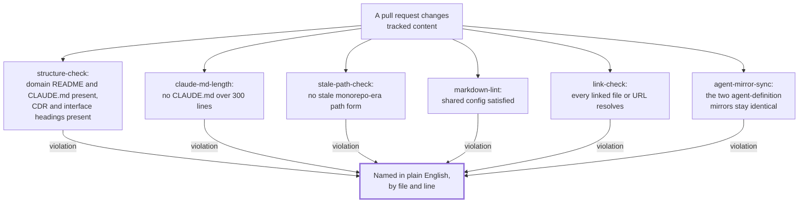

## 1. Intent

A repository that nobody actively watches drifts: a folder goes missing its
required files, a session file grows past the point anyone can hold it in
context, a path written for a layout the repos no longer have survives long
after the layout changed, prose formatting diverges file by file, a link
quietly stops resolving, and two copies of the same agent definition slide
apart. None of these failures announces itself. The constraint this must not
violate: catching them cannot depend on a reviewer noticing, because a
reviewer's attention is exactly the resource this harness cannot budget for
every PR.

Three materially different solutions could satisfy this without being what
the harness ships: a written style guide and a review checklist, with no
machine ever comparing a file against the rule; a single do-everything linter
that reports one undifferentiated pass/fail with no indication of which rule
tripped or where; or a set of checks that exit non-zero on a violation but
say nothing else, leaving a contributor to reverse-engineer the cause from a
stack trace. The harness's own answer is six narrow, single-purpose checks,
each testable in isolation against a violating and a clean input, each
naming the exact violation in plain English by file and line rather than
only failing. That is one of several ways to meet the intent, which is what
keeps this an intent rather than a solution mandate.

## 2. Problem & evidence

`stale-path-check.yml`'s own header names a real incident directly: the
2026-05-22 three-repo split left 36 references written for the old,
single-repository layout (a form described in FR-11.3 below, without
reproducing it here, since this check's own logic would flag its own
literal reproduction) scattered through the tree, which, in the file's own
words, "broke two agents, five commands and the Pattern A mount allow-list
without failing anything." The same comment records that a second variant
of the identical mistake spread even further before anyone caught it: "only
the Foundation one was ever guarded, so this form was free to spread
unguarded (16 live instances found in Foundation when this check was
added)." A path written for a layout the repos no longer use does not raise
an error at the point it goes stale; it fails, silently, whenever something
later tries to follow it.

`.markdownlint.jsonc`'s own comment on its `MD025` setting records a second
incident of the same shape, from a different check: "the previous value
{ "front_matter_title": "" } did NOT disable this rule... so 22 violations
went unnoticed for as long as CI never ran." A rule can be configured,
documented, and still enforce nothing, and the gap is invisible until
someone runs it and counts what it finds.

The obstacle common to both incidents, and to every risk this PRD covers, is
that a repository's own file listing cannot distinguish a structure that is
still correct from one that has quietly rotted. A `CLAUDE.md` at 250 lines
and one at 350 look identical from a directory listing; a path that resolved
under the old layout and one that resolves under the current one are both
just text until something walks the string against the layout that actually
exists. Nothing about the file itself announces which is which. Only a
check that runs the comparison, and says what it found, closes that gap.

## 3. Outcomes

- Every domain folder in a repository that carries one keeps its mandatory
  `README.md` and `CLAUDE.md`, and any cross-domain-decision or interface
  file uses the heading shape its template requires, checked on every
  pull request rather than assumed from a listing.
- No `CLAUDE.md` in any of the three repositories grows past 300 lines
  without a check naming the file and its line count.
- A path written for the three-repo split's old, monorepo-era layout cannot
  survive a pull request unnamed, while the harness's own prose idiom that
  happens to look similar in passing is never mistaken for one.
- Every Markdown file in all three repositories is checked against the same
  shared rule set, so a heading or list formatted one way in one repository
  and another way in a second is caught rather than left as house style.
- A link that no longer resolves, to a file inside the repository or a URL
  outside it, is named before merge, except for the one placeholder form the
  harness expects every published template to carry until an adopter
  substitutes it.
- Foundation's two agent-definition surfaces, the one a coding-agent CLI
  reads natively and the thin mirror Claude Code reads, cannot diverge
  without a check naming the file that differs.

## 4. Non-goals

- The reusable-workflow delivery mechanism itself, meaning how a check's
  logic lives once in Foundation and reaches Leadership and Domain by a
  pinned reference. That is PRD-10's territory; this PRD treats each of the
  six checks as logic to verify and cites PRD-10 only for how it travels.
- Why Foundation keeps a second, thin mirror of its own agent definitions in
  two locations at all. That is PRD-12's territory; this PRD covers only the
  check that keeps the two mirrors from drifting apart, not the reason the
  mirror exists.
- The content quality of a CDR or an interface document beyond the two
  heading names `structure-check` requires. Template shape and promotion
  flow belong to the PRDs that own those artefacts; this PRD's interest in
  either file type stops at the two headings the check greps for.
- Confidentiality and format-whitelist enforcement (`banned-string-check`,
  `format-gate`). Those checks guard different risks and belong to the PRDs
  that cover confidentiality and format policy.
- CODEOWNERS bindings, reviewer identity, and whether a red run of any check
  in this PRD can currently block a merge. That depends on branch
  protection, which is absent on all three published repositories today
  (section 7); this PRD covers what each check detects, not who is required
  to act on a red result.

## 5. Solution sketch

Each of the six checks answers one narrow question about one kind of rot,
and each says so in its own error text rather than only exiting non-zero.
Five live as a `workflow_call` reusable in Foundation with a thin caller in
whichever of Leadership and Domain also needs it; the sixth,
`agent-mirror-sync`, is an inline job inside Foundation's own `self-ci.yml`
with no reusable file and no caller anywhere else, because only Foundation
carries the two agent-definition directories it compares.

The primary flow is a pull request. `structure-check` walks every domain
folder for its two mandatory files and every cross-domain-decision or
interface file for its two required headings. `claude-md-length` walks
every `CLAUDE.md` and compares its line count against a fixed cap.
`stale-path-check` greps the whole tree, twice, for the layout the split
left behind, while sparing a capitalised prose idiom that happens to look
like one of the same words. `markdown-lint` and `link-check` each hand the
diff to an external tool, `markdownlint-cli2` and `lychee`, against a config
file shared byte-for-byte across all three repositories. `agent-mirror-sync`
diffs two directories against each other directly. Every one of the six
reports a violation by naming the exact file, and often the exact line,
rather than a bare failure.

Key rules:

- A check that only exits non-zero has not met this PRD's intent; the point
  of running one at all is that a contributor reads what it says and knows
  what to fix without opening the check's own source.
- `stale-path-check`'s comparison is deliberately asymmetric in
  case-sensitivity: one half of its logic folds case so a stray capitalised
  reference to Foundation's own name is still caught, and the other half
  does not, specifically so a standing prose idiom pairing two of the other
  repositories' names with a slash is never mistaken for a path.
- `claude-md-length`'s cap is a fixed line count, not a heuristic; a file one
  line under it passes and one line over it fails, with nothing in between.
- `markdown-lint` and `link-check` each depend on a config file shared
  identically across Foundation, Leadership, and Domain, so a rule loosened
  or tightened in one repository is loosened or tightened in all three,
  by construction of the file being the same file.
- `agent-mirror-sync` exists only where the thing it guards exists: Foundation
  is the only one of the three repositories carrying both agent-definition
  directories, so it is the only one that needs, or has, this check.

Important states: a repository whose structure, path forms, and Markdown
all satisfy every check (clean, the state every check reports on silently);
a repository with exactly one of the six risks present (caught, named by
file and often line, on the pull request that introduces it); Foundation's
own two agent-definition directories in lockstep (clean, the only state
`agent-mirror-sync` has ever observed on a published repository); the same
two directories with one file edited in only one location (caught, the one
file named directly).

Alternatives rejected:

- **A style guide with no machine comparison.** Rejected because it makes
  every one of these six risks depend on a reviewer noticing, the exact
  dependency the intent rules out; `.markdownlint.jsonc`'s own MD025 history
  shows a documented rule sitting unenforced for as long as nothing ran it.
- **One undifferentiated linter reporting pass or fail with no detail.**
  Rejected because a contributor who only learns that something failed still
  has to find the cause by reading the check's own source, the same cost
  this PRD's outcomes are meant to remove.
- **A check that exits non-zero with no explanation.** Rejected for the
  identical reason: an exit code alone tells a contributor a rule was
  broken, not which one, or where.

## 6. Requirements

### FR-11.1 — Mandatory domain structure and template headings are machine-checked

Status: ENFORCED (local); no run in Foundation's own CI history has ever
reported this check's job as failing
Evidence: `organisationos-foundation/.github/workflows/structure-check.yml`,
"Verify mandatory structure" step. Its own comment on the domain loop: "A
repo with no domain-* directories (Foundation) leaves the glob literal;
skipping non-directories makes this a no-op there while keeping every
assertion for Domain callers. AR-02." The step checks three things in
sequence: every `domain-*/` folder carries `README.md` and `CLAUDE.md`;
every file under `cross-domain-decisions/` other than a README or template
contains the literal headings `## Status` and `## Domains affected`; every
file under `interfaces/` other than a README or template contains `##
Providing domain` and `## Consuming domain`.

Verified: the step's own `run:` block, extracted verbatim and executed
against a scratch copy of `organisationos-domain` (`cp -R`, `.git` stripped,
never touching the live working tree). Clean copy: exit 0. Seed: renamed
`domain-1/README.md` out of place, leaving `domain-1/CLAUDE.md` in place.
Re-run: `::error file=domain-1/::Domain domain-1/ is missing mandatory
README.md`, exit 1, naming only the removed file; the CDR and interface
loops produced no output on either run, since neither directory holds a
real CDR or interface file on the published Domain repo today (confirmed:
`organisationos-foundation/cross-domain-decisions/` and `interfaces/` each
hold only a `README.md`). Restored the file: exit 0 again.

`gh run list --repo 2SSilver/organisationos-foundation --workflow=self-ci.yml
--limit 20`, checked 2026-09-07, followed by `gh api
.../actions/runs/<id>/jobs` for each of the nine recorded runs, shows the
`structure-check / structure` job reporting `success` on every single run;
none has ever reported it failing.

The system MUST verify, on every pull request, that every domain folder
carries its two mandatory files and that every cross-domain-decision and
interface file carries its required headings.

- Given a domain folder missing its `README.md` or `CLAUDE.md`
  When the check runs
  Then it is named by folder path, reproduced locally against a scratch
    Domain copy
- Given a `cross-domain-decisions/` or `interfaces/` file lacking one of its
  two required headings
  When the check runs
  Then it is named by file path and the missing heading; this half of the
    logic has been exercised only in this PRD's own verification, since
    neither directory holds a real entry beyond a README on any of the
    three published repositories today
- Given a repository with no `domain-*/` folders at all (Foundation's own
  case)
  When the check runs
  Then the domain loop is a no-op by construction of the glob, per the
    step's own comment, not a defect
- No run of `structure-check` in Foundation's own CI history has ever
  reported this job failing; every observed execution against a genuine
  violation was produced by this PRD's own local verification, not by a
  live pull request

### FR-11.2 — No `CLAUDE.md` exceeds 300 lines

Status: ENFORCED (local); no run in Foundation's own CI history has ever
reported this check's job as failing
Evidence: `organisationos-foundation/.github/workflows/claude-md-length.yml`,
"Verify no CLAUDE.md exceeds 300 lines" step: for every file named
`CLAUDE.md` outside `node_modules/` and `_archive/`, compare `wc -l` against
300 and, if it exceeds that figure, emit `"CLAUDE.md is $lines lines (cap:
300). Multi-step procedures move into skills or scoped rule files, not the
main CLAUDE.md."` and fail. The cap is read from the file itself (`-gt
300`), not assumed.

Verified: the step's own `run:` block, extracted verbatim, run against two
scratch directories each holding only a `CLAUDE.md`. A 301-line file
(`python3 -c "print('x\n'*301, end='')"`, confirmed `wc -l` = 301): `::error
file=./CLAUDE.md::CLAUDE.md is 301 lines (cap: 300)....`, exit 1. A
100-line file (same construction, `*100`): exit 0, no output.

`gh run list` and `gh api .../jobs` for every recorded Foundation `self-ci`
run (same nine-run history FR-11.1 cites) show `claude-md-length / length`
reporting `success` on every run; none has ever failed.

Every `CLAUDE.md` across the three published repositories was measured
directly (`find ... -name CLAUDE.md | wc -l` per file), checked 2026-09-07:
Foundation's own is 111 lines, the longest of the seven; Domain's root
`CLAUDE.md` is 76 and each of its four domain-level copies is 71; Leadership's
is 51. None approaches the cap.

The system MUST fail, on every pull request, if any `CLAUDE.md` in the
repository exceeds 300 lines, naming the file and its line count.

- Given a `CLAUDE.md` at 301 lines
  When the check runs
  Then it is named with its exact line count, reproduced locally
- Given a `CLAUDE.md` at 100 lines
  When the check runs
  Then it passes with no output
- No `CLAUDE.md` on any of the three published repositories is close to the
  cap today; the longest, Foundation's own, is 111 lines, well under half
- No run of this check in Foundation's own CI history has ever reported it
  failing

### FR-11.3 — Monorepo-era and bare-sibling path forms are un-reintroducible; a capitalised prose idiom is deliberately spared

Status: ENFORCED (local); no run in Foundation's own CI history has ever
reported this check's job as failing
Evidence: `organisationos-foundation/.github/workflows/stale-path-check.yml`.
Its own header comment records why the check exists: the 2026-05-22
three-repo split left references written for the old, single-repository
layout scattered through the tree, and one variant of the mistake "was free
to spread unguarded" because only one of the three repositories' names had
ever been guarded against it. The check runs two `grep`-and-`awk` passes.
One rejects two related forms: Foundation's own repository name used as a
path root in place of its full published slug, and a `../` reference to any
of the three sibling repositories that omits the `organisationos-` prefix
their real folder names carry. The other rejects the identical
repository-name-as-path-root mistake for the other two repositories' names,
and is the one place the check's own case-folding is switched off: this
harness's prose carries a standing idiom pairing two capitalised proper
nouns with a slash to mean "or" (`self-ci.yml`'s own comment, for one real
example, explains why Foundation calls its own reusables differently "not
the cross-repo pinned-tag form (`@v1`) Domain/Leadership callers use"), and
folding case here would misread that idiom as the very form being banned.
The check's own filename is excluded from its own scan, because its header
comment is the one place all three banned forms are written out literally
for a developer to read, which would otherwise fail the check on every PR
that runs it.

Verified: both `grep`/`awk` passes, extracted verbatim, run against a
scratch directory, one violation seeded at a time and removed before the
next.

- A file containing only a sentence pointing at Foundation's own content
  through the banned repository-name-as-root form: flagged by the first
  pass, naming the file and the exact line, with the error text quoting the
  fix directly.
- A file containing only a `../` reference to a sibling using its bare name,
  omitting the `organisationos-` prefix: flagged by the first pass's second
  check, naming the file and line.
- A file containing only a sentence using the same repository-name-as-root
  mistake for one of the other two repositories: flagged by the second
  pass, naming the file and line.
- A file containing only the capitalised prose idiom, pairing the other two
  repositories' names with a slash: NOT flagged by either pass. Confirmed
  by direct execution, both before and after seeding, on a clean tree: exit
  0.
- Clean tree, with no violation seeded (containing only full published
  repository slugs): exit 0 on both passes, before any seed and again after
  each seed was removed.

`gh run list` and `gh api .../jobs` for the same nine-run Foundation
`self-ci` history show `stale-path-check / stale-paths` reporting `success`
on every run; none has ever failed. The check's own header comment records
that the incident it guards against (36 references left behind by the
2026-05-22 split) was found and fixed before this reusable existed to catch
it live; nothing in the recorded run history shows this check itself ever
catching a real instance in a pull request.

The system MUST reject, on every pull request across all three
repositories, any reference written for the pre-split monorepo layout, and
MUST NOT reject the harness's own capitalised prose idiom that pairs two
repository names with a slash to mean "or."

- Given a path reference using the pre-split layout, in any of its three
  banned forms
  When the check runs
  Then it is rejected, naming the offending file and line
- Given the same capitalised prose idiom the check is designed to spare
  When the check runs
  Then it is not flagged, reproduced locally as a deliberate negative case
- Given a clean tree using only the full published repository slugs
  When the check runs
  Then it passes with no output
- No run of this check in Foundation's own CI history has ever reported it
  failing; the incident that motivated it predates the check's own creation

### FR-11.4 — Markdown lints against a shared config, `MD013` and `MD033` off

Status: ENFORCED (CI); run `32484132031` (red) and run `33501983753`
(green), both on real Foundation pull requests
Evidence: `organisationos-foundation/.github/workflows/markdown-lint.yml`
calls `DavidAnson/markdownlint-cli2-action@v16` against `**/*.md`, excluding
`_archive/` and `node_modules/`. The config it reads,
`.markdownlint.jsonc`, is byte-identical across all three repositories
(confirmed by `diff`, no output either comparison): `"MD013": false` (line
length, disabled for prose), `"MD033": false` (inline HTML allowed), plus
`MD024`, `MD025`, `MD036`, and `MD041` each set for the same "relaxed prose,
strict structure" posture the file's own opening comment names. The file's
own comment on `MD025` records a prior defect: an earlier config value "did
NOT disable this rule... so 22 violations went unnoticed for as long as CI
never ran."

`gh run list --repo 2SSilver/organisationos-foundation --workflow=self-ci.yml`
and `gh api .../actions/runs/32484132031/jobs`, checked 2026-09-07, show
`markdown-lint / lint` failing with "Summary: 270 error(s)", naming specific
violations by file and line, for example `.claude/agents/glossary-check.md:7
MD022/blanks-around-headings Headings should be surrounded by blank lines...
[Context: "# Role"]`. The same query against run `33501983753` shows the job
`success`, with its own step list recording "Run markdownlint" as `success`
(reached and passed, not skipped) and the failure-only comment step
correctly `skipped`. The red run's failure is genuinely the check's own
logic, not an upstream cause, and the green run genuinely reaches and passes
the same linting step rather than being gated away from it; the pair
isolates the variable.

Supplementary local verification, disclosed as a substitution: `npx --yes
markdownlint-cli2` run directly (not the marketplace action) against the
same `.markdownlint.jsonc`, on two scratch files differing only in whether a
fenced code block names a language. The fence with no language: `MD040/
fenced-code-language Fenced code blocks should have a language specified`,
exit 1. The fence naming `bash`: "0 issues in 0 files", exit 0.

The system MUST lint every Markdown file across all three repositories
against one shared configuration, with line-length and inline-HTML rules
disabled.

- Given a pull request whose Markdown violates the shared config
  When the check runs
  Then it fails, naming each violation by file, line, and rule, as observed
    on a real Foundation pull request
- Given a pull request whose Markdown satisfies the shared config
  When the check runs
  Then it passes, the linting step itself reached and green, as observed on
    a later Foundation pull request
- The three repositories' `.markdownlint.jsonc` files are byte-identical; a
  rule loosened in one is loosened in all three by construction

### FR-11.5 — Links resolve; the one documented false positive is ignored

Status: ENFORCED (CI); run `32485676303` (red) and run `32741967207`
(green), both on real Foundation pull requests
Evidence: `organisationos-foundation/.github/workflows/link-check.yml` calls
`lycheeverse/lychee-action@v2` against `**/*.md`. The one file it consults
for exceptions, `.lycheeignore`, is byte-identical across all three
repositories (confirmed by `diff`, no output either comparison) and ignores
exactly one pattern: the literal string `adopter-org`. Its own comment
explains the pattern is written without the angle brackets deliberately,
because lychee percent-encodes them before matching, so a pattern
containing a literal `<` or `>` would silently never match anything.

`gh api .../actions/runs/32485676303/jobs` shows the job `link-check /
links` failing, with its "Check links with lychee" step itself reaching
failure (not skipped, not an upstream setup error): the run's own log
reports "🚫 Errors | 3" and, under "Errors in
standards/templates/references-template.md", three identical lines:
"[ERROR] <error:> (at 10:31) | Cannot parse 'https://…' into a URL: invalid
international domain name" (repeated at 11:43 and 9:19). This is the
check's own logic genuinely rejecting real file content, not an upstream
configuration failure: `git show 5fa85c9:standards/templates/references-template.md`
shows the file, at Foundation's initial commit (2026-08-20), carried the
literal string `https://…` (an ellipsis character, not three periods) as a
placeholder URL in three worked-example table rows; lychee correctly cannot
parse that string as a URL. Commit `f5d083f3` ("style: bring markdownlint
to zero, and fix the MD025 config bug", 2026-08-21T13:21:55Z, roughly nine
minutes after the red run) replaced all three instances with `<url>`, plain
placeholder text no longer offered to lychee as something to parse; the
live file today carries zero `https://` occurrences. `gh api
.../actions/runs/32741967207/jobs`, a later run (2026-08-24), shows
`link-check / links` succeeding, with "Check links with lychee" itself
`success` (reached and passed, not skipped) and the failure-only comment
step correctly `skipped`. The pair isolates the variable: same job, same
underlying tool, differing only in whether the unparseable placeholder was
present in the tree at run time.

A second, earlier run also failed this job: `gh api
.../actions/runs/32484132031/jobs` shows the same job failing for an
unrelated, upstream reason — its own log reports the lychee step itself
"No links were found. This usually indicates a configuration error,"
independent of any real broken link, followed by a second, permission-related
failure in the comment-posting step gated behind it. This run does not
demonstrate the check's own broken-link logic and is not part of the
red/green pair cited above; it is recorded here only to distinguish it from
`32485676303`, since both are failures of the same job for materially
different reasons.

Supplementary local verification, disclosed as a substitution:
`lychee --offline --no-progress`, run directly against scratch files, using
a copy of the shared `.lycheeignore`. A file linking to a missing relative
file: lychee reports the target "File not found. Check if file exists and
path is correct" and exits 2. A file linking to a file that exists in the
same directory: one link checked, zero errors, exit 0. A file linking to a
`github.com` URL containing the literal, unsubstituted placeholder: zero
errors and one link excluded, exit 0, confirming the ignore file is
genuinely read and genuinely excludes the one pattern it documents, not
merely present and unused.

The system MUST fail, on every pull request across all three repositories,
if a linked file or URL fails to resolve, except for the one documented
placeholder every published template still carries.

- Given a pull request whose Markdown links to a string lychee cannot parse
  as a URL
  When the check runs
  Then it fails, naming the file, the exact position, and the parse error,
    as observed on a real Foundation pull request
- Given a pull request whose links all resolve or are excluded
  When the check runs
  Then it passes, the lychee step itself reached and green, as observed on
    a later Foundation pull request
- Given a file linking to a path that does not exist
  When the check runs locally, offline, against file links
  Then it fails, naming the missing target, reproduced as supplementary
    local evidence
- Given a file linking to a URL containing the literal, unsubstituted
  adopter-organisation placeholder
  When the check runs
  Then it is excluded, not flagged, on the strength of the shared
    `.lycheeignore` alone
- A second, earlier CI failure of this job (`32484132031`) is a materially
  different, upstream cause (a lychee configuration failure reporting no
  links found at all) and is not part of the red/green pair this
  requirement claims

### FR-11.6 — `.github/agents/` and `.claude/agents/` cannot drift

Status: ENFORCED (local); this check has no caller outside Foundation, by
design
Evidence: `organisationos-foundation/.github/workflows/self-ci.yml`,
`agent-mirror-sync` job: `diff -rq --exclude=README.md .claude/agents
.github/agents`. The job's own comment states the two directories it
compares are two distinct surfaces for the same content, and that they
"must stay identical or the vendor surfaces silently drift apart"; what
each surface is for, and why Foundation carries both, is PRD-12's territory.
Unlike the other five checks in this PRD, `agent-mirror-sync` is not a
`workflow_call` reusable and has no caller in Leadership or Domain: neither
repository carries a `.claude/agents/` or a `.github/agents/` directory at
all (confirmed by direct listing, both absent in both repositories), so
neither has anything for this check to compare. A check with no caller and
nothing to guard has no execution path outside the one repository that
needs it; that is this check's situation by design, not an oversight the
way an unwired reusable elsewhere would be.

Verified: the diff command, run directly against a scratch copy of
`organisationos-foundation` (`.git` stripped). Clean copy, unmodified:
exit 0, no output. Seed: appended two lines to
`.claude/agents/reviewer.md`, leaving `.github/agents/reviewer.md`
untouched. Re-run: `Files .claude/agents/reviewer.md and
.github/agents/reviewer.md differ`, exit 1, naming only the edited file.
Restored the file from a backup: exit 0 again.

`gh run list` and `gh api .../jobs` for the same nine-run Foundation
`self-ci` history show `agent-mirror-sync` reporting `success` on every
run; none has ever failed.

The system MUST fail if any file under `.github/agents/` and its mirror
under `.claude/agents/` (other than the mirror's own `README.md`) differ,
checked on every Foundation pull request.

- Given the two directories in lockstep
  When the check runs
  Then it passes with no output
- Given exactly one file edited in only one of the two directories
  When the check runs
  Then it fails, naming only that file, reproduced locally
- Given a repository carrying neither directory (Leadership, Domain)
  When any pull request runs there
  Then this check does not run at all; it has no caller and nothing to
    compare in either repository, by design

## 7. Dependencies & constraints

- **PRD-01 (repo topology)** documents the path forms `stale-path-check`
  enforces and the sibling-clone layout the check assumes; this PRD's
  FR-11.3 is the enforcement PRD-01 names and defers to.
- **PRD-10 (CI architecture)** owns the reusable-workflow delivery mechanism
  every check but `agent-mirror-sync` travels through, including why
  Foundation calls its own reusables by local path while Leadership and
  Domain pin a tag, and the two independent obstacles, the unresolved
  `<adopter-org>` placeholder and Actions being disabled by design, that
  keep every Leadership and Domain caller from having executed past
  registration on the published repositories today. This PRD's callers are
  cited only to establish that a caller exists (or, for `agent-mirror-sync`,
  that none does), not to re-derive their reachability.
- **PRD-12 (not yet written)** owns why Foundation maintains two
  agent-definition surfaces at all; FR-11.6 cites the mirror only as the
  thing the check compares.
- **Confirmed via `self-ci.yml`, read directly:** all six checks this PRD
  covers are wired into Foundation's own pull-request CI: five as jobs
  calling a reusable by local path (`structure-check`, `claude-md-length`,
  `stale-path-check`, `markdown-lint`, `link-check`), one
  (`agent-mirror-sync`) as an inline job with no reusable file. Leadership
  carries a thin caller for four of the five reusable checks
  (`claude-md-length.yml`, `stale-path-check.yml`, `link-check.yml`,
  `lint.yml`, the last calling the `markdown-lint` reusable under a
  different filename) but none for `structure-check`, confirmed by direct
  listing of its workflows directory. Domain carries a thin caller for all
  five (`claude-md-length.yml`, `stale-path-check.yml`, `link-check.yml`,
  `markdown-lint.yml`, `structure-check.yml`), confirmed the same way.
- **External constraint — no branch protection on any of the three
  reference repositories.** `gh api repos/2SSilver/organisationos-foundation/
  branches/main/protection` returns `404` ("Branch not protected"), checked
  2026-09-07, the same finding PRD-09's and PRD-10's own section 7 record.
  Nothing about any of these six checks running red currently blocks a
  merge on any of the three repositories.
- **External constraint — Leadership's and Domain's Actions are disabled at
  the repository level.** `gh api repos/2SSilver/organisationos-<repo>/
  actions/permissions`, checked 2026-09-07, returns `enabled: false` for
  both, `enabled: true` for Foundation, the same reading PRD-10's own
  section 7 records for the identical constraint. This is why every
  `ENFORCED` claim in section 6 either rests on this PRD's own local
  reproduction or, for FR-11.4, on Foundation's own run history alone:
  no pinned caller in Leadership or Domain has ever executed past
  registration, the state PRD-10's FR-10.7 records in full.

## 8. Known gaps & open questions

- **GAP — `structure-check`'s CDR- and interface-heading logic has never
  been exercised against real content on any of the three published
  repositories.** FR-11.1 records this: Foundation's own
  `cross-domain-decisions/` and `interfaces/` folders each hold only a
  `README.md` today, so this PRD's own scratch seed is the only execution
  of that half of the check's logic against a genuine violation to date.
- **GAP — four of the six checks have never been observed rejecting
  anything in real CI.** `structure-check`, `claude-md-length`,
  `stale-path-check`, and `agent-mirror-sync` (FR-11.1, FR-11.2, FR-11.3,
  FR-11.6) each record that their job has reported success on every one of
  the nine recorded Foundation `self-ci` runs; their `ENFORCED` status rests
  entirely on this PRD's own local reproduction. Two of the six,
  `markdown-lint` (FR-11.4) and `link-check` (FR-11.5), each have a genuine
  CI-locus red and green pair to cite; `link-check`'s CI history also
  carries a second, earlier failure of the same job that is not part of its
  cited pair, for an unrelated, upstream reason recorded in FR-11.5's own
  evidence.
- **Open question — whether `structure-check` should gain a Leadership
  caller.** FR-11.1's evidence shows Leadership carries no `structure-check`
  caller at all, unlike the other four reusable checks in this PRD; nothing
  in this PRD's evidence establishes whether that absence reflects a
  deliberate choice (Leadership has no `domain-*/` structure of its own to
  check) or an oversight.
- **Open question — whether `agent-mirror-sync`'s Foundation-only scope
  should extend if Leadership or Domain ever gain their own agent-definition
  mirror.** Today, neither carries the two directories this check compares,
  so the question is dormant rather than live.

## 9. Rebuild guide

This section assumes PRD-01's three repositories and PRD-10's
reusable-workflow delivery mechanism already exist. It produces the state
PRD-11 alone is responsible for: the six checks' own detection logic, not
how a check travels from Foundation to a caller.

1. In Foundation, write `structure-check.yml` as a `workflow_call` reusable:
   walk every `domain-*/` folder for its two mandatory files, treating a
   repository with none as a no-op rather than an error; walk every
   cross-domain-decision and interface file, excluding a README or template,
   for its two required headings.
2. In Foundation, write `claude-md-length.yml`: find every file named
   `CLAUDE.md` outside excluded paths, compare its line count against a
   fixed cap, and name the file and its count on a violation rather than
   only failing.
3. In Foundation, write `stale-path-check.yml` as two passes: one rejecting
   the pre-split layout's forms for Foundation's own name and for a bare
   `../` sibling reference lacking the published prefix; a second rejecting
   the same mistake for the other two repositories' names, with its
   case-folding switched off specifically so a capitalised prose idiom
   pairing two repository names is never mistaken for a path. Exclude the
   check's own filename from its scan, since its header comment is where
   the banned forms are written out literally for a developer to read.
4. In Foundation, write `markdown-lint.yml` and `link-check.yml`, each
   calling an external tool against a config file (`.markdownlint.jsonc`,
   `.lycheeignore`) copied byte-identically into Leadership and Domain, so
   a rule change in one config file is a rule change in the other two only
   if the file is actually copied, not merely intended to be.
5. In Foundation's own `self-ci.yml`, add `agent-mirror-sync` as an inline
   job, not a reusable file, diffing `.claude/agents/` against
   `.github/agents/` with the mirror's own `README.md` excluded. Wire it
   only into Foundation; do not add a caller in Leadership or Domain unless
   either repository later gains both directories to compare.
6. In Leadership and Domain, write a thin caller for each of the first five
   checks that applies to that repository's own content, matching the
   trigger to the check's own nature (`pull_request`, optionally scoped by
   `paths:` to the files the check actually reads).

After this PRD alone: a domain's mandatory files, a `CLAUDE.md`'s length, a
stale path form, a Markdown formatting rule, a broken link, and Foundation's
own two agent-definition mirrors are each checked and named on the pull
request that introduces the problem. What stays broken until later work
closes it: whether any of this actually blocks a merge depends on branch
protection, which this PRD does not configure and which does not exist on
any of the three published repositories today (section 7); and Leadership's
and Domain's own pinned callers, for the five checks that have one, have
never executed past registration on the published repositories, for the
reasons PRD-10 records in full.

## 10. Provenance & verification

Files specified by this PRD (`specifies:` above) were confirmed present with
`ls`, individually, on 2026-09-07; all twenty-one resolved without error.
Last-touched commits (`git log -1 --format="%H %ad" --date=short -- <path>`,
run 2026-09-07): Foundation's `structure-check.yml` at `0870c877`,
2026-08-21; `claude-md-length.yml` and `self-ci.yml` both at `adc560a8`,
2026-08-26; `stale-path-check.yml` at `bd3263d6`, 2026-08-24;
`markdown-lint.yml` at `5fa85c95`, 2026-08-20; `link-check.yml` and
`.markdownlint.jsonc` both at `f5d083f3`, 2026-08-21; `.lycheeignore`
at `1bade06f`, 2026-08-26. Leadership's `claude-md-length.yml` at `c09fe4b9`,
2026-08-20; `stale-path-check.yml` at `db540010`, 2026-08-21; `link-check.yml`
and `lint.yml` both at `0a64f335`, 2026-08-21; `.lycheeignore` at `581cf4bb`,
2026-08-26; `.markdownlint.jsonc` at `503a9746`, 2026-08-21. Domain's
`claude-md-length.yml` at `f10a3e2e`, 2026-08-20; `stale-path-check.yml`,
`link-check.yml`, `markdown-lint.yml`, and `.markdownlint.jsonc` all at
`3791f15d`, 2026-08-21; `structure-check.yml` at `5acd5663`, 2026-08-26;
`.lycheeignore` at `3a05c6b7`, 2026-08-26. Foundation tag `v1.1.2` resolves
to `d70bafc83acd1942e807ff35da888901ac45f255`, 2026-09-02, the same commit
`v1` resolves to.

**Method.** FR-11.1, FR-11.2, FR-11.3, and FR-11.6 were each verified by
extracting the check's own shell logic verbatim from its workflow file and
running it against a scratch copy or a scratch-seeded file, once on a
violating input and once on a clean input, per the evidence bar in the PRD
template's section 3.5. FR-11.1 and FR-11.6 used a `.git`-stripped `cp -R`
of, respectively, `organisationos-domain` and `organisationos-foundation`,
so the live working trees were never touched. FR-11.2 and FR-11.3 used
files constructed directly in scratch directories rather than a copied
repository, since the logic they test does not depend on surrounding
repository content. FR-11.4 and FR-11.5 each rest on Foundation's own
recorded CI history instead: for FR-11.4, a genuine red run
(`32484132031`) and a genuine green run (`33501983753`); for FR-11.5, a
genuine red run (`32485676303`) and a genuine green run (`32741967207`).
Each pair was checked the same way: reading the run's own log, to confirm
the failure and the pass are both the check's own logic and not an
upstream or downstream cause, and, for FR-11.5's red run, tracing the
unparseable content it flagged to a specific commit in
`references-template.md`'s own git history. A supplementary local run of
each tool, against a hand-constructed seed, is recorded alongside both and
disclosed as a substitution. A second, earlier CI failure of FR-11.5's job
(`32484132031`) was checked by the same standard and found not to isolate
the variable — a materially different, upstream cause from the genuine
pair — and is recorded as such rather than folded into the claimed pair.

Every one of the six checks' presence in Foundation's own `self-ci.yml`, and
in Leadership's and Domain's respective workflow directories, was confirmed
by reading `self-ci.yml` directly and by listing each repository's
`.github/workflows/` directory directly, not assumed from one repository's
shape.

Live GitHub state (Foundation's `self-ci.yml` run history and job-level
results, and the external-constraint readings in section 7) was read via
`gh run list`, `gh run view --log-failed`, and `gh api`, each call
timestamped to the reading in section 6 or section 7. None of these calls
write to a live repository.

**Limits.** The scratch verifications for FR-11.1 and FR-11.6 use a copied,
`.git`-stripped working tree rather than a real `actions/checkout@v4`; the
checkout mechanics themselves were not exercised. FR-11.2, FR-11.3, and
FR-11.5's scratch files are hand-constructed rather than a real pull
request's diff. FR-11.4's local supplementary run substitutes the
`markdownlint-cli2` CLI directly for the `DavidAnson/markdownlint-cli2-action@v16`
GitHub Action; FR-11.5's local run substitutes the `lychee` CLI directly for
`lycheeverse/lychee-action@v2`, and adds `--offline` (absent from the
action's own arguments) specifically to keep the verification to file links
rather than attempting live network requests. Both substitutions use the
same underlying tool and the same
repository config file the action wraps, not a different implementation.
`structure-check`'s CDR- and interface-heading logic (FR-11.1) has been
exercised, against a real violation, only in this PRD's own scratch test;
neither directory holds a genuine entry on any of the three published
repositories today. Four of the six checks (`structure-check`,
`claude-md-length`, `stale-path-check`, `agent-mirror-sync`) have never
produced a red result in Foundation's own recorded CI history at all, so
their `ENFORCED` status rests entirely on this PRD's local reproduction,
disclosed as such rather than implied to carry live-CI confirmation.
Foundation's own workflow-run retention is bounded; the specific run IDs
FR-11.4 and FR-11.5 cite may age out for a future re-verifier even though
the workflow files and their config do not.

A re-verifier reproducing FR-11.1, FR-11.2, FR-11.3, or FR-11.6's scratch
result needs only the cited `run:` block or job step, extracted from the
named workflow file, and a scratch copy or scratch file constructed as
described in section 6, not GitHub access. A re-verifier checking FR-11.4's
or FR-11.5's CI-locus claim needs public read access to the three
repositories and the two run IDs each requirement cites, or a fresh run
history mined the same way if those age out; FR-11.5's red run additionally
depends on `standards/templates/references-template.md`'s own git history
at Foundation's initial commit, which does not age out the way a workflow
run's retention does.
