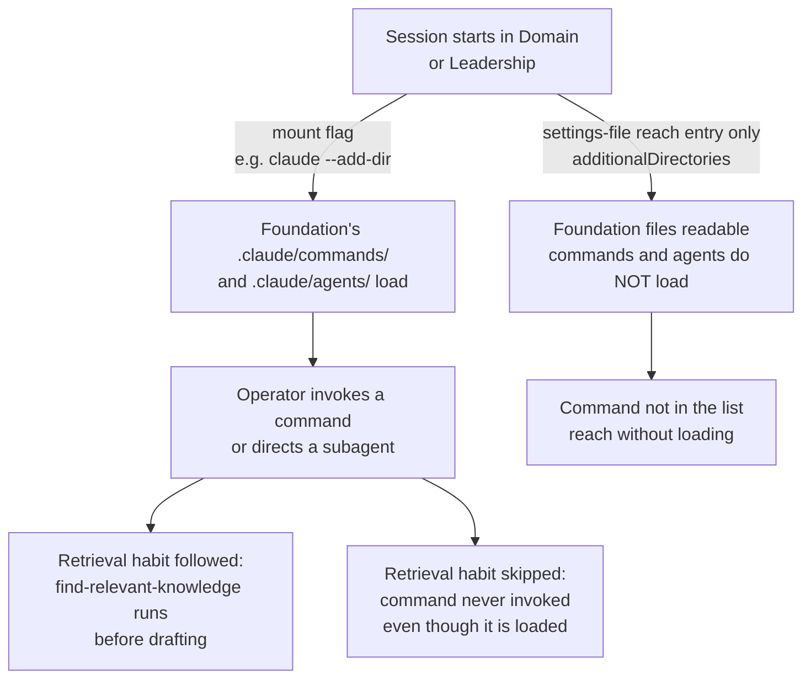

## 1. Intent

Routine agent work (reviewing a changed file, summarising a long document,
onboarding a joiner, retrieving what already exists before drafting something
new) behaves the same for every operator in every repo, and improving it once
improves it everywhere. A Product Owner in one domain and a Domain Lead in
another reach for the same review checklist and the same retrieval habit, not
whatever each happened to write into their own prompt that week.

## 2. Problem & evidence

An organisation running several sessions across three repositories accumulates
agent behaviour the same way it accumulates anything else people repeat under
time pressure: as private habit. One operator writes a good review prompt for
a markdown deliverable; it lives in their own head, or a scratch file, and the
next operator reinvents it, differently. A retrieval habit that would have
caught duplicate work never happens unless someone remembers to ask for it
that day. None of this is visible to a reviewer, and none of it improves when
one person gets better at it.

Foundation ships a shared answer to a narrow slice of this: six commands and
four subagents, defined once and available to any session that reaches them.
The definitions are shared; whether a given session actually has them
depends on how that session was started, which is a second, separate
question this PRD also has to answer honestly. A definition that ships but is
never reachable from the documented onboarding path is not meaningfully
different, to the operator who followed that path, from a definition that was
never written.

## 3. Outcomes

- Six named commands and four named subagents exist once, in Foundation, and
  their one-line purpose is legible from their own frontmatter rather than
  from a description someone remembers.
- A subagent's declared tool list is visible before it runs, so an operator
  can tell a read-only reviewer from anything with broader reach.
- The same agent definition is available whether an operator's tool reads
  `.github/agents/` or `.claude/agents/`, with one of the two folders named as
  the place changes are made.
- An operator who runs `find-relevant-knowledge` before drafting sees what
  already exists, reducing duplicate work and missed prior decisions, provided
  the documented setup path actually puts that command within reach.
- A skill that intentionally routes around a plugin skill is named, approved,
  and dated in one place, rather than existing as an unrecorded local
  override.

## 4. Non-goals

- How a session actually loads a mounted directory's commands, agents and
  skills, and the difference between a directory-mount flag and a
  settings-file reach entry. PRD-02 owns that mechanism; this PRD assumes it
  and is scoped to what gets loaded, not how loading works.
- Verifying the mirror-sync check itself. PRD-11's `agent-mirror-sync` job is
  where that check is defined, run, and reproduced red and green; this PRD
  confirms the two folders match today and cites PRD-11 for the check that
  keeps them that way.
- Tool-permission scoping and supply-chain trust for anything a command or
  subagent invokes. The next PRD in this set owns that gate.
- The registry's ongoing maintenance cadence: who re-verifies a routing
  entry and how often. A later PRD owns that upkeep; this PRD is scoped to
  what the registry contains and the rule it states today.

## 5. Solution sketch

A command or a subagent is a single markdown file with a frontmatter
`description:` (a subagent also carries a `tools:` list). Foundation ships
six commands under `.claude/commands/` and four subagents, each defined
twice: once under `.github/agents/`, described as the source of truth for
Copilot-native tooling, and once under `.claude/agents/`, the mirror Claude
Code actually reads. The two copies are kept identical by hand at edit time
and checked by a CI job that fails a Foundation pull request the moment they
diverge; that job is PRD-11's territory, cited here rather than re-verified.

The primary flow: an operator starts a Claude Code session with Foundation
mounted using a directory-mount flag. That flag, and only that flag, brings
Foundation's `.claude/commands/` and `.claude/agents/` into the session; a
settings-file reach entry grants file access alone. The operator (or the
harness's own end-of-session ritual) then invokes a command by name, or a
command or a human directs a subagent to review, summarise, check glossary
terms, or fix links, read-only.

Key rules:

- A command or subagent's one-line purpose lives in its own frontmatter
  `description:`, not in a separate index someone has to keep in sync.
- `.github/agents/` is the edited copy; `.claude/agents/` is the mirror. An
  edit that lands in only one of the two is a defect the mirror-sync check
  catches on the next Foundation pull request.
- All four subagents ship a `tools:` list restricted to reading and
  searching; one names an additional read-only web-fetch capability. None
  ships write, edit, or shell access.
- An OrganisationOS-native skill that overlaps a plugin skill's job routes
  around it only by naming the plugin skill it replaces in its own
  `description:`, and only once a Domain Lead has approved the routing and
  the Admin has recorded it in the skill registry.
- Retrieval is a documented habit, not an automatic behaviour: reaching a
  folder and having its contents enter context are two different things, and
  a command that is supposed to be run "before drafting" only helps an
  operator whose session actually has it loaded.

Important states: the template state, as published (six commands and four
subagents exist, the two agent-definition folders are identical, the skill
registry holds only its own format instructions, and no harness-native skill
has yet been written); the mounted state, once an operator starts a session
naming Foundation as an additional directory with the mount flag rather than
only the settings-file entry, and the six commands and four subagents become
reachable; and the adopted state, once a Domain Lead has approved at least
one routing entry and the registry holds a real row instead of its own
example.

Alternatives rejected:

- **One agent-definition folder, read by whichever tool is in use.** Rejected
  because Claude Code and Copilot-native tooling read different, tool-specific
  locations; a single folder would require one of the two tools to change
  where it looks, which is outside the harness's control.
- **A generative index that regenerates each command's one-line description
  from its body.** Rejected in favour of frontmatter the tool itself already
  parses to populate its own command list; a second, regenerated index is one
  more artefact that can drift from the file it describes.
- **Registering every OrganisationOS-native skill in the registry by default,
  routing or not.** Rejected because the registry's job is to track a
  deliberate override of plugin behaviour, not to catalogue every skill the
  harness ships; a skill that does not overlap a plugin skill has nothing to
  route around and nothing to approve.

## 6. Requirements

### FR-12.1 — Six shared commands, one-line purpose from frontmatter

Status: SHIPPED
Evidence: `organisationos-foundation/.claude/commands/` holds exactly six
files (`ls`, six entries): `drift-check.md`, `find-relevant-knowledge.md`,
`onboard.md`, `promotion-candidate.md`, `raise-cdr.md`, `update-wiki.md`.
Each file's frontmatter `description:` reads verbatim:

- `drift-check`: "Scan every domain's CLAUDE.md against the harness baseline
  and report drift. Admin tool."
- `find-relevant-knowledge`: "Search the harness for relevant existing
  knowledge before drafting a new piece of work. Retrieval-on-demand for the
  semantic and episodic memory layers."
- `onboard`: "Produce a personalised 30-day onboarding plan for a new joiner
  based on their role and domain."
- `promotion-candidate`: "Surface practices in one domain that recur across
  others. Candidates for promotion into Foundation. Admin tool."
- `raise-cdr`: "Draft a Cross-Domain Decision Record (CDR) from a session's
  cross-domain implications."
- `update-wiki`: "End-of-session ritual. Review the session and draft ADRs,
  CDRs, wiki updates, method revisions to `_drafts/`. Drafts only — never
  commits."

The harness MUST ship exactly six shared commands under
`.claude/commands/`, and each MUST carry a frontmatter `description:` stating
its purpose in one line.

- All six files are present and each opens with a `description:` field; none
  is empty.
- `drift-check` and `promotion-candidate` name themselves an "Admin tool" in
  their own description; the other four carry no such restriction and are
  usable by any role that reaches them.
- `update-wiki`'s own file carries an internal inconsistency worth noting
  against this requirement's evidence rather than under a separate FR: its
  "Low-ceremony merge path" section (line 36) states that branch protection
  has "`require-code-owner-review` off on `domain-N/_drafts/`" and cites
  `docs/setup-org.md` Step 7 as the source. Step 7 itself (line 116) says the
  opposite of what is cited: "GitHub branch protection is per-branch, not
  per-path, so it cannot express that distinction natively," and names the
  notification-only tier a documented convention with no enforcement behind
  it, not an actual per-path setting. The command's own description of its
  low-ceremony path names a mechanism the file it cites says does not exist.
  This does not change the command's SHIPPED status: the file exists and is
  wired. It does mean a reader following `update-wiki`'s own citation to Step
  7 finds Step 7 contradicting it.
- Definitions existing is what this requirement claims; whether a given
  session invokes a given command in a given week is not observed by
  anything cited here.

### FR-12.2 — Four read-only-by-default subagents, declared tool lists

Status: SHIPPED
Evidence: `organisationos-foundation/.claude/agents/` holds five files (`ls`,
five entries): `glossary-check.md`, `link-fixer.md`, `reviewer.md`,
`summariser.md`, and `README.md` (the mirror's own README, not a fifth
agent). Each agent file's frontmatter carries both `description:` and
`tools:`, verbatim:

- `glossary-check`: "Check a changed file against the domain's glossary. Flag
  terms used without definition, terms defined differently elsewhere, and
  candidates for glossary inclusion." Tools: `[read, search]`
- `link-fixer`: "Find broken or stale links in a changed file and propose
  fixes. Read-only; outputs a list of suggested edits." Tools: `[read,
  search, web]`
- `reviewer`: "Read a changed file and produce a structured review against
  the harness's standards. Read-only; never writes." Tools: `[read,
  search]`
- `summariser`: "Produce a one-paragraph summary of a long markdown document,
  plus a 3-5 bullet \"what changed\" list against the previous version if one
  exists." Tools: `[read, search]`

The harness MUST ship exactly four subagents, each with a frontmatter
`description:` and a `tools:` list, and each list MUST be read-only.

- All four declared `tools:` lists name only `read`, `search`, and, for
  `link-fixer` alone, `web` (a read-only fetch capability, not a write or
  execution capability). None of the four names `edit`, `write`, or a shell
  tool.
- Three of the four agent bodies restate the read-only constraint in their
  own prose (`link-fixer`: "Read-only; never edits files"; `reviewer`:
  "Do not write to the file... Do not call any tool other than read and
  search"; `summariser`: "Read-only; never writes"); `glossary-check`'s body
  states "Read-only" under its own "Constraints" heading.
- The read-only claim in this requirement rests on the declared `tools:`
  list matching what the file's own prose says it does; nothing here
  observed a subagent running and confirms the declared list is what
  actually executes.

### FR-12.3 — Dual-homed agent definitions, `.github/agents/` as source of truth

Status: SHIPPED
Evidence: `organisationos-foundation/.claude/agents/README.md`: "These agent
definitions mirror `.github/agents/` (the Copilot-CLI-native location).
Claude Code reads `.claude/agents/`, so the harness ships this mirror... **
Source of truth:** `.github/agents/`. When you edit an agent definition, edit
it in `.github/agents/` and copy the change here so both stay identical."
`organisationos-foundation/.github/agents/` holds exactly four files
(`ls`, four entries: `glossary-check.md`, `link-fixer.md`, `reviewer.md`,
`summariser.md`); it carries no README. Byte-comparison of all four pairs
(`diff` and `md5`, run 2026-09-08, every pair, not a sample) found zero
differences: `glossary-check.md`, `link-fixer.md`, `reviewer.md` and
`summariser.md` are identical between `.claude/agents/` and
`.github/agents/`, both by `diff` (no output) and by matching MD5 sums.

The harness MUST ship each subagent definition in both `.github/agents/` and
`.claude/agents/`, byte-identical except for the mirror's own `README.md`,
which has no counterpart in `.github/agents/`.

- Every one of the four agent files is present in both locations and
  byte-identical, verified individually rather than by sampling one pair.
- `.claude/agents/README.md` is the one file that intentionally differs
  between the two folders: it exists to document the mirror itself and has
  no reason to exist in `.github/agents/`, which needs no explanation of a
  mirror it is the source for.
- Whether the two folders staying identical is actually enforced, rather
  than true by coincidence at the moment this was read, is PRD-11's
  FR-11.6, which excludes the mirror's own README from its comparison by
  name and records the check reproduced red and green locally. This
  requirement's evidence is a direct comparison of file contents on the date
  read; it does not re-run or re-derive PRD-11's enforcement finding.

### FR-12.4 — Portability to other harnesses is a documented claim, no mechanism

Status: CONVENTION
Evidence: `organisationos-foundation/.claude/agents/README.md`, its only
sentence on the subject: "Adopters on Cursor / Codex CLI invoke the same
agents via their tool's mechanism (skills, prompt files, etc.)." A search of
Foundation's `docs/` and `.claude/` for any other mention of Cursor or Codex
found none.

The harness MUST document that an adopter on a different tool invokes the
same agent definitions through that tool's own mechanism, without the
harness itself building or wiring that mechanism.

- The claim names two example tools (Cursor, Codex CLI) and two example
  mechanisms (skills, prompt files) as illustrative, not exhaustive.
- Nothing in Foundation translates an agent definition into a Cursor rule
  file or a Codex prompt file; the claim is that an adopter's own tool reads
  the same markdown source, not that the harness produces a tool-specific
  artefact.
- No file anywhere in Foundation's `docs/` or `.claude/` beyond this one
  sentence discusses either tool; the claim rests on exactly this evidence
  and nothing more was found to corroborate or contradict it.

### FR-12.5 — Skill-registry routing rule exists; nothing is registered

Status: CONVENTION
Evidence: `organisationos-leadership/steward/skill-registry.md`: "OrganisationOS-native
skills that route around `superpowers:` or other plugin skills via
description-based routing." Its "Rules" section: "Every OrganisationOS-native
skill whose `description:` opens with 'Use this instead of
`<plugin>:<skill>` when...' is registered here. Domain Lead approves a
routing declaration when the skill is created." Its "Current state" section:
"> Replace this section with the current registry. At adoption time, this
file holds only these instructions." `organisationos-foundation/.claude/skills/README.md`
restates the same rule with a worked example
(`requesting-deliverable-review`, routing around
`superpowers:requesting-code-review`) under its own "Indicative shape
(adopter populates)" heading. A direct listing of
`organisationos-foundation/.claude/skills/` found only `.gitkeep` and
`README.md`; no skill subdirectory exists.

The harness MUST document a rule for registering an OrganisationOS-native
skill that routes around a plugin skill (a naming convention in the skill's
own `description:`, a Domain Lead approver, and a dated verification), and
the registry itself MUST exist as the record of that routing.

- The routing rule and its registration format are documented identically in
  two files (the registry itself, and Foundation's skills README), each
  giving the same worked example.
- At template state, `.claude/skills/` ships no skill folder at all, and the
  registry's own "Current state" section is explicitly a placeholder, not a
  populated table.
- The worked example (`requesting-deliverable-review`) appears in both
  documents as an illustration of the format, not as a registered entry; it
  is not backed by any actual skill file in `.claude/skills/`.

### FR-12.6 — Retrieval-on-demand: reachability does not follow from the documented onboarding path alone

Status: CONVENTION
Evidence: `find-relevant-knowledge.md`'s own frontmatter names it "Retrieval-on-demand
for the semantic and episodic memory layers" (quoted in full under FR-12.1).
Foundation's `docs/loading-model.md` line 41: "**Retrieve before drafting.**
Run `find-relevant-knowledge` against the folders you are about to touch.
Reach without retrieval leaves the substrate on disk." The same document,
line 40: "**Start sessions with `--add-dir ../organisationos-foundation`**
when you want Foundation's shared commands (`/onboard`, `/update-wiki`,
`/find-relevant-knowledge`, `/raise-cdr`) and agents. `additionalDirectories`
alone does not bring those." A search for the mount flag (`--add-dir`) across
all five role-onboarding templates under
`organisationos-foundation/standards/templates/onboarding/`
(`claude-local-admin.example.md`, `claude-local-leader.example.md`,
`claude-local-domain-lead.example.md`, `claude-local-team-member.example.md`,
`claude-local-product-owner.example.md`) returned zero hits in every file;
each template's own "Clone layout and additionalDirectories" section
documents only the settings-file reach entry. `docs/setup-person.md` line 79
mentions the mount flag once, conditionally: "If you started with `claude
--add-dir ../organisationos-foundation` (`../../` from inside a domain
folder), `/onboard` and `/find-relevant-knowledge` appear in the command
list." The same document's Step 5 (line 85) does instruct starting a session
with the mount flag, but only in order to run `/onboard` once, in week one,
not as a standing habit for every session's retrieval step Step 4 describes.

The harness's designated retrieval mechanism, `find-relevant-knowledge`,
MUST be documented as the mechanism that makes reach into Foundation's
substrate usable rather than merely readable.

- Every individual document is accurate on its own terms:
  `docs/loading-model.md` correctly distinguishes the mount flag from the
  settings-file entry; the five role templates correctly document the
  settings-file entry, which is what they are for; `docs/setup-person.md`
  correctly notes the mount flag's effect where it does mention it.
- None of them, read in the order a joiner is told to read them (clone,
  copy the role template, smoke-test, run `/onboard`), instructs a joiner to
  adopt the mount flag as a standing per-session habit for retrieval. The
  mount flag surfaces once as a conditional smoke-test check and once tied
  to a single week-one command, not as the thing a joiner does every session
  before drafting.
- A joiner who follows their role template exactly configures the
  settings-file reach entry, never encounters an instruction to also use the
  mount flag routinely, and can complete the documented onboarding path
  without `find-relevant-knowledge` ever appearing in their command list.
  This is recorded as a `GAP` in section 8 rather than a defect in any one
  file: no single sentence cited above is wrong.
- Cross-reference PRD-02 FR-02.2 and FR-02.3 for the mechanism itself (what
  the mount flag and the settings-file entry each do); this requirement is
  scoped to whether the documented path actually leads an operator to use
  the mechanism that reaches the retrieval command, not to the mechanism's
  own behaviour.

## 7. Dependencies & constraints

- **PRD-02 (session context and loading model)** owns the mount-flag and
  settings-file mechanics this PRD's FR-12.6 depends on: which one loads
  commands and agents, which one grants file access only, and why a
  settings-file entry alone never brings a shared command into a session's
  list. This PRD does not re-derive that mechanism; it establishes whether
  the documented per-role path actually invokes it for retrieval.
- **PRD-11 (structural checks)** owns `agent-mirror-sync`, the CI job that
  fails a Foundation pull request if `.github/agents/` and `.claude/agents/`
  diverge (excluding the mirror's own `README.md`), and records that check
  reproduced red and green locally. This PRD's FR-12.3 confirms the two
  folders match today by direct comparison; it defers to PRD-11 for whether
  and how that match is enforced going forward.
- **The next PRD in this set** owns tool-permission scoping and supply-chain
  trust for what a command or subagent is allowed to call once invoked; this
  PRD is scoped to the definitions and their reachability, not to what they
  are permitted to do once reached.
- **A later PRD** owns the skill registry's ongoing maintenance cadence: who
  re-verifies a routing entry at the monthly maintenance issue and what
  happens when the routed-around plugin skill changes. This PRD establishes
  only what the registry contains and the rule it states at template state.
- **External constraint — the tool a session is running determines which
  agent-definition folder loads.** Claude Code reads `.claude/agents/`;
  Copilot-native tooling reads `.github/agents/`. Neither harness component
  nor this PRD controls that split; it is why two folders exist rather than
  one.

## 8. Known gaps & open questions

- **GAP — the documented per-role onboarding path does not reliably produce
  a session that can run `find-relevant-knowledge`.** FR-12.6 traces the
  chain: `docs/loading-model.md` correctly separates the mount flag from the
  settings-file entry and names the mount flag as what brings shared
  commands into a session; none of the five role-onboarding templates
  mentions the mount flag; `docs/setup-person.md` mentions it once as a
  conditional smoke-test check and once tied to a single week-one command.
  A joiner who does nothing beyond the documented steps can complete
  onboarding without the harness's own designated retrieval mechanism ever
  appearing in their session.
- **Open question — should the mount flag be the default launch habit, or
  should retrieval have a settings-file-only path?** The current design
  treats the mount flag as the only route to shared commands; an
  alternative would teach `find-relevant-knowledge`'s logic as a plain
  grep an operator runs without any command at all, at the cost of losing
  the ranked, formatted output the command produces. Left to whichever PRD
  or later revision takes up onboarding-path repair.
- **GAP — `update-wiki.md`'s own citation of `docs/setup-org.md` Step 7 names
  a mechanism that Step 7 itself says does not exist.** A per-path
  `require-code-owner-review` setting is what `update-wiki.md` cites Step 7
  for; Step 7 says GitHub branch protection cannot express a per-path
  distinction at all. FR-12.1 records the exact lines; the discrepancy sits
  inside Foundation's own documentation of a single feature, not between
  this PRD and a source.
- **Open question — when does an OrganisationOS-native skill get written at
  all?** FR-12.5 confirms the registry and its routing rule exist with
  nothing registered. Nothing in the harness times or triggers writing a
  first skill; it happens only if and when an adopter's routine work
  produces one worth routing around a plugin skill for.
- **Open question — no adopter has exercised the Cursor/Codex portability
  claim.** FR-12.4's evidence is a single documented sentence; nothing in
  either template repository shows a Cursor rule file or a Codex prompt
  file derived from an OrganisationOS agent definition.

## 9. Rebuild guide

This section assumes PRD-01's three repositories and PRD-02's loading
mechanism already exist. It produces the state PRD-12 alone is responsible
for: the shared command and subagent definitions, their dual-home mirror,
and the skill registry, with no permission scoping yet layered on top.

1. Write each of the six commands as a single markdown file under
   Foundation's `.claude/commands/`, each opening with a frontmatter
   `description:` stating its one-line purpose. Match the harness's split:
   two commands (`drift-check`, `promotion-candidate`) name themselves
   Admin-only in their own description; the other four (`find-relevant-knowledge`,
   `onboard`, `raise-cdr`, `update-wiki`) carry no such restriction.
2. Write each of the four subagents once, under `.github/agents/`, treating
   that folder as the edited source. Each file's frontmatter carries a
   `description:` and a `tools:` list restricted to reading and searching,
   adding a read-only fetch capability only where the agent's job genuinely
   needs one (as `link-fixer` does, to check external links).
3. Copy each of the four agent files, unchanged, into `.claude/agents/`.
   Add a README to that folder alone, naming `.github/agents/` as the
   source of truth and stating plainly that an edit belongs there first.
4. Wire a CI check that fails a Foundation pull request if any file under
   `.github/agents/` differs from its mirror under `.claude/agents/`,
   excluding the mirror's own README by name. This is PRD-11's territory in
   full; this PRD only assumes the check exists once PRD-11 is built.
5. In Leadership, write `steward/skill-registry.md`: the routing rule (an
   OrganisationOS-native skill's `description:` names the plugin skill it
   replaces), the approval and verification columns, and one worked example
   row as a format illustration rather than a live entry. Restate the same
   rule and example in Foundation's `.claude/skills/README.md`, since a
   skill author reads that file, not the registry, at the point of writing
   one.
6. Document, in whichever file a joiner actually reads start to finish
   (their role's onboarding template, or `docs/setup-person.md`), that
   reaching the shared commands requires starting every working session
   with the mount flag, not only the settings-file entry used for read
   access. This closes the gap section 8 records, rather than repeating it
   here.

After this PRD alone: six commands and four subagents are defined once, the
two agent-definition folders match, and the skill registry exists with its
rule stated and nothing yet registered. What stays open: nothing prevents a
joiner from completing onboarding without ever reaching
`find-relevant-knowledge`, no OrganisationOS-native skill has been written
against the registry's rule, and the portability claim to other harnesses
remains a documented sentence rather than a demonstrated path. Those wait for
whichever PRD repairs the onboarding path, an adopter's first routed skill,
and an adopter's first non-Claude-Code invocation of an agent definition.

## 10. Provenance & verification

This PRD's subject is definition files and their reachability, not executable
logic; no `ENFORCED` claim appears here, consistent with FR-12.1 through
FR-12.6 all resting on reading, counting, and comparing files rather than
running anything. The method: every count in section 6 (six commands, five
files under `.claude/agents/`, four files under `.github/agents/`) was
derived from a directory listing, not asserted from memory; every quoted
`description:` and `tools:` line was extracted with a small Python script
that prints the file's own `repr()`, not retyped by eye; all four
`.github/agents/`-to-`.claude/agents/` pairs were byte-compared with both
`diff` and `md5`, individually, not sampled; the `find-relevant-knowledge`
reachability chain (FR-12.6) was traced by reading `docs/loading-model.md` in
full, then grepping the mount flag across all five role-onboarding templates
by name, then reading the cited lines of `docs/setup-person.md` directly.

Loci: FR-12.1 and FR-12.2's counts and quotes, and FR-12.3's byte-comparison,
were all read and run directly against
`organisationos-foundation` at tag `v1.1.2` on 2026-09-08. FR-12.4 and
FR-12.5 rest on reading the cited files in full, plus a directory listing
confirming no skill folder exists. FR-12.6 rests on reading five templates
and two docs files in full; PRD-02's FR-02.2 and FR-02.3 are cross-referenced
for the underlying mechanism rather than re-verified here.

Limits: this PRD does not re-run PRD-11's `agent-mirror-sync` CI job; FR-12.3
reports a direct file comparison on the date read, which can drift the
moment either folder is next edited, and defers to PRD-11 for the check that
catches that drift going forward. FR-12.4's evidence is a single sentence,
searched for corroboration and finding none; a stronger claim would need an
adopter's actual Cursor or Codex configuration, which does not exist in
either template repository to read. FR-12.6's finding is a documented
composition gap across four files that were each individually accurate at
the moment read; it is not a claim that any operator has actually failed to
reach the command in practice, since no session log of a real onboarding
exists to check against.
