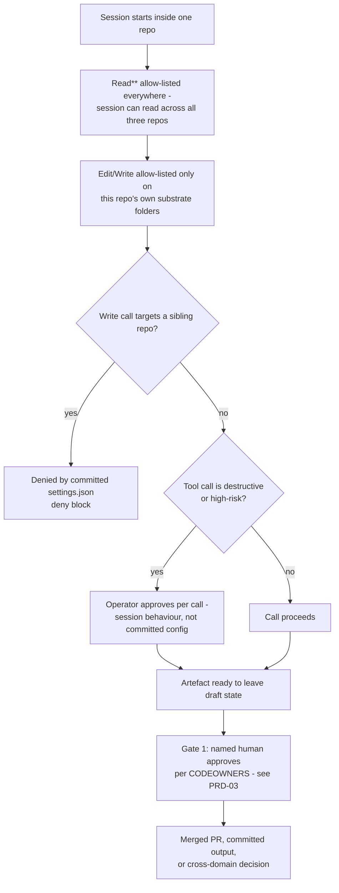

## 1. Intent

An agent session can read the whole harness but can only change the surface
it belongs to, and nothing executable enters the toolchain without a named
human having pinned exactly what it is. The permission surface and the
supply-chain surface are both committed configuration, so both travel with
the repository rather than depending on any one operator's habits; neither
one claims to cover more of the tool's actual behaviour than a committed
file can.

## 2. Problem & evidence

A harness that lets an agent read across a three-repo set for context, but
write only inside the repo it was launched in, needs that boundary to hold
independent of which human is at the keyboard on a given day, the same
requirement PRD-02's loading model states for reading, applied here to
writing. And a harness that lets an operator install a plugin marketplace
or an MCP server needs the same discipline applied to code and tooling that
an adopter did not write: something a named human audited and pinned,
rather than whatever a URL happened to resolve to on the day someone typed
`claude plugin install`.

`docs/concepts.md` names the two places this discipline actually sits, and
is explicit about the limit of what a committed file can do for the second
one: "Each repo's `.claude/settings.json` ships a permissions block that
does the part a committed file can do. It allow-lists `Read(**)` across the
workspace; it allow-lists Edit and Write against that repo's own substrate
folders, and Edit alone on its root `CLAUDE.md`; and it denies Write into
the sibling repos' paths. A session can therefore read across the
three-repo set and write only inside its own. What the file does not
encode is the rest of the tool gate: destructive calls are approved one at
a time by the operator, which is session behaviour rather than committed
configuration." (`organisationos-foundation/docs/concepts.md`, line 53.)

That caveat sets the evidence bar for this whole PRD: a committed
`.claude/settings.json` or `.mcp.json` can be read, quoted, and checked for
internal consistency, but it cannot, by itself, prove what a running
session actually did when someone approved a tool call.

## 3. Outcomes

- Reading any of the three repositories' `.claude/settings.json` tells a
  reviewer, without running anything, which folders a session in that repo
  may write to and which two sibling repos it may not.
- No plugin marketplace or plugin version reaches a session without a
  commit SHA or version string named in committed configuration, and any
  install outside that mechanism is documented as needing a CDR.
- A reviewer auditing `.mcp.json` can tell, from the file alone, what
  review policy an MCP server entry is meant to pass before it is added,
  even before any entry exists.
- Adopter-facing guidance that would otherwise live only in a wiki page or
  a Slack message instead ships inside the config file it explains, so it
  travels with every clone and every fork.

## 4. Non-goals

- Defining how a session comes to be launched with a given repo's
  `additionalDirectories` reach, or how Foundation's own rules load into a
  sibling session's context. PRD-02 owns loading mechanics; this PRD takes
  the resulting reach as given and describes what a session may then do
  with it.
- Defining the review-gate identities, CODEOWNERS bindings, or the
  proposer-cannot-approve escalation ladder. PRD-03 owns the publish gate;
  this PRD is scoped to the second gate concepts.md names, the tool-call
  gate, and cites PRD-03's CODEOWNERS evidence rather than re-deriving it
  where the two gates share a mechanism (the two-approver block on
  `.claude/` and `.mcp.json`).
- Defining or re-verifying the banned-string check, back-flow review, or
  any other confidentiality enforcement mechanism. PRD-04 owns
  confidentiality; where this PRD's evidence touches the same file
  (`external-work-claude-md.md`) it cites PRD-04's own finding rather than
  re-establishing it independently.
- Defining the command and subagent definitions a session's tool calls
  actually invoke. PRD-12 owns those definitions; this PRD describes the
  permission surface they run inside, not their content.
- Building or specifying a mechanism that verifies, at runtime, that a
  session was actually launched with the flags a template document
  recommends, or that an approved tool call matched a reviewer's
  expectation. Section 8 records this as open; nothing in the harness
  closes it.

## 5. Solution sketch

Two gates sit downstream of PRD-03's publish gate and upstream of it in
time: a session's tool calls happen throughout the work, before any
artefact reaches the moment PRD-03 governs. The first of the two,
`docs/concepts.md`'s "two gates" language calls the publish gate; the
second is the tool-call gate this PRD specifies. The tool-call gate itself
has two halves with different durability: a committed half (the
`.claude/settings.json` permissions block, present in all three
repositories) that a reviewer can read without running anything, and a
session-behaviour half (per-call operator approval of destructive actions,
and the actual scope of any `--add-dir` mount a launch command names) that
no committed file can observe or guarantee.

The supply-chain surface sits inside the same committed file: a
marketplace pinned by commit SHA, `strictKnownMarketplaces: true` so no
other marketplace is trusted, and a plugin version pin, with the review
discipline for both documented in a `_notes` array shipped inside the
config rather than in a separate document. `.mcp.json` carries the same
committed-versus-documented split: it ships empty, so at template state
every claim about MCP review, loopback restriction, and the external-work
allow-list is `_notes` policy with nothing yet for it to apply to.

Key rules:

- `Read(**)` is allow-listed identically in all three repositories; a
  session's write reach is the only thing that narrows per repository.
- A repository's deny block never names its own paths: it names both
  siblings, because a session already cannot write outside its allow list
  inside its own tree, and the deny block's job is specifically the
  cross-repo case.
- `strictKnownMarketplaces: true` makes an unlisted marketplace
  categorically untrusted; a pin on the one listed marketplace is a
  separate, narrower guarantee about which version of that marketplace's
  content is trusted.
- A `_notes` array is documentation shipped inside otherwise-executable
  configuration, not a field any of this PRD's mechanisms read back; its
  own last entry, in every file that carries one, instructs that it is
  removed before a real adoption commits the file.
- The external-work template's tool-call framing (`--add-dir` as the
  read-only mount and a restricted MCP allow-list) is the same tool-call
  gate concept applied to Pattern A specifically, not a third, separate
  gate.

Important states: the template state, as published: every marketplace
ref and plugin version a literal placeholder string, `_notes` still
present in every file, `.mcp.json`'s `mcpServers` object empty; the
adopter-bound state, once real handles, a real commit SHA, and a real
version pin replace those placeholders; and the state this PRD's evidence
cannot reach from a committed file alone: a session actually running
under these settings, approving or declining a destructive call.

Alternatives rejected:

- **A single harness-wide `.claude/settings.json` shared across all three
  repositories.** Rejected because the three repos have genuinely
  different substrate folders to allow-list, and a shared file would have
  to either union all of them (granting every repo write reach into every
  other repo's substrate paths, defeating the deny block's purpose) or
  fall back to some external per-repo override the harness does not ship.
- **Enforcing the deny block with a runtime hook rather than a static
  permissions list.** Rejected as a materially different, heavier
  mechanism than what ships: a hook would need to run inside every
  session, on every write, in a way the current design leaves to the
  tool's own permission surface instead of a harness-authored check.
- **A separate schema-validated marketplace-and-plugin manifest, outside
  `.claude/settings.json`.** Rejected because it would duplicate a
  mechanism the tool itself already reads from that one file, adding a
  second file to keep in sync for no capability the current shape lacks.

## 6. Requirements

### FR-13.1 — Two gates, not one

Status: CONVENTION
Evidence: `organisationos-foundation/docs/concepts.md`, "Two gates, not
one" section (lines 49-53): "A human gates the publish. Every artefact
that leaves a draft state ... passes a named human ..." and "A human gates
high-risk tool calls. The publish gate is necessary but not sufficient: an
agent reading external content can be steered into a destructive action
before any publish moment." `organisationos-foundation/standards/templates/external-work-claude-md.md`
line 24 cross-references the same section by name rather than restating
it: "Tool-call gate: read tools default-allow; write tools require
allowlist; destructive tools require per-call approval (see
`docs/concepts.md` → Two gates, not one)."

The harness MUST document two independent human gates: one that gates
every artefact leaving a draft state (the publish gate, PRD-03's scope),
and one that gates high-risk or destructive tool calls during a session
(the tool-call gate, this PRD's scope), with the second justified as
necessary because the first alone cannot catch an agent steered into a
destructive action before any publish moment occurs.

- `docs/concepts.md` names both gates under one heading and states the
  reason the second exists, rather than leaving it as an unexplained
  addition to the first.
- The external-work template cross-references the same section by name at
  the point it applies the tool-call gate to Pattern A specifically,
  rather than restating or re-deriving the model.
- **Status qualifier (A17-2, security-relevant, owned by another session,
  recorded here, not fixed):** the same template that cross-references
  this model separately calls the `--add-dir` mount "OS-level isolation,
  fail-closed" (line 30), states "nothing outside this list is visible to
  the session" (line 32), and states unlisted content "stays hidden by
  default" (line 45). `--add-dir` is a Claude Code permission-surface flag
  that grants a session access to a named directory; it is not an
  operating-system sandbox, and nothing in the tool enforces that content
  outside the named list is actually invisible to a session running under
  some other configuration. Pattern A's tool-call gate, as documented,
  rests on this overstated sentence. PRD-04's FR-04.7 records the same
  finding from the confidentiality side; this is the same defect recorded
  here from the permissions side, not a second, independent finding.
- Nothing in the harness measures whether a given session was actually
  launched with the documented flags, or whether an operator's per-call
  approval was informed rather than reflexive; both are session behaviour,
  not something a committed file can observe.

### FR-13.2 — Per-repository allow-list, own substrate only

Status: SHIPPED
Evidence: all three `.claude/settings.json` files, read in full on
2026-09-08. Foundation's `permissions.allow`: `Edit(./standards/**)`,
`Write(./standards/**)`, `Edit(./cross-domain-decisions/**)`,
`Write(./cross-domain-decisions/**)`, `Edit(./interfaces/**)`,
`Write(./interfaces/**)`, `Edit(./nfrs/**)`, `Write(./nfrs/**)`,
`Edit(./architectural-decisions/**)`, `Write(./architectural-decisions/**)`,
`Edit(./.github/**)`, `Write(./.github/**)`, `Edit(./CLAUDE.md)`,
`Read(**)`. Leadership's `permissions.allow`: `Edit(./cadence/**)`,
`Write(./cadence/**)`, `Edit(./strategy/**)`, `Write(./strategy/**)`,
`Edit(./steward/**)`, `Write(./steward/**)`, `Edit(./CLAUDE.md)`,
`Read(**)`. Domain's `permissions.allow`: `Edit(./domain-*/**)`,
`Write(./domain-*/**)`, `Edit(./CLAUDE.md)`, `Read(**)`.

Each repository's committed `.claude/settings.json` MUST allow-list
`Read(**)` across the workspace, and MUST allow Edit and Write only against
that repository's own substrate folders plus Edit alone on its root
`CLAUDE.md`.

- Foundation's list names six substrate folders
  (`standards`, `cross-domain-decisions`, `interfaces`, `nfrs`,
  `architectural-decisions`, `.github`), each with both Edit and Write.
- Leadership's list names three (`cadence`, `strategy`, `steward`), each
  with both Edit and Write.
- Domain's list names one glob (`domain-*`), with both Edit and Write.
- All three, and only all three, share `Edit(./CLAUDE.md)` (Edit, not
  Write) on the root file and `Read(**)`; every other allow-list entry
  differs by repository.

### FR-13.3 — Writes into sibling repos denied by committed config

Status: SHIPPED
Evidence: all three `.claude/settings.json` files, `permissions.deny`
blocks, read in full on 2026-09-08. Foundation denies
`Write(../organisationos-domain/**)` and
`Write(../organisationos-leadership/**)`. Leadership denies
`Write(../organisationos-foundation/**)` and
`Write(../organisationos-domain/**)`. Domain denies
`Write(../organisationos-foundation/**)` and
`Write(../organisationos-leadership/**)`.

Each repository's committed `.claude/settings.json` MUST deny Write into
both sibling repositories' paths.

- Each of the three deny blocks names exactly its two siblings and never
  its own tree; no deny block overlaps with that repository's own allow
  list.
- This PRD records only that the deny rule is present and structurally
  correct in all three committed files, verified by direct read on
  2026-09-08. Live behaviour, whether a running session actually honours
  these entries against an attempted cross-repo write, was not probed
  here; per `docs/concepts.md`'s own account (quoted at FR-13.1), a
  committed file encodes only "the part a committed file can do." and the
  rest of the tool gate is session behaviour that this PRD's evidence does
  not reach.

### FR-13.4 — Marketplace pinned by commit SHA, `strictKnownMarketplaces`

Status: CONVENTION for substituting the marketplace pin (closed 2026-09-15,
was `GAP`); SHIPPED for the pin mechanism's shape as it ships
Evidence: all three `.claude/settings.json` files carry an identical
`marketplaces` block: `{"name": "anthropic-official", "url":
"https://github.com/anthropics/claude-code-plugins", "ref":
"REPLACE-WITH-AUDITED-COMMIT-SHA"}`, and an identical
`"strictKnownMarketplaces": true`. Each file's `_notes` array states the
policy directly: "Pin to a marketplace ref (commit SHA), not a
tag/label."; "strictKnownMarketplaces blocks any marketplace not
explicitly listed."; "Any non-marketplace install (URL, zip, local path)
requires a CDR."

The harness MUST pin its plugin marketplace by commit SHA rather than a
mutable tag or label, MUST set `strictKnownMarketplaces: true` so no
unlisted marketplace is trusted, and MUST document that a non-marketplace
plugin install requires a CDR.

- All three files carry the identical marketplace entry and
  `strictKnownMarketplaces: true`, confirmed by direct comparison of the
  parsed JSON across all three, not by inspecting one and assuming the
  rest match.
- The `_notes` array states what `strictKnownMarketplaces` does and the
  CDR requirement for anything outside the marketplace mechanism, in the
  same file the mechanism lives in.
- **Closed 2026-09-15 (finding N2).** The `ref` field ships as the literal
  placeholder string `REPLACE-WITH-AUDITED-COMMIT-SHA`, not an actual
  commit SHA (confirmed: `grep -n "REPLACE-WITH-AUDITED-COMMIT-SHA"`
  against all three files, foundation line 29, leadership line 23, domain
  line 19). "Pinned by commit SHA" is the mechanism's shape as shipped, not
  its state: substituting a real SHA is still a step an adopter has to
  take. Before this wave, nothing in `docs/setup-org.md`'s documented setup
  path named or caught this: Step 3's placeholder sweep matched only the
  literal string `<adopter-org>`, Step 4's matched only `placeholder-`
  inside `.github/CODEOWNERS`, and a search of the entire `docs/` tree for
  `REPLACE-WITH-AUDITED-COMMIT-SHA` returned no hits outside the three
  settings files themselves. `docs/setup-org.md` now carries "Also in Step
  3 — pin the plugin supply chain," which names both
  `REPLACE-WITH-AUDITED-COMMIT-SHA` and `<pinned-version-or-ref>` directly
  and instructs setting both before deleting the `_notes` array, and
  `.github/scripts/setup-check.sh`'s check 2 fails with "file(s) still
  carry an unsubstituted supply-chain pin" if either literal remains in
  any of the three `.claude/settings.json` files.
  **This stops at `CONVENTION`, not `ENFORCED (local)`.** `setup-check.sh`
  is adopter-run: nothing compels running it, and it executes on a
  workstation before any CI exists to gate against. Claiming a local locus
  here would borrow the credibility of this PRD set's 17 existing
  local-locus claims, each of which sits behind a check something actually
  invokes. The script's own correctness is a separate, and separately
  enforced, claim: its fixture suite (`setup-check.test.sh`) runs in
  Foundation's own CI and passed at run `35324985628` — that run verifies
  the checker works, not that any adopter has run it. An adopter who
  completes `docs/setup-org.md` Step 3 but skips the optional Step 10
  verification still finishes setup with an unsubstituted supply-chain
  pin and no CI job to flag it — documentation and a script now exist,
  but nothing compels either being used. This moves the finding from
  `GAP` to `CONVENTION` in section 8, not to `ENFORCED (local)`.

### FR-13.5 — Plugin version pinned; pin bumps are two-approver PRs

Status: SHIPPED, with the pin-bump procedure recorded as CONVENTION below
Evidence: all three `.claude/settings.json` files carry an identical
`plugins` block: `{"superpowers": {"marketplace": "anthropic-official",
"version": "<pinned-version-or-ref>"}}`. The `_notes` array states the
procedure: "Pin bumps are two-approver PRs (Admin + Leader) per
.github/CODEOWNERS." `organisationos-foundation/.github/CODEOWNERS` line
29 names `/.claude/` with `@placeholder-admin @placeholder-leader`, the
same two-approver entry PRD-03's FR-03.4 records for Foundation's
substrate paths generally.

Each repository's committed `.claude/settings.json` MUST pin each
installed plugin's version, and a change to that pin MUST be documented as
requiring two approvers.

- The `version` field's shape and placement is identical across all three
  files, confirmed by direct comparison of the parsed JSON.
- As shipped, the version pin is the same kind of placeholder as FR-13.4's
  marketplace ref (`<pinned-version-or-ref>`, not a real version string):
  the config shape exists; substituting a real value is an adopter step,
  not something the template state already carries out.
- The two-approver procedure for an actual pin bump rests on the same
  `.claude/` CODEOWNERS entry PRD-03's FR-03.4 documents, and inherits that
  requirement's status exactly: advisory until branch protection is
  separately and deliberately configured (`docs/setup-org.md` Step 7).
  Nothing this PRD's own evidence names checks that a merged pin-bump PR
  actually carried two distinct approvals, which is why the procedure
  half of this requirement is recorded as `CONVENTION` rather than
  `SHIPPED`, even though the config field it governs is `SHIPPED`.

### FR-13.6 — `.mcp.json` committed, Admin-reviewed, restricted by policy

Status: CONVENTION
Evidence: `organisationos-foundation/.mcp.json` (the only `.mcp.json` in
the three-repo set, confirmed absent from Leadership and Domain).
`mcpServers` is an empty object (`{}`). Its `_notes` array, quoted
verbatim: ".mcp.json is committed and Admin-reviewed (same two-approver
rule as .claude/settings.json)."; "Each MCP server entry is reviewed
against the external-work boundary (Foundation CLAUDE.md →
Confidentiality): what data leaves the org boundary when this MCP is in
scope?"; "Localhost-bound MCP or worker services get a firewall treatment:
block external interface bindings; restrict to loopback only.";
"External-work sessions (--add-dir to harness) use a restricted MCP
allow-list — web-fetch, scraping, write-back, email/Slack MCPs are blocked
by default." `organisationos-foundation/standards/templates/external-work-claude-md.md`
line 25 restates the same allow-list claim from the Pattern A side: "MCP
allow-list: only the MCPs explicitly listed in `.mcp.json` of this repo
are active during sessions with `--add-dir` to the harness. Web-fetch,
scraping, email, Slack, and write-back MCPs are blocked by default."

The repository that ships MCP server configuration MUST commit
`.mcp.json`, MUST document that each entry is reviewed against the
external-work boundary, MUST document that a localhost-bound MCP is
restricted to loopback, and MUST document that an external-work session
gets a restricted MCP allow-list.

- Only Foundation ships `.mcp.json`; Leadership and Domain carry none, so
  every claim below applies to one file, not three.
- `.mcp.json`'s two-approver review claim, its confidentiality-boundary
  review question, its loopback restriction for localhost-bound servers,
  and its external-work allow-list are stated in `_notes`, and the
  allow-list claim is independently restated (not merely cross-referenced)
  in the external-work template.
- What is policy versus mechanism: every claim above is documentation,
  `_notes` in one file and prose in another, and `mcpServers` ships empty.
  Nothing in this harness's CI reads `.mcp.json`'s contents, checks that a
  future localhost-bound entry is actually loopback-restricted, or
  programmatically restricts an external-work session's MCP set; and with
  no entry yet configured, there is nothing yet for any of this policy to
  have been applied to.

### FR-13.7 — `_notes` fields are documentation shipped inside config

Status: SHIPPED
Evidence: all three `.claude/settings.json` files and
`organisationos-foundation/.mcp.json` each carry a `_notes` array. Each
settings.json's array ends: "Remove the \_notes field before committing
in a real adoption — it is documentation, not config." `.mcp.json`'s array
ends with different wording: "Remove \_notes before committing in a real
adoption." A search of Foundation's `.github/workflows/` for any reference
to `settings.json` or `_notes` returns no hits.

Every config file in this PRD's scope that carries adopter-facing guidance
MUST keep that guidance inside a `_notes` array shipped alongside the real
configuration, rather than in a separate document, and MUST instruct that
`_notes` is removed before committing in a real adoption.

- All four files (three `settings.json`, one `.mcp.json`) carry a `_notes`
  array, and each array's final entry is an explicit removal instruction,
  though the two file types' removal wording is not identical
  character-for-character.
- Quiet defect, if found: nothing in this harness's own CI reads,
  schema-validates, or checks the removal of `_notes` from either file
  type. Anything that consumed these files strictly, a JSON-Schema
  validator or a future, stricter build of the tool itself, would need
  to tolerate an unknown top-level key neither file's own `$schema`
  reference defines. Nothing in the harness today exercises that path in
  either direction, so whether such a consumer would tolerate or reject
  the field is unverified, not merely unenforced.

## 7. Dependencies & constraints

- **PRD-02** owns the loading model that determines what reach a session
  actually has before this PRD's permissions block narrows what it may do
  with that reach: the `additionalDirectories` mechanism, its relative-path
  anchor, and the CLAUDE.md chain a session's context is built from.
- **PRD-03** owns the publish gate, the CODEOWNERS bindings, and the
  two-approver floor's enforcement status; this PRD cites the same
  `.claude/` CODEOWNERS entry for FR-13.5's pin-bump procedure rather than
  re-deriving PRD-03's finding that the floor is advisory until branch
  protection is configured.
- **PRD-04** owns confidentiality enforcement and the back-flow boundary,
  including the `external-work-claude-md.md` template this PRD also cites
  for FR-13.1 and FR-13.6. FR-04.7 records the A17-2 finding on the
  confidentiality side; this PRD records the same finding at FR-13.1 on
  the permissions side, without re-verifying it a second, independent way.
- **PRD-12** owns the command and subagent definitions that run inside the
  permission surface this PRD describes; this PRD does not describe what
  those commands or agents do.
- **External constraint — `--add-dir` is a permission surface, not a
  sandbox.** Nothing in Claude Code itself makes content outside a named
  `--add-dir` path inaccessible in an operating-system sense; the
  isolation the external-work template describes is a mounting convention
  a launch command follows, not a guarantee the tool enforces. This is the
  same external constraint PRD-04 names for its own evidence.
- **External constraint — `.claude/settings.json`'s permissions block is
  read by the tool, not validated against a published schema by anything
  in this harness's CI.** The `$schema` line each file carries
  (`https://json.schemastore.org/claude-code-settings`) points at an
  external, unversioned reference this harness does not control or pin.
- **External constraint — GitHub CODEOWNERS and branch protection.** The
  two-approver procedure FR-13.5 documents for pin bumps depends on the
  same external constraints PRD-03 names: CODEOWNERS satisfies a path rule
  with one approval from any listed owner, and branch protection is the
  separate, deliberate configuration surface that turns that into an
  actual count.

## 8. Known gaps & open questions

- **CONVENTION, closed 2026-09-15 (N2) — unsubstituted supply-chain
  placeholders ship in all three settings files; nothing compels catching
  them.** `REPLACE-WITH-AUDITED-COMMIT-SHA` and `<pinned-version-or-ref>`
  both ship in every `.claude/settings.json`. Before this wave,
  `docs/setup-org.md`'s Step 3 sweep matched only `<adopter-org>` and Step
  4's matched only `placeholder-` inside CODEOWNERS, and no check named
  either literal. `docs/setup-org.md` now names both directly ("Also in
  Step 3 — pin the plugin supply chain") and `.github/scripts/
  setup-check.sh` fails if either remains — but `setup-check.sh` is run at
  an adopter's discretion, not compelled by anything, so an adopter who
  completes Step 3 but skips verification can still finish with both pins
  unsubstituted. See FR-13.4.
- **Status qualifier, not closed here — A17-2.** FR-13.1's central
  tool-call-gate claim for Pattern A external-work sessions rests on
  `external-work-claude-md.md`'s overstated description of `--add-dir` as
  "OS-level isolation, fail-closed". The file is owned by another
  workstream and is not edited by this PRD. PRD-04's FR-04.7 records the
  same finding independently, from the confidentiality side.
- **Open question — no mechanism verifies a pin-bump PR actually carried
  two distinct approvals.** FR-13.5's procedure names the CODEOWNERS
  entry; nothing this PRD's evidence names checks who approved a given
  merged pin-bump PR, or whether two role labels resolved to two different
  people. This is the same open shape PRD-03's section 8 records for the
  publish gate generally, applied here to one specific PR type.
- **Open question — `.mcp.json`'s review policy has nothing configured to
  apply to yet.** `mcpServers` ships empty; every claim in FR-13.6 is
  `_notes` policy for an MCP entry that does not exist in the template.
  Whether the loopback restriction or the external-work allow-list would
  actually be honoured once a real entry is added is untested by
  construction.
- **Open question — whether a strict consumer of these files would
  tolerate or reject `_notes`.** FR-13.7's quiet defect is recorded as
  unverified rather than as a confirmed break: nothing in this harness
  exercises a schema-strict reader against either file type, in either
  direction.

## 9. Rebuild guide

This section assumes PRD-02's loading model and PRD-03's CODEOWNERS
bindings already exist. It produces the state PRD-13 alone is responsible
for: the per-repository permission surface and the supply-chain pinning
inside `.claude/settings.json`, and the review policy inside `.mcp.json`.

1. Write `docs/concepts.md`'s "Two gates, not one" section, naming the
   publish gate and the tool-call gate and stating plainly why the second
   is necessary given the first.
2. In each of the three repositories' `.claude/settings.json`, write a
   `permissions.allow` block: `Read(**)`, then Edit and Write against that
   repository's own substrate folders, then `Edit` alone on the root
   `CLAUDE.md`.
3. In the same three files, write a `permissions.deny` block naming
   `Write` into both sibling repositories' paths, never the repository's
   own tree.
4. Add an identical `marketplaces` block to all three files, naming the
   marketplace and a `ref` field intended to hold an audited commit SHA,
   and set `strictKnownMarketplaces: true`.
5. Add an identical `plugins` block naming each installed plugin's
   marketplace and a `version` field intended to hold a real pin.
6. Add a `_notes` array to each of the three files documenting the pin
   discipline, the CDR requirement for non-marketplace installs, the
   pin-bump procedure, and the instruction to remove `_notes` before a
   real adoption commits the file.
7. Ship `.mcp.json` in Foundation only, with an empty `mcpServers` object
   and a `_notes` array documenting Admin review against the external-work
   boundary, loopback restriction for localhost-bound servers, and the
   restricted MCP allow-list for external-work sessions.
8. Write the external-work template's tool-call-gate line, cross-
   referencing `docs/concepts.md` rather than restating it, and its
   `--add-dir` mount instructions, noting, for whoever maintains that
   file, that its isolation language currently overstates what the flag
   does (A17-2), a correction this PRD does not make.

After this alone: a session in any of the three repositories can read the
whole harness, by committed configuration, and can write only inside its
own substrate folders; no plugin marketplace or plugin version reaches a
session without a named field in that same file, though at template state
those fields are still placeholders. What stays open: whether an adopter
actually substitutes the marketplace SHA and version pins before a real
session runs (nothing in the documented setup path catches it if they do
not); whether a pin bump or an `.mcp.json` entry is ever reviewed by two
distinct people rather than one person under two labels (depends on
PRD-03's branch-protection step, not on anything this PRD adds); and
whether the `--add-dir` mount Pattern A's external-work sessions rely on
actually isolates what its own template claims (open, owned elsewhere,
tracked at FR-13.1).

## 10. Provenance & verification

**Method.** All seven `specifies:` files were read in full, directly from
the working trees, on 2026-09-08, against Foundation tag `v1.1.2`. Every
`_notes` array and every JSON field quoted in section 6 was additionally
verified with `python3 -c "print(repr(open(...).read()))"` (or an
equivalent parsed-JSON comparison across all three settings files) rather
than by eye. The `docs/concepts.md` "Two gates, not one" quotation and the
`external-work-claude-md.md` line citations were verified the same way,
against the cited line numbers.

**Loci.** Every claim in this PRD rests on a direct file read; none rests
on live GitHub state gathered by this PRD itself. Where a claim shares a
mechanism with PRD-03 (the `.claude/` CODEOWNERS two-approver entry, the
branch-protection-dependent enforcement status), this PRD cites PRD-03's
own section and does not re-run PRD-03's live `gh api` checks.

**Limits.** FR-13.3's deny blocks and FR-13.1's tool-call gate were checked
only as committed configuration: no session was launched to attempt an
actual cross-repo write or an actual destructive call, and neither
requirement claims otherwise. FR-13.7's quiet defect is recorded as
unverified in either direction, since no schema-strict consumer of either
file type was run against it. A17-2 (FR-13.1) is recorded as a status
qualifier, not corrected, since the source file is owned by another
workstream; PRD-04's FR-04.7 is the independent verification of the same
finding from the confidentiality side, cited here rather than duplicated.

**2026-09-18 — FR-13.4 moved from `GAP` to `CONVENTION`.** N2 closed:
`docs/setup-org.md`'s "Also in Step 3 — pin the plugin supply chain" now
names both supply-chain literals, and `.github/scripts/setup-check.sh`
checks 2 fails if either remains unsubstituted, verified by reading both
files directly. The status stops at `CONVENTION` rather than `ENFORCED
(local)` because nothing compels an adopter to run `setup-check.sh` —
it is a discretionary local script, not a check something invokes.
`setup-check.test.sh`'s own passing run (`35324985628`) verifies the
checker's logic, a separate claim from whether any adopter runs it.
