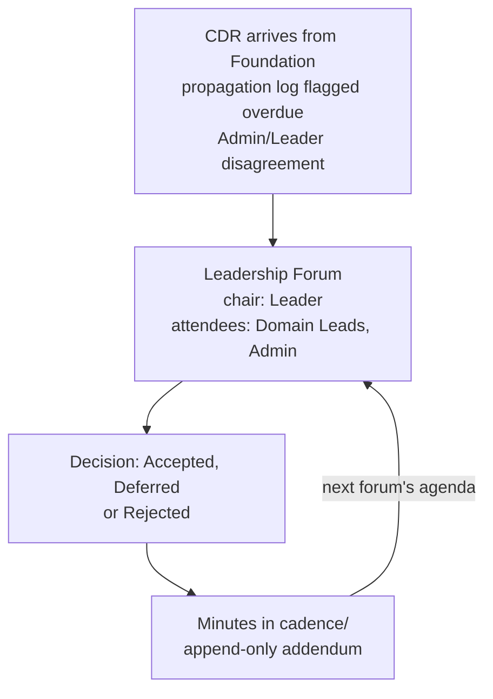

## 1. Intent

Cross-domain direction is set, reviewed, and closed in one visible rhythm,
so steering happens on the record instead of in side channels. The
constraint this must not violate: a decision that reaches more than one
domain, or a change to organisation-level priorities, is never adopted or
confirmed anywhere other than the standing body every affected Domain Lead
can see.

## 2. Problem & evidence

An organisation running several domains needs somewhere that cross-domain
decisions get approved, propagation gets checked, and strategy gets tested
against what domains actually report back — otherwise those three things
happen wherever it is convenient: a hallway conversation, a chat thread, an
email chain that only some Domain Leads are on. `docs/concepts.md` gives the
Leader's ownership of this directly: "**Leader** — owns cross-domain
alignment and strategy. Chairs the Leadership Forum, approves CDRs,
co-signs harness changes. Does not commit inside any single domain."
(`organisationos-foundation/docs/concepts.md` line 40.) Without a standing
body carrying that ownership, the same
one-person-two-hats scarcity PRD-03 documents for review gates would recur
here undocumented: nothing would say who reviews a stalled propagation
action, or where a strategy disagreement between the Admin and the Leader
gets recorded rather than argued out privately.

## 3. Outcomes

- A cross-domain decision has one standing body that approves it, on a
  known cadence, with a named chair and a stated quorum.
- The propagation log is reviewed at that body's own meetings, not only
  scanned by automation between them.
- Every meeting produces minutes that live in the same place the
  propagation log does, so a reader checking one naturally finds the other.
- Org-level strategy has one folder, distinct from any domain's plans and
  from Foundation's cross-domain decisions, and is dated so a later reader
  can see what changed and why.
- A disagreement between the Admin and the Leader, or a propagation action
  running late, has one named surface it reaches rather than staying
  unresolved in private.

## 4. Non-goals

- Defining the propagation mechanics themselves — the CDR-to-domain flow,
  `promotion-lint`, and `propagation-sla.yml`'s detection logic. PRD-07 owns
  that; this PRD covers only the Forum's own role in confirming it.
- Defining the monthly maintenance issue, the drift log's format, or the
  Admin's stewardship loop. Those belong to the PRD covering harness
  stewardship.
- Prescribing which cadence, quorum, or decision rule an adopter runs.
  `cadence/README.md` ships one worked shape and instructs the adopter to
  replace it; this PRD documents that shape, not a mandate to keep it.
- Prescribing a strategy document's internal structure. `strategy/README.md`
  lists common shapes an adopter may choose between; none is required.
- Building any check that a Forum meeting actually happened, that minutes
  were filed on time, or that a strategy revision was genuinely tested
  against domain reality. Nothing in this PRD's evidence executes; section 6
  says so per requirement.

## 5. Solution sketch

The Leadership Forum is a standing body, not a one-off meeting: a chair
(the Leader), a fixed attendee set (Domain Leads, the Admin), a decision
rule, and a quorum, all stated once in `cadence/README.md` rather than
re-negotiated each time it convenes. Its recurring job is threefold: approve
or defer cross-domain decisions reaching it from Foundation, review the
propagation log to see which accepted decisions are still owed downstream
work, and record both as minutes in the same folder the log lives in.
Strategy sits alongside it on a slower clock: the Leader owns it, and a
revision is tested against what the Forum's Domain Leads report before it
is adopted, rather than being declared unilaterally.

Key rules:

- Minutes are append-only. A correction is a new addendum, not an edit to a
  past entry.
- The propagation log and the Forum's minutes live in the same folder
  (`cadence/`) so reviewing one naturally surfaces the other; a reader is
  never sent to a second repository to check whether an accepted decision
  is still open.
- Strategy revisions are dated, not overwritten — a later reader can see
  what the current position is and what it replaced.
- Two distinct escalation paths reach the Forum: a disagreement between the
  Admin and the Leader, and a propagation action that has run more than 30
  days past its stated deadline.

Important states: template state, where `cadence/` holds only a README and
an empty propagation-log skeleton and `strategy/` holds only a README — the
state this PRD's evidence was read against; the adopted state, once an
organisation has replaced the cadence block with its own shape and begun
filing dated minutes; and the escalated state, reached whenever a
disagreement or an overdue propagation action is added to the next
meeting's agenda instead of resolved elsewhere.

Alternatives rejected:

- **No standing body — CDRs approved by whichever reviewers CODEOWNERS
  names on the Foundation PR.** Rejected because propagation review and
  strategy testing have no natural home on a pull request; they need a
  recurring point where the whole Domain Lead set looks at the log
  together, not a per-PR reviewer set that never all meets at once.
- **Minutes and strategy in the same folder.** Rejected because strategy
  moves on a slower clock than a monthly or fortnightly Forum, and
  `strategy/README.md` states plainly that Forum agendas are not strategy
  content: keeping them apart lets one be revised without touching the
  other's history.
- **A single escalation channel (everything routes through the drift
  log).** Rejected because the drift log covers harness health and
  Admin-Leader disagreement, not routine propagation timing; folding an
  overdue-deadline signal into it would blur the distinction
  `propagation-log.md`'s own rules already draw between propagation and
  drift.

## 6. Requirements

### FR-14.1 — Leadership Forum is the standing body for cross-domain decisions

Status: CONVENTION
Evidence: `organisationos-leadership/cadence/README.md`, "Adopted cadence"
section (lines 9–14): "**Forum name:** Leadership Forum (rename to fit
culture: Council, Forum, Round Table, etc.)"; "**Chair:** Leader";
"**Attendees:** Leader, Domain Leads, Admin. Product Owners attend when on
agenda. Per-domain stewards at scale."; "**Decision rule:** consent of
affected Domain Leads. Leader override after 2 stalled cycles."; "**Quorum:**
all affected Domain Leads present or formally delegated." The Minutes
template's "Agenda" list (lines 40–44) names "1. Propagation review (Admin
presents `propagation-log.md`)" and "2. CDR-NNN proposed by @<handle>" as
standing items, and its "Decisions" section (lines 46–48) records "CDR-NNN:
Accepted | Deferred | Rejected — rationale." `organisationos-foundation/docs/concepts.md`
line 40 names the chair's ownership directly: "**Leader** — owns
cross-domain alignment and strategy. Chairs the Leadership Forum, approves
CDRs, co-signs harness changes. Does not commit inside any single domain."

The Leadership Forum MUST exist as a standing body with a named chair, a
fixed attendee set, a stated decision rule and quorum, and MUST review the
propagation log and decide on pending cross-domain decisions at every
meeting.

- `cadence/README.md`'s "Adopted cadence" block names the chair (Leader),
  the attendees (Leader, Domain Leads, Admin, with Product Owners and
  per-domain stewards as conditional additions), the decision rule, and the
  quorum, as one documented shape rather than an ad-hoc arrangement.
- The Minutes template's Agenda opens with propagation review and a CDR
  decision item, so both recur on the record rather than being raised only
  when someone remembers.
- Nothing named in this PRD's evidence checks that a meeting matching this
  shape occurred, that the stated quorum was met, or that a decision
  recorded as "Accepted" followed the stated consent rule; the cadence is
  documented and expected, not verified by any mechanism.

### FR-14.2 — Minutes live in cadence/ alongside the propagation log

Status: SHIPPED for the file that exists (the folder and the propagation
log it holds); CONVENTION for the practice of filing minutes and treating
the log as the Forum's own review artefact — no minutes file exists at
template state.
Evidence: `organisationos-leadership/cadence/` at template state holds
exactly two files: `README.md` and `propagation-log.md` (verified by
directory listing, 2026-09-08); no `YYYY-MM-DD.md` minutes file is present.
`cadence/README.md`'s "File pattern" section (lines 25–26): "`YYYY-MM-DD.md`
— minutes of each forum. Commit within one working day." and
"`vocabulary-YYYY-MM-DD.md` — output of any vocabulary workshop." The
Minutes template's closing sections (lines 50–51) read "## Open propagation
actions" followed by "(Cross-link to `propagation-log.md`)." `organisationos-leadership/CLAUDE.md`,
"Rules specific to Leadership": "Leadership Forum minutes in `cadence/` are
append-only. Corrections are addenda, not edits." The root `README.md`'s
worked example states the same practice concretely: "At the next Leadership
Forum, the Leader reviews `cadence/propagation-log.md` to confirm all three
implementation PRs have merged. The outcome is recorded as an addendum in
the Forum minutes."

Minutes and the propagation log MUST live in the same folder
(`cadence/`), each minutes file MUST follow the `YYYY-MM-DD.md` pattern and
be append-only, and the Minutes template MUST cross-link to the propagation
log rather than duplicating its content.

- The `cadence/` folder, as shipped, contains the propagation log and its
  documented format; the minutes file pattern and template are documented
  in the same README, but no dated minutes file exists yet at template
  state.
- The Minutes template's own structure points at `propagation-log.md`
  instead of repeating its rows, so the two files stay a single source of
  truth between them rather than two copies that can drift.
- `CLAUDE.md`'s append-only rule is stated as a Leadership-specific rule,
  restated in the repo's own file rather than only in a linked Foundation
  document; nothing checks at commit time that a past minutes entry was
  never edited.

### FR-14.3 — strategy/ holds org-level priorities, OKRs and position papers

Status: CONVENTION
Evidence: `organisationos-leadership/strategy/README.md` line 3: "Long-lived
strategic direction for this organisation. The Leader commits here.
Strategy revisions are tested against domain reality at the Leadership
Forum before being adopted." Same file, "What does NOT live here" (lines
15–17): "Per-domain plans — those live in each domain."; "Cross-domain
decisions — those are CDRs in `../organisationos-foundation/cross-domain-decisions/`.";
"Forum agendas — those live in `../cadence/`." The "Versioning" section
(line 21): "Strategy is dated. When a strategy file is revised, add a
`## YYYY-MM-DD — revision` heading at the top documenting what changed and
why. Do not overwrite history; old strategy informs why current strategy is
what it is."

Org-level strategic content (priorities, OKRs, position papers) MUST live
in `strategy/`, MUST be owned by the Leader, and each revision MUST be
dated rather than overwriting prior history.

- `strategy/README.md` names the Leader as the committer and states that
  revisions are tested against domain reality at the Forum before adoption.
- The same file draws three explicit boundaries (domain plans, CDRs, Forum
  agendas), each pointing to where that content lives instead, so a reader
  cannot mistake the folder's scope.
- At template state, `strategy/` holds only its README; no strategy content
  file of any kind has been committed. The folder's structure (single file,
  per-theme, or per-horizon) is left to adopter choice, not prescribed.
- The dating rule is documented, not enforced; no check in this PRD's
  evidence verifies that a revision heading was added or that history was
  never overwritten.

### FR-14.4 — Escalations surface at the Forum

Status: CONVENTION
Evidence: `organisationos-leadership/steward/drift-log.md` line 10:
"Admin/Leader disagreements, recorded here when escalated at the Leadership
Forum (`cadence/`)." `organisationos-leadership/cadence/propagation-log.md`
line 21: "Items unchecked >30 days past their deadline are surfaced by
`propagation-sla.yml` as issues; the Admin escalates at the next Leadership
Forum."

An Admin/Leader disagreement and a propagation action more than 30 days
past its deadline MUST both be recorded as reaching the Leadership Forum for
resolution, via two distinct documented paths.

- The drift log names the Forum as the place an Admin/Leader disagreement
  is escalated to, distinct from the drift log's own routine drift-tracking
  entries.
- The propagation log names the Forum as the place the Admin escalates an
  overdue action, once `propagation-sla.yml` has surfaced it as an issue —
  the detection and issue-opening mechanism itself is PRD-07's FR-07.4,
  cross-referenced here rather than re-verified.
- Both paths are stated as what the Admin does at the next Forum meeting;
  nothing named in either file's evidence checks that either kind of
  escalation was actually raised or resolved once the Forum convened.

## 7. Dependencies & constraints

- **PRD-03 (role model)** defines the Leader role this PRD assumes: chairing
  the Forum, approving CDRs, and owning strategy are the Leader's function
  as PRD-03 states it; this PRD does not redefine the role, only the body
  the Leader chairs.
- **PRD-07 (promotion and propagation flow)** owns the propagation mechanics
  the Forum reviews. FR-07.5 already states, and this PRD cross-references
  rather than restates, that "the propagation cycle for an accepted CDR
  MUST close only when the Leadership Forum has seen every implementation
  PR merged and marks the propagation-log entry complete." FR-07.4's
  overdue-item detection is the mechanism FR-14.4 names as the source of one
  of the Forum's two escalation paths.
- **The PRD covering harness stewardship** owns the drift log's own format
  and the monthly maintenance issue in full; this PRD cites the drift log
  only for the single line naming the Forum as the escalation surface for
  an Admin/Leader disagreement.
- **External constraint — nothing in GitHub or Claude Code observes a
  meeting.** A Forum meeting is a human event with no corresponding CI run,
  webhook, or committed artefact other than the minutes a human chooses to
  write afterward; every requirement in this PRD is consequently
  `CONVENTION`, and no future mechanism named elsewhere in the harness
  changes that without a new check being built specifically to observe it.

## 8. Known gaps & open questions

- **GAP — nothing checks that minutes were filed within the stated one
  working day, or at all.** `cadence/README.md`'s "File pattern" states the
  timing; no workflow named anywhere in this PRD set's evidence reads
  `cadence/` for a missing or late minutes file.
- **GAP — nothing verifies the append-only rule.** `CLAUDE.md` states
  corrections are addenda, not edits; no pre-commit hook or CI check in
  either repository rejects a diff that edits a past minutes entry.
- **Open question — no threshold for when the documented cadence stops
  fitting.** `cadence/README.md` offers "fortnightly for <20 people or
  split-session for 50+" as adjustment points, mirroring PRD-03's own
  unmeasured Admin-split threshold, but nothing measures an adopter's actual
  headcount or flags when the default shape no longer fits.
- **Open question — the two escalation paths are documented separately and
  never cross-checked against each other.** An organisation could accumulate
  both kinds of escalation in the same period with no single view showing
  both at once; nothing in this PRD's evidence combines them.

## 9. Rebuild guide

This section assumes PRD-01's three repositories and PRD-03's role model
already exist. It produces the state PRD-14 alone is responsible for: a
named standing body, a minutes location, a strategy folder, and two
documented escalation paths — with no verification wired on top of any of
them.

1. Write `cadence/README.md`'s "Adopted cadence" block: name the Forum, its
   chair (the Leader), its attendee set, its decision rule, and its quorum,
   as one block an adopter is expected to replace with their own shape
   rather than a fixed mandate.
2. Add a Minutes template to the same file, with an Agenda that opens on
   propagation review and pending CDR decisions, and a Decisions section
   recording each as Accepted, Deferred, or Rejected.
3. State the minutes file pattern (`YYYY-MM-DD.md`, committed within one
   working day) and the append-only rule, restating the latter in the
   repository's own `CLAUDE.md` rather than leaving it only in this README.
4. Create `strategy/README.md` naming the Leader as committer, the Forum as
   the place revisions are tested against domain reality, the dating rule
   for revisions, and the three kinds of content that do not belong there
   (domain plans, CDRs, Forum agendas).
5. Add the drift log's single line naming the Forum as the destination for
   an escalated Admin/Leader disagreement, and the propagation log's line
   naming the Forum as the destination for an overdue propagation action,
   once the PRDs covering those two files exist.

After this PRD alone: a reader knows who chairs the Forum, what it decides,
where its minutes and the propagation log both live, where strategy lives
and how it is dated, and which two situations are expected to reach the
Forum. What stays open: no meeting has ever been observed to happen on this
cadence, no minutes file exists, no strategy content beyond the README has
been written, and nothing checks that either escalation path was actually
followed. Those all remain human practice, not mechanism, until an adopter
runs the cadence and later PRDs build a check for whichever part of it a
review decides is worth verifying.

## 10. Provenance & verification

Files specified by this PRD (`specifies:` above) are `cadence/README.md` and
`strategy/README.md`, both read in full on 2026-09-08 against Foundation tag
`v1.1.2` (commit `d70bafc8`, identical to `v1`). `cadence/README.md` was last
touched by commit `224fb782` (2026-08-26); `strategy/README.md` by commit
`503a9746` (2026-08-21); both durable history on `organisationos-leadership`'s
own `main` branch.

All four requirements are `CONVENTION`, consistent with this PRD's subject:
a meeting rhythm and two folders, neither of which has any CI or hook
watching it. FR-14.1 and FR-14.3 rest on reading the two specified files
directly. FR-14.2's split status rests on a directory listing of `cadence/`
at template state (two files present, no minutes file) alongside the same
README's documented pattern — a structural fact and a documented practice,
kept distinct rather than collapsed into one status. FR-14.4 rests on one
line each from `steward/drift-log.md` (commit `8bb2c85a`, 2026-08-26) and
`cadence/propagation-log.md` (commit `503a9746`, 2026-08-21), cited for
evidence though neither file is claimed in this PRD's own `specifies:` list
— `cadence/propagation-log.md` belongs to PRD-07's, and `steward/drift-log.md`
to the PRD covering harness stewardship. Its cross-reference to FR-07.5 and
FR-07.4 points at PRD-07's own section 6, not at any revision of it.

No `ENFORCED` or `GAP` status appears in section 6: nothing here is
executable logic to run red or green, and nothing describes a mechanism the
harness intends but has not built — the Forum and the strategy folder are
exactly as documented, at exactly the maturity the evidence shows. A
re-verifier needs only the two specified files, the two evidence-only files
named above, `organisationos-foundation/docs/concepts.md` line 40, and
PRD-07's and PRD-03's own text — all resolvable from the three published
repositories alone, with no live GitHub state, no seeded input, and no
substitution of any kind in this PRD's method.
