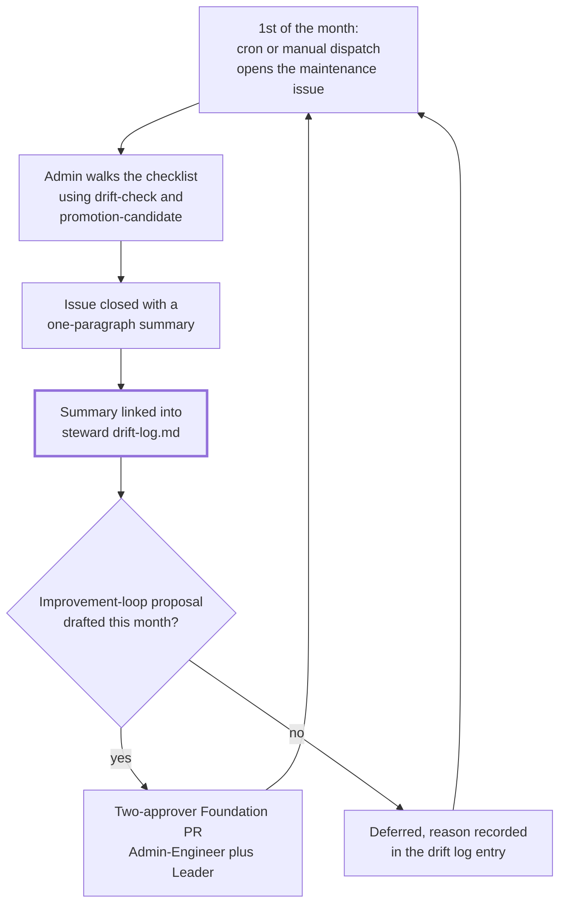

## 1. Intent

The harness has one named person on the hook every month for noticing drift,
and one channel for turning what they notice into a change, so maintenance
is a rhythm rather than a rescue. The constraint this must not violate:
harness health must never depend on someone happening to remember to look.

Three materially different solutions could satisfy this without being what
the harness ships: no assigned cadence at all, where drift is noticed
whenever someone stumbles on it; a CI check that blocks merges until some
computed harness-health metric clears a threshold, mechanising a judgment
call that only a human reviewing several domains at once can actually make;
or a shared, unowned responsibility distributed across every role with no
single date and no single name, so a slow month produces no signal that
anyone should have looked. The harness's own answer is one of several ways
to meet the intent, which is what keeps this an intent rather than a
solution mandate: a monthly issue assigned to one named Admin, walked
against a fixed checklist, closed into a running log, with one harness
change a month as the improvement channel.

## 2. Problem & evidence

`organisationos-foundation/docs/setup-org.md` Step 8 — The monthly
maintenance issue — states the cadence directly: "On the 1st of every
month, the Admin walks a checklist: stale
`CLAUDE.md` files, stale interfaces, stalled propagations, accumulated
drafts, the banned-pattern list, plugin pins." `organisationos-foundation/CLAUDE.md`
line 79 ties a specific artefact's own clock to the same event: "Drafts have
a 14-day shelf life; the monthly DRI loop sweeps them." Both statements
assume the same thing: something opens on a fixed date, someone specific
reads it, and other parts of the harness (draft staleness among them) rely
on that reading actually happening rather than being merely documented.

The obstacle is that "the Admin walks a checklist monthly" is a sentence,
not a mechanism, unless something opens the issue without anyone having to
remember the date, names who is on the hook without anyone having to
remember who that is, and gives the resulting finding somewhere to live that
outlasts the issue itself. Without the first, the checklist is read whenever
someone thinks of it. Without the second, an unassigned issue is nobody's
issue. Without the third, a finding closed with the issue is a finding lost
with the issue: the next month starts from nothing, and a `references.md`
row or a stale `CLAUDE.md` that was flagged once and never fixed has no
record showing it was ever flagged at all.

## 3. Outcomes

- An issue opens on the 1st of every month from the Leadership repo's own
  checklist template, without anyone having to remember the date.
- The issue is assigned to whichever handle the `ADMIN_HANDLE` repository
  variable names, so responsibility for that month is not left implicit.
- A second dispatch in the same month, however triggered, finds the month's
  issue already open and exits without creating a duplicate.
- Closing the issue produces a durable record: a one-paragraph summary
  linked from the drift log, so a finding survives past the issue that
  raised it.
- The drift log accumulates as the harness's own health backlog, kept
  visibly distinct from the propagation log that tracks cross-domain
  decisions instead of harness maintenance.
- At most one harness change a month moves from noticed to proposed, as a
  two-approver Foundation pull request, so the improvement channel has a
  fixed cadence rather than accumulating unboundedly or never firing.

## 4. Non-goals

- The propagation log's own format and the CDR-to-domain flow it tracks.
  PRD-07 owns that; this PRD cites the drift log only to draw the boundary
  between the two logs, not to describe propagation mechanics.
- The reusable-workflow-and-pinned-caller delivery pattern itself: why a
  shared check lives once in Foundation and is called by tag elsewhere.
  PRD-10 owns that pattern in general; this PRD assumes it for the monthly
  issue's own reusable-and-caller pair without re-deriving it.
- The `drift-check` and `promotion-candidate` command files' own invocation
  surface, model bindings, and internal logic. PRD-12 owns those command
  definitions; this PRD names them only as the two tools the Admin's monthly
  session reaches for.
- The Leadership Forum's own cadence, chair, and decision rule, and the
  Admin/Leader escalation path the Forum resolves. PRD-14 owns the Forum;
  this PRD's drift log carries one line naming the Forum as an escalation
  destination, cross-referenced there rather than redefined here.
- Any measurement of whether the checklist's own items (stale `CLAUDE.md`,
  stale interfaces, stale wiki content) are individually correct thresholds.
  Those numbers are named in the checklist itself; this PRD covers the
  cadence and the record it produces, not whether 90 days or 14 days is the
  right cutoff for any one line.

## 5. Solution sketch

The cycle starts with an issue, not a memory. Foundation ships a reusable
workflow that opens one issue a month by title-searching for it first. The
Leadership repo owns the cadence, the checklist, and the assignee, and
calls that reusable by a pinned tag rather than carrying its own copy of the
opening logic. The Admin (or a per-domain steward, at scale) walks the
resulting checklist using two session tools: `drift-check` to scan every
domain's `CLAUDE.md` and scaffolding for drift, and `promotion-candidate` to
find practices recurring across domains. Then the Admin closes the issue
with a one-paragraph summary. That summary is not the record; it is a
pointer to one. The actual record is an entry in `steward/drift-log.md`,
the file this PRD treats as the harness's own rolling backlog of health
findings, kept apart from the propagation log next door that tracks a
different kind of item entirely. One line in the same checklist asks for at
most one harness change a month, drafted as a two-approver Foundation pull
request: the improvement loop's own fixed cadence, so it neither stalls
silently nor proposes without limit.

Key rules:

- The issue-opening mechanism searches for this month's title before
  creating anything, so a second dispatch in the same month, whether
  scheduled, manual, or accidental, never produces a duplicate issue.
- An unset `ADMIN_HANDLE` does not block the issue from opening; it opens
  unassigned instead, so a missing configuration step degrades to "nobody
  named" rather than "nothing happens."
- The drift log and the propagation log occupy the same `steward/`-adjacent
  neighbourhood but are never the same file: the drift log is harness
  health, named by the Admin; the propagation log is cross-domain decision
  tracking, named by the Leader and the Forum.
- The improvement loop is capped at one proposal a month by the checklist's
  own wording, not enforced by anything that counts proposals across a
  Foundation pull-request history.

Important states: an unopened month (no issue yet, cron or manual dispatch
both still pending); an open, unwalked issue (assigned or not, checklist
unstarted); a walked, closed issue (summary written, drift-log entry filed);
and a month with an improvement proposal in flight (a Foundation pull
request open, referenced from that month's drift-log entry until it merges
or is deferred with a stated reason).

Alternatives rejected:

- **A CI job that opens a pull request against `steward/drift-log.md`
  directly, computing findings automatically.** Rejected because every
  checklist line names a judgment call (is this `CLAUDE.md` actually stale,
  or just short) that the harness deliberately leaves to the Admin reading
  several domains at once, the same reasoning the checklist's own items
  apply individually.
- **One combined log for both propagation and drift.** Rejected for the
  reason PRD-14 already records for the Forum's own escalation paths: the
  two failure modes (a decision stuck downstream, a harness artefact going
  stale) have different owners and different clocks, and folding them
  together would blur a distinction the drift log's own file states in its
  first paragraph.
- **An improvement loop with no monthly cap, proposing whenever the Admin
  notices something.** Rejected because an unbounded channel either floods
  Foundation's two-approver gate with small changes or, more likely,
  produces nothing because no single moment ever feels like the right one;
  a fixed monthly slot forces the question even in a quiet month.

## 6. Requirements

### FR-15.1 — Monthly maintenance issue opens and assigns to `ADMIN_HANDLE`

Status: SHIPPED
Evidence: `organisationos-leadership/.github/workflows/monthly-dri.yml`
carries the schedule (`cron: '0 9 1 * *'`) and passes
`assignee: ${{ vars.ADMIN_HANDLE }}` and
`body-file: .github/ISSUE_TEMPLATE/monthly-dri.md` to Foundation's reusable.
`organisationos-leadership/README.md` line 60 states the unset case in the
same sentence as the mechanism: "assigns it to the handle in the
`ADMIN_HANDLE` repository variable"; "If the variable is unset the issue
opens unassigned". `organisationos-foundation/docs/setup-org.md` Step 8 —
The monthly maintenance issue
(`gh variable set ADMIN_HANDLE --body "the-admins-github-handle" -R
"$ORG/organisationos-leadership"`) is the adopter step that sets it.

Checked live on 2026-09-08 ~11:59 UTC: `gh api
repos/2SSilver/organisationos-leadership/actions/variables` returns
`{"variables":[],"total_count":0}`. No variable is set on the published
template repository, consistent with it being an adopter-time step, not
shipped content. `gh api
repos/2SSilver/organisationos-leadership/actions/permissions` returns
`{"enabled":false,...}`, and `gh api
repos/2SSilver/organisationos-leadership/actions/workflows/342810212/runs`
(the id of Leadership's own `monthly-dri` workflow) returns
`{"total_count":0,"workflow_runs":[]}`: the workflow's own `state` field
reports `active` in the workflows listing, but that field records whether
GitHub would accept a dispatch, not whether the repository's Actions are
enabled. That is a different field entirely, read from
`actions/permissions`. With the repository-level flag `false`, the cron has
never fired, and no manual dispatch has ever been recorded either.

Foundation's own reusable has been exercised directly: `gh api
repos/2SSilver/organisationos-foundation/actions/workflows/342796207/runs`
(checked in the same window) lists exactly two runs, both `event:
workflow_dispatch`, both `conclusion: success`, both against Foundation's
own `main` branch, 2026-08-26T11:06:19Z and 2026-08-26T11:06:48Z. The
earlier run's log shows `ASSIGNEE: 2SSilver`, `BODY_FILE: README.md`, and
ends "Opened `https://github.com/2SSilver/organisationos-foundation/issues/4`";
`gh issue view 4` confirms the resulting issue carries `2SSilver` as its
assignee. Both runs demonstrate the underlying open-and-assign logic
executing correctly in CI, with two disclosed substitutions: the dispatch
supplied an explicit `ASSIGNEE` input rather than reading
`vars.ADMIN_HANDLE`, and `BODY_FILE` pointed at Foundation's own `README.md`
rather than Leadership's issue template, since Foundation carries no
`monthly-dri.md` of its own. Neither run has `event: workflow_call`, so
neither shows Leadership's caller invoking the reusable at all. The
unassigned branch (empty `ASSIGNEE`) has never been observed on any run on
any of the three published repositories.

The system MUST open an issue from the Leadership checklist template on the
1st of every month, assigned to the `ADMIN_HANDLE` repository variable's
value where one is set, and unassigned where it is not.

- The caller workflow and the reusable it calls are both present and wired
  as described; the reusable's own open-and-assign logic has been observed
  executing correctly in CI, twice, on Foundation directly.
- Neither run was triggered by Leadership's own cron or caller, and
  Leadership's own workflow has zero recorded runs of any kind. The cron
  path named in this requirement has never fired on the published
  repository.
- The unassigned-on-unset branch is documented (README, setup-org.md) but
  has not been observed executing on any run this evidence names.

### FR-15.2 — Idempotent per month: a re-run exits without a duplicate

Status: ENFORCED (CI)
Evidence: `organisationos-foundation/.github/workflows/monthly-dri.yml` line
11: "(or closed) exits 0 without creating a duplicate."
`organisationos-leadership/.github/workflows/monthly-dri.yml` line 7: "the
reusable exits without creating a duplicate if this month's issue exists."

The two runs FR-15.1 names form the isolated pair this status requires.
Run `32961622047` (created 2026-08-26T11:06:19Z) and run `32961663454`
(created 2026-08-26T11:06:48Z, 29 seconds later) are the same workflow, on
the same branch, in the same repository, dispatched with identical inputs
(`ASSIGNEE: 2SSilver`, `BODY_FILE: README.md`); the only thing that
differs between them is whether this month's issue already existed. The
earlier run's log ends "Opened
`https://github.com/2SSilver/organisationos-foundation/issues/4`" (issue #4
created at 2026-08-26T11:06:25Z, between the two run starts); the later
run's log ends "Issue 'Monthly maintenance check — 2026-08' already exists
— nothing to do." with exit code 0 and overall `conclusion: success`. Both
directions of the title-search-then-create-or-skip logic were observed
producing the correct outcome in the same live window, isolating the one
variable this status requires.

The system MUST NOT create a second issue for a month that already has one
open (or closed).

- Given no issue titled for the current month exists
  When the workflow runs (`32961622047`)
  Then it creates one and reports its URL
- Given an issue titled for the current month already exists
  When the workflow runs again, 29 seconds later, with identical inputs
    (`32961663454`)
  Then it reports the existing title and exits 0 without creating another

### FR-15.3 — Admin walks the checklist, closes with a summary linked from the drift log

Status: CONVENTION
Evidence: `organisationos-leadership/.github/ISSUE_TEMPLATE/monthly-dri.md`
line 23: "Close this issue with a one-paragraph summary linked from
`steward/drift-log.md`." `organisationos-leadership/steward/drift-log.md`
line 25 states the same rule from the log's own side: "The monthly
maintenance issue (see README) closes with a one-paragraph summary linked
from this file." `organisationos-leadership/README.md` line 60 restates it
a third time in the repo's own top-level documentation: "The Admin walks the
checklist and closes the issue with a one-paragraph summary linked from
`steward/drift-log.md`."

The checklist itself (the same file, lines 11–21) carries eleven items,
confirmed by `grep -c '^- \[ \]'` against the live file: stale `CLAUDE.md`,
stale interfaces, stalled propagation, stale wiki content, accumulated
drafts, banned-pattern-list additions, `FORMATS.md` changes, template
retirement candidates, plugin/MCP pin review, the improvement-loop
proposal, and a commit-volume sanity check.

The Admin MUST walk every checklist item before closing the issue, and MUST
close it with a one-paragraph summary linked from `steward/drift-log.md`.

- The closing instruction appears verbatim in three places (the issue
  template, the drift log's own rules, and the repo README) rather than
  being stated once and assumed to travel.
- Nothing named in this PRD's evidence checks that a closed issue's summary
  paragraph actually exists, that it is one paragraph rather than zero or
  several, or that the link it names actually resolves to a drift-log entry
  for that month.
- Walking eleven items is a human judgment pass; no item on the list is
  itself computed by this requirement's own mechanism, only surfaced by it.

### FR-15.4 — The drift log is the harness-health backlog, distinct from the propagation log

Status: SHIPPED
Evidence: `organisationos-leadership/steward/drift-log.md` line 3: "This is
**not** the CDR propagation tracker — that lives in
`../cadence/propagation-log.md`." Its "What goes here" section (lines 5–10)
names four categories: monthly-maintenance findings, improvement-loop
proposals ("the one-harness-change-per-month the Admin-Engineer drafts as a
Foundation PR.", line 8), harness-substrate change reasoning, and Admin/Leader
disagreements escalated at the Leadership Forum ("recorded here when
escalated at the Leadership Forum (`cadence/`).", line 10). Its "Format"
section (lines 12–21) fixes a per-month entry shape: a `## YYYY-MM` heading,
a drift-found line per finding with an action or "monitoring", an
improvement-proposal line with a PR link or "deferred, reason", and a free
"Notes" line for escalations. Its "Rules" section (lines 23–27) states the
closing link (FR-15.3), the two-approver routing (FR-15.5), and an optional
annual archive to `_archive/drift-log-YYYY.md`.

At template state the file carries no entries: its "Current state" section
(line 31) reads "Replace this section with the current state. At adoption
time, this file is empty save for these instructions."

The system MUST provide a single file that is the harness's rolling record
of health findings and improvement proposals, structurally distinct from
the file tracking cross-domain propagation.

- The file's own opening paragraph draws the boundary explicitly, naming
  the other file by path rather than leaving the distinction implicit.
- The format and the four content categories are fixed and documented; the
  file exists, is wired into the closing instruction FR-15.3 names, and
  carries no live content at template state. That is the shape this status
  distinguishes from a mechanism whose logic has actually run.
- Nothing in this requirement's evidence checks that an entry filed here
  matches the fixed format, or that the categories it lists are exhaustive
  of what an Admin might file.

### FR-15.5 — One harness change a month, as a two-approver Foundation pull request

Status: CONVENTION
Evidence: `organisationos-leadership/.github/ISSUE_TEMPLATE/monthly-dri.md`
line 20: "**Improvement-loop proposal** — one harness change drafted as a PR
(skill, CI rule, template, or none with rationale). Admin-Engineer cadence
visible artefact." `organisationos-leadership/steward/drift-log.md` line 26:
"Harness improvement proposals route to Foundation as two-approver PRs
(Admin + Leader)."

The system MUST cap the improvement-loop proposal at one harness change per
monthly cycle, drafted by the Admin-Engineer and opened as a Foundation
pull request requiring two approvers.

- The checklist explicitly allows "none with rationale" as a valid monthly
  outcome, so a quiet month records a deliberate decision not to propose
  rather than silence indistinguishable from forgetting.
- The two-approver routing is stated once, in the drift log's own rules,
  and is the same Foundation pull-request gate PRD-10's reusable-and-caller
  pattern already requires for any change to shared CI logic; this
  requirement names the cadence that feeds that gate, not a separate one.
- Nothing named in this PRD's evidence counts proposals across a Foundation
  pull-request history to confirm the cap is ever actually one, or checks
  that a given PR's own drift-log entry names it correctly.

### FR-15.6 — `drift-check` and `promotion-candidate` are the Admin's monthly session tools

Status: CONVENTION
Evidence: this status covers their use as part of the monthly cycle; the
command files themselves are PRD-12's territory, cited here rather than
re-verified.
`organisationos-foundation/.claude/commands/drift-check.md`'s
closing section: "A report tool. It does not auto-PR fixes. The Admin reads
the report and decides what to action — typically as the next monthly DRI
close-out." `organisationos-foundation/.claude/commands/promotion-candidate.md`'s
closing section: "Not a promotion executor. The Admin reads the report and
decides whether to PR a promotion." and "Promotions are two-approver PRs
touching Foundation (Admin + Leader per CODEOWNERS)."

An open question this PRD records rather than resolves: `coverage-check.sh`
(the script that confirms every harness file in the three published
repositories is claimed by at least one PRD's `specifies:` list) is not
itself wired into any CI workflow on any of the three repositories (a
tracked-content search for "coverage-check" across all three returns no
hit outside `steward/prds/` itself, where the script lives). `steward/prds/README.md`'s
own "Maintenance" section states its intended cadence: "`coverage-check.sh`
is re-run at the monthly DRI to confirm every harness file is still claimed
and every claim still resolves." That places the PRD set's own coverage
check inside the monthly maintenance cycle this PRD documents, run by a
human at the checklist rather than by any CI job, the same shape as
`drift-check` and `promotion-candidate` themselves.

The Admin's monthly session SHOULD reach for `drift-check` (per-domain
drift against the harness baseline) and `promotion-candidate` (cross-domain
recurrence, for practices worth promoting into Foundation) as the two
report tools behind several checklist items, and MAY additionally run
`coverage-check.sh` against the PRD set itself.

- Both commands' own closing sections name the monthly DRI close-out as
  their expected point of use, without either file mandating that use.
- Neither command auto-executes a fix; both name the Admin as the one who
  reads the report and decides what, if anything, becomes a PR. That is the
  same human-judgment shape FR-15.3's checklist walk and FR-15.5's
  improvement cap both carry.
- `coverage-check.sh`'s own cadence is undocumented anywhere except the PRD
  set's own README, and nothing checks that it is actually run in any given
  month; it is recorded here as an open question, not resolved.

## 7. Dependencies & constraints

- **PRD-03 (role model)** defines the Admin role and its Steward/Engineer
  split this PRD assumes rather than redefines: FR-03.7 records the split
  and the roughly-50-person threshold at which stewardship distributes to
  per-domain stewards, while the Engineer function (the one FR-15.5's
  improvement loop names) stays singular.
- **PRD-10 (CI architecture)** owns the reusable-workflow-and-pinned-caller
  pattern this PRD's FR-15.1 depends on: Foundation's `monthly-dri.yml`
  reusable, called by Leadership's caller at a pinned tag, is one instance
  of that general pattern, not a separate mechanism this PRD re-derives.
- **PRD-07 (promotion & propagation flow)** owns `cadence/propagation-log.md`,
  the file FR-15.4 names only to draw the boundary the drift log's own
  first paragraph states.
- **PRD-12 (harness commands)** owns `drift-check.md` and
  `promotion-candidate.md` themselves; FR-15.6 cites their stated role in
  the monthly cycle without describing their invocation surface or logic.
- **PRD-14 (Forum & strategy)** owns the Leadership Forum FR-15.4's fourth
  drift-log category (Admin/Leader disagreement) names as an escalation
  destination; this PRD does not restate the Forum's cadence or quorum.
- **External constraint — Leadership's Actions are disabled at the
  repository level.** `gh api repos/2SSilver/organisationos-leadership/actions/permissions`,
  checked 2026-09-08 ~11:59 UTC, returns `{"enabled":false,...}`. This is a
  different field from a workflow's own `state`, which the same reading
  reports as `active` for `monthly-dri`: the workflow is registered and
  would accept a dispatch if Actions were enabled, but the repository-level
  flag is what actually gates every run, and it is `false`. FR-15.1's cron
  has consequently never fired.
- **External constraint — the `<adopter-org>` placeholder.** Leadership's
  caller reads `uses: <adopter-org>/organisationos-foundation/.github/workflows/monthly-dri.yml@v1`;
  until an adopter substitutes a real organisation name, the caller cannot
  resolve the reusable at all, independent of the Actions-disabled
  constraint above. This is the same two-obstacle shape PRD-07, PRD-08 and
  PRD-09 record for their own sibling callers.
- **External constraint — no repository variable is set.** `gh api
  repos/2SSilver/organisationos-leadership/actions/variables`, same reading
  window, returns zero variables; `ADMIN_HANDLE` exists only as documented
  adopter-time configuration (`setup-org.md` Step 8 — The monthly
  maintenance issue), not as live state on the published template
  repository.

## 8. Known gaps & open questions

- **GAP — no live run of Leadership's own monthly-dri workflow exists.**
  FR-15.1 records zero recorded runs of any kind (scheduled or dispatched)
  against Leadership's own caller; the CI evidence this PRD cites for the
  underlying open-and-assign and idempotency logic comes from two direct
  dispatches of Foundation's reusable, not from Leadership's cron.
- **GAP — the unassigned-on-unset branch has never been observed
  executing.** Both live runs this PRD's evidence names supplied an
  explicit assignee; no run on any of the three repositories has exercised
  the empty-`ADMIN_HANDLE` path FR-15.1 also describes.
- **Open question — `coverage-check.sh`'s CI wiring.** FR-15.6 records that
  the PRD set's own coverage check runs only when a human runs it at the
  monthly maintenance issue, per `steward/prds/README.md`'s own stated
  cadence, and is wired into no CI workflow on any of the three published
  repositories. Whether it should be, and what would have to change for a
  scheduled or PR-triggered run to check it instead of an Admin remembering
  to, is left open here rather than decided.
- **Open question — nothing counts improvement-loop proposals against the
  one-per-month cap FR-15.5 states.** The checklist's own wording allows
  "none with rationale" as a valid outcome; nothing named in this PRD's
  evidence would catch a month that shipped two, or twelve.
- **Open question — nothing verifies a drift-log entry's format against
  the template FR-15.4 fixes,** or that a closed maintenance issue's summary
  paragraph actually links to one.

## 9. Rebuild guide

This section assumes PRD-01's three repositories, PRD-03's role model, and
PRD-10's reusable-and-caller pattern already exist. It produces the state
PRD-15 alone is responsible for: the monthly issue mechanism, the checklist,
the drift log, and the documented improvement-loop cadence.

1. In Foundation, write `monthly-dri.yml` as a `workflow_call` reusable that
   title-searches for the current month's issue before creating one, so a
   second invocation in the same month is a no-op rather than a duplicate.
   Accept an `assignee` input (empty leaves the issue unassigned) and a
   `body-file` input naming the Markdown whose content, minus its
   frontmatter, becomes the issue body.
2. In Leadership, write a short caller carrying the schedule
   (`cron: '0 9 1 * *'`), `workflow_dispatch` for on-demand runs, and
   `issues: write` permission, passing `${{ vars.ADMIN_HANDLE }}` as the
   assignee and its own `.github/ISSUE_TEMPLATE/monthly-dri.md` as the
   body-file.
3. Write that issue template as a fixed checklist naming every stale-thing
   check the harness's other PRDs already define a clock for (drafts,
   interfaces, propagation, wiki content), plus the improvement-loop
   proposal line, plus a commit-volume sanity check; close with the
   instruction to summarise into `steward/drift-log.md`.
4. Write `steward/drift-log.md` with its own opening line distinguishing it
   from the propagation log, a fixed per-month entry format, and rules
   naming the closing-summary link and the two-approver Foundation-PR
   routing for improvement proposals.
5. Document the `ADMIN_HANDLE` repository-variable step in the org setup
   guide, and state plainly what happens if an adopter skips it: the issue
   still opens, unassigned.
6. Add a line to the same monthly checklist (or to the PRD set's own
   maintenance instructions, if a PRD set is being rebuilt alongside the
   harness) directing the Admin to run `coverage-check.sh` from
   `steward/prds/` at the same sitting, so the PRD set's own claim that
   every harness file is accounted for is re-checked on the same cadence as
   everything else the Admin reviews that day.

After this PRD alone: a named person is on the hook every month, an issue
opens without anyone remembering the date, a re-run cannot duplicate it, and
a closed month leaves a durable trace in a log that is not the propagation
log. What stays open: nothing has ever run this mechanism on Leadership's
own schedule, the unassigned path has never been observed, and nothing
counts whether the one-change-a-month cap or the coverage check's own
cadence are actually honoured in any given month.

## 10. Provenance & verification

Files specified by this PRD (`specifies:` above) were confirmed present with
`ls -la` on 2026-09-08; all four resolved without error. Last-touched
commits (`git log -1 --format="%H %ad" --date=short -- <path>`, same date):
Foundation's `monthly-dri.yml` at `a25fdc6e`, 2026-08-26; Leadership's
`monthly-dri.yml` and `.github/ISSUE_TEMPLATE/monthly-dri.md` both at
`224fb782`, 2026-08-26; `steward/drift-log.md` at `8bb2c85a`, 2026-08-26.
Foundation tag `v1.1.2` and tag `v1` both dereference (`git log -1
--format=%H`) to the same commit `d70bafc8`.

**Method.** FR-15.3, FR-15.4, FR-15.5, and FR-15.6 (`CONVENTION` and
`SHIPPED`) were verified by reading each cited file at its cited line, on
2026-09-08, against Foundation tag `v1.1.2`. FR-15.2 (`ENFORCED (CI)`) rests
on two live GitHub Actions runs read directly: `gh run view <id> --log` on
both `32961622047` and `32961663454`, isolating the one variable the pair
needed to differ on (see FR-15.2's own evidence block for the full
isolation argument, per this template's standing rule that a red/green pair
must be checked, not assumed, before being claimed). FR-15.1 (`SHIPPED`)
rests on the same two runs for the underlying mechanism, plus four `gh api`
reads of live repository state: Leadership's `actions/permissions`,
`actions/variables`, and the run history of both Leadership's own
`monthly-dri` workflow (id `342810212`) and Foundation's reusable (id
`342796207`), all read within the 2026-09-08 ~11:58–11:59 UTC window
recorded in section 6 and section 7. None of these calls write to a live
repository.

**Limits.** Live GitHub state is a point-in-time reading, distinct from the
file-based evidence above it, which does not drift the same way: another
session or an adopter could set `ADMIN_HANDLE`, flip Leadership's
Actions-enabled flag, or dispatch the workflow between this reading and the
next one. The two runs FR-15.1 and FR-15.2 cite are both direct
`workflow_dispatch` invocations of Foundation's reusable on Foundation's own
repository, not invocations of Leadership's own caller. Disclosed
substitutions are an explicit `ASSIGNEE` input in place of
`vars.ADMIN_HANDLE`, and Foundation's own `README.md` as `BODY_FILE` in
place of Leadership's issue template, since Foundation carries no
`monthly-dri.md` of its own to substitute instead. These substitutions do
not weaken FR-15.2's idempotency claim, since both runs used identical
inputs and differed only in whether the month's issue already existed; they
do bound FR-15.1's claim to the underlying open-and-assign logic rather
than to Leadership's specific cron, variable, and template ever having
fired together, which this PRD's evidence shows they have not. No run of
any kind (`workflow_call` included) has ever invoked the reusable other than
by the two direct dispatches this PRD cites, and no run has ever exercised
the unassigned-on-unset branch.

A re-verifier needs the four specified files, the `gh run view --log`
output for the two named run IDs, and the four `gh api` reads named above,
all resolvable against the three published repositories and their public
Actions history without any scratch path or working-branch state.
