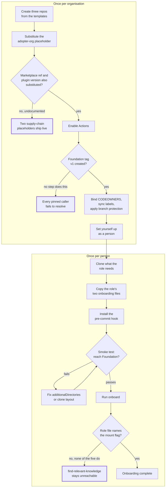

## 1. Intent

A stranger with a GitHub account can stand the whole harness up, and a new
joiner can become productive in it, from the three published repositories
alone. No folklore, no author on call. The constraint this must not
violate: no step in either setup path may depend on information that
exists only outside those three repositories, whether a plan, a design
specification, a task brief, or someone's memory of how the harness was
built.

Three materially different solutions could satisfy this without being what
the harness ships: documentation-only prose that trusts the reader to work
out sequencing and configuration unaided; an interactive installer that
prompts for every value and validates each step before the next; or a
consulting-led rollout where an expert configures each new adopter by hand
and no self-serve path exists at all. The harness's own answer (two
ordered Markdown guides, ten role-matched onboarding files, and three
landing-page READMEs) is one of several ways to meet the intent, which is
what keeps this an intent rather than a solution mandate.

## 2. Problem & evidence

Standing up a three-repository harness and then getting a new person
productive inside it are two different jobs, on two different clocks: one
happens once per organisation, the other happens every time someone joins
or changes role. Conflating them forces a new joiner to read organisation-
wide setup steps that do not apply to them, or forces the person setting
the organisation up to hunt for the one step relevant to them inside a
document written for individuals.

The documented path has changed shape twice already, both times correcting
something that looked complete and was not. Foundation `CHANGELOG.md`'s
2026-08-26 entry records the first correction: `docs/` added (concepts,
loading model, setup-org, setup-person) and the README rebuilt as a landing
page with a banner and diagrams. Every spec-section reference is gone: what
an adopter needs on Day 0 is now inlined, including the branch-protection
settings, and setup no longer depends on a specification that does not ship
with these repos. That correction removed a dependency on material outside
the three repositories; it did not, on its own, prove the remaining path
was correct.

Two further corrections landed together on 2026-09-01. One fixed all
thirteen shipped `additionalDirectories` examples across the three
repositories, including the five role-specific settings files this PRD
specifies: every one put the key at the top level of the settings JSON,
where it is silently ignored — valid JSON, exit 0, no warning, and the
granted directories are simply never applied. The other replaced the
once-per-person smoke test: it asked for a fact from `FORMATS.md`, which CI
mirrors byte-identical into all three repos, so a Domain-only clone with no
Foundation on disk answered it correctly and the test could never fail. The
probe now reads a file under Foundation's `standards/`, which Domain and
Leadership do not carry. The same sweep corrected the six sites across the
three role onboarding templates, the files a joiner copies verbatim, that
claimed Foundation's rules load automatically once it's a sibling repo.

That history is the evidence that the documented path is actively
maintained against real defects, not evidence that it is now defect-free.
As of 2026-09-08, this PRD records four further gaps in the same territory:
no step creates the Foundation tag every pinned Leadership and Domain
caller resolves against; two supply-chain placeholders ship unsubstituted
and neither setup document names them; none of the five role onboarding
files names the mount flag that the retrieval command three of them
instruct a joiner to run depends on; and branch protection, documented as a
per-repo floor, is absent on all three published repositories today.

## 3. Outcomes

- A stranger with GitHub admin rights on a fresh owner can read
  `docs/setup-org.md` once, top to bottom, and reach the point where they
  hand off to their own once-per-person setup, in the roughly two hours the
  guide itself budgets.
- A joiner can read `docs/setup-person.md` once and finish with a working
  pre-commit hook, a smoke test that can fail, and a drafted 30-day
  onboarding plan, in the roughly thirty minutes the guide budgets.
- Every one of the five committer roles has a matched pair of onboarding
  files to copy, rather than hand-authoring a settings file or a personal
  overlay from a blank page.
- The one placeholder the setup guide actually sweeps (`<adopter-org>`) is
  substituted before any workflow depending on it is enabled, so that
  caller never resolves against a dead reference.
- Branch protection is stated as the per-repo floor it actually is, with
  GitHub's own per-branch limitation disclosed rather than glossed over.
- Each repository's README functions as a landing page a stranger can
  navigate without any other context: what this repo is, where to start,
  what lives here, one worked example.
- The four-document docs set is sufficient, on its own, to complete both
  paths, with the caveat, recorded below, that four specific gaps mean a
  fully literal walkthrough today does not succeed without additional
  steps the guide does not name.

## 4. Non-goals

- The technical behaviour of the three reach mechanisms an onboarded
  session actually uses (`@import`, the mount flag, the settings-file
  entry). PRD-02 owns that; this PRD covers only whether the onboarding
  path leads a joiner to configure and use them correctly.
- The five-role model and the CODEOWNERS binding those roles rest on.
  PRD-03 owns that; this PRD assumes the binding exists and covers only
  the adopter-facing step (`setup-org.md` Step 4) that performs it.
- The reusable-workflow-and-pinned-caller pattern's general design and why
  a shared check lives once in Foundation. PRD-10 owns that; this PRD
  covers only what an adopter following the documented setup path must do
  for a caller's pin to resolve.
- The shared commands' own invocation surface, model bindings and internal
  logic. PRD-12 owns those; this PRD covers only whether the onboarding
  material actually leads a joiner to reach and use them.
- The marketplace-pin and plugin-pin mechanism's own design. PRD-13 owns
  that; this PRD covers only whether the documented setup path catches an
  unsubstituted pin.
- Actually applying or technically enforcing branch protection. This PRD
  records what the setup guide states and what the live repositories show;
  building an enforcement mechanism GitHub's per-branch model cannot
  natively express is out of scope for any PRD in this set.

## 5. Solution sketch

Two ordered guides, not one. `docs/setup-org.md` is walked once, by
whoever will be Admin, and ends by handing that same person to
`docs/setup-person.md`, the guide everyone, including that person,
follows afterwards. Splitting the two by cadence means a new joiner never
has to skip past organisation-wide steps that do not apply to them, and the
person standing the organisation up follows exactly one extra guide rather
than a second copy of the first.

The primary flow runs `setup-org.md`'s ten steps in order: create the
three repositories from their templates, clone them as siblings, substitute
the `<adopter-org>` placeholder, bind CODEOWNERS to real handles, enable
Actions, sync labels, apply branch protection, enable the monthly
maintenance issue, install the pre-commit hook, and hand off to
`setup-person.md`. That second guide runs five steps in order: clone what
the role needs, copy the role's two onboarding files, install the hook,
smoke-test the session, and run `/onboard`.

Key rules:

- Every cross-repo path in the harness assumes sibling clones with the
  exact repository names; the layout, not any configuration toggle, is
  what makes those paths resolve at all.
- Placeholder substitution precedes enabling Actions in the guide's own
  step order, because a workflow that names an unsubstituted placeholder
  in its own `uses:` line cannot resolve regardless of anything else being
  correct.
- Each role's own onboarding pair, not the generic repo-root example, is
  the correct file to copy. The generic example ships an empty
  `additionalDirectories` list on purpose, so that copying it produces a
  session that starts and reaches nothing, rather than one that reaches
  the wrong thing.
- A wrong install is silent by the underlying reach mechanisms' own design
  (see PRD-02); the smoke test is the one point in the whole path built to
  fail on purpose when the install is wrong.

Important states: an unconfigured organisation (no repos created yet); an
organisation configured but no person set up (Step 10 of `setup-org.md`
pending); a person configured but not yet smoke-tested; and a person
smoke-tested and onboarded, with a dated 30-day plan on file.

Alternatives rejected:

- **One combined guide covering both organisation setup and person
  onboarding.** Rejected because the two happen on different cadences: once
  ever, versus once per hire or role change. Merging them would force
  every new joiner to read organisation-wide steps that do not apply to
  them.
- **An automated setup wizard that runs all ten organisation steps
  unattended.** Not built, because several steps require a human decision
  the harness cannot make on an adopter's behalf: which real handles bind
  to CODEOWNERS, and whether the organisation runs Pattern A or Pattern B.
- **Generating each role's `additionalDirectories` list dynamically from a
  role registry instead of shipping ten static files.** Not built, because
  it would require tooling this harness does not ship; a static, readable
  pair is copy-paste simple and auditable by opening it.

## 6. Requirements

### FR-16.1 — Once-per-organisation setup is a single ordered ten-step guide

Status: SHIPPED
Evidence: `organisationos-foundation/docs/setup-org.md` numbers exactly ten
steps, Step 1 ("Create the three repos") through Step 10 ("Now set
yourself up as a person"), confirmed directly: `grep -c '^## Step'` on the
file returns 10. Its opening line: "This is the once-per-organisation path.
One person — usually the person who will be Admin — does it, once." Step
10 hands off explicitly: "Continue with 'Joining an organisation that runs
OrganisationOS' (`setup-person.md`), which covers your role's
`settings.local.json`, your `CLAUDE.local.md`, and the smoke test that
shows whether your session can reach Foundation — not whether its rules
are loaded."

An independent cold-start walkthrough of this guide, on 2026-08-26, by an
operator without access to this project's own planning materials,
concluded that setup was completable from the three published repositories
alone, with caveats. That reading is recorded in this project's own
historical decision record rather than in any of the three published
repositories; it is disclosed here as a limit rather than cited as a
source a reader of this PRD can resolve (see section 10). It predates, and
does not test, four gaps this PRD records below (N1, N2, N6, and the
live branch-protection state).

The setup documentation MUST present the once-per-organisation path as a
single ordered sequence, ending in a handoff to the once-per-person path.

- Ten numbered steps run start to finish without branching, each with its
  own heading and a runnable command block.
- Step 10 is the explicit handoff to `setup-person.md`; nothing in the
  once-per-organisation path is left implicit.
- What remains true and what remains a gap when the ten steps are executed
  literally, in order, is recorded at FR-16.4 rather than here: the
  `<adopter-org>` substitution and its ordering are `SHIPPED`; a Foundation
  tag and two supply-chain placeholders are neither created nor caught by
  any of the ten steps (`GAP`).

### FR-16.2 — Once-per-person setup: clone, copy, hook, smoke-test, onboard

Status: SHIPPED
Evidence: `organisationos-foundation/docs/setup-person.md` runs five
numbered sections: "1. Clone what your role needs", "2. Copy your role's
two files", "3. Install the pre-commit hook", "4. Smoke-test the session",
"5. Run `/onboard`". Its own budget: "Budget thirty minutes."

Section 4's probe is its second version. Foundation `CHANGELOG.md`'s
2026-09-01 entry: "it asked for a fact from `FORMATS.md`, which CI mirrors
byte-identical into all three repos, so a Domain-only clone with no
Foundation on disk answered it correctly and the test could never fail."
"The probe now reads a file under Foundation's `standards/`, which Domain
and Leadership do not carry." `setup-person.md` section 4 now asks:

> Read Foundation's `standards/coverage-gaps.md` and quote the Defence for
> the "Date identifiers" row.

expecting "Back-flow review (Domain Lead recognises the date)." PRD-02's
FR-02.5 records this same correction in full, including the caveat that
the expected answer's own ingredients already sit inside the
confidentiality section a broken-install session has still loaded; this
PRD does not re-derive that caveat.

The once-per-person path MUST take a joiner from "has GitHub access" to
"has run a probe that can fail" in five ordered steps, each producing one
artefact or one verified state.

- Cloning is role-scoped: Team Member, Product Owner and Domain Lead clone
  Domain plus Foundation; Leader and Admin clone all three.
- Section 2 states plainly that the role pair in
  `standards/templates/onboarding/` is "the single source of the role →
  configuration mapping; nothing else in the three repos duplicates it."
- Section 4's probe replaced a structurally unfalsifiable one; the
  mechanism's own history is PRD-02's FR-02.5, cited above rather than
  re-verified here.
- Section 5's `/onboard` step is the path's last state; the document names
  nothing beyond it except a closing "When your role changes" heading.

### FR-16.3 — Ten role onboarding files, correctly nested, restating the empty-list warning

Status: SHIPPED
Evidence: `organisationos-foundation/standards/templates/onboarding/`
carries exactly ten files, confirmed by direct listing: five
`claude-local-<role>.example.md` and five
`settings.local.json.example-<role>` files, one pair each for admin,
domain-lead, leader, product-owner and team-member. All five settings
files nest `additionalDirectories` under `"permissions"`, read directly in
each file on 2026-09-08: the corrected form. Foundation `CHANGELOG.md`'s
2026-09-01 entry records the earlier defect and its fix: "every one put the
key at the top level of the settings JSON, where it is silently ignored —
valid JSON, exit 0, no warning, and the granted directories are simply
never applied."

`docs/loading-model.md` states the warning this requirement restates:
"those examples ship with an empty list, which starts a session that
reports nothing and reaches nothing." `setup-person.md` section 2 states
the same warning from the once-per-person path's own side, "Use the role
file, not the generic one.", then continues: "Each repo root also has a
`.claude/settings.local.json.example`. It is a pointer to the onboarding
folder and its `additionalDirectories` is empty. Copying it works, in the
sense that Claude starts without complaint — and Foundation is then never
in reach." Direct read of all three repositories' root
`.claude/settings.local.json.example` files confirms each carries
`"additionalDirectories": []` with a `"//"` note pointing at the onboarding
folder as the canonical source, consistent with this being deliberate
rather than an oversight.

Each of the five `claude-local-<role>.example.md` files was read in full.
Three of five (Leader, Product Owner, Team Member) instruct the joiner, in
their own "My agent preferences" section, to run `find-relevant-knowledge`.
Product Owner's copy reads: "Run `find-relevant-knowledge` before
starting a new offering draft — habituate the retrieval skill". None of
the five, checked individually rather than assumed uniform, mentions the
mount flag (`--add-dir`) or the word "mount" anywhere: a search for either
term returns zero hits in every file. PRD-12's FR-12.6 and PRD-02's section
8 record the resulting composability gap in full (N6): the command three
of these five files instruct a joiner to run is reachable only through a
mechanism none of the five files ever names. This PRD does not re-derive
that evidence; it records that the gap sits inside exactly the files this
requirement specifies.

A second gap sits in the same ten files (N4, recorded in full as a `GAP`
at PRD-02's own section 8): `setup-person.md` step 4 tells a Domain-role
joiner to launch "in the folder you will actually work from —
`organisationos-domain/domain-N/` for domain roles," one level deeper than
the matching settings file's own location, and no document states which
of the two candidate anchors, the settings file's own location or the
session's launch directory, the `additionalDirectories` path is resolved
against.

A third, mechanical gap touches five of these ten files directly (N5,
status owned by PRD-05's FR-05.2): `format-gate.yml`'s extension check
(`ext="${f##*.}"`, line 66 as read on 2026-09-08) extracts
`example-admin`, `example-domain-lead`, `example-leader`,
`example-product-owner` and `example-team-member` respectively from the
five `settings.local.json.example-<role>` basenames, reproduced directly
against the live workflow text, none of which is on the extension
whitelist. A PR touching any one of these five files fails `format-gate`
as the check is currently written.

Six sites across these same role templates carried a separate false claim
until 2026-09-01: Foundation `CHANGELOG.md`'s entry for that date:
"Corrected the six sites across the three role onboarding templates — the
files a joiner copies verbatim — that claimed Foundation's rules load
automatically once it's a sibling repo." Direct read of the three role
templates carrying a "Clone layout and additionalDirectories" section of
that shape (Domain Lead, Product Owner, Team Member) confirms the
corrected wording in place today: "How much of it reaches this session —
file access only, or its shared skills and commands too — depends on how
Claude is launched; see `docs/loading-model.md` in Foundation for the
specifics."

The harness MUST ship one matched pair of onboarding files per committer
role, each pair's settings file carrying `additionalDirectories` correctly
nested, and MUST warn, in both the loading documentation and the
once-per-person path, that the generic repo-root example ships an empty
list on purpose.

- Ten files exist, one pair per role, none missing.
- All five settings files nest the key correctly as of 2026-09-08; the
  top-level defect that shipped in all thirteen `additionalDirectories`
  sites across the harness is fixed here specifically.
- The warning that a joiner should copy the role file rather than the
  generic one is stated in both `loading-model.md` and `setup-person.md`,
  in nearly identical words.
- Three further gaps sit inside this same set of ten files without being a
  defect in any one file's own wording: the mount-flag reachability gap
  (N6), the `additionalDirectories` anchor ambiguity (N4), and
  `format-gate`'s extension-parsing defect (N5). Each is cross-referenced
  to the PRD that owns its full derivation rather than re-derived here.

### FR-16.4 — Placeholder substitution precedes enabling Actions; two supply-chain placeholders are not part of the sweep

Status: SHIPPED for the `<adopter-org>` substitution and its ordering
before Actions is enabled; GAP for the Foundation tag every pinned caller
depends on (N1) and for two supply-chain placeholders the substitution
step does not catch (N2)
Evidence: `docs/setup-org.md` Step 3 ("Substitute the placeholder")
precedes Step 5 ("Enable Actions") in the document's own numbering, and
Step 5 states the dependency directly: "Actions are disabled on the
published Leadership and Domain templates precisely because Step 3 has not
run on them. Now that it has, enable them:". Step 3 itself: "The templates
carry the literal string `<adopter-org>` wherever they need to name your
GitHub owner: in every workflow that calls a Foundation reusable, in
`AGENTS.md`, and in the cross-repo links in each README. Until it is
substituted, those workflows are invalid and those links are dead."
PRD-10's FR-10.7 records the run-level proof that an unsubstituted caller
fails at registration time in both Leadership and Domain, with four run
IDs read directly; this PRD does not repeat them.

**N1 — no step creates the Foundation tag every pinned caller resolves
against.** Checked directly against `docs/setup-org.md`'s full text on
2026-09-08: of its ten numbered steps, none mentions "tag" or "v1"; the
only occurrence of "v1" in the whole document is one sentence in the
closing "Afterwards" section, after Step 10: "Every Leadership and Domain
workflow calls Foundation's reusables at `@v1`. When Foundation's
workflows change, roll the `v1` tag forward in a Foundation PR (two
approvers) — callers pick the change up on their next run." That sentence
assumes `v1` already exists; it never instructs creating it. Step 1
creates each repository with `gh repo create "$ORG/organisationos-$r"
--template "2SSilver/organisationos-$r" --private`. GitHub's template
mechanism does not copy tags from the source repository. PRD-10's FR-10.2
records this same finding in full; this PRD's own independent check
reproduces the same zero-hit result and records what it means for the
adoption path specifically: a stranger who executes Steps 1 through 10
exactly as written, on a freshly templated Foundation, has every one of
the pinned `@v1` references in Leadership and Domain fail to resolve the
moment Actions is enabled at Step 5.

**N2 — two supply-chain placeholders ship unsubstituted and the setup
guide never names them.** Direct read of all three repositories'
`.claude/settings.json` on 2026-09-08: each carries `"ref":
"REPLACE-WITH-AUDITED-COMMIT-SHA"` (Foundation line 29, Domain line 19,
Leadership line 23) and `"version": "<pinned-version-or-ref>"` (Foundation
line 36, Domain line 26, Leadership line 30). Foundation's own file states
the intent in its `_notes` array: "Pin to a marketplace ref (commit SHA),
not a tag/label."; "Remove the _notes field before committing in a real
adoption — it is documentation, not config." A search of both setup
documents for "REPLACE-WITH", "pinned-version" and "marketplace" returns
no hits in either file. Step 3's substitution sweep matches only the
literal string `<adopter-org>`, a different literal from either
placeholder, so it cannot catch them structurally, not merely by
omission. PRD-13's FR-13.4 records this same finding from the permissions
side in full; this PRD records what it means for the documented setup
path: an adopter who completes `docs/setup-org.md` exactly as written
finishes with both placeholders live, and nothing in either setup
document, at any step, flags it.

The setup documentation MUST substitute every adopter-specific placeholder
before any workflow depending on it is allowed to run, and MUST NOT enable
Actions before that substitution completes.

- The one substitution step the guide actually runs (`<adopter-org>`)
  precedes the one step that enables the workflows depending on it; the
  ordering in the document's own step numbers is correct for the
  placeholder it covers.
- Two further placeholders, a marketplace commit SHA and a plugin version
  pin, are not part of that sweep, are not named anywhere in either setup
  document, and ship live in all three repos as of 2026-09-08.
- A tag every pinned caller depends on is never created by any of the ten
  steps; the only sentence mentioning it assumes it already exists.
- None of these three gaps is a defect in the ordering this requirement's
  title names. The ordering that exists is correct; they are gaps in the
  sweep's completeness: what it substitutes, it substitutes in the right
  order; what it does not know to look for, it cannot catch.

### FR-16.5 — Branch protection is stated as a per-repo floor and named a convention, not enforcement

Status: CONVENTION (deliberately)
Evidence: `docs/setup-org.md` Step 7 states the mechanism's real limit
directly: "GitHub branch protection is per-branch, not per-path, so it
cannot express that distinction natively. The Domain repo therefore runs
at the single-reviewer floor, and the notification-only tier is a
convention: Domain Leads approve glossary and draft PRs promptly rather
than reading them closely." Its table names the intended per-repo floor:
Foundation 2 required approvals, Leadership and Domain 1, all three with
Code Owner review and dismiss-stale-approvals on.

Checked live, 2026-09-08 ~12:15 UTC: `gh api
repos/2SSilver/organisationos-<repo>/branches/main/protection` against all
three repositories returns `{"message":"Branch not protected",...,
"status":"404"}` in every case. This is a point-in-time reading, distinct
from the file-based evidence above it: none of the three published
template repositories currently has branch protection of any kind applied
to `main`, independent of and prior to the per-path limitation Step 7
already discloses.

The setup documentation MUST state the per-repo approval floor it
intends, and MUST NOT claim that GitHub branch protection can express a
per-path distinction it cannot.

- Step 7's own prose declines the stronger claim before any adopter or
  reader would need to be corrected: the harness names its own limitation
  rather than a reviewer finding it.
- The documented floor (Foundation 2, Leadership and Domain 1) is a
  `protect()` step an adopter runs; nothing in the published repositories
  runs it against the live templates, so the floor described is not
  currently applied to any of the three, per the 404 reading above.
- These are two independent facts, not one: the per-path tier being
  unenforceable by GitHub's model is a permanent property of that model;
  branch protection being entirely absent today is a current, changeable
  state of these specific published repositories.

### FR-16.6 — Each README is a landing page with a shared skeleton

Status: SHIPPED
Evidence: all three root `README.md` files were read in full on
2026-09-08. Each opens with the same banner image reference
(``) and a one-paragraph identity
statement; each carries an identical three-node Mermaid flowchart
(Foundation, Leadership, Domain, the same edge labels), with `style <id>
stroke-width:3px` marking that repo's own node; each carries a "Where do I
start?" section with its own Mermaid decision flowchart and a "You are
here" row inside the repo-comparison table; each carries a "What lives
here" table; each carries a "Worked example — GreenLeaf Research Lab"
section.

Read individually rather than assumed uniform, the three differ beyond
that shared skeleton: Foundation's README additionally carries a
"Repository structure" file-tree section that neither Leadership's nor
Domain's does; Leadership's carries a "The monthly maintenance issue"
section unique to it; Domain's carries "Promotion rule" and
"Split-per-domain path" sections unique to it. Foundation's own "Where do
I start?" flowchart expands the once-per-organisation path into its four
grouped phases; Leadership's and Domain's collapse the same decision into
two branches pointing at Foundation's two setup guides by cross-repo link,
since neither repository hosts those guides itself.

The three READMEs MUST share one skeleton (banner, three-repo diagram, a
"where do I start" router, a "what lives here" table, one worked example)
while carrying whatever additional sections that repository's own content
requires.

- All five skeleton elements are present in all three files, confirmed by
  reading each in full rather than sampling one.
- The worked example is the identical organisation (GreenLeaf Research
  Lab) and the identical underlying decision (an anonymisation-standard
  CDR) in all three, narrated from that repository's own vantage point
  each time.
- The three files are not identical beyond the skeleton, and this
  requirement does not claim they are; the differences named above are
  each repository's own content, not drift from a template the harness
  intends to be uniform.

### FR-16.7 — The four-document docs set is the complete adopter path

Status: SHIPPED
Evidence: `docs/concepts.md` and `docs/loading-model.md` each carry a
"Further reading" section pointing at the other three documents.
`docs/setup-org.md` and `docs/setup-person.md` carry no section of that
name but link inline to each other and to `loading-model.md` at the point
each dependency arises (`setup-org.md` line 3 to `setup-person.md`, line
35 to `loading-model.md`, line 147 back to `setup-person.md`;
`setup-person.md` line 5 to `setup-org.md`, lines 15 and 74 to
`loading-model.md`). No one of the four documents links to `concepts.md`
except `loading-model.md`'s own "Further reading" list, and no document in
the set links anywhere outside the three published repositories. Foundation
`CHANGELOG.md`'s 2026-08-26 entry: "`docs/` added (concepts, loading
model, setup-org, setup-person) and the README rebuilt as a landing page
with a banner and diagrams. Every spec-section reference is gone: what an
adopter needs on Day 0 is now inlined, including the branch-protection
settings, and setup no longer depends on a specification that does not
ship with these repos."

The same 2026-08-26 restructuring is the point an independent cold-start
walkthrough addresses: an operator without access to this project's own
planning materials concluded, that day, that setup was completable from
the three published repositories alone. As with FR-16.1, that reading is
recorded outside the three published repositories and is disclosed here as
a limit rather than cited as a source a reader of this PRD can resolve
(see section 10). It predates, and does not test, the four gaps this
PRD's section 8 records: the missing Foundation tag (N1), the two
unsubstituted supply-chain placeholders (N2), the mount-flag reachability
gap (N6), and the absence of branch protection on all three live
repositories. This requirement's `SHIPPED` status means the docs set is
structurally complete and self-contained, not that a literal walkthrough
of the documented path today succeeds end to end without any additional
step. FR-16.4 and section 8 state precisely where that stronger claim
does not hold as of 2026-09-08.

The docs set MUST be sufficient, on its own, to take an adopter from "has
a GitHub account" through both setup paths, with no dependency on any
document outside the three published repositories.

- Four documents, cross-linked to one another either under a "Further
  reading" heading or inline at the point a dependency arises, cover
  concepts, the loading model, once-per-organisation setup and
  once-per-person setup; nothing in any of the four points outside the
  three repositories for a Day-0 adopter step.
- The 2026-08-26 restructuring removed a prior dependency on an unpublished
  specification, named directly in the CHANGELOG entry quoted above.
- The set's completeness as documentation is a different claim from its
  completeness as a working path; four gaps found since that restructuring
  (N1, N2, N6, and live branch-protection state) mean a literal walkthrough
  today does not fully succeed without steps the docs do not name.

### FR-16.8 — CHANGELOG announces substrate changes; releases are tagged and `v1` rolls forward

Status: SHIPPED for the mechanism; CONVENTION for the discipline
Evidence: `organisationos-foundation/CHANGELOG.md`'s own opening line:
"This is the announcement surface for merged substrate changes — glossary,
standard, template, or interface clarifications that do not rise to the
level of a CDR. Each merged change gets one dated, one-line entry, added
as part of the same PR that makes the change." It carries exactly four
dated entries as of 2026-09-08: 2026-01-15, 2026-08-26, and two on
2026-09-01.

Foundation's tags, read directly on 2026-09-08: `v1`, `v1.0.0` through
`v1.1.2`, eight in total. `git rev-list -n1 v1` and the same command
against `v1.1.2` both resolve to the same commit,
`d70bafc83acd1942e807ff35da888901ac45f255`, while `git for-each-ref` shows
`v1` as its own tag object, created 2026-09-02, the same date as
`v1.1.2`. `v1` has therefore been observed rolling forward at least once
on the published repository, not merely documented as a convention.
`docs/setup-org.md`'s "Afterwards" section states the rule an adopter
follows: "When Foundation's workflows change, roll the `v1` tag forward in
a Foundation PR (two approvers) — callers pick the change up on their next
run."

The harness MUST provide one announcement surface for merged substrate
changes and MUST move a single rolling tag forward, by a two-approver
Foundation pull request, whenever a reusable workflow a caller pins
against changes.

- The CHANGELOG mechanism exists, is documented, and carries real entries
  tied to real merged changes, each independently confirmed by this or a
  sibling PRD against the files and dates it names.
- The `v1` tag has actually moved to track the latest point release at
  least once, observed directly rather than assumed from the documented
  rule alone.
- Nothing in either repository checks that a merged substrate PR is
  accompanied by a CHANGELOG entry, or that `v1` is rolled forward promptly
  after a reusable changes; both remain a documented discipline an Admin
  and Leader are trusted to follow, which is why the discipline itself, as
  opposed to the git-and-CHANGELOG mechanism it runs on, is recorded as
  `CONVENTION`.

## 7. Dependencies & constraints

- **PRD-01 (repo topology)** establishes the sibling clone layout and
  canonical cross-repo paths that `setup-org.md` Step 2 and
  `setup-person.md` section 1 assume; this PRD describes the onboarding
  path built on that layout, not the layout itself.
- **PRD-02 (loading model)** owns the three reach mechanisms, the smoke
  test's own mechanism history, and the restated-rule convention; this PRD
  cites its FR-02.5 (smoke test correction) and its section 8 (the N4
  anchor gap, the N6 composability gap) rather than re-deriving them.
- **PRD-03 (role model)** owns the five roles and the CODEOWNERS binding
  `setup-org.md` Step 4 performs; this PRD assumes that binding exists and
  describes only the adopter-facing step that performs it.
- **PRD-05 (format policy)** owns `format-gate.yml`'s own status; FR-16.3
  cites its finding (N5) only as it lands on five of this PRD's ten
  specified files.
- **PRD-10 (CI architecture)** owns the reusable-and-pinned-caller pattern
  in general and FR-10.2's and FR-10.7's full derivation of N1 and the
  parse-failure run evidence; this PRD names what N1 means for an adopter
  reading `setup-org.md` literally.
- **PRD-12 (agent tooling)** owns the shared commands' own invocation
  surface and FR-12.6's full derivation of N6; this PRD names what it means
  that the affected files are the same ten this PRD specifies.
- **PRD-13 (permissions & supply chain)** owns the marketplace-pin
  mechanism and FR-13.4's full derivation of N2; this PRD names what it
  means for the documented setup path specifically.
- **External constraint — GitHub's `--template` mechanism does not copy
  tags or releases** from a template repository. The harness's own
  tag-based pinning (PRD-10) depends on an adopter creating one where the
  setup guide does not currently instruct it.
- **External constraint — GitHub branch protection is per-branch, not
  per-path.** The harness's own graduated per-path review model cannot be
  expressed by it, a limitation `setup-org.md` Step 7 discloses itself
  rather than a reviewer surfacing it.

## 8. Known gaps & open questions

- **GAP — N1.** No step in `setup-org.md` creates the Foundation tag every
  pinned Leadership and Domain caller resolves against; a stranger
  executing the ten steps literally has every caller fail once Actions is
  enabled (FR-16.1, FR-16.4; full derivation at PRD-10's FR-10.2).
- **GAP — N2.** `REPLACE-WITH-AUDITED-COMMIT-SHA` and
  `<pinned-version-or-ref>` ship live in all three repos'
  `.claude/settings.json`; neither setup document names either string, and
  the one substitution sweep that exists cannot catch them (FR-16.4; full
  derivation at PRD-13's FR-13.4).
- **GAP — N6.** None of the five role onboarding files ever names the
  mount flag that the retrieval command three of them instruct a joiner to
  run depends on (FR-16.3; full derivation at PRD-12's FR-12.6 and PRD-02's
  section 8).
- **Open question — N4.** The anchor for a relative `additionalDirectories`
  path (settings-file location versus launch directory) is unspecified,
  and a Domain-role joiner is told to launch one level deeper than the
  settings file's own location (FR-16.3; recorded in full as a `GAP` at
  PRD-02's section 8).
- **Open question — N5.** `format-gate.yml`'s extension parsing fails
  every PR touching any of the five `settings.local.json.example-<role>`
  files this PRD specifies, independent of anything this task changed
  (FR-16.3; status owned by PRD-05's FR-05.2).
- **Live state, checked 2026-09-08 ~12:15 UTC.** Branch protection is
  absent (404) on all three published repositories' `main` branch; the
  per-repo floor `setup-org.md` Step 7 documents (Foundation 2 approvals,
  Leadership and Domain 1) is not currently applied to any of them
  (FR-16.5).
- **Caveat.** The 2026-08-26 cold-start evidence FR-16.1 and FR-16.7 cite
  predates all of the above and does not test any of it; it establishes
  that the docs set is structurally navigable without outside material,
  not that a literal walkthrough today completes without any additional
  step.
- **Open question.** Nothing in either repository checks that the ten
  onboarding files, the three READMEs, or the four docs stay mutually
  consistent as any one of them changes. The 2026-09-01 sweep corrected
  thirteen and six sites respectively by a manual, tree-wide search after a
  narrower per-sentence fix had already missed most of them once. Nothing
  mechanises that search for the next change.

## 9. Rebuild guide

This section assumes PRD-01's three repositories, PRD-02's reach
mechanisms, PRD-03's role model, PRD-10's pinning pattern and PRD-13's
marketplace-pin mechanism already exist. It produces the onboarding
surface PRD-16 alone is responsible for.

1. Write `docs/concepts.md` and `docs/loading-model.md` as the two
   documents a reader consults to understand the model before acting on
   it; cross-link them to the two setup guides in a closed loop with
   nothing outside the three repositories.
2. Write `docs/setup-org.md` as a single ordered sequence ending in a
   handoff to `setup-person.md`. Include, as an addition this PRD's own
   findings show the current guide omits: an explicit step creating the
   pinning tag immediately after the three repositories are created and
   before any caller is asked to resolve it, and a line naming both
   supply-chain placeholders inside the same substitution step that
   handles `<adopter-org>`, so one sweep catches all three.
3. Write `docs/setup-person.md` as five ordered sections (clone, copy,
   hook, smoke-test, onboard), each role's clone-table entry matching
   PRD-03's role model. Make the smoke test read a fact that exists only
   in Foundation's own folder structure, never a file CI mirrors
   byte-identical elsewhere. The harness's own 2026-09-01 correction is
   the illustration of why a probe must be checked for whether it can fail
   before it ships.
4. Ship one `claude-local-<role>.example.md` and one
   `settings.local.json.example-<role>` pair per committer role in
   `standards/templates/onboarding/`, each settings file's
   `additionalDirectories` nested under `permissions`. In each
   `claude-local-<role>.example.md` file that instructs the joiner to run a
   retrieval command, also state, in the same file and not only in
   `loading-model.md`, what launching with the mount flag looks like, so
   the instruction and the mechanism it depends on travel together.
5. Ship a repo-root `.claude/settings.local.json.example` in each of the
   three repositories with an empty `additionalDirectories` list and a
   `"//"` note pointing at the role-specific pair, deliberately, so an
   accidental copy is inert rather than silently wrong in a way nothing
   flags, and state this explicitly in both `loading-model.md` and
   `setup-person.md`.
6. Write each repository's root `README.md` to a shared skeleton: banner,
   three-repo diagram with a `style` emphasis marking that repo's own
   node, a "where do I start" router, a "what lives here" table, one
   worked example, adding whatever else that repository's own content
   needs beyond the skeleton.
7. Document branch protection as a per-repo floor with a runnable step,
   stating plainly, in the same step, that GitHub branch protection is
   per-branch and cannot express the harness's per-path review tiers.
8. Write `CHANGELOG.md` with one dated entry per merged substrate PR, and
   tag the first release `v1` as part of standing the repository up,
   before any caller elsewhere is allowed to pin against it.

After this PRD alone: a stranger can read a single ordered guide for the
once-per-organisation path and a second for the once-per-person path, copy
a matched onboarding pair for their role, and land on a README that
orients them without other context. What stays open, as of 2026-09-08: no
step creates the tag every pinned caller needs, two supply-chain
placeholders ship unsubstituted and uncaught, the retrieval command the
harness calls essential is not reachable from any role file's own standing
instructions, and branch protection is absent on every published
repository despite being documented as a floor. Whoever rebuilds this
PRD's territory should close the four gaps in steps 2 and 4 above rather
than reproducing them.

## 10. Provenance & verification

Files specified by this PRD (`specifies:` above) were confirmed present
with direct `ls` checks on 2026-09-08; all seventeen resolved without
error (three `docs/` files, ten onboarding files, `CHANGELOG.md`, and
three root `README.md` files, one of which,
`organisationos-foundation/README.md`, is one of the three listed by its
own slug). Last-touched commits (`git log -1 --format="%H %ad" --date=short
-- <path>`, same date): `docs/concepts.md` at `f5508862`, 2026-08-26;
`docs/setup-org.md` and `docs/setup-person.md` both at `d39135f6`,
2026-09-01; all ten onboarding files and `CHANGELOG.md` at a single
commit, `7ce3b325`, 2026-09-01; the three root `README.md` files at
`d89ab57c` (Foundation), `581cf4bb` (Leadership) and `3a05c6b7` (Domain),
all 2026-08-26. Foundation tag `v1.1.2` and tag `v1` both dereference
(`git rev-list -n1`) to the same commit, `d70bafc8`.

**Method.** FR-16.1, FR-16.2, FR-16.3, FR-16.6 and FR-16.7 (`SHIPPED`) were
verified by reading each cited file in full, at its cited section, on
2026-09-08, against Foundation tag `v1.1.2`. FR-16.4's `GAP` clauses (N1,
N2) were verified by direct greps against `docs/setup-org.md`'s and
`docs/setup-person.md`'s full text for "v1", "tag", "REPLACE-WITH",
"pinned-version" and "marketplace", none of which returned a hit inside
either document for the placeholder strings, and by reading all three
repositories' `.claude/settings.json` directly to confirm the
placeholders' presence. FR-16.3's N5 clause was verified by reproducing
`format-gate.yml`'s own extension-extraction line (`ext="${f##*.}"`)
locally against the five `settings.local.json.example-<role>` basenames,
run directly rather than inferred from any prior description of the
workflow's logic, since the live file's implementation of the extraction
has changed shape since that description was written. FR-16.5's live
branch-protection reading rests on `gh api
repos/2SSilver/organisationos-<repo>/branches/main/protection` against all
three published repositories, checked 2026-09-08 ~12:15 UTC. FR-16.8's
tag-and-CHANGELOG claims rest on `git tag -l`, `git rev-list -n1 v1` and
the same against `v1.1.2`, `git for-each-ref`, and a direct count of
CHANGELOG entries, all run against Foundation's own history on 2026-09-08.

**Limits.** The 2026-08-26 cold-start evidence FR-16.1 and FR-16.7 cite is
recorded in this project's own historical decision record, not in any of
the three published repositories, and cannot be independently re-verified
by a reader holding only those three repositories; it is disclosed here as
exactly that kind of evidence, distinct from every other citation in this
PRD, all of which resolve from the three published repositories or their
public GitHub state alone. It also predates, and was never tested against,
the four gaps recorded in FR-16.3, FR-16.4 and FR-16.5. The
extension-parsing reproduction for N5 is a local shell simulation of
`format-gate.yml`'s own logic, not an observed GitHub Actions run; it is
offered as a disclosed substitution, sufficient to establish that the
current workflow text produces the claimed result, not as an `ENFORCED`
claim anywhere in this PRD. Live GitHub state (branch protection, the tag
list) is a point-in-time reading as of 2026-09-08 and could change before a
later reader checks it again; where this PRD's status depends on such a
reading, the reading's own timestamp is stated alongside it.

A re-verifier needs the seventeen specified files, Foundation's tag list
and commit history, and the three `branches/main/protection` reads named
above, all resolvable against the three published repositories and their
public state without any scratch path, working-branch reference, or access
to this project's own tasks, briefs or errata.
